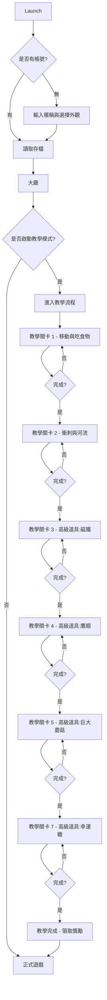

# 📝 GDD 補遺草案（v12.0 對應）
>
> 以下內容可直接插入原 GDD 第 16 章之後，或依專案決議調整章節。

---

## 交叉參照缺失修正

原文件中出現多次 `<Module表_...>` 內部占位符，易造成開發人員認知落差。本節統一收斂為《貪食蛇 GDD》內部參照，避免技術未定前提下造成參數真空。

| 原占位符 | 修正後說明 | 對應範疇 |
| :--- | :--- | :--- |
| `<Module表_基礎屬性>` | 指代本文件基礎數值與成長參數集合，包含 BASE_SPEED、STAMINA_MAX、POINTS_PER_SECTION、INITIAL_LENGTH 等。 | 基礎屬性與成長參數範疇 |
| `<Module表_地圖場景>` | 指代地圖配置參數集合，包含 MAP_WIDTH、MAP_HEIGHT、RIVER_SLOW_MULTIPLIER、食物區域分配權重、地形碰撞參數。 | 地圖配置與場景參數範疇 |
| `<Module表_AI策略>` | 指代 AI 行為參數集合，包含反應延遲、轉彎精準度、衝刺決策機率、偵測半徑。 | AI 行為與策略參數範疇 |
| `<Module表_遊戲模式>` | 指代模式共用參數集合，包含 GAME_DURATION、RESPAWN_TIME、GHOST_TIME、門票能量、擊殺獎勵參數。 | 遊戲模式共用參數範疇 |
| `<Module表_個性外觀>` | 指代個性化外觀參數集合，目前僅包含 EMOTE_DURATION。 | 個性化外觀參數範疇 |

> 開發備註：若後續使用 DataTable / ScriptableObject / JSON Config 管理參數，請以上述各範疇為單一真源（Single Source of Truth），各模組實作時直接引用對應參數名稱與預設值。

---

## 玩法規格補遺

### 蛇隻視覺節奏與尺寸對照

蛇身渲染除長度外，需明確定義節點視覺間距，以避免高速移動時節點過密或過疏。

| 項目 | 建議數值 | 備註 |
| :--- | :--- | :--- |
| 蛇節視覺間距 | 10 px | 頭部與第一節，以及每節之間的固定螢幕距離 |
| 蛇頭碰撞半徑 | 12 px | 用於頭部與頭部、頭部與身體的碰撞偵測 |
| 蛇身碰撞半徑 | 8 px | 身體節點碰撞半徑 |
| 食物碰撞半徑 | Small 4 px / Medium 7 px / Large 10 px | 與遊戲規格對齊 |
| 吸附生效距離 | 碰撞半徑 + 2 px | 避免高速時食物「滑過」蛇頭 |

### 衝刺視覺特效與 Debuff 狀態標示

- 衝刺狀態：
  - 蛇頭兩側噴射 streamwise 粒子，角度 -30° / +30°，長度約 20 px，透明度 0.6。
  - 拖尾殘影保留 200 ms。
  - 蛇身每節於本幀與上一幀位置之間插值補足 animation curve，避免節點跳動。

- 減速狀態（跑速低於基礎速度時）：
  - 隱藏速度線，蛇頭外周繪製淡藍色漣漪圈，半徑 14 px，透明度 0.4，呼吸動畫週期 800 ms。
  - 蛇頭上方浮顯小型狀態圖示（建議：🐌 或減速紗霧 Icon），與 buff/debuff 層疊顯示。
  - 蛇體擺動頻率由 1.0x 降至 0.5x，動畫週期翻倍。

### 死亡碎裂與殘骸生成規則補充

- 殘骸尺寸：碎裂後每段殘骸半徑固定 8 px，堆疊時可做隨機偏移 ±2 px，避免完美排列。
- 殘骸價值：由 DEBRIS_PERCENTAGE 控制，建議值 5000，代表死亡時個人長度積分的 50% 轉化為殘骸食物總分。
  - 例如：死亡時個人長度積分 2400 → 殘骸總分 1200 → 拆為約 120~240 顆小 / 中食物（隨機混合）。
- 殘骸存活時間：殘骸本身不自動消失，但若地圖總食物積分已達上限，優先回收最舊殘骸或採動畫方式蒸發。

### 隊伍識別視覺規範

多人組隊賽中，同隊玩家需有清晰且不干擾的視覺辨識。

| 視覺層級 | 規則 |
| :--- | :--- |
| 蛇頭光環 | 同隊蛇頭繪製隊伍專屬色彩環（例：藍隊、紅隊），透明度 0.5，寬度 2 px。 |
| 排行榜隊伍標示 | 排行榜中同隊玩家名稱後方加隊伍縮寫圖示或括號顏色標示。 |
| 聊天 / 擊殺橫幅 | 擊殺橫幅格式建議為 `[藍隊] PlayerA 擊殺 [紅隊] Bot_03`。 |
| 禁止遮擋 | 穿透時不顯示碰撞火花或塊狀位移，僅在穿透瞬間播放極短（100 ms）的過渡動畫。 |

---

## 新手教學與首次使用者體驗 (FTUE)

### 設計原則

- 零強制閱讀，全手勢引導：操作以「手指光暈 → 搖桿/按鈕高亮 → Demo 動畫」三步引導。
- 漸進解鎖：新手局僅開放「移動」與「衝刺」，暴食功能在第 2 局解鎖。
- 容錯與鼓勵：首次死亡不計中離，重生速度由 3000 ms 縮短至 1500 ms。

### 流程圖



### 教學關卡明細

#### 教學關卡 1：搖桿與吃食

- 場景：小型封閉沙盒，約 1200×1200 px，無敵人、無岩石、無河流。
- 目標：引導玩家將蛇頭移動至 10 顆閃爍食物並吞食。
- 引導機制：
  1. 畫面左下出現半透明手掌動畫，指示玩家放置左手拇指於虛擬搖桿區域。
  2. 食物高亮並出現「前往」磁吸線。
  3. 吃到第 3 顆食物後，播放金幣/經驗飛入動效與 Floating Tip：「+10 熟練度」。
- 完成條件：吃到 10 顆食物，個人長度積分達 50 分。
- 失敗條件：無。即使撞牆僅彈回，不扣除長度。

#### 教學關卡 2：衝刺與河流

- 場景：地圖中央加入橫向河流（寬度 80 px），兩側各放置 1 隻靜止初階 BOT。
- 目標：引導玩家使用衝刺穿過河流，並在安全區域吃食發育。
- 引導機制：
  1. 右下角衝刺按鈕高亮並脈衝。
  2. 按住按鈕時，畫面中央顯示體力條與加速特效。
  3. 衝刺進入河流後，播放減速漣漪特效與 🐌 狀態圖示，顯示 Floating Tip：「河流減速 -50%」。
- 完成條件：成功衝刺穿越河流一次，且個人長度積分達 100 分。

#### 教學關卡 3：高級道具 - 磁鐵

- 場景：沙盒地圖加入 2 隻 BOT，地圖中央放置 1 顆磁鐵道具。
- 目標：引導玩家拾取磁鐵，並體驗其「吸附周邊食物」的效果。
- 引導機制：
  1. 磁鐵道具高亮並閃爍，浮空 Floating Tip：「磁鐵道具 - 吸附周邊食物！」
  2. 玩家靠近後自動吸附，播放吸力 SFX 與視覺漏斗效果。
  3. 道具倒數計時顯示於蛇頭上方（例：8 秒）。
- 完成條件：拾取磁鐵並吃到至少 20 顆被吸附食物，持續時間內個人長度積分達 200 分。

#### 教學關卡 4：高級道具 - 鷹眼

- 場景：沙盒地圖，隨機分散 15~20 顆食物，3 隻移動 BOT。
- 目標：引導玩家使用鷹眼道具「掃描地圖並標記食物位置」。
- 引導機制：
  1. 鷹眼道具高亮，浮空 Tip：「鷹眼道具 - 掃描食物位置！」
  2. 拾取後地圖上出現 30 秒內所有食物的位置標記（例：小圓點 + 距離數字）。
  3. 標記會逐漸淡出，提示玩家記憶時間窗口。
- 完成條件：使用鷹眼掃描後，在 20 秒內吃到至少 15 顆食物，個人長度積分達 250 分。

#### 教學關卡 5：高級道具 - 巨大蘑菇

- 場景：沙盒地圖加入 2 隻「進階 BOT」，地圖中央放置 1 顆巨大蘑菇。
- 目標：引導玩家拾取巨大蘑菇，臨時變身為大蛇（短期內無敵且能衝撞敵方）。
- 引導機制：
  1. 蘑菇高亮並脈衝，浮空 Tip：「巨大蘑菇 - 短暫無敵化身！」
  2. 拾取後蛇隻視覺變大（約 1.5 倍），外周加上金色光環，持續 10 秒。
  3. 無敵狀態下衝刺可「衝撞」敵方蛇隻（敵方短暫眩暈但不死亡），演示碰撞反饋。
- 完成條件：使用巨大蘑菇無敵狀態衝撞敵方 BOT 至少 1 次，個人長度積分達 200 分。

#### 教學關卡 7：高級道具 - 幸運糖

- 場景：沙盒地圖，地圖中分散多個幸運糖（隨機生成）。
- 目標：引導玩家認知「幸運糖可提升食物掉落率和點數獲取」的機制。
- 引導機制：
  1. 幸運糖道具高亮，浮空 Tip：「幸運糖 - 提升幸運值！」
  2. 拾取後蛇頭上方出現幸運值指示條（例：粉紅色漸層條），持續 15 秒。
  3. 幸運值期間，食物掉落率 +50%，每顆食物點數 +20%。
  4. 倒數結束時播放「幸運值失效」音效與視覺淡出。
- 完成條件：在幸運糖期間吃到至少 25 顆食物，個人長度積分達 300 分。

### 教學獎勵與退出機制

- 完成獎勵：通關後發放 500G 金幣、100 XP 熟練度，並解鎖「經典綠」基礎外觀。
- 跳過機制：玩家可在關卡中點擊左上角「跳過教學」按鈕，並需確認彈窗：「跳過教學將錯過首次獎勵，仍可繼續嗎？」。
- 重複體驗：已解鎖玩家可於大廳設定頁重新進入「練習模式」體驗各關卡要素，但不再發放獎勵。

---

## 好友與社交組隊系統設計

### 設計原則

- 僅「大亂鬥」與「陣營對抗」支援邀請朋友功能。

### 好友名單與邀請流程

- 邀請流程參考現有小遊戲（如麻將、你畫我猜）的社交機制。

### 邀請與組隊流程（參考麻將/你畫我猜設計）

**流程：**

1. 隊長在大廳點擊「邀請好友」，生成唯一房間碼（例：20155）。
2. 隊長分享給好友（聊天軟體 / 社群）。
3. 好友輸入房間碼 -> 點擊確認 -> 進入隊伍大廳。
4. 進入後顯示隊長名稱與目前隊伍人數，自動加入隊伍。
5. 隊長確認所有成員準備後，按下「開始配對」進入對局。

**簡化優勢：**

- 無需繁複的好友列表與邀請確認
- 房間碼一次性有效，配對成功或超時自動失效

### 隊伍大廳規格

- 隊伍最大人數依模式而定：
  - Solo / 大亂鬥：1 人或自由 1~8 人房間，1 隊僅供同房間好友社交
  - 多人組隊賽：4 人，2 隊（藍 / 紅）

- 隊伍大廳 UI 佈局建議：

```
+--------------------------------------------------------------+
| [返回]          ★ 隊伍大廳 ★        藍隊 (隊長: Me)          |
|--------------------------------------------------------------|
|  [隊長準備]  [邀請好友]  [更換模式]                           |
|                                                              |
|  隊友列表:                                                    |
|  1. Me             (隊長)    [Ready]                          |
|  2. FriendA        (隊友)    [Ready]                          |
|  3. FriendB        (隊友)    [ waiting... ]                   |
|  4. (空閒)                    [邀請空格]                       |
|                                                              |
+--------------------------------------------------------------+
```

### 隊伍互動規則

- 隊長權限：隊長可踢人、更換遊戲模式（大亂鬥 / 陣營對抗）、按下開始配對。
- 隊長離線：自動轉移給第一位隊友。
- 準備狀態：每位隊友有 [準備] / [等待] 狀態，隊長可強制全員準備。
- 配對規則：隊長按下開始後系統以隊伍為單位配對，4v4 湊對如超時則自動補 BOT。
- 禁言機制：若玩家被檢舉不當言語，系統自動記錄但對局內不顯示禁言（避免擾亂比賽）。

### 好友與隊伍狀態同步

- 在線：頭像外框亮綠色圓圈
- 配對中：頭像外框黃色旋轉圈
- 對局中：頭像外框紅色，顯示剩餘時間
- 離線：頭像灰度處理，無框線

---

## 音樂與音效設計需求

### 設計基調

- 可愛與緊張並存：背景音樂走輕鬆風格，擊殺 / 死亡 / 衝刺時需有強烈節拍回饋。
- 低記憶體佔用：SFX 以 AAC / 44.1 kHz 壓縮，BGM 以循環 segment 設計，每首不超過 1.5 MB。
- 動態混音：局內即時根據蛇隻長度排名調整 BGM Intensity，第 1 名時鼓點加重，第 4 名後趨緩；衝刺疊加加速 pulse 層，減速時啟用低通濾波並降低高頻。

### 音樂清單

| 音樂名稱 | 使用場景 | 風格描述 | 長度 | 備註 |
| :--- | :--- | :--- | :--- | :--- |
| Main Theme | 遊戲大廳 / 開頭動畫 | 輕快卡通，木箱鼓 + 合成器 | 2:00 | 無聲版用於靜音裝置 |
| Loading BGM | 配對等待 / Loading | 節奏偏緩，循環段落 A-B | 1:30 | 與大廳區別於 drum fill |
| Ingame BGM | 對局戰鬥中 | 卡通 battle pop，低音貝斯 | 3:00 | 隨排名動態切換 loudness 層 |
| Victory Fanfare | 結算畫面第一名 | 小號 + 掌聲采樣 | 0:08 | 僅第一名播放 |
| Defeat Sting | 結算畫面非第一名 | 短促幽默低音下墜 | 0:03 | 走搞笑路線，避免挫折感 |

### 即時音效清單

#### 通用音效

| 類別 | SFX 名稱 | 觸發時機 | 規格建議 | 備註 |
| :--- | :--- | :--- | :--- | :--- |
| 移動 | Move_Loop | 蛇隻正常行進，每 3 節循環 | 0.3s / 輕微 rustle | 無 |
| 移動 | Move_Turn | 蛇頭大幅轉向（>45°） | 0.1s / 滑順 whoosh | 無 |
| 吃食 | Eat_Small | 吞食小食物 | 0.08s / 短 pop | 無 |
| 吃食 | Eat_Medium | 吞食中食物 | 0.12s / 中 pop | 無 |
| 吃食 | Eat_Large | 吞食大食物 | 0.18s / 低音 thud + pop | 無 |
| 吃食 | Eat_Debris | 吞食殘骸 | 0.25s / 玻璃碎裂 + pop | 無 |
| 衝刺 | Dash_Start | 按住衝刺瞬間 | 0.15s / 加速嘶聲 | 衝刺角色音效混音加大 |
| 衝刺 | Dash_Loop | 衝刺持續中，每 0.5s 循環 | 0.4s / 引擎風切聲 | 無 |
| 衝刺 | Dash_End | 體力耗盡 | 0.3s / 機械失靈 clunk | 無 |
| 道具 | Buff_Activate | 地圖道具 / 高級道具生效 | 0.4s / shimmer | 隊伍賽同隊拾取者播放，其他隊友弱一階音 |
| 道具 | Buff_Expire | Buff 結束 | 0.2s / 下降音階 fadeout | 無 |
| 碰撞 | Bounce_Rock | 撞擊岩石 / 邊界回彈 | 0.15s / dull knock | 無 |
| 碰撞 | Death_Impact | 頭撞身體 / 頭對頭致死 | 0.3s / balloon pop | 無 |
| 碰撞 | Death_Shatter | 碎裂瞬間 | 0.5s / glass cascade | 無 |
| 重生 | Respawn_Ready | 重生預覽倒數結束 | 0.4s / 電子鐘 ding | 無 |
| 擊殺 | Kill_Notify | 擊殺橫幅彈出時 | 0.6s / fanfare | 隊伍賽：擊殺者隊伍播放雄壯音，被殺隊伍播放低音悲劇音 |
| 近掠 | Near_Miss | 頭頭距離 < 60 px | 0.2s / 縮音 squeak | 雙方播放 |
| 彈窗 | Alert_Warning | 離開確認彈窗 | 0.2s / 警示嗶聲 | 無 |
| 彈窗 | Alert_Success | 結算 SSS / 擊殺獎勵 | 0.3s / Coin drop + chord | 無 |
| 環境 | River_Ambience | 進入河流區段 | 漸增水流聲 | 無 |
| 環境 | Rock_Zone_Ambience | 接近岩石區 | 漸增碎石摩擦聲 | 無 |
| 配對 | Match_Found | 配對成功 | 0.5s / 歡呼采樣 + 鼓點 | 無 |

### 動態混音規則

為強化競技節奏，採用以下即時混音策略，由音頻管理器於局內每幀校調：

| 優先級 | 觸發條件 | BGM 處理 | SFX 處理 |
| :--- | :--- | :--- | :--- |
| 1 | 衝刺啟動 | 套用 Band-pass 升頻、整體音量 +3 dB | Dash_Start 優先播放，中頻拉高 |
| 2 | 減速狀態 | BGM 套用 Low-pass filter（cutoff 800 Hz）、音量 -2 dB | Move_Loop 音量 -6 dB |
| 3 | 擊殺事件 | BGM 短暫插入 Kill Sting（0.6s overlay），再恢復 | Kill_Notify 搶先播放，0.2s 內蓋過 BGM |
| 4 | 剩餘時間 < 30 秒 | 強制切入緊張版 BGM 段落 | 每 1 秒播放 Tick-Tock 滴答聲 |
| 5 | 隊伍賽團滅 | BGM 淡出，播放 Defeat Sting | Shock SFX + 階段降調 |

### 語音包需求（選配）

若後續加入語音包，僅保留以下四項，以控制成本：

| 觸發時機 | 建議語言 | 備註 |
| :--- | :--- | :--- |
| Ready / Loading 畫面 | 英文 / 中文各 1 版 | 短促「Go!」/「衝呀！」 |
| 擊殺橫幅 | 建議保留無語音 | 以 SFX 為主 |
| 首局首次擊殺 | 英文 / 中文各 1 版 | "First Blood!" / 「第一滴血！」 |
| 結算第一名 | 英文 / 中文各 1 版 | "Victory!" / 「大獲全勝！」 |
