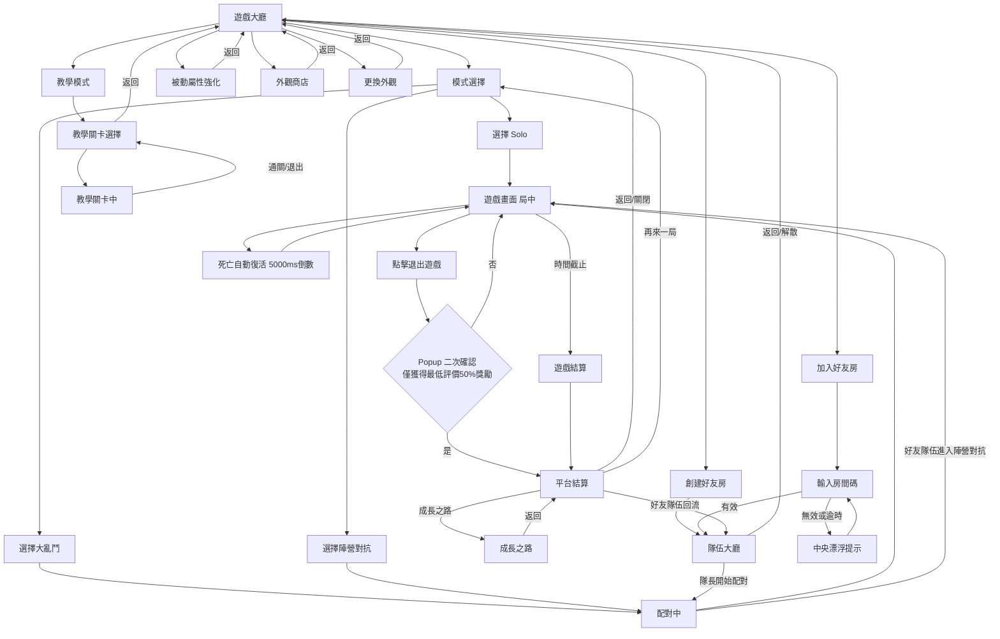
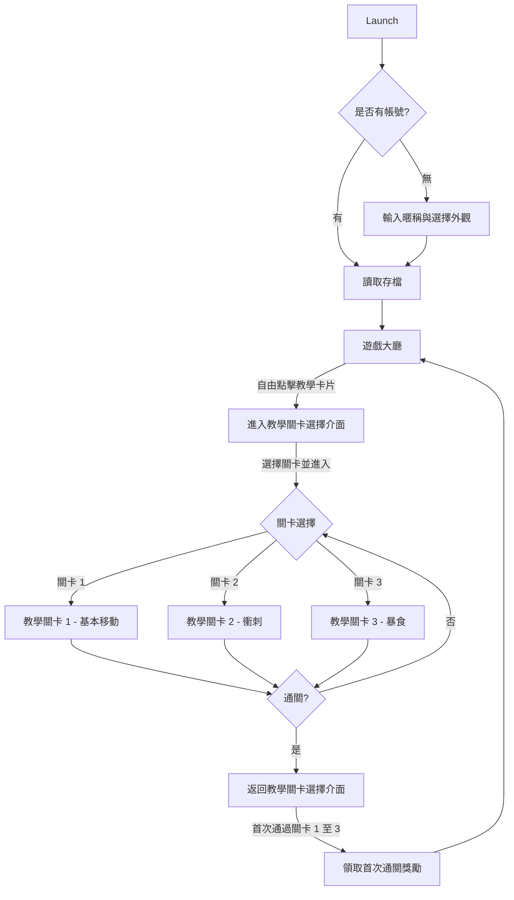
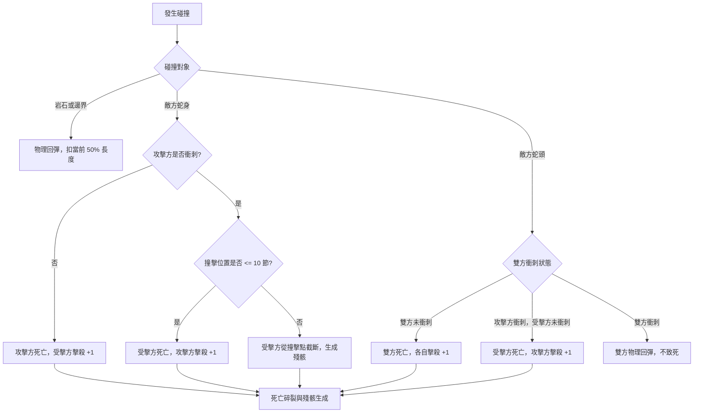
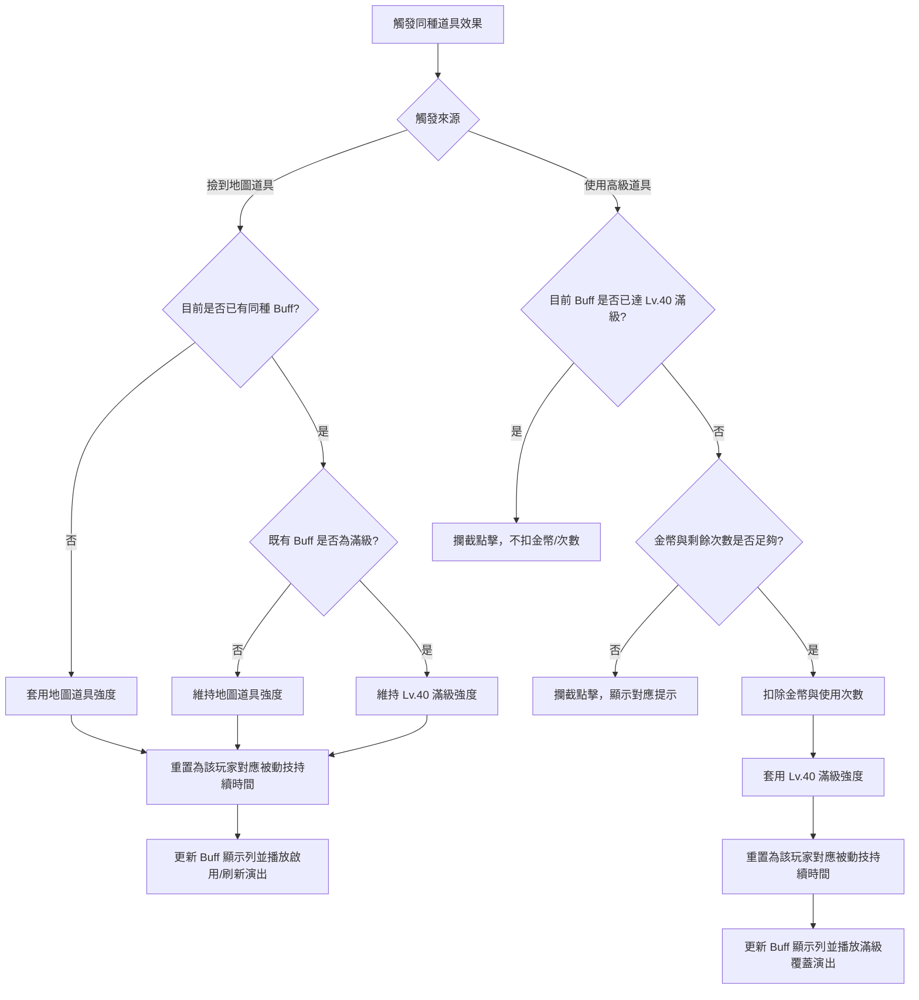
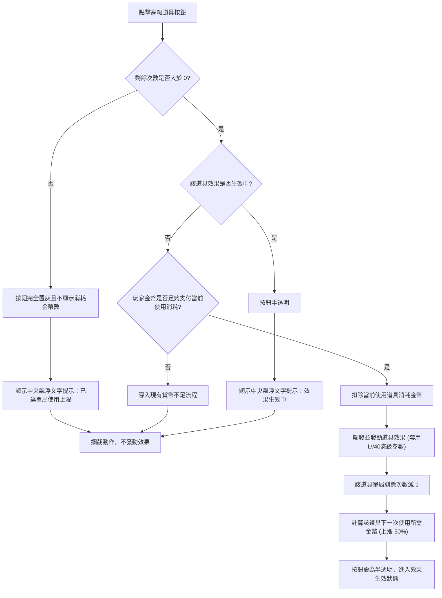
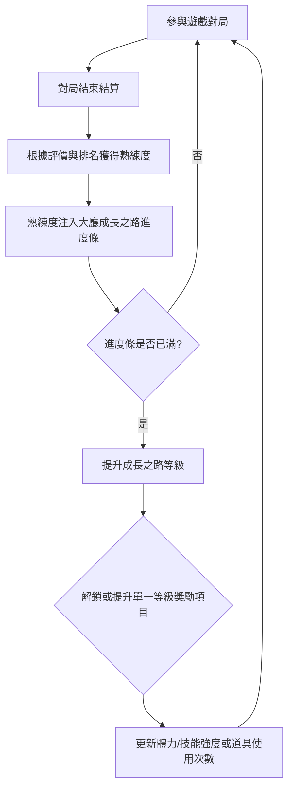
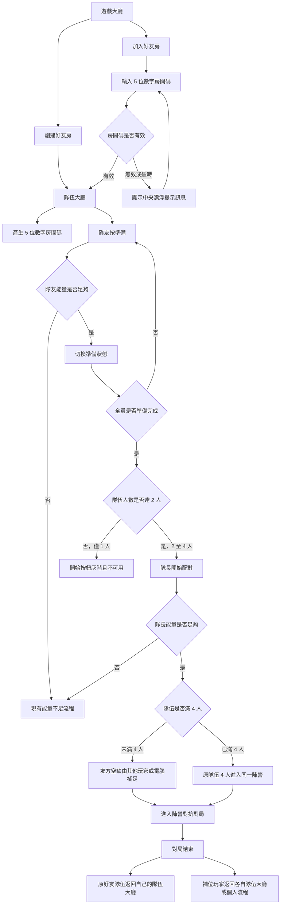

# 🎮 《貪食蛇》遊戲設計規格書

**文件版本**：22.0
**更新日期**：2026-07-16
**本次更新**：新增 Server Log 規格與活動任務條件，並調整後續章節編號。
**文件主旨**：定義《貪食蛇》玩法操作、局內規則、勝負判定、美術 UI 需求與 AI 機制，作為外包開發與程式實作之最高依據。
**其他需求**：`以本地端模擬網路連線`

---

## 0. 系統與版本變更紀錄

<details open>
<summary><b>v22.0 (2026-07-16)</b></summary>

新增 Server Log 規格與活動任務條件

* **Ch15.4 Server Log 規格**：
  * 定義對局摘要、貨幣與道具流水、商店與玩家資產變動、玩家權益異常等必要 Server Log。
  * 明確第一階段不記錄的低必要性事件，以及未來增加診斷 Log 的條件。
* **Ch17 活動任務條件**：
  * 新增聯名活動、收集活動與通行證的貪食蛇任務條件。
  * 聯名活動採遊玩次數、累積擊殺與累積對局總積分；收集活動採每達指定累積積分獲得活動收集物；通行證採遊玩次數與累積對局總積分。
* **章節編號調整**：
  * 原 Ch17「字串表與多語系文字參數」順延為 Ch18。
  * 原 Ch18「美術與音效需求」順延為 Ch19，並同步修正章節引用。

</details>

---

<details>
<summary><b>v21.0 (2026-07-07)</b></summary>

主要針對 Ch9 AI 機制之轉向公式修正與全域公式語法優化

* **Ch9.2 AI 機制與轉向公式修正**：
  * 修正並簡化 AI 轉彎精準度 (`SteeringPrecision`) 計算模型，將偏差角基準值由 180° 下修為 **45°**，使 AI 在 80% 精準度下的最大偏航角收斂至合理的 **±9°**（實際角度範圍為 36° ~ 54°），解決原本偏差過大（±36°）導致 AI 嚴重蛇行的問題。
  * 於 Ch9.2 第一步與第二步下方新增詳細的 `[!NOTE]` 計算實例，並將第二步隨機偏航優化為乘法表示法 `隨機(-1, 1) * 最大偏差角度`。
* **Ch7.4 長度成長關係公式修正**：
  * 修正長度成長換算公式，將原本的 `floor` 修正為 `int` 並註記為無條件捨去至整數，以配合程式標準語法。
* **全域公式與邏輯語法優化（LaTeX 轉純文字代碼塊）**：
  * 將規格書中所有的核心公式（共 10 處，包含熟練度、跑速、積分、長度、道具金幣、Hermite 曲線與 AI 轉角等）由 LaTeX 語法全面改寫為 **` ```text ` 純文字代碼塊** 封裝，並統一外層為 `> [!IMPORTANT]` 與 `> [!NOTE]` 樣式，徹底避免跨平台 Markdown 編輯器下的 LaTeX 語法渲染不相容問題。

</details>

---

<details>
<summary><b>v20.0 (2026-07-02)</b></summary>

Ch16.1 與 Ch16.4 參數命名與結構調整

* **Ch16.1 Module 參數重命名與結構調整**：
  * 表格擴充「參數名稱調整後」欄位，保留原始全大寫參數名，對照 PascalCase／語意化命名。
  * 78 筆參數統一調整為 PascalCase 語意化命名（例如：`BASE_SPEED` → `BaseMoveSpeed`、`SLOW_ZONE_SPEED_MULTIPLIER` → `SlowZoneSpeedFactor`、`OBJECT_SPAWN_MIN_DIST` → `ObjectSpawnMinDist`）。
  * `GROWTH_ROAD_MAX_LEVEL` 標示為不使用參數，改讀既有資料表。
  * 道具圈層相關描述與參數名稱補充「地圖」語意（如 `MapCenterItemSpawnWeight` 等）。
  * 參數數值與單位維持不變。

* **Ch16.4 PassiveSkill 被動參數命名全面更新**：
  * 10 筆被動參數全面更新命名：
    * `ITEM_MAGNET_RADIUS` → `ItemMagnetRadius`
    * `ITEM_MUSHROOM_SPEED` → `ItemMushroomSpeed`
    * `ITEM_CANDY_MULTIPLIER` → `ItemCandyMultiplier`
    * `ITEM_EYE_SCALE` → `ItemEyeScale`
    * 四項持續時間改為 `Item*Duration`
    * `PASSIVE_ROCK_RESIST` → `ImpactBoundaryResist`
    * `PASSIVE_RIVER_RESIST` → `SlowZoneResist`
  * 同步調整企劃名稱與描述：
    * 「岩石抗性」→「反彈抗性」，描述改為「碰撞扣長度減免」
    * 「河流抗性」→「緩速區抗性」，描述改為「緩速區減速減免」

* **相關章節同步調整**：
  * `Ch8.1` 與 `Ch10.2` 中對應的被動屬性參數名稱、企劃名稱與描述已完全同步一致。

</details>

---

<details>
<summary><b>v19.0 (2026-06-26)</b></summary>

外包反饋問題壹與地圖物件規格整理版

* **AI 參數定義與命名規範化**：
  * `Ch9.2` 將原先帶有底線的 AI 參數（例如 `AI_REACTION_DELAY` 等）全面更新為 CamelCase 標準命名（例如 `ReactionDelay` 等），與 DataTable 欄位名稱對齊。
  * `Ch9.2` 補充 `SteeringPrecision` 計算公式，明確 `10000` 為完全貼合理論方向，低精準度會產生偏航角。
  * `Ch9.2` 補充 `EvadeRadius` 與 `ChaseRadius` 定義，說明避險半徑、追逐／尋路半徑的用途與可鎖定目標。
  * `Ch9.3` 補充追逐／尋路半徑與追擊中止規則，將追擊距離中止公式修正為 `ChaseRadius * (1 + ChaseLeashRatio / 10000)` 判定，並以 `ChaseAbortTime` 控制追擊最長持續時間。
  * `Ch9.4` 與 AI 決策優先級同步引用 AI 半徑參數，避免固定文字距離與 DataTable 參數分流。
  * `Ch16.2 AIStrategy` 擴充追擊緩衝倍率、追擊中止時間、危急逃生距離、卡位預判時間、搶奪資源距離、低長度保護門檻等欄位；同時將 5 種策略的 `ChaseLeashRatio` 由 `12000` (120%) 修正為 `2000` (20%)。

* **地圖主題與地圖池整理**：
  * `Ch6.3` 地圖主題改以美術需求方案為準，統一收斂為 4 個主題：草原冒險、河岸水域、岩石峽谷、糖果樂園。
  * 新增地圖池概念：單局開始時由地圖池隨機抽選地圖，地圖池數量可擴充。
  * 修正地圖資料需求：每張地圖只綁定所屬主題與美術資源；岩石、緩速區等投放物件使用全域統一投放標準與參數，不依不同地圖各自綁定。

* **緩速區與岩石規格整理**：
  * `Ch6.2` 將玩法規格中的「河流」整理為「緩速區」，河流僅作為部分地圖的美術題材，不作為固定河道規則。
  * 補充緩速區模組拼接、美術主題表現、隨機生成規則與蛇頭中心進入／離開效果範圍時的緩速套用規則。
  * `Ch6.1` 補充岩石障礙物隨機投放規則，包含生成數量、尺寸、投放範圍與最小距離限制。
  * `Ch5.1` 補充緩速區不屬於死亡碰撞對象，僅以蛇頭中心判定套用／解除緩速。

* **地圖區域與投放規則收斂**：
  * `Ch7.1` 緩速區說明改為引用 `Ch6.2`，避免重複描述緩速區定位、美術、生成與效果規則。
  * `Ch7.1` 僅保留食物／地圖道具投放所需的區域判定與食物權重用途，緩速區詳細規格以 `Ch6.2` 為主。
  * `Ch7.1` 新增地圖區域判定定義（緩速區、岩石區、平地區與重疊優先級判定）。

* **地圖道具投放與分布規則**：
  * `Ch7.5` 新增開局投放與每 20s 刷新機制，增加道具類型權重（均分 25%）及圈層投放分布權重（中心/中/外圈比例 50%/30%/20%）等規則。

* **被動屬性與數據單位修正**：
  * `Ch10.2` 被動屬性強化明細中將磁吸半徑單位修正為 px，巨大蘑菇與河流抗性修正為萬分比。
  * `Ch16.4 PassiveSkill` 將磁鐵、巨大蘑菇等道具持續時間單位從秒 (s) 修正為毫秒 (ms)，數值改為 10000~20000 毫秒。

* **參數命名一致性**：
  * `Ch7.1` 地形權重表將 `河流區 / FOOD_DIST_RIVER` 改為 `緩速區 / FoodDeployWeight_SlowZone`。
  * `Ch16.1 Module` 將 `RIVER_SLOW_MULTIPLIER` 改為 `SlowZoneSpeedFactor`，將 `FOOD_DIST_RIVER` 改為 `FoodDeployWeight_SlowZone`。
  * 地圖物件生成最小安全偏移參數統一使用 `ObjectSpawnMinDist`。

* **移除幽靈無敵相關規則**：
  * 移除基礎屬性表（Ch 4.2）與遊戲資料表（Ch 16.1 Module）中的「復活無敵時間 (GHOST_TIME)」參數。
  * 修正碰撞死亡判定（Ch 5.1）說明，移除「無敵結束重疊判定死亡」的文字描述。

* **碰撞回彈規則**：
  * `Ch5.1.2` 新增撞擊岩石與地圖邊界之回彈邏輯，定義為 180 度正面回彈。

* **死亡重生點規則**：
  * `Ch5.3` 補充死亡重生點座標選定規則，採隨機選點且不與岩石/邊界重疊（允許在緩速區）。

* **開局出生點位置**：
  * `Ch4.1` 新增開局 8 隻蛇的初始生成點與朝向邏輯（隨機選點且朝向最開闊處）。

* **食物大小生成比例**：
  * `Ch7.1` 新增食物大小生成比例規則，採加權隨機（條列式說明：小 60% / 中 30% / 大 10%），並於 Ch 16.1 Module 表新增 ID 76~78 權重參數。

</details>

---

<details>
<summary><b>v18.0 (2026-06-25)</b></summary>

死亡掉落池與 5.4 結構重整版

* **死亡局內掉落池補充**：
  * 新增蛇隻死亡後的局內掉落規則，死亡時會於蛇頭位置必定掉落金幣、星光卡包與活動道具等地圖道具。
  * 掉落池、掉落權重與各類道具的出現條件皆可由資料表或設定檔控制，避免硬編碼。
  * 金幣掉落量會依死亡蛇隻當前名次變動，名次對應金幣數量改為可配置參數。
  * 活動道具僅在活動開啟期間納入死亡掉落池，無活動時不會掉落。

* **局內掉落與平台掉落分流**：
  * 補充局內死亡掉落與平台結算掉落的區隔說明，避免把死亡瞬間掉落與對局結束後獎勵混為同一流程。
  * 平台結算仍維持原本的對局後獎勵、平台掉落與中離折減機制。

* **死亡與殘骸規則整理**：
  * `Ch5.4` 拆分為「殘骸結晶」與「道具」兩個小節，讓死亡後生成內容的說明更清楚。
  * 道具保留時間沿用殘骸生命週期的 `10 秒` 保留與淡出邏輯，便於規格一致化。

* **文件同步更新**：
  * 本次內容同步寫入 `ch0` 作為版本變更紀錄，方便後續追蹤。

* **移除上傳頭像功能**：
  * `Ch12.2` 移除上傳頭像功能，改為啟動後直接套用帳號頭像。

</details>

---

<details open>
<summary>

## 📦 第一部分：框架與流程 (Frame & Flow)

</summary>

### 1. 遊戲核心玩法與簡介

#### 1.1 玩什麼 (Core Loop)

玩家與電腦（共 8 人）置身於封閉的平面二維競技場內進行限時大亂鬥：

* **基礎食物**：地圖常駐隨機散落之發光小圓點。
* **殘骸資源**：蛇隻死亡後，身體殘骸轉化為高價值食物，**吞食殘骸為發育增長之核心手段**。
* **單局時長**：固定的單局限時倒數計時。

#### 1.2 怎麼玩：基礎操作與 HUD 佈局

操作介面採用雙手橫屏配置：


* **動態搖桿（手觸出現）**：
  * 控制蛇頭進行 360 度任意轉向與走位。
  * 支援 360 度動態追隨，靈敏度高，防止走位遲滯。
* **衝刺按鈕（右下角-大顆 圓形）**：
  * 按住時消耗體力提升移動速度。
  * 體力耗盡進入疲勞超載狀態，鬆開按鈕後體力自然回復。
* **體力槽 HUD（衝刺體力）**：
  * 顯示在蛇頭周圍，採環狀 HUD 呈現目前可用衝刺體力，玩家能直接從蛇頭位置判斷可衝刺時間。
  * **正常可使用 / 消耗中**：蛇頭周圍環狀體力槽使用黃色，按住衝刺時黃色環狀填充長度隨體力消耗縮短。
  * **超載狀態**：體力歸 0 後蛇頭周圍環狀體力槽改為紅色，表示暫時不可衝刺；回復完成後恢復黃色可用狀態。
  * 只看的到玩家自己的體力槽，無法看到其他玩家/電腦的體力槽。
* **暴食按鈕（右下角-小顆 圓形）**：
  * 點擊觸發， N 秒冷卻遮罩與倒計時。
* **道具快捷鍵（中央下排-小顆 方形r角）**：
  * 顯示各道具 消耗金幣 和 可用次數，無須局前攜帶。（鷹眼、磁鐵、巨大蘑菇、幸運糖）
* **局內排行榜（左上角）**：
  * 最多顯示 4 行，第一名（No.1）名字左側顯示皇冠標誌。
  * 玩家排名不在前三名時，第四格固定顯示玩家本人的名次與對局總積分。
* **對局剩餘時間（上方中央）**：
  * 顯示本局剩餘時間，格式為 `MM:SS`。
  * 剩餘 30 秒內進入倒數提醒狀態，時間文字可加亮或脈衝提示，但不可遮擋擊殺橫幅。
  * 時間歸零時觸發對局結束，進入對局結算流程。
* **離開按鈕（上方功能列）**：
  * 點擊後開啟二次確認 Popup，確認文案與中離獎勵規則請參照 [3.4 結算評價與獎勵機制](#34-結算評價與獎勵機制) 與 [15.2 中離懲罰](#152-中離懲罰)。
  * 選擇「否」返回局中；選擇「是」視為中途離開。
* **擊殺橫幅（正上方）**：
  * 擊殺事件發生時，由畫面正上方滑出擊殺提示。
* **第一名相對方位標示（畫面邊緣）**：
  * 畫面四周邊緣常駐 crown icon，動態指向第一名目前所在座標。
* **小地圖限制**：
  * 局內 HUD 不顯示小地圖。

#### 1.3 比什麼 (Scoring & Rank)

* 即時計算「蛇身長度數值（積分）」，並於 HUD 左上方顯示「即時積分排行榜」。
* 單局時間截止時，依據結算那一瞬間的**積分**進行名次排定，並依照**積分**換算為 SSS 至 E 級別發放金幣獎勵。

---

### 2. 介面設計 (UI Flow & Layout)

#### 2.1 介面流程圖 (UI Flow)



#### 2.2 局外與局中 UI 規格

* **遊戲大廳**：大廳下方拆分為左右兩大區塊；上方資訊列沿用平台公版，不在本章重複規範。
  * **左側固定資訊區**：展示當前遊戲（貪食蛇）之遊戲熟練度與進度條、遊戲技能解鎖與升級狀態、單局獎勵一覽、以及時限活動（貼紙派對）剩餘時間。
  * **右側功能與模式區**：包含可滾動的常規對局模式（單人對抗 30⚡、多人大亂鬥 30⚡、陣營對抗 30⚡），以及右側的社交與養成按鈕組（被動強化、外觀商店、更換外觀、創建好友房、加入好友房、教學模式）。


---

### 3. 遊戲模式、排行與結算

#### 3.1 遊戲模式與消耗設計

| 模式名稱                  | 入場門票消耗                       | 對局配置                 | 勝負規則與時限                                         |
| :------------------------ | :--------------------------------- | :----------------------- | :----------------------------------------------------- |
| **新手教學**        | `0` 點能量                       | 單人封閉沙盒，全手勢指引 | 獨立完成條件，無時限。不計對局結算與熟練度獎勵。       |
| **Solo (單人練習)** | `EntryEnergy_Solo = 30` 點能量  | 1 玩家 + 7 電腦          | 單局限時結束時，以所有角色長度積分排行，最高分者獲勝。 |
| **多人大亂鬥**      | `EntryEnergy_Brawl = 30` 點能量 | 8 玩家                   | 單局限時結束時，以個人長度積分排行，最高分者獲勝。     |
| **陣營對抗**        | `EntryEnergy_Team = 30` 點能量  | 4 玩家 + 4 玩家          | 單局限時結束時，累計陣營總長度積分，總分高之陣營獲勝。 |

> [!NOTE]
> 若在配對時長超時未配對到足夠的真人玩家，系統會自動使用電腦 AI 替代補滿對局席位。
> 各對局模式電腦 BOT 補位固定分配與配比請參閱 [9.1.1 電腦 BOT 對局固定補位配比表](#911-電腦-bot-對局固定補位配比表)。

##### 3.1.1 陣營對抗特殊互動規則

為增強團隊協作與社交趣味，陣營對抗（4v4）對局套用以下特殊規則：

* **友方穿透**：同隊隊友之間不觸發碰撞死亡判定，蛇頭可自由穿過隊友的身體與頭部。
* **道具共享與各人強度套用**：
  * **共享機制**：任一隊員在場上拾取到地圖道具（磁鐵、巨大蘑菇、幸運糖、鷹眼），全隊友方共享效果，各自均會獲得對應的 Buff 圖示與計時器。
  * **個人數值縮放**：**共享 Buff 的具體增益數值，由每個蛇隻本人的屬性養成等級決定，而非依據拾取者等級。**
  * **覆寫與時長重置**：若觸發共享時隊友身上已帶有同種 Buff，則該 Buff 的剩餘持續時間**直接重置（刷新）為最大持續時間**，但具體效果依然套用個人自身的屬性數值。
* **食物獨立**：地圖上的隨機食物及碎裂殘骸不共享拾取。玩家吃食僅會增加「吃食者本人」的蛇身長度與個人分數。

> [!NOTE]
> 例：隊伍中拾取者磁鐵效果為滿級 Lv 40，隊友 A 為 Lv 0，隊友 B 為 Lv 10。當拾取者吃得磁鐵時，全隊共享磁鐵效果；但拾取者獲得其滿級 Lv 40 的磁吸半徑，隊友 A 獲得其 Lv 0 的基礎半徑，隊友 B 則獲得其 Lv 10 的半徑。
>
> 例：隊友 A 的磁鐵剩餘時間為 2000ms（其個人 Lv 0 磁鐵最大時長為 10000ms）。此時隊友 B 拾取了地圖隨機磁鐵，觸發共享覆寫：隊友 A 的磁鐵 Buff 剩餘時間立即重置刷新回其本人的最大時長 10000ms，而其磁吸增益半徑依然依據其本人的 Lv 0 屬性計算。

###### 3.1.1.1 隊伍識別視覺規範

為確保陣營對抗模式中同隊友方與敵方有直觀且清晰的視覺區隔，對局內採用以下辨識規範：

| 視覺層級                 | 規則與表現效果                                                                                                |
| :----------------------- | :------------------------------------------------------------------------------------------------------------ |
| **名牌與蛇身光環** | 友方名牌周圍繪製隊伍專屬色彩光環（如藍隊為半透明天藍色、紅隊為半透明淡紅色），寬度 `2 px`，透明度 `0.5`。 |
| **排行榜隊伍標示** | 右上角排行榜中，同隊玩家名稱後方加上對應的陣營文字或顏色方塊標記（如 `[藍]`、`[紅]`）。                   |
| **擊殺橫幅廣播**   | 擊殺橫幅格式升級為：`[藍隊] 玩家A 擊殺 [紅隊] 電腦_03`，並以對應顏色高亮隊伍名稱。                          |

#### 3.2 排名與破平規則

* **同分破平**：若局終結算時有多名玩家的分數完全相同，名次將依據**達到該分數的毫秒級時間戳 (`score_update_timestamp`) 進行判定，先達到該分數的玩家排名在前**。系統會在每次得分時記錄當前幀的絕對時間戳（精確至毫秒），確保破平邏輯 100% 精準無爭議。

#### 3.3 局內排行榜與第一名冠冕顯示

* **排行榜 HUD**（介面佈局與顯示位置請參考 [1.2 怎麼玩：基礎操作與 HUD 佈局](#12-怎麼玩基礎操作與-hud-佈局)）：
  * 排行榜固定於畫面左上角，最多顯示 4 行，每行格式為「`名次. 名字 - 對局總積分`」。第一名（No.1）名字左側顯示皇冠 👑。
  * **領先與防護欄展示機制**：
    * 若玩家當前名次排在前三名（No.1 ~ No.3）：排行榜展示第 `1, 2, 3, 4` 名的資訊。
    * 若玩家當前名次排在第四名以下 (>= No.4)：排行榜前三格展示第 `1, 2, 3` 名的資訊，第四格固定顯示玩家本人的名次與對局總積分（例如 `6. 玩家名字 (你) - 230`）。
* **第一名冠冕掛飾**：當前對局總積分第一名的蛇隻，其蛇頭上方常駐隨蛇身滑行的皇冠掛飾，易主時轉移。
* **相對方位標示**：畫面四周邊緣常駐一個帶有皇冠標誌的指引座標 ICON，動態指向第一名當前所在座標與其對局總積分。


#### 3.4 結算評價與獎勵機制

對局結束後，系統彈出對局結算畫面（介面佈局見下方參考圖），條列式展示以下局內遊戲內容。評價金幣獎勵與發育評級直接掛鉤，因此需於此畫面完成計算與顯示；實際獎勵入帳統一於後續平台結算流程完成。


* **各玩家(電腦)排名**：展示本局所有玩家（及 AI 電腦）的最終名次與對局總積分列表。
* **發育評價**：展示本局自己獲得的最終發育等級評級（SSS / SS / S / A / B / C / D / E）。
* **擊殺數**：展示本局內自己成功擊殺敵蛇的總次數。
* **死亡數**：展示本局內自己被擊殺或碰撞死亡的次數。
* **本局可獲得金幣**：展示依發育評級計算出的評價金幣獎勵；此處僅顯示結果，實際入帳於平台結算完成。

##### 3.4.1 金幣獎勵機制

根據玩家的單局結算評級發放固定金幣獎勵，與排名無直接關聯。金幣獎勵於「遊戲/對局結算」階段計算並顯示，實際入帳於「平台結算」階段完成。

若玩家局中點擊退出遊戲，並在二次確認 Popup「僅獲得最低評價50%獎勵」中選擇「是」，視為中途離開，不進入一般對局結算金幣發放流程；後續由平台結算依最低評價獎勵的 50% 顯示並入帳。


##### 3.4.2 熟練度與評級加成計算

* **門票熟練度換算**：熟練度獲取比率固定為 `1點能量 = 10點熟練度`。單局基礎熟練度依據入場門票能量值動態計算
* **計算公式**：

> [!IMPORTANT]
>
> ```text
> 單局基礎熟練度 = 該對局模式之入場能量門票 * 10
> ```

* **評級額外加成**：依據單局結算評級有額外定值熟練度加成.
* **計算公式**：

> [!IMPORTANT]
>
> ```text
> 單局最終獲得熟練度 = 基礎熟練度 + 評級額外加成
> ```

> [!NOTE]
> 例：入場消耗能量門票為 30⚡，則單局基礎熟練度為 300 點；評級為 SSS 的玩家最終可獲得 300 + 50 = 350 點熟練度。

##### 3.4.3 發育評級標準

結算發育評級（SSS 至 E 級別）完全依據玩家在單局結束時所達到的「對局總積分（積分條件）」進行評判。

##### 3.4.4 單局結算獎勵與評級對照表

| 評級 | 最低積分 | 最高積分 | 金幣獎勵 | 額外熟練度 |
| :--: | -------: | -------: | -------: | ---------: |
| SSS | 2000 | -1 | 3000 | 50 |
| SS | 1500 | 1999 | 2800 | 30 |
| S | 1000 | 1499 | 2600 | 10 |
| A | 800 | 999 | 2400 | 0 |
| B | 500 | 799 | 2200 | 0 |
| C | 300 | 499 | 2000 | 0 |
| D | 100 | 299 | 1800 | 0 |
| E | 0 | 99 | 1600 | 0 |

##### 3.4.5 擊殺積分與結算獎勵

對局結算時，玩家的擊殺表現將獲得額外的積分加乘與獎勵：

* **發育評級積分累加**：對局結束時，結算發育評級採用的「個人累計積分」已包含局內的所有擊殺積分（每擊殺 1 次獲得 `KillScore = 100` 分）。
* **擊殺熟練度獎勵**：每成功擊殺一隻蛇，結算時額外發放 `MasterBonus_Kill = 2` 點熟練度。擊殺不會獲得額外金幣。此額外獎勵與評級獎勵累加發放，不設上限。

> [!NOTE]
> 例：玩家評級為 SSS 且擊殺 5 次，最終獲得金幣為：3000（評級固定獎勵，無擊殺額外金幣）；獲得熟練度為：300（基礎）+ 50（評級加成）+ 5 * 2 = 360 點。

##### 3.4.6 平台結算與養成機制

當玩家關閉「對局結算」視窗後，系統會自動載入「平台結算介面」（介面佈局與按鈕引導見下方參考圖）進行評價金幣實際入帳、平台 XP、外觀熟練度、隨機掉落、活動入口與後續引導等局外流程。平台結算需再次顯示玩家本局名次，讓玩家能對照對局結果與實際獎勵發放。

若玩家中途離開並在退出二次確認 Popup 選擇「是」，仍會進入平台結算流程，並依 [15.2 中離懲罰](#152-中離懲罰) 僅取得最低評價獎勵的 50%。平台結算需明確顯示「中途離開」狀態與折減後獎勵，避免玩家誤認為獎勵漏發。


* **本局名次再次顯示**：平台結算需再次顯示玩家本局名次與對局總積分，讓玩家確認獎勵入帳來源。
* **中途離開名次顯示**：若玩家中途離開，平台結算的名次欄顯示 `再接再厲`，並同步顯示最低評價獎勵 50% 的實際入帳金幣。
* **評價金幣入帳**：依對局結算畫面顯示的發育評級與金幣獎勵，在平台結算階段實際加算至玩家帳號金幣餘額。
* **平台經驗與等級**：根據對局的表現與名次折算為平台 XP，當 XP 條滿時提升「平台等級」。
* **外觀熟練度累積**：將當局獲得之熟練度（依對局表現與門票消耗計算，參考 [3.4.2 熟練度與評級加成計算](#342-熟練度與評級加成計算)）注入當前裝備之蛇隻皮膚中，累積熟練度條。
* **隨機掉落獎勵**：對局結束時有一定機率獲得隨機掉落獎勵（如貼紙派對活動貼紙、平台虛擬代幣或裝飾等，但不會掉落磁鐵等局內戰鬥消耗道具）。若未觸發任何掉落，底部子面板文字固定顯示 `未獲得隨機掉落獎勵`。
* **活動面板關聯**：右側展示時限活動（如「貼紙派對」之賸餘時間與圖示），點擊可開啟對應活動詳情。
* **局內掉落獨立**：死亡瞬間的金幣、星光卡包與活動道具掉落，屬於局內死亡掉落池；平台結算僅負責對局結束後的結算型獎勵與平台掉落，不可與死亡掉落混用。
* **按鈕引導邏輯**：
  * **再來一局**：點擊直接關閉平台結算，並依據上一局之模式與門票設定，直接進入配對佇列（快速開始對局）。
  * **成長之路**：點擊切換至平台「成長之路」專屬畫面，領取等級成長解鎖的里程碑獎勵。

#### 3.5 新手教學模式與首次使用者體驗


##### 3.5.1 設計原則

* **圖卡先行、操作接續**：進入關卡後先顯示全畫面圖卡，快速說明本關操作與目標；關閉圖卡後，再以「手指光暈 ➔ 搖桿/按鈕高亮 ➔ 示意動態」進行場內操作引導。
* **獨立遊戲模式**：教學模式為完全獨立的選關玩法，玩家可在大廳隨時自由進入、重複挑戰或選擇特定關卡進行練習。
* **零消耗與零獎勵**：每次進入關卡不消耗能量（0 ⚡），對局結束時不發放常規的評級金幣、擊殺金幣或熟練度結算獎勵。
* **三關制教學**：教學模式僅保留教學關卡 1～3，每關集中教授單一主題，其他高級道具與環境機制不納入教學。
* **教學關卡技能覆寫**：教學關卡內「暴食」預設直接可用，固定採 Lv 0 數值（吸附半徑 200px、CD 30 秒），不檢查玩家成長之路等級，也不顯示解鎖提示；離開教學後恢復帳號原本的技能解鎖狀態。
* **新手首次通關獎勵**：玩家首次通過教學關卡 1～3 後，系統透過任務系統發放一次性獎勵：500 G 金幣、100 XP 熟練度，並解鎖「經典綠」基礎外觀。

##### 3.5.2 教學流程圖



##### 3.5.3 教學關卡明細

> 關卡設定、步驟順序與文字 Key 來源讀取：[<Tutorial表>](#167-tutorial)。

| 關卡                                      | 場景                                                                | 目標                                                                                    | 引導內容                                                                                                                                                                                                                                                                                                                         | 完成條件                                                              | 失敗條件                                                   |
| :---------------------------------------- | :------------------------------------------------------------------ | :-------------------------------------------------------------------------------------- | :------------------------------------------------------------------------------------------------------------------------------------------------------------------------------------------------------------------------------------------------------------------------------------------------------------------------------- | :-------------------------------------------------------------------- | :--------------------------------------------------------- |
| **教學關卡 1：基本移動** | 小型封閉沙盒（約 1200×1200 px），無敵人、無岩石、無河流，場上散落高辨識度食物。 | 教導基本方向操作、吃食物及蛇身成長的因果關係。 | 1. 顯示關卡 1 圖卡。 <br> 2. 左下搖桿區出現手指光暈，引導玩家拖曳並完成轉向。 <br> 3. 高亮前方食物並顯示前往虛線，引導玩家吞食。 <br> 4. 吞食後放慢蛇身增長演出，強調新增蛇節。 | 完成至少 1 次方向轉換、吃到 10 顆食物，並觸發至少 1 次蛇身增長。 | 無。撞牆僅彈回，不致死亦不扣分。 |
| **教學關卡 2：衝刺** | 封閉戰鬥沙盒，配置 2 隻低攻擊性初階 BOT 與足量安全空間；玩家初始體力為滿值。 | 教導按下衝刺、蛇隻加速，以及利用衝刺截斷／擊殺對手。 | 1. 顯示關卡 2 圖卡。 <br> 2. 高亮衝刺按鈕，引導玩家按住衝刺。 <br> 3. 以速度線與殘影強調蛇隻加速。 <br> 4. BOT 進入預設截斷路徑，引導玩家截斷或擊殺對手。 | 完成 1 次衝刺，成功截斷或擊殺 BOT 1 次。 | 無。BOT 不主動擊殺玩家；玩家死亡時原地復活並重置當前戰鬥步驟。 |
| **教學關卡 3：暴食** | 小型封閉沙盒，玩家周圍配置一圈超出基礎吸附半徑、但位於暴食 Lv 0 半徑內的食物。 | 教導使用暴食、辨識瞬間大範圍吸收效果，以及理解技能 CD。 | 1. 顯示關卡 3 圖卡。 <br> 2. 暴食按鈕預設可用並高亮，引導玩家點擊。 <br> 3. 觸發 Lv 0 暴食力場，以明顯範圍圈與吸附軌跡呈現瞬間大範圍吸收。 <br> 4. 按鈕進入 30 秒 CD；倒數結束後引導玩家再次使用。 | 使用暴食 2 次、吸附至少 10 顆食物。 | 無。暴食於教學內直接可用，不檢查成長之路解鎖狀態。 |

##### 3.5.4 教學圖卡資訊與製作需求

> [!NOTE]
> 版型與資訊層級參考下圖；正式素材需依《貪食蛇》HUD、角色、技能 Icon 與美術風格製作。


* **顯示時機**：每次進入教學關卡時，在玩家可操作前顯示對應圖卡；重玩關卡仍會顯示，可點擊底部「點擊繼續」進入操作，圖卡不自動關閉。
* **版型結構**：全畫面覆蓋層依裝置安全區自適應；背景使用關卡實機畫面並加深色遮罩，上方顯示關卡標題，中段由上至下排列該關 3～4 個步驟，底部固定顯示繼續操作。
* **圖片優先**：每組重點先放操作物件、HUD 截圖或技能 Icon，再放 1～2 行短句；使用大型發光箭頭串接閱讀順序，避免僅用文字描述按鈕位置。
* **聚焦方式**：非重點區域降低亮度；重點物件使用外發光、描邊或局部光暈。箭頭不得遮住按鈕 Icon、蛇頭、食物或效果判讀區。
* **動態需求**：箭頭以緩慢位移或呼吸亮度循環；技能效果可使用短循環動畫或序列幀，但不得播放完畢後自動進入關卡。
* **步驟上限**：每張圖卡最多 4 個步驟；每一步只表達一個主要操作或結果，不得把兩個需分別理解的動作壓縮成同一步。
* **文字規格**：每段繁中文字以 18 字內為原則，使用高對比粗體與描邊；不得把操作、效果與完成條件塞在同一段。
* **關閉／繼續**：僅提供底部「點擊繼續」作為主要操作，不使用右上角關閉鈕，避免新手誤關。若平台規範強制提供返回，返回按鈕需與繼續按鈕明確區隔。

###### 教學關卡 1 圖卡：基本移動


| 步驟 | 圖片欄位（先製作） | 圖卡文字 | 美術表現與避免誤讀 | 驗收標準 |
| :---: | :--- | :--- | :--- | :--- |
| **1** | 左下虛擬搖桿、手指按住搖桿並向不同方向拖曳、蛇頭同步轉向。 | **拖曳搖桿控制方向** | 以弧形軌跡箭頭呈現可 360 度轉向；手指必須維持按住狀態。不可畫成點擊地面移動或四方向鍵。 | 一眼可辨識「按住並拖曳」；蛇頭方向與手指拖曳方向一致。 |
| **2** | 蛇頭朝發光食物移動，食物前方有短距離引導箭頭。 | **移動並吃掉食物** | 食物使用外發光與局部聚焦；箭頭指向食物，不遮住蛇頭。不可讓食物看起來像主動技能或可點擊按鈕。 | 玩家能理解需控制蛇頭接觸食物，而非點擊食物。 |
| **3** | 吞食前後對照：左側短蛇、右側增加蛇節的長蛇，新增蛇節以亮色標出。 | **吃食物讓身體變長** | 使用同一隻蛇的前後對照，新增部分以光暈或跳出動態強調。不可只放積分數字而沒有身體變化。 | 可明確看出「吃食物」導致「蛇身增加」，新增蛇節位置清楚。 |

###### 教學關卡 2 圖卡：衝刺


| 步驟 | 圖片欄位（先製作） | 圖卡文字 | 美術表現與避免誤讀 | 驗收標準 |
| :---: | :--- | :--- | :--- | :--- |
| **1** | 右下衝刺按鈕、手指按住按鈕，按鈕呈按壓狀態。 | **按下衝刺** | 聚焦手指與衝刺按鈕，先不加入過多速度特效，讓操作方式成為唯一重點。不可畫成點擊地面或自動衝刺。 | 可直接理解需要按住衝刺按鈕來發動技能。 |
| **2** | 蛇頭環狀體力槽由黃色縮短，接著歸零轉紅並顯示超載狀態。 | **體力耗盡會超載** | 使用黃槽消耗 → 紅槽超載的前後對照；超載時衝刺按鈕同步不可用。不可將紅色誤讀為受傷或生命值。 | 清楚呈現體力會持續減少、歸零後暫時不能衝刺。 |
| **3** | 同一隻蛇的常速／衝刺速度對照；衝刺側具有速度線、殘影與拉長的移動箭頭。 | **衝刺讓蛇隻加速** | 常速與衝刺使用相同起點與時間尺度，明確呈現衝刺移動距離較遠。不可只靠特效而沒有位移差異。 | 可一眼辨識衝刺中的蛇隻速度高於常速，且加速來自按住衝刺。 |
| **4** | 玩家衝刺切過敵方蛇身，呈現截斷；旁側補充衝刺撞擊敵方蛇頭的擊殺畫面。 | **截斷或擊殺對手** | 玩家蛇與敵蛇使用不同色；截斷位置加亮，擊殺使用短促爆裂效果。不可誤讀為一般接觸即可截斷，也不可畫成玩家撞敵方蛇身後死亡。 | 能辨識玩家處於衝刺狀態、截斷位置與擊殺結果，且兩種結果的因果方向正確。 |

###### 教學關卡 3 圖卡：暴食


| 步驟 | 圖片欄位（先製作） | 圖卡文字 | 美術表現與避免誤讀 | 驗收標準 |
| :---: | :--- | :--- | :--- | :--- |
| **1** | 右下暴食按鈕呈可用狀態，手指點擊按鈕。 | **點擊使用暴食** | 暴食 Icon 使用外發光聚焦，不顯示鎖頭、等級限制或金幣價格。與衝刺的按住手勢明確區隔。 | 一眼可理解暴食為單次點擊技能，且在教學中可直接使用。 |
| **2** | 蛇頭周圍展開大範圍圓形力場，多顆食物同時沿軌跡快速飛向蛇頭。 | **瞬間大範圍吸收** | 顯示完整吸附範圍邊界與多方向吸附軌跡，範圍需明顯大於基礎吸附。不可畫成持續磁鐵 Buff 或只吸一顆食物。 | 可辨識技能是瞬間、大範圍、同時吸收多顆食物。 |
| **3** | 暴食按鈕覆蓋半透明 CD 遮罩，中央顯示倒數數字，倒數結束後恢復發光可用。 | **等待冷卻後再次使用** | 以「30 → 0 → 可用」呈現狀態變化；CD 期間按鈕不得維持可點擊高亮。不可誤讀為技能只可使用一次。 | 能理解暴食使用後需等待 CD，倒數結束即可再次使用。 |

##### 3.5.5 退出與跳過機制

* **離開教學**：關卡對局中允許玩家隨時點擊「離開」按鈕，彈出確認提示：「離開教學將返回關卡選擇，尚未完成的進度不會保留，確定離開嗎？」。確認後返回教學關卡選擇介面。
* **重新體驗**：通關後，玩家仍可在關卡選擇介面中自由選擇關卡 1～3 重複體驗，但不再重複發放首次通關獎勵。

---

</details>

<details open>
<summary>

## ⚔️ 第二部分：局內核心玩法 (Core Gameplay)

</summary>

### 4. 基礎核心與速度控制

#### 4.1 開局生成位置與朝向

* **初始生成位置**：單局開始時，玩家與 7 隻電腦 AI（共 8 隻蛇）的初始生成座標採**隨機選定**。安全選點規則為：生成座標不得與任何岩石障礙物或地圖邊界重疊，允許於平地區或緩速區生成。
* **初始朝向邏輯**：開局生成時，每隻蛇頭的初始朝向會自動計算，並朝向距離該生成座標最近的障礙物（岩石）或地圖邊界最遠的方向，確保開局有最大的移動與反應空間。

#### 4.2 初始蛇隻基礎屬性規格表

為統一對局初始化與運算邏輯，蛇隻（玩家與電腦 AI）在剛進入戰局或重生時的初始屬性設定如下表所示：

| 屬性名稱               | 預設數值 |   單位   | 說明                                         | 對應參數常數                    |
| :--------------------- | :------: | :-------: | :------------------------------------------- | :------------------------------ |
| **基礎移動速度** | `4000` | 0.01 px/s | 蛇隻無加速時的移動速度（40.00 px/s）         | `BaseMoveSpeed`                  |
| **初始蛇身長度** |  `50`  |    節    | 剛進入戰場或重生時的蛇節數量                 | `BaseSnakeSegment`              |
| **體力上限值**   | `1000` |    點    | 衝刺時消耗 the 體力最大池（可連續衝刺 3 秒） | `BaseMaxStamina`                 |
| **體力回復速度** |  `80`  |   點/s   | 停止衝刺後每秒自動恢復的體力量               | `BaseStaminaRecoverRate`         |
| **每節所需積分** |  `10`  |    分    | 蛇身每增加 1 節所需的積分增量                | `PointPerSegment`          |
| **常態吸附半徑** |  `50`  |    px    | 未開啟暴食與磁鐵時的基礎食物吸附半徑         | `BaseSuctionRadius`         |
| **蛇頭碰撞半徑** |  `12`  |    px    | 蛇頭進行死亡碰撞檢測的物理半徑               | `SnakeHeadCollisionRadius` |
| **蛇身碰撞半徑** |  `8`  |    px    | 蛇身被敵方頭部碰撞檢測的物理半徑             | `SnakeBodyCollisionRadius` |

#### 4.3 基礎跑速與速度計算規則

* **基礎跑速**：初始基礎跑速單位為 `BaseMoveSpeed = 4000`（等同於 `40.00 px/s`，即以 100 代表 1 px/s，由 [16.2 基礎核心參數](#161-module) 控制）。
* **速度計算公式**：

> [!IMPORTANT]
>
> ```text
> 最終跑速 = 基礎跑速 * (1 + 所有速度增減 / 100)
> ```

* **實例計算說明**：

  * 假設基礎跑速為 `4000`。
  * 當前狀態為：衝刺加成 `+25`
  * 巨大蘑菇減幅 `-25`
  * 被動巨大化跑速 Lv6 加成 `+6`
  * 河流地形減幅 `-50`

> [!IMPORTANT]
>
> ```text
> 最終跑速 = 4000 * (1 + (25 - 25 + 6 - 50) / 100) = 4000 * 0.56 = 2240 (等同於 22.40 px/s)
> ```

#### 4.4 蛇隻主動技能規則

|                       Icon                       | 技能名稱                  | 控制模組                            | 解鎖等級             | 養成與最大等級                                                            | 基礎規格 / 冷卻                                     | 疲勞與超載規則                                    |
| :-----------------------------------------------: | :------------------------ | :---------------------------------- | :------------------- | :------------------------------------------------------------------------ | :-------------------------------------------------- | :------------------------------------------------ |
|  | **衝刺 (Dash)**     | [16.2 基礎核心參數](#161-module) | 無須解鎖 (初始 Lv 0) | **體力上限**：可升至 Lv4  <br> **體力回復速度**：可升至 Lv4 | 每秒消耗 `333` 點體力。加速 `+25%` 移動速度。   | 體力歸 0 進入超載：鎖定禁衝刺與回體，回滿後解鎖。 |
|  | **暴食 (Gluttony)** | [16.2 基礎核心參數](#161-module) | 成長之路 Lv 1 解鎖   | **吸附範圍**：可升至 Lv4  <br> **冷卻時間縮短**：可升至 Lv4 | 瞬間釋放暴食力場，區域內食物於 `150ms` 內飛向蛇頭並完成吞食判定（由 `GluttonySuctionTravelTime` 控制）。 | 釋放後進入冷卻。單局無次數限制。                  |

##### 主動技能養成與數值參數表

###### 衝刺 (Dash) 升級養成數值表

* **體力上限升級表**（體力消耗固定為 `333 點/s`）：

|    效果等級    |  體力上限  | 體力全滿可衝刺秒數 | 備註     |
| :------------: | :---------: | :----------------: | :------- |
| **Lv 0** | `1000` 點 |    `3.00 秒`    | 初始狀態 |
| **Lv 1** | `1125` 點 |    `3.38 秒`    |          |
| **Lv 2** | `1250` 點 |    `3.75 秒`    |          |
| **Lv 3** | `1375` 點 |    `4.13 秒`    |          |
| **Lv 4** | `1500` 點 |    `4.50 秒`    | 滿級狀態 |

* **體力回復速度升級表**：

|    效果等級    | 體力回復速度 | 備註                                            |
| :------------: | :----------: | :---------------------------------------------- |
| **Lv 0** |   `80/s`   | 初始狀態（搭配上限 1000 點時，回滿需 12.50 秒） |
| **Lv 1** |  `100/s`  |                                                 |
| **Lv 2** |  `125/s`  |                                                 |
| **Lv 3** |  `158/s`  |                                                 |
| **Lv 4** |  `200/s`  | 滿級狀態（搭配上限 1500 點時，回滿需 7.50 秒）  |

###### 暴食 (Gluttony) 升級養成數值表

* **吸附範圍升級表**（各等級的食物吸附飛行時間固定為 `150ms`，由 `GluttonySuctionTravelTime` 控制）：

|    效果等級    | 吸附半徑 | 備註     |
| :------------: | :-------: | :------- |
| **Lv 0** | `200px` | 初始狀態 |
| **Lv 1** | `250px` |          |
| **Lv 2** | `300px` |          |
| **Lv 3** | `350px` |          |
| **Lv 4** | `400px` | 滿級狀態 |

* **冷卻時間縮短升級表**：

|    效果等級    | 冷卻時間 | 備註     |
| :------------: | :-------: | :------- |
| **Lv 0** | `30 秒` | 初始狀態 |
| **Lv 1** | `29 秒` |          |
| **Lv 2** | `28 秒` |          |
| **Lv 3** | `27 秒` |          |
| **Lv 4** | `25 秒` | 滿級狀態 |

#### 4.5 蛇隻視覺節奏與尺寸對照表

蛇身渲染除長度外，需明確定義節點視覺間距，以避免高速移動時節點過密或過疏。

| 項目                   |                  建議數值                  | 說明                                                                                                                                                                                                                                       |
| :--------------------- | :----------------------------------------: | :----------------------------------------------------------------------------------------------------------------------------------------------------------------------------------------------------------------------------------------- |
| **蛇節視覺間距** |                 `10 px`                 | 頭部與第一節，以及每節之間的固定螢幕渲染距離。                                                                                                                                                                                             |
| **蛇頭碰撞半徑** |                 `12 px`                 | 用於頭部與頭部、頭部與身體的碰撞偵測物理半徑 (`SnakeHeadCollisionRadius`)。                                                                                                                                                           |
| **蛇身碰撞半徑** |                  `8 px`                  | 身體節點碰撞物理半徑 (`SnakeBodyCollisionRadius`)。                                                                                                                                                                                   |
| **食物碰撞半徑** |                     —                     | 各食物種類的碰撞物理半徑，請詳見[7.1 全域食物規格對照表](#71-全域食物規格對照表)。                                                                                                                                                            |
| **吸附生效距離** | `蛇頭碰撞半徑 + 當前食物碰撞半徑 + 2 px` | **判定食物已被吃掉的最小距離閾值**。當飛向蛇頭的食物與蛇頭中心的距離小於或等於此數值時，立即觸發吞食判定（食物銷毀、積分增加、長度增長）。此設計是為了避免蛇隻在高速衝刺時，因影格渲染的時間差而穿透了食物卻無法觸發正常吃食的問題。 |

#### 4.6 衝刺與減速視覺特效規範

* **衝刺加速特效**：
  * **流線速度線**：蛇頭兩側噴射粒子效果，角度 -30° / +30°，長度約 20 px，透明度 0.6。
  * **拖尾殘影**：蛇身路徑釋放同色粒子，且節點殘影保留時間固定為 `200 ms`。
  * **曲線插值**：蛇身每節在當前幀與上一幀位置之間採用 animation curve 內插補足，避免高速移動時節點跳動。
* **減速狀態特效（跑速低於基礎速度時）**：
  * **隱藏速度線**：自動隱藏加速流線粒子，並在蛇頭外周繪製淡藍色漣漪圈，半徑 14 px，透明度 0.4，呼吸動畫週期為 800 ms。
  * **狀態圖示**：蛇頭上方浮顯小型減速狀態圖示（🐌 或減速紗霧圖示），與其他 Buff/Debuff 圖示層疊顯示。
  * **動畫降頻**：蛇體物理擺動頻率由正常的 1.0x 降低至 0.5x，動畫播放週期翻倍。

---

### 5. 碰撞、死亡與重生復活規則

#### 5.1 生死與碰撞判定矩陣

局內生死邏輯最高指導原則為「撞身即死」（撞擊他人身體者必死）。
頭對頭碰撞或衝刺截斷時執行以下判定矩陣。
死亡後（包括但不限於：頭撞他人蛇身、撞頭被擊殺、或中離暴斃），屍體轉化為生前長度積分之 50% 價值的食物（由 `DeathDebrisConversionRate = 5000` 控制）。

> [!NOTE]
> 緩速區不屬於死亡碰撞對象。緩速區只以蛇頭中心判定：蛇頭中心進入緩速區效果範圍時套用緩速，蛇身進入不觸發；蛇頭中心離開效果範圍時解除緩速。



| 攻擊方 |   受擊方   | 攻擊方狀態 | 受擊方狀態 | 攻擊方死亡 | 受擊方死亡 | 攻擊方擊殺 | 受擊方擊殺 | 物理演出與碰撞說明                     |
| :----: | :--------: | :---------: | :--------: | :--------: | :--------: | :--------: | :--------: | :------------------------------------- |
|   頭   |     身     |   未衝刺   |   未衝刺   |     O     |     X     |     -     |     +1     | 攻擊方碎裂死亡，原地生成殘骸。         |
|   頭   |     身     |    衝刺    |   未衝刺   |     X     |     X     |     -     |     -     | 受擊方**從撞擊點截斷**变為殘骸。 |
|   頭   |     身     |    衝刺    |    衝刺    |     X     |     X     |     -     |     -     | 雙方物理回彈，不致死、不截斷。         |
|   頭   |     頭     |   未衝刺   |   未衝刺   |     O     |     O     |     +1     |     +1     | 雙方碎裂死亡，原地生成殘骸。           |
|   頭   |     頭     |    衝刺    |   未衝刺   |     X     |     O     |     +1     |     -     | 受擊方整個碎裂死亡（無視長度）。       |
|   頭   |     頭     |    衝刺    |    衝刺    |     X     |     X     |     -     |     -     | 雙方物理回彈，不扣除長度。             |
|   頭   | 岩石或邊界 | 衝刺/未衝刺 |     -     |     X     |     -     |     -     |     -     | 物理回彈，蛇身發光閃爍並扣 50% 長度。  |

##### 5.1.1 衝刺截斷與擊殺細節說明

衝刺撞擊敵蛇身體時，依撞擊位置節數觸發不同死傷判定：

* 撞擊位置 ＜＝ 10 節 (頭部區) ➔ 受擊方死亡。**攻擊方擊殺數 +1**。
* 撞擊位置 ＞ 10 節 (身體區) ➔ 受擊方被截斷。亦即最短只會剩下頭部區。
* **擊殺廣播提示**：當觸發任一擊殺事件時，畫面中央上方會彈出置頂廣播提示（Tip），格式為 `[擊殺者頭像] {擊殺者名稱} 擊殺 {被擊殺者名稱} [被擊殺者頭像]`，其中擊殺方頭像顯示在名字左側，被擊殺方頭像顯示在名字右側。

##### 5.1.2 撞擊岩石與邊界回彈邏輯

* **正面回彈**：當蛇頭碰撞岩石或地圖邊界時，觸發「物理回彈」效果。回彈方向固定為入射行進方向的反方向（180度反向回彈，即正面回彈）。
* **懲罰機制**：碰撞時蛇身發光閃爍，且扣除當前 50% 的蛇身長度（扣除比例由 `ImpactBoundaryLengthDeductionRatio` 控制）。 **反彈扣除長度可以小於初始長度。** 最短只會剩下頭部區。

#### 5.2 死亡復活與行為限制

* **死亡至重生 5 秒流程（攝影機與視覺演出）**：
  * **第 0 ~ 1.5 秒（觀察期）**：攝影機維持鎖定在蛇隻死亡的地點，讓玩家看清死亡結果與周圍戰局。
  * **第 1.5 ~ 3.0 秒（過渡期）**：攝影機平滑平移（Pan）至系統選定的安全重生點。
  * **第 3.0 ~ 5.0 秒（預覽期）**：於安全重生點處，僅對**重生玩家自身**顯示半透明的蛇頭預覽與朝向箭頭（預告初始面向），並在該預覽蛇頭正上方顯示浮動倒數文字 `2... 1...`。
  * **第 5.0 秒（重生）**：蛇隻正式生成，攝影機恢復即時鎖定跟隨，玩家取得操作控制權。
* **讀秒期行為限制**：無法位移，無法釋放主動技能或使用地圖道具。身上作用中的所有地圖道具或技能道具**計時器不凍結，持續實時倒數消耗**。

#### 5.3 重生安全保護與朝向判定

* **對手隱蔽規則**：重生安全座標與準備期的預覽特效，對**所有對手玩家完全隱蔽**，對手畫面上不提供任何指針或特效預告，防止守屍。
* **重生點座標選定**：重生點座標採**隨機選定**。安全選點規則為：重生座標不得與任何岩石障礙物或地圖邊界重疊，允許隨機在平地區或緩速區生成。
* **重生點朝向邏輯**：重生預覽及生成時，蛇頭的初始朝向會自動計算並朝向**距離重生點最近的障礙物（岩石）或地圖邊界最遠的方向**，以確保重生後有最大的反應與移動緩衝空間。

#### 5.4 死亡與掉落規則

* **死亡總述**：
  * 蛇隻死亡後，頭部會掉落 `金幣、星光卡包、聯名活動素材` 等「獎勵道具」。
  * 身體會轉化為「殘骸結晶」。
  * 「獎勵道具」與「殘骸結晶」皆在場上保留 `10 秒`，之後依各自規則淡出消失。（由 `CrystalLifeTime = 10` 秒控制）

##### 5.4.1 殘骸結晶

* **殘骸尺寸與種類**：碎裂後每段殘骸半徑固定為 `8 px`，多個殘骸生成於同一區域時，需套用隨機位置偏移 `±2 px` 以避免完全重疊。死亡殘骸會全部轉化為專屬的「殘骸結晶 (Debris Crystal)」。每顆殘骸結晶的物理碰撞半徑為 `12 px`，實時生成時其渲染外觀尺寸隨機縮放為其基礎尺寸的 `1.0x ~ 1.2x`，以豐富視覺層次與立體感；其單顆積分固定為 `10` 分（詳見 [7.3 全域食物規格對照表](#73-積分與加分公式)）。
* **殘骸價值與無條件捨去**：轉化比例由 `DeathDebrisConversionRate = 50%`（由 [Ch16.2 Module](#161-module) 控制）決定。當蛇隻死亡時，其個人累計長度積分的 50% 將轉化為地圖食物殘骸，並無條件捨去至 10（單顆殘骸結晶積分）的倍數。

> [!NOTE]
> 例：蛇隻死亡時長度積分為 2400 分，轉化後的殘骸總積分為 1200 分。系統生成 1200 / 10 = 120 顆隨機尺寸的發光殘骸結晶。若殘骸總分為 1205 分，則無條件捨去至 1200 分，同樣生成 120 顆結晶。

* **積分判定**：
  * **列入局內積分**：吃下由殘骸轉化的食物會正常增加蛇身當前長度與個人總積分（影響排行榜名次與結算發育評級）。但這些殘骸食物在未被吃掉前，不列入地圖常態食物補充的檢測計算基數。

##### 5.4.2 道具

* **掉落池控制**：掉落池、權重、掉落結果與活動道具出現條件皆需可由資料表或設定檔控制，避免硬編碼。
* **金幣名次掉落**：「獎勵道具」中的 `金幣數量` 需依死亡蛇隻當前名次決定，名次對應掉落量需可配置。
* **聯名活動素材條件掉落**： `聯名活動素材` 僅在對應活動開啟時才允許掉落；活動結束後該道具自動從掉落池濾掉。
* **局內掉落**：局內掉落獎勵會在進到平台結算才會正式獲得。

### 6. 地圖與環境系統

#### 6.1 地圖尺寸與阻擋

* **地圖尺寸**：寬度 `MapWidth = 2200px`，高度 `MapHeight = 2200px` （由 [Ch16.2 Module](#161-module) 控制）。
* **岩石障礙物**：地圖中隨機投放無法穿透的 2D 障礙物（碰撞規則詳見 5.1），撞擊不致死，觸發回彈並扣減 50% 當前長度。岩石視覺可依地圖主題替換，但碰撞與阻擋規則一致。
* **岩石生成規則**：每局依 `ROCK_SPAWN_COUNT_MIN`～`ROCK_SPAWN_COUNT_MAX` 隨機決定生成數量，尺寸於 `ROCK_SIZE_MIN`～`ROCK_SIZE_MAX` 間隨機。生成位置需落在 `ROCK_SPAWN_RECT` 或 `ROCK_SPAWN_RADIUS_RANGE` 定義的可投放範圍內，並遵守離出生點、邊界與其他岩石的最小距離限制。

#### 6.2 緩速區設計

* **緩速區定位**：緩速區是地圖障礙／地形效果物件，玩法效果為降低蛇隻移動速度。
* **緩速區美術**：緩速區美術表現採模組拼接方式製作，暫定為固定方形尺寸拼接；實際尺寸、切片數量、邊緣／轉角／中心片等細節待美術規格補齊。GDD 驗收以效果範圍、投放規則與緩速倍率為準。
* **主題表現**：不同地圖可使用不同緩速區美術，例如：
  * 草原冒險為泥土／泥地
  * 河岸水域為水灘
  * 岩石峽谷為碎石地／砂地
  * 糖果樂園依主題配置對應緩速材質。
* **緩速效果**：蛇頭中心進入緩速區效果範圍時，移動速度套用 `SlowZoneSpeedFactor = -5000`（即減速 50%，由 [Ch16.2 Module](#161-module) 控制）；蛇頭中心離開效果範圍時解除緩速。
* **緩速區生成規則**：每局依 `SLOW_ZONE_SPAWN_COUNT_MIN`～`SLOW_ZONE_SPAWN_COUNT_MAX` 隨機決定生成數量，尺寸於 `SLOW_ZONE_SIZE_MIN`～`SLOW_ZONE_SIZE_MAX` 間隨機。生成位置需落在 `SLOW_ZONE_SPAWN_RECT` 或 `SLOW_ZONE_SPAWN_RADIUS_RANGE` 定義的可投放範圍內，並遵守離出生點、邊界與其他地圖物件的最小距離限制。

#### 6.3 隨機場景主題與地圖池

* **隨機地圖機制**：單局遊戲開始時，系統從地圖池中隨機挑選 1 張地圖套用。地圖池數量可擴充，不在本版固定死數量。
* **地圖資料需求**：每張地圖需綁定所屬主題與美術資源；岩石、緩速區等投放物件使用全域統一投放標準與參數，不依不同地圖各自綁定。
* **場景主題列表**：以美術需求方案為準，暫定 4 種主題：
  1. **草原冒險**
  2. **河岸水域**
  3. **岩石峽谷**
  4. **糖果樂園**
* **美術需求分工**：美術需求由我方整理與製作，GDD 僅定義玩法與資料結構需求。

---

### 7. 食物、地圖道具與積分系統

#### 7.1 食物與地圖道具安全生成規則

* **安全投放與防穿幫重疊**：食物與道具生成時，必須確保其碰撞半徑完全不與岩石或地圖邊界接觸（即物理無碰撞邊緣點）。

  * 食物與食物、食物與地圖道具、地圖道具與地圖道具之間**允許重疊，但不可完全等同**（即兩者的中心點座標 $X, Y$ 不能完全重合，需由最小間距 `ObjectSpawnMinDist = 2px` 進行安全隨機偏移控制；來源讀取：[<Module表>](#161-module)）。
* **地圖區域判定定義**：區域不用預先由美術輸出獨立區域圖，程式依已生成的緩速區與岩石物件動態判定。

  1. **緩速區**：依 [Ch6.2 緩速區設計](#62-緩速區設計) 定義之效果範圍判定；Ch7.1 僅引用該區域結果，不重述緩速區定位、美術、生成或緩速效果。
  2. **岩石區**：所有岩石物件中心向外 `RockRegionRadius` px 半徑圓的聯集；預設 `100px`，可由 [<Module表>](#161-module) 調整。
  3. **平地區**：地圖可行走區域扣除緩速區與岩石區後的剩餘範圍。
  4. **重疊優先級**：若緩速區與岩石區重疊，區域判定以緩速區優先；其餘可行走區域才歸入平地區。
* **食物地形投放分配權重**：（由 [Ch16.1 Module](#161-module) 數據驅動）

  | 地形區域         | 關聯參數             | 預設權重 | 預設比例 | 規則說明                                                               |
  | :--------------- | :------------------- | :------: | :------: | :--------------------------------------------------------------------- |
  | **岩石區** | `FoodDeployWeight_RockZone`   | `5000` |  50%  | 高風險高回報區域，單區域的食物總積分佔比最多。 |
  | **緩速區** | `FoodDeployWeight_SlowZone`  | `3000` |  30%  | 區域定義與效果詳見 [Ch6.2 緩速區設計](#62-緩速區設計)；本表僅定義食物投放權重。 |
  | **平地區** | `FoodDeployWeight_LandZone` | `2000` |  20%  | 無任何環境風險，食物總積分佔比最低。                         |

  * **實際權重計算**：每次生成食物時，只納入當前地圖實際存在且可投放的區域。若某區域不存在或沒有合法安全座標，該區域權重排除，剩餘區域依有效權重總和重新歸一。

* **計算公式**：

> [!IMPORTANT]
>
> ```text
> 該區域實際比例 = 該區域權重 / 當前所有有效區域權重總和
> ```

> [!NOTE]
> 例：某地圖沒有緩速區時，岩石區比例為 5000 / (5000 + 2000) = 71.4%，平地區比例為 2000 / (5000 + 2000) = 28.6%。

* **首次生成 (Initial Spawn)**：每局開局時，系統在符合上述安全投放邏輯的隨機座標上，一次性生成總價值 `InitialFoodPoints = 2000` 分的隨機食物。
* **常態補充 (Replenish Check)**：系統每隔 `FoodReplenishInterval = 10000ms`（10秒）自動檢測全場數據。當「地圖基礎生成食物總積分」低於下限值 `MinFoodPoints = 1000` 分時，在隨機安全點補足缺額。**注意：在檢測判定是否低於下限值時，地圖上現存之「死亡殘骸轉化食物」的積分不計入此統計基準中（避免大量屍體殘骸存留時，抑制了地圖基礎食物的常態刷新）。**
* **食物大小生成比例（加權隨機）**：
  * **觸發時機**：適用於開局首次生成（總價值 2000 分食物）以及局內常態補充時（當檢測到低於下限 1000 分進行補足時）。
  * **種類生成權重**（單位為萬分比，由 Module 資料表控制，不得硬編碼）：
    * **小食物 (1分)**：預設佔比 `60%`（對應參數：`FoodSpawnWeight_S` = 6000）
    * **中食物 (3分)**：預設佔比 `30%`（對應參數：`FoodSpawnWeight_M` = 3000）
    * **大食物 (5分)**：預設佔比 `10%`（對應參數：`FoodSpawnWeight_L` = 1000）
  * **實作邏輯**：系統每次在隨機安全座標生成單顆食物時，應讀取上述權重進行加權隨機判定，決定該顆食物的大小種類，直到累積生成達目標總分數。

#### 7.2 吃食物與吸附規則

* **自動吸附半徑**：常態基礎吸附半徑為 `BaseSuctionRadius = 50px`（由 [16.2 基礎核心參數](#161-module) 控制）。當食物或殘骸進入此半徑時，依目前生效的吸附類型讀取飛行時間，以 Lerp 內插向蛇頭滑行，並在指定時間內完成吞食判定。
* **吸附飛行時間**：食物飛向蛇頭，並於下表時間內完成現有吞食判定。時間越短，吸附越快；暴食 > 地圖磁鐵 > 基本吸附。三項皆由 [16.1 Module](#161-module) 參數控制。

| 吸附類型 | 飛向蛇頭並完成吞食判定時間 | 對應參數 |
| :--- | :---: | :--- |
| **基本吸附** | `300ms` | `BaseSuctionTravelTime` |
| **地圖磁鐵** | `200ms` | `MagnetSuctionTravelTime` |
| **暴食** | `150ms` | `GluttonySuctionTravelTime` |

#### 7.3 積分與加分公式

* **全域食物規格對照表**：

  > 食物分數、碰撞半徑來源讀取：[<Food表>](#165-food)。渲染倍率從Cocos設定。

  | 食物類型           | 基礎分數價值 | 物理碰撞半徑 |           渲染尺寸/縮放           | 說明與關聯參數                                                                                              |
  | :----------------- | :----------: | :----------: | :--------------------------------: | :---------------------------------------------------------------------------------------------------------- |
  | **小食物**   |   `1` 分   |   `4 px`   |    `1.0x` (固定半徑 `4px`)    | 地圖隨機大量分布的基礎食物；由 `FoodPoint_S` 控制。                                                    |
  | **中食物**   |   `3` 分   |   `7 px`   |    `1.0x` (固定半徑 `7px`)    | 中等價值的隨機食物；由 `FoodPoint_M` 控制。                                                           |
  | **大食物**   |   `5` 分   |  `10 px`  |    `1.0x` (固定半徑 `10px`)    | 高價值的隨機食物；由 `FoodPoint_L` 控制。                                                              |
  | **殘骸結晶** |  `10` 分  |  `12 px`  | **動態隨機 `1.0x ~ 1.2x`** | 蛇隻死亡碎裂轉化的專屬結晶。渲染半徑隨機以增加層次感，但吃下的分數價值均固定；由 `FoodPoint_Crystal` 控制。 |

* **對局總積分計算公式**：

> [!IMPORTANT]
>
> ```text
> 對局總積分 = 個人長度積分 + 擊殺積分
> ```

  *(註：對局總積分是決定每局結束那一瞬間的玩家排名與終局「SSS 至 E」發育評級的唯一最高依據)*

* **個人長度積分（物理成長線）**：

  * 通過吞食地圖基礎食物或死者殘骸資源累積。
  * 當前個人長度積分每達到「每節所需積分」`PointPerSegment = 10` 分（由 [16.2 基礎核心參數](#161-module) 控制），蛇身長度增加 1 節。
* **單次吞食得分加算公式**：

> [!IMPORTANT]
>
> ```text
> 吞食得分 = 食物基礎價值 * ItemCandyMultiplier (幸運糖得分倍率)
> ```

* **擊殺積分（非成長競技線）**：

  * 玩家每成功擊殺一隻敵蛇，系統直接加算 `KillScore = 100` 分（由 [16.3 遊戲模式參數](#161-module) 控制）。
  * 擊殺積分僅會直接加算至「對局總積分」中，**絕對不增加蛇身的物理長度與節數**。

#### 7.4 長度成長關係

* **初始長度與重生重置**：初始長度 `BaseSnakeSegment = 50` 節（由 [16.2 基礎核心參數](#161-module) 控制）。當玩家死亡並重生時，蛇頭與蛇身節數立刻重置為 50 節。
* **重生不加分**：重生只重置蛇身長度，不會額外增加對局分數或個人長度積分。
* **長度成長換算公式**：

> [!IMPORTANT]
>
> ```text
> 目前蛇隻總節數 = 初始長度 + int(本次生命週期累積吞食積分 / 每節所需積分) （無條件捨去至整數）
> ```

> [!NOTE]
>
> * 初始長度 = BaseSnakeSegment = 50
> * 每節所需積分 = PointPerSegment = 10
> * 玩家重生後會重新從 50 節開始，之後每累積 10 分個人長度積分即可增加 1 節長度。

#### 7.5 地圖道具說明

* **規格優先級**：地圖道具投放規則以本節 Ch7.5 為準；若 Ch7.1 的安全生成規則與本節衝突，安全座標與重疊限制仍沿用 Ch7.1，但道具類型與分布權重以 Ch7.5 定義為準。
* **開局投放**：每局開局時立即執行 1 次地圖道具生成流程，確保開局場上已有可拾取道具。
* **投放頻率**：開局投放後，系統每 `ItemSpawnInterval = 20s` 嘗試刷新 1 個地圖道具（由 [Ch16.1 Module](#161-module) 控制）。
* **同時存在上限**：地圖上最多同時存在 `ItemMaxCount = 12` 個地圖道具（由 [Ch16.1 Module](#161-module) 控制）；若已達上限，該次刷新跳過。
* **道具類型權重**：四種地圖道具使用獨立權重參數決定出現機率，預設平均，各 25%。實際機率一律依有效權重總和重新歸一，避免硬編碼。

  | 道具類型 | 權重參數 | 預設權重 | 預設比例 |
  | :--- | :--- | :---: | :---: |
  | 磁鐵 | `ItemMagnetSpawnWeight` | `2500` | 25% |
  | 巨大蘑菇 | `ItemMushroomSpawnWeight` | `2500` | 25% |
  | 幸運糖 | `ItemCandySpawnWeight` | `2500` | 25% |
  | 鷹眼 | `ItemEyeSpawnWeight` | `2500` | 25% |

* **投放座標分布權重**：地圖道具不沿用食物的地形權重。道具座標依地圖中心向外的距離分為中心圈、中圈、外圈，預設中心多、外圍少，且圈層邊界與權重皆由 [Ch16.1 Module](#161-module) 調整。

  | 圈層 | 判定範圍 | 權重參數 | 預設權重 | 預設比例 |
  | :--- | :--- | :--- | :---: | :---: |
  | 中心圈 | `normalizedRadius <= MapCenterRadiusRatio / 10000` | `MapCenterItemSpawnWeight` | `5000` | 50% |
  | 中圈 | `MapCenterRadiusRatio / 10000 < normalizedRadius <= MapMidRadiusRatio / 10000` | `MapMidItemSpawnWeight` | `3000` | 30% |
  | 外圈 | `MapMidRadiusRatio / 10000 < normalizedRadius <= 1` | `MapOuterItemSpawnWeight` | `2000` | 20% |

  * `normalizedRadius` 為座標到地圖中心的距離，除以地圖中心到最遠可行走邊界的距離後得到的 0～1 值。
  * 若抽中的圈層沒有合法安全座標，排除該圈層後依剩餘圈層權重重新抽選。
* **投放座標邏輯**：地圖道具會投放在「隨機安全座標」上。隨機安全座標指系統從抽中的圈層與可行走地圖區域中隨機抽取的位置，該位置不得位於岩石、邊界外或其他不可通行區，且不得與既有食物或地圖道具完全同座標；若抽取失敗，系統重新抽取直到找到合法位置或達到嘗試上限。
* **重疊容許規則**：食物與地圖道具可以視覺上接近或部分重疊，但中心點不可完全相同，需套用 `ObjectSpawnMinDist = 2px` 的最小安全偏移（來源讀取：[<Module表>](#161-module)）。
* **投放預告**：生成前有 `ItemTeaserTime = 2s` 的閃爍預告（由 [Ch16.1 Module](#161-module) 控制）。
* **拾取生效**：玩家拾取地圖道具後會立即自動發動效果，並與高級道具共用局內上方 Buff 顯示列；Buff 顯示、啟用演出與覆蓋演出統一由 [8.2 局內 Buff 顯示列與效果回饋](#82-局內-buff-顯示列與效果回饋) 規範。

### 8. 高級道具與覆蓋規則

#### 8.1 高級道具
>
> 相關資料表：[Ch16.4 PassiveSkill](#164-passiveskill)

| Icon | 道具名稱 | 生效效果說明 | 數值與半徑參數 (DataTable 綁定變數) | 基礎持續時間 |
| :--- | :--- | :--- | :--- | :--- |
|  | **磁鐵 <br> (Magnet)** | 啟動強制大範圍引力，自動吸附周圍食物向蛇頭飛行。 | 吸附半徑：`ItemMagnetRadius = 100px` <br> 吸附飛行時間：`MagnetSuctionTravelTime = 200ms` | 10s <br> (由 `ItemMagnetDuration` 控制) |
|  | **巨大蘑菇 <br> (Giant Mushroom)** | 啟動巨大化效果，提升蛇身尺寸與衝刺速度，強調身體放大與高速移動感。 | 巨大化尺寸：`ItemMushroom_Size = 15000` (1.5x) <br> 跑速變化：`ItemMushroomSpeed = -2500` (-25%) | 10s <br> (由 `ItemMushroomDuration` 控制) |
|  | **幸運糖 <br> (Lucky Candy)** | 啟動得分倍率加成，提高吞食食物與殘骸時的收益。 | 得分倍率：`ItemCandyMultiplier = 3` (3倍) | 10s <br> (由 `ItemCandyDuration` 控制) |
|  | **鷹眼 <br> (Eagle Eye)** | 拉遠視野範圍，提升玩家觀察遠方地圖與目標的能力。 | 視野倍率：`ItemEyeScale = 13500` (1.35x) | 10s <br> (由 `ItemEyeDuration` 控制) |

##### 8.1.1 滿級屬性封裝與 HUD 限制

* **屬性效果封裝**：
  * 局內點擊使用道具時，其發動效果直接套用 **【局外被動屬性養成滿級 (Level 40)】** 的極限數值參數。
  * 與玩家當前實際的帳號被動等級完全脫鉤。
* **次數上限解鎖**：
  * 各道具單局設有獨立的「可使用次數上限」，初始（Lv 0）上限為 **2 次**。
  * 隨大廳【成長之路】等級提升逐步解鎖，單局最高可提升至 **5 次**（請參照 [11.2 成長之路與技能/道具次數解鎖系統](#112-成長之路與技能道具次數解鎖系統)）
* **HUD 基礎資訊顯示**：
  * 局內道具按鈕需常駐顯示當前可用次數。
  * 按鈕下方顯示當前使用該道具需要消耗的金幣數。

##### 8.1.2 單局消耗等差遞增機制

* **遞增溢價邏輯**：`BoosterPriceMultiplier` 中文名稱為「高級道具價格倍率」，數值 `15000` 代表價格倍率為 1.5 倍。每次使用後，下一次同款高級道具的價格依此倍率做等差遞增。
* **遞增消耗計算公式**：

> [!IMPORTANT]
>
> ```text
> 第 N 次使用需要消耗的金幣 = int(基礎價格 * (1 + ((高級道具價格倍率 / 10000) - 1) * (N - 1)))
> ```

> [!NOTE]
>
> * 高級道具價格倍率 = BoosterPriceMultiplier = 15000
> * 其中 N >= 1

* **各道具單局使用次數與金幣消耗對照表**：

  |       使用次數 ($N$)       | 鷹眼消耗金幣 | 磁鐵消耗金幣 | 巨大蘑菇消耗金幣 | 幸運糖消耗金幣 |
  | :--------------------------: | :----------: | :----------: | :--------------: | :------------: |
  | **第 1 次 (基礎消耗)** |    2,000    |    4,000    |      6,000      |     8,000     |
  |      **第 2 次**      |    3,000    |    6,000    |      9,000      |     12,000     |
  |      **第 3 次**      |    4,000    |    8,000    |      12,000      |     16,000     |
  |      **第 4 次**      |    5,000    |    10,000    |      15,000      |     20,000     |
  |      **第 5 次**      |    6,000    |    12,000    |      18,000      |     24,000     |

##### 8.1.3 使用按鈕 4 大行為狀態機

* **無 CD 限制**：高級道具本身無任何冷卻時間限制，僅受限於「持續時間」與「單局總次數」。
* **按鈕狀態與反饋提示**：

| 按鈕當前狀態                                                | UI 視覺與外包美術需求                                                        | 玩家點擊時之程式處理與阻擋邏輯                                                                                                                                        |        螢幕中央飄浮文字 (Floating Tip)        |
| :---------------------------------------------------------- | :--------------------------------------------------------------------------- | :-------------------------------------------------------------------------------------------------------------------------------------------------------------------- | :-------------------------------------------: |
| **A. 可使用狀態**  <br> *(次數>0 且 道具未生效)*  | 按鈕正常高亮，顯示剩餘次數。 <br> 下方顯示當前使用所需金幣。               | 1. 成功扣除當前需消耗的金幣數。 <br> 2. 該道具單局剩餘次數 **`-1`**。 <br> 3. 即刻發動道具滿級效果（持續 10 秒）。 <br> 4. 更新下次使用之等差消耗售價。 | **無**  <br> *(直接觸發使用與特效)* |
| **B. 效果生效中**  <br> *(道具效果時效內)*        | 按鈕降低透明度（**半透明置灰 50%**）。 <br> 顯示剩餘次數與消耗提示。 | **【攔截點擊】**：效果期間內阻擋重複點擊與疊加消耗。不觸發效果，**不扣除金幣**。                                                                          |             `「效果生效中！」`             |
| **C. 次數耗盡狀態**  <br> *(單局剩餘次數 = 0)*    | 按鈕**完全灰階**。 <br> **隱藏金幣消耗數量顯示**。             | **【攔截點擊】**：永久封殺本局該道具使用權。不觸發效果，不扣除金幣。                                                                                            |          `「已達單局使用上限！」`          |
| **D. 金幣不足狀態**  <br> *(餘額 < 當前消耗代價)* | 按鈕**完全灰階**。 <br> 消耗金幣文字變紅（提醒餘額不足）。           | **【攔截點擊】**：檢測到剩餘金幣不足以支付本次使用代價。不觸發效果，不扣除金幣，並導入現有貨幣不足流程。                                                        |              `「金幣不足！」`              |

#### 8.2 局內 Buff 顯示列與效果回饋

地圖道具與高級道具啟用後，統一在對局介面上方顯示對應 Buff 資訊，讓玩家能立即判斷目前身上效果、剩餘時間與是否發生覆蓋刷新。


* **適用來源**：
  * **地圖道具**：玩家在地圖中拾取磁鐵、巨大蘑菇、幸運糖、鷹眼後，自動加入 Buff 顯示列。
  * **高級道具**：玩家在 HUD 快捷欄消耗金幣啟用道具後，同樣加入 Buff 顯示列。
* **顯示位置**：Buff 顯示列固定於對局畫面上方，優先不遮擋排行榜、擊殺橫幅與主要操作區。
* **顯示資訊**：
  * Buff icon：顯示道具圖示，需可區分磁鐵、巨大蘑菇、幸運糖、鷹眼。
  * 剩餘時間：顯示倒數秒數或環形倒數遮罩，效果結束時從 Buff 列移除。
  * 強度狀態：若效果為高級道具或滿級效果，可在 icon 邊框加上滿級光框，避免與一般地圖道具混淆。
* **啟用演出**：
  * Buff 新增時，Buff 列對應 icon 以短暫滑入、亮起或脈衝動畫提示生效。
  * 地圖道具拾取與高級道具直購都需觸發啟用演出，但高級道具可使用更明顯的滿級光效。
* **覆蓋演出**：
  * 同種 Buff 被刷新時間或由高級道具覆蓋時，既有 Buff icon 不新增第二顆，而是在原 icon 上播放閃光、縮放或刷新掃光動畫。
  * 覆蓋後倒數時間立即回到最大值；若強度提升為滿級，icon 邊框同步切換為滿級光框。
  * 若拾取地圖道具只刷新時間但不改變強度，Buff icon 播放較短的刷新動畫即可。

#### 8.3 道具堆疊、覆蓋與重複使用規則

> 相關資料表：[Ch16.4 PassiveSkill](#164-passiveskill)

* **核心定義區分**：
  * **「地圖道具」**：指玩家在對局地圖中拾取後自動發動的道具。
  * **「高級道具」**：指玩家於局內 HUD 快捷欄中，點擊並消耗對應金幣後發動的道具。

##### 8.3.1 道具效果覆蓋與時效判定矩陣

本矩陣定義了當玩家身上已有 **Buff A**（地圖道具或高級道具），此時又觸發 **事件 B**（再次拾取地圖道具，或在 HUD 點擊使用高級道具）時的覆蓋關係與按鈕狀態判定：



| 當前生效中 Buff A              | 高級按鈕狀態 | 觸發事件 B   | 扣除金幣/次數 |     最終效果強度     |               最終剩餘時間               | 說明                                               |
| :----------------------------- | :----------: | :----------- | :-----------: | :------------------: | :--------------------------------------: | :------------------------------------------------- |
| **無**                   |    可使用    | 撿到地圖道具 |      否      |     地圖道具強度     |      重置為該玩家對應被動技持續時間      | 正常觸發地圖道具效果。                             |
| **無**                   |    可使用    | 使用高級道具 | **是** | **Lv.40 滿級** |      重置為該玩家對應被動技持續時間      | 正常觸發高級道具效果。                             |
| **地圖道具 (非滿級)**    |    可使用    | 撿到地圖道具 |      否      |     地圖道具強度     | **重置為該玩家對應被動技持續時間** | 重複拾取，刷新時長。                               |
| **地圖道具 (非滿級)**    |    可使用    | 使用高級道具 | **是** | **升級為滿級** | **重置為該玩家對應被動技持續時間** | **高級覆蓋普通**：套用滿級數值並重置時間。   |
| **高級道具 (滿級)**      |  效果生效中  | 撿到地圖道具 |      否      |  **維持滿級**  | **重置為該玩家對應被動技持續時間** | **時間重置，強度不降級**（撿地圖道具續杯）。 |
| **高級道具 (滿級)**      |  效果生效中  | 使用高級道具 |      —      |          —          |                    —                    | **點擊攔截**：不消耗金幣，不重複扣費。       |
| **滿級地圖道具 (Lv.40)** |  效果生效中  | 撿到地圖道具 |      否      |       維持滿級       | **重置為該玩家對應被動技持續時間** | 重複拾取，刷新時長。                               |
| **滿級地圖道具 (Lv.40)** |  效果生效中  | 使用高級道具 |      —      |          —          |                    —                    | **點擊攔截**：效果已達滿級，不重複扣費。     |

##### 8.3.2 核心規則摘要說明

1. **高級優先級高**：高級道具（滿級屬性）生效中，若撿到地圖道具，Buff 持續時間會被重置為該玩家對應道具的被動技持續時間，且數值強度**維持滿級**，不會被地圖道具降級。
2. **滿級狀態點擊攔截（防呆）**：只要當前 Buff 強度已是 Lv.40 滿級（不論是透過高級道具觸發，還是玩家被動已升滿 Lv.40 從地圖撿的），高級按鈕會進入 **「效果生效中」半透明置灰 50% 狀態**（見 Ch 8.1.3 狀態表），點擊時直接攔截，不扣費，防止玩家浪費金幣。
3. **時間重置（續杯）**：效果期間內只要重複拾取同種地圖道具，效果持續時間一律**重置為該玩家對應道具的被動技持續時間**，不固定為 10 秒。
4. **Buff 顯示同步**：所有覆蓋、刷新、滿級提升與時間重置，都必須同步更新上方 Buff 顯示列，並播放對應的啟用或覆蓋演出。

#### 8.4 局內高級道具與消耗流程圖



---

### 9. 電腦 (AI/BOT) 策略與匹配系統

#### 9.1 電腦玩家策略類型與配比

載入對局時，電腦對手會依據簡化的 5 種策略行為特徵進入戰場（由弱至強排序）：

> 出現機率來源讀取：[Ch16.2 AIStrategy](#162-aistrategy) 的 `SpawnWeight` 欄位。

| AI 策略類型             | 出現機率 | 核心尋路與移動特徵                                                                                   | 技能與道具使用邏輯                                                      |
| :---------------------- | :------: | :--------------------------------------------------------------------------------------------------- | :---------------------------------------------------------------------- |
| **【初階 BOT】**  |    0%    | **環境基礎填充物**： <br> 大半徑隨機折線滑行，無主動攻擊意識。作為移動發育資源。             | 仍會使用衝刺與暴食，但僅為無規律地隨機亂用。                            |
| **【避險型 AI】** |   25%   | **安全避險型**： <br> 半徑 150px 內有敵蛇衝刺或接近時立即大轉向逃跑，常駐在安全邊緣滑行。    | 不主動攻擊，僅在逃避威脅時使用衝刺。                                    |
| **【收集型 AI】** |   25%   | **食物與道具收集型**： <br> 偏好高密度食物與 300px 內刷新道具，無威脅時以常速前進發育。      | 拾取到地圖道具時主動發動，爭奪道具時會開啟衝刺。                        |
| **【截斷型 AI】** |   25%   | **主動獵殺卡位型**： <br> 當附近有其他蛇時，計算交會點並進行前方卡位，強迫對方撞擊自身身軀。 | 鎖定卡位時長按衝刺加速。                                                |
| **【追獵型 AI】** |   25%   | **高階獵殺型**： <br> 高智商 AI。鎖定地圖上高名次/長度長的大蛇，預判交會路徑。               | 進入殺傷半徑時，長按衝刺並以極刁鑽 the Z/C 字軌跡切入目標頭前截斷反殺。 |

（系統需要補入電腦席位時，根據「補位機率」隨機選用其中一種 AI。玩家斷線或中離後，局內蛇隻由避險型、收集型、截斷型、追獵型 4 種 AI 隨機一種接手。）

##### 9.1.1 電腦 BOT 對局固定補位配比表

> 來源讀取：[<ModeBotComposition表>](#166-modebotcomposition)。

| 模式                      |  電腦數  | 初階 | 避險 | 收集 | 截斷 | 追獵 | 說明與限制                                             |
| :------------------------ | :-------: | :--: | :--: | :--: | :--: | :--: | :----------------------------------------------------- |
| **Solo (單人練習)** |   7 隻   | 2 隻 | 2 隻 | 1 隻 | 1 隻 | 1 隻 | 僅在 Solo 模式出現初階 BOT 作為基礎發育資源。          |
| **大亂鬥**          |   7 席   |  -  | 1 隻 | 2 隻 | 2 隻 | 2 隻 | 大亂鬥高強度競技，不生成初階 BOT。                     |
| **陣營對抗**        | 單側 3 席 |  -  |  -  | 1 隻 | 1 隻 | 1 隻 | 單側玩家 1 席，補位 3 席，不生成初階 BOT 與避險型 AI。 |

#### 9.2 強度控制參數與物理控制

電腦玩家（AI/BOT）的行為強度由專屬參數配置矩陣細緻化控制（**註：電腦玩家僅能拾取並使用地圖隨機道具，無法購買與使用任何局外/局內金幣消耗之「高級道具」**）：

* **反應延遲 (`ReactionDelay`)**：感知環境並決策新向量的延遲間隔，用以模擬人類生理反應時間；單位 ms。
* **轉彎精準度 (`SteeringPrecision`)**：轉向時與理論完美尋路向量的貼合度（萬分比），用以消除機械感。
  * **計算公式步驟**：

> [!IMPORTANT]
> **第一步：計算最大偏差角度**
>
> ```text
> 最大偏差角度 = 45° * (1 - 轉彎精準度 / 10000)
> ```
>
> * **最大偏差角度**（`MaxDeviationAngle`）：此轉彎動作可能產生的最大偏航角範圍。
> * **轉彎精準度**（`SteeringPrecision`）：配表參數（讀取自 [Ch16.2 AIStrategy](#162-aistrategy)）。單位為萬分比，`10000` 代表 100% 完美轉彎，`8000` 代表 80% 貼合度。

> [!NOTE]
> **第一步範例計算**：
> 若配表設定 `SteeringPrecision = 8000` (80% 精準度)，則最大偏差角度為：
>
> ```text
> 最大偏差角度 = 45° * (1 - 8000 / 10000) = 45° * 0.2 = 9°
> ```

> [!IMPORTANT]
> **第二步：計算實際轉角**
>
> ```text
> 實際角度 = 目標角度 + 隨機(-1, 1) * 最大偏差角度
> ```
>
> * **實際角度**（`ActualAngle`）：最終送入移動系統並執行的實際轉向角度。
> * **目標角度**（`TargetAngle`）：AI 尋路計算出來的理論完美角度。
> * **隨機** (`min`, `max`)：產生一個介於 min 與 max 之間的隨機實數值。

> [!NOTE]
> **第二步範例計算**：
> 接續上步，若 AI 計算出的完美 `目標角度 = 45°`，且最大偏差角度為 `9°`：
>
> ```text
> 實際角度 = 45° + 隨機(-1, 1) * 9°
> ```
>
> 最終實際指令方向會隨機落在 45° ± 9° 之間，即值域範圍為 [36°, 54°]（最大偏航 9°）。

* **衝刺機率 (`DashProbability`)**：常態搶奪資源或尋路時，電腦玩家觸發衝刺加速的隨機判定機率（戰術必衝與低長度保護不受此機率限制）；單位萬分比。
* **避險半徑 (`EvadeRadius`)**：AI 用於偵測蛇頭周遭威脅的保命半徑；單位 px。威脅包含岩石、邊界、敵蛇頭、衝刺蛇與高碰撞風險蛇身；半徑內若存在威脅，AI 會依決策優先級優先執行保命迴避。
* **追逐半徑 (`ChaseRadius`)**：AI 在常態尋路、收集、追擊或截斷決策時，用來搜尋可鎖定目標的最大距離；單位 px。可鎖定目標包含安全食物、殘骸、地圖道具與敵方蛇隻；實際目標類型依 AI 策略與當前優先級決定。半徑越大，AI 越容易主動轉向遠處資源或敵人；半徑越小，AI 行為越偏近距離反應。
* **追擊距離緩衝倍率 (`ChaseLeashRatio`)**：追擊或截斷中允許目標短暫超出追逐半徑的倍率（萬分比）。預設 `2000 (20%)`，即距離超過 `ChaseRadius * (1 + ChaseLeashRatio / 10000)` 時放棄。
* **追擊中止時間 (`ChaseAbortTime`)**：追擊或截斷的最長持續時間；單位 ms。預設 `3000 ms`，超時仍未成功接近、截斷或形成有效攻擊角度時放棄。

> [!NOTE]
> 範例：截斷型 AI 的 `ReactionDelay = 100 ms` 時，面對敵蛇突襲加速截斷，會先維持原軌跡 100ms，隨後才轉向避險，為玩家保留反應窗口。
>
> 範例：收集型 AI 的 `SteeringPrecision = 8000 (80%)` 時，若理論避險角度為 45°，實際指令方向會隨機在 36°~54° 之間偏航（最大偏差 9°），使軌跡呈現人為手操的隨機平滑弧線。
>
> 範例：收集型 AI 的 `DashProbability = 3000 (30%)` 時，若前方出現道具，AI 有 30% 的機率發動衝刺搶奪，其餘 70% 機率則維持常速前進，防止電腦對手步調一致地死板衝刺。

>
> 範例：避險型 AI 的 `EvadeRadius = 250 px` 時，若蛇頭 250px 內偵測到敵蛇高速靠近或前方有高碰撞風險蛇身，會立即放棄目前收集或追擊目標，轉向遠離威脅點。
>
> 範例：追獵型 AI 的 `ChaseRadius = 500 px` 時，會在蛇頭 500px 內搜尋高名次或長度較長的目標蛇；若目標同時符合追擊與截斷條件，才進一步預判路徑並嘗試切入頭前。若半徑內沒有有效目標，則回到常態尋路或收集。

* **五大策略 AI 強度控制配置矩陣**：（完整欄位詳參 [Ch16.2 AIStrategy](#162-aistrategy)）

  | 電腦策略類型 | 反應延遲 <br> `ReactionDelay` | 轉彎精準度 <br> `SteeringPrecision` | 衝刺機率 <br> `DashProbability` | 避險半徑 <br> `EvadeRadius` | 追逐半徑 <br> `ChaseRadius` |
  | :---------------------- | :-------------------------------: | :-------------------------------------: | :------------------------------: | :-----------------------------------: | :------------------------------------: |
  | **【初階 BOT】**  |            `300 ms`            |             `5000 (50%)`             |          `1000 (10%)`          |               `50 px`               |               `100 px`               |
  | **【避險型 AI】** |            `150 ms`            |             `7000 (70%)`             |          `2000 (20%)`          |              `250 px`              |               `150 px`               |
  | **【收集型 AI】** |            `120 ms`            |             `8000 (80%)`             |          `3000 (30%)`          |              `150 px`              |               `400 px`               |
  | **【截斷型 AI】** |            `100 ms`            |             `9000 (90%)`             |          `5000 (50%)`          |              `180 px`              |               `350 px`               |
  | **【追獵型 AI】** |             `50 ms`             |             `9500 (95%)`             |          `6000 (60%)`          |              `200 px`              |               `500 px`               |

#### 9.3 衝刺決策與攔截防盲追控制

定義所有電腦玩家在執行常態尋路或戰術行為時的衝刺與防盲追邏輯，其決策預設值隨 AI 類型從強度配置矩陣中載入，細分為以下四層與中止機制（各參數常數詳參 [Ch16.2 AIStrategy](#162-aistrategy)）：

* **追逐／尋路半徑與追擊中止規則**：
  * `ChaseRadius` 是**進入/搜尋條件**：AI 在常態尋路、收集、追擊或截斷決策前，用此半徑搜尋可鎖定目標；目標不在此範圍內時，不主動發起追擊或截斷。
  * 追擊中不再使用固定距離常數。若目標距離超過該 AI 類型的 `ChaseRadius * (1 + ChaseLeashRatio / 10000)`（預設 `120%`，即 `ChaseRadius * 1.2`），視為脫離有效追逐範圍，AI 必須放棄當前戰術並回到常態尋路。
  * `ChaseAbortTime` 是**追擊最長持續時間**：AI 已進入追擊、衝刺截斷或攔截演算後，若超過該 AI 類型的 `ChaseAbortTime`（預設 `3000 ms` / `3.0 s`）仍未成功接近、截斷或形成有效攻擊角度，視為追擊失敗。

1. **戰術型必衝 (100% 執行，無視隨機機率)**：
   * **危急逃生**：當敵蛇身軀逼近蛇頭距離 `EvadePanicDistance`（預設 `80 px`）內且判定面臨正面碰撞威脅時，100% 強制開啟衝刺逃跑。
   * **卡位阻截**：當敵蛇頭部進入截斷夾角內，且預估開啟衝刺能在 `InterceptPredictTime`（預設 `0.5 s`）內成功搶佔對手前進軌跡（完成卡位截斷）時，100% 強制開啟衝刺。
2. **常態搶資源型 (機率判定，受 `DashProbability` 限制)**：
   * **搶食與搶道具**：當距離蛇頭 `DashResourceDistance`（預設 `300 px`）內刷新地圖道具或高價值食物堆，且周圍有其他競爭者時，以強度控制配置矩陣中的 `DashProbability` (隨機機率判定) 是否開啟衝刺。
3. **攔截中止與防盲追機制 (關鍵優化)**：
   * 在進行衝刺截斷或追擊時，每影格進行即時演算。若滿足以下任一條件，判定攔截失敗，**AI 電腦玩家必須立刻終止衝刺加速、降回常速，並切換回常態尋路（停止無效盲目追擊）**：
     * **距離拉開**：敵蛇透過衝刺或大轉向，使雙方蛇頭距離拉開至 `> ChaseRadius * (1 + ChaseLeashRatio / 10000)`。
     * **時效超限**：追擊或截斷持續時間超過該 AI 類型的 `ChaseAbortTime`（預設 `3000 ms` / `3.0 s`），仍未成功接近、截斷或形成有效攻擊角度。
     * **角度偏離**：敵方已轉向逃離或行進路線與 AI 平行，AI 無法在對方前進方向前截斷。
4. **長度保護與常速迂迴機制**：
   * 當電腦玩家長度 `< ProtectMinLength`（預設 `80` 節）時，**強制禁用所有常態搶資源型衝刺**（僅保留「危急逃生」衝刺）。
   * 此時行為模式切換為「迂迴發育」，只以常速安全收集食物，直至長度回升至 `> ProtectRecoveryLength`（預設 `120` 節）才解鎖限制。

#### 9.4 局內狀態動態切換與回復機制

* **動態切換決策矩陣**：

  > 參數來源：本矩陣所有門檻值皆讀取 [Ch16.2 AIStrategy](#162-aistrategy)；若資料表數值調整，以資料表為準，不在本節另設固定數字。

  | 目標 AI 狀態       | 觸發判定條件                                                | 狀態決策行為特徵                                      |
  | :----------------- | :---------------------------------------------------------- | :---------------------------------------------------- |
  | **食物收集** | 當前蛇隻長度 `< ProtectMinLength`                    | 鎖定「食物收集」策略，優先避險，常態尋路吃食發育。    |
  | **道具爭奪** | 當前蛇頭距離 `DashResourceDistance` 內刷新/存在地圖道具 | 暫停當前尋路，轉向直奔道具點，爭奪資源。              |
  | **保命迴避** | 當前蛇頭距離 `EvadeRadius` 內有敵蛇接近或執行衝刺      | 立即執行大轉向朝遠離威脅點方向滑行逃跑。              |
  | **圍剿截斷** | 目標位於該 AI 類型的 `ChaseRadius` 內，且符合追獵或截斷型 AI 的長度、角度與目標條件 | 發動獵殺，預判目標軌跡，以 Z/C 字卡位切入其頭前截斷。 |

* **AI 決策優先級**：

  | 優先級 | 決策項目 | 觸發條件 | 最小可驗收行為 |
  | :---: | :--- | :--- | :--- |
  | 1 | 保命迴避 | 蛇頭前方或距離 `EvadeRadius` 內存在岩石、邊界、敵蛇頭、衝刺蛇或高碰撞風險蛇身。 | 立即放棄目前目標，轉向遠離威脅方向；不可為了吃食物或搶道具主動撞入危險區。 |
  | 2 | 低長度保護 | 當前蛇隻長度 `< ProtectMinLength`。 | 優先吃近距離安全食物，避免追擊與高風險截斷；衝刺僅可用於脫離危險。 |
  | 3 | 道具爭奪 | 距離 `DashResourceDistance` 內存在可拾取地圖道具，且路徑未被高風險障礙阻擋。 | 朝道具方向移動；若途中觸發保命迴避，必須中止搶道具。 |
  | 4 | 戰術追擊 / 截斷 | 目標位於該 AI 類型的 `ChaseRadius` 內，且符合追獵或截斷型 AI 的長度、角度與目標條件。 | 嘗試預判目標前進方向並切入；追擊中若距離超過 `ChaseRadius * (1 + ChaseLeashRatio / 10000)` 或時間超過 `ChaseAbortTime`，必須放棄。 |
  | 5 | 常態收集 | 無更高優先級事件。 | 依初始 AI 性格選擇食物、殘骸或安全路徑，保持連續移動與基本避障。 |

* **AI 驗收原則**：外包可自行選擇 steering、取樣或尋路實作方式，但最終行為必須符合上表優先級；同一時間多個條件成立時，永遠以較高優先級覆蓋較低優先級。
* **適用對象範圍**：

  * 本動態切換規則適用於**所有電腦玩家（不論開局/重生時分配的是初階 BOT 還是何種高階 AI 檔案）**。

> [!NOTE]
> 例如：即便初始分配的是高階的「追獵型 AI」，一旦其偵測到蛇頭距離 `EvadeRadius` 內有威脅，仍會優先切換為「保命迴避」以確保生存，絕不愚蠢撞擊。

* **決策狀態切換與回復機制**：

  * 當電腦玩家滿足以下條件之一時，會立即切換至對應的「目標 AI 狀態」。
  * **狀態回復**：當該狀態的「觸發判定條件」消失或解除時（如威脅點遠離、道具被撿走、長度累積回升等），電腦玩家**必須立刻自動回復為其開局或重生時所隨機分配的「初始常態主策略特徵」**，例如追獵型 AI 回復至追獵大蛇、避險型 AI 回復至常態避險滑行。

#### 9.5 電腦玩家頭像與名稱命名規則

* 電腦的頭像和名稱規則：按照現有《玩星派對》的假人規則。

---

</details>

<details open>
<summary>

## 💰 第三部分：局外養成與經濟系統 (Progression & Economy)

</summary>

### 10. 被動養成 (強化系統)

> 相關資料表：[Ch16.4 PassiveSkill](#164-passiveskill)

玩家可於大廳進入「被動強化」介面，點擊【強化】按鈕進行屬性提升。
介面以 10 種被動屬性列表為核心，顯示目前等級、進度條、屬性 Icon、下一次強化消耗與強化按鈕。


* **介面對照說明**：

  * **屬性列表**：顯示 10 種被動屬性，每列包含屬性 Icon、名稱、目前等級與進度條。
  * **強化按鈕**：按鈕文案固定顯示為 `強化`；每次點擊仍是隨機抽選一個未滿級屬性提升 1 級。
  * **消耗金幣**：顯示本次強化所需金幣，金幣不足時文字轉為不足狀態並導入現有貨幣不足流程。
  * **說明按鈕**：右上角 `[i]` 開啟被動強化規則說明 Popup。
* **點擊強化演出參考**：

[Ref_強化演出.mp4](<./Reference Image/Ref_強化演出.mp4>)

* **強化演出流程**：
  1. 玩家點擊【強化】。
  2. 按鈕播放短暫按壓、亮起或轉動演出，整體演出建議控制在 `0.6 ~ 0.8 秒` 內。
  3. 系統抽選一個未滿級被動屬性。
  4. 被命中的屬性列播放高亮、跳動或掃光動畫，命中演出建議不超過 `0.5 秒`。
  5. 等級數字、進度條與下一次消耗同步更新。
* **連續強化體驗控制**：
  * 若玩家連續點擊強化，前一次演出不得阻塞下一次強化超過 `0.8 秒`。
  * 演出期間玩家可再次點擊【強化】快速略過收尾動畫並進入下一次強化。
  * 若偵測到雙擊【強化】，可直接跳過非必要的中段轉動演出，只保留命中屬性高亮與數值更新。

#### 10.1 被動強化機制與消耗公式

* **被動強化使用說明**：

  * **隨機提升機制**：每次點擊【強化】時，系統會從 10 種被動屬性中，**隨機提升其中一個未達滿級 (Lv 40) 的屬性 1 等**。每個屬性的提升機率**完全均分**（皆為 10% 權重；若有屬性已達滿級，則由剩餘未滿級屬性均分機率）。
* **強化消耗金幣公式 (節點平滑曲線)**：
  每次強化的所需金幣基於整體已強化次數（$x$，範圍 1 至 400）通過分段單調三次 Hermite 曲線（PCHIP）計算，計算結果四捨五入至整數。此公式需精準命中指定費用節點，並確保費用不會隨強化次數下降：

> [!IMPORTANT]
>
> ```text
> C(x) = round(PCHIP(x))
> ```

* **參數設定**：
  * 初始費用 $C(1) = 1,000$ 金幣
  * 費用節點 $C(100) = 40,000$ 金幣
  * 費用節點 $C(200) = 120,000$ 金幣
  * 費用節點 $C(300) = 240,000$ 金幣
  * 滿級費用 $C(400) = 300,000$ 金幣
* **階段特徵與關鍵節點費用**：
  * **1 ~ 100 級（前期發育）**：費用從 1,000 金幣平滑升至 40,000 金幣。
  * **100 ~ 200 級（中期回收）**：費用從 40,000 金幣升至 120,000 金幣。
  * **200 ~ 300 級（後期壓力）**：費用從 120,000 金幣升至 240,000 金幣，作為主要金幣消耗段。
  * **300 ~ 400 級（滿級收斂）**：費用從 240,000 金幣放緩升至 300,000 金幣。
* **扣費規則**：每次點擊強化，系統隨機判定提升的屬性後，依據**當前全部屬性已強化總次數 $x$（自 1 開始，最大 400）** 代入公式扣除對應金幣。詳細對照表請參閱 [passive_upgrade_cost_curve.csv](passive_upgrade_cost_curve.csv)。
* **屬性等級範圍**：10 種屬性初始皆為 0 級，單一屬性最大可強化至 40 級（共計 400 次強化）。

> [!NOTE]
> 公式實作不需要手算曲線，可直接查 `passive_upgrade_cost_curve.csv`。例如第 1 次強化消耗 `1,000` 金幣；第 50 次消耗 `16,141` 金幣，累積消耗 `385,040` 金幣；第 100 次消耗 `40,000` 金幣，累積消耗 `1,775,855` 金幣。

##### 10.1.1 被動屬性強化介面與互動規則

* **介面互動與彈窗規則**：
  * **[i] 規則說明按鈕**：
    * 介面右上角設有 `[i]` (Info) 按鈕，取代原本直接寫在介面上的冗長規則說明。
    * **點擊觸發**：玩家點擊 `[i]` 時，打開一個規則說明 Popup 彈窗，顯示以下內容：
      > **被動強化規則說明**
      >
      > 1. 點擊【強化】按鈕，將從所有未滿級（< 40 級）的被動屬性中，等機率隨機提升一個屬性的等級。
      > 2. 每個未滿級屬性被隨機抽中的機率完全均等（基礎為 10%）。若某屬性已達滿級，則由其餘未滿級屬性均分機率。
      > 3. 本次強化消耗的金幣由目前總強化次數決定。
      >
  * **被動屬性 [Icon] 點擊互動**：
    * 每個屬性左側均配有專屬屬性 `[Icon]`。
    * **點擊觸發**：玩家點擊任意屬性 `[Icon]` 時，彈出效果詳情 Popup 彈窗，展示該屬性的目前等級效果、下一級效果（若未滿級）以及詳細作用說明（詳見下方 [10.2 被動屬性強化明細](#102-被動屬性強化明細)）。例如點擊「磁吸半徑」的 Icon，彈出：
      > **磁吸半徑**
      > 當前效果 (Lv.15)：吸附半徑 137.5px
      > 下一級效果 (Lv.16)：吸附半徑 140px
      > *說明：提升局內拾取磁鐵道具後的吸附範圍。*
      >
  * **金幣不足狀態**：若玩家持有金幣低於本次強化消耗，`強化` 按鈕維持可見但顯示灰階，消耗金幣文字改為紅色；點擊時不扣費、不抽選屬性，導入現有貨幣不足流程。
  * **全滿級狀態**：當 10 種被動屬性皆達 Lv 40，`強化` 按鈕顯示灰階並改文案為 `強化已達上限`；點擊時不觸發任何抽選，中央顯示漂浮提示 `強化已達上限`。
  * **隨機命中演出**：成功強化後，被抽中的屬性列播放短暫高亮、跳動或掃光動畫，等級數字與進度條同步更新；其他未命中屬性不播放升級演出。
  * **Popup 美術需求**：`[i]` 規則說明 Popup 與被動屬性詳情 Popup 皆需列入 UI 美術需求，包含標題、內容區、關閉按鈕與可捲動文字區。

#### 10.2 被動屬性強化明細

> 參數來源：[Ch16.4 PassiveSkill](#164-passiveskill)。本節僅作玩家可讀說明；初始值、滿級值與單位需與資料表一致，每級強化增量由程式依 Lv0、Lv40 與 MaxLevel 推算。

| 被動屬性名稱               | 類別 | 初始(Lv 0)數值 | 滿級(Lv 40)數值 | 每級強化增量 | 作用說明                                             |
| :------------------------- | :--: | :------------: | :-------------: | :----------: | :--------------------------------------------------- |
| **磁吸半徑**         | 道具 |    `100 px`    |    `200 px`    |   `+2.5 px`   | 提升拾取磁鐵道具後的吸附半徑。        |
| **巨大蘑菇跑速**     | 道具 |    `-2500`    |     `1500`     |    `+100`    | 提升巨大蘑菇狀態下的移動速度（加算萬分比）。         |
| **幸運糖倍率**       | 道具 |   `30000`   |    `70000`    |  `+1000`  | 增加幸運糖狀態下的得分與長度增量倍率（萬分比）。     |
| **鷹眼視野**         | 道具 |   `13500`   |    `17500`    |   `+100`   | 提升鷹眼狀態下的相機拉遠比例（萬分比）。             |
| **磁鐵時長**         | 特殊 |  `10000 ms`  |  `20000 ms`  | `+250 ms` | 延長局內地圖磁鐵道具的作用時長。                     |
| **巨大蘑菇時長**     | 特殊 |  `10000 ms`  |  `20000 ms`  | `+250 ms` | 延長局內巨大蘑菇道具的作用時長。                     |
| **幸運糖時長**       | 特殊 |  `10000 ms`  |  `20000 ms`  | `+250 ms` | 延長局內幸運糖道具的作用時長.                        |
| **鷹眼時長**         | 特殊 |  `10000 ms`  |  `20000 ms`  | `+250 ms` | 延長局內鷹眼道具的作用時長。                         |
| **反彈抗性**         | 特殊 |   `-5000`   |    `-1000`    |   `+100`   | 減免撞擊岩石與邊界時的蛇身長度扣除百分比（萬分比）。 |
| **緩速區抗性**       | 特殊 |    `-5000`    |     `-1000`     |    `+100`    | 減免緩速區的跑速減弱比例（萬分比）。                 |

---

### 11. 主動養成 (成長之路)

* **成長之路核心循環流程圖**：




* **節點狀態顯示**：
  * **未達成**：未達等級的節點以鎖定或低透明度顯示，仍可查看下一級預覽。
  * **目前等級**：當前成長之路等級節點需有明顯定位標記，進度條顯示距離下一級所需熟練度。
  * **可領取 / 自動生效**：若該等級獎勵需要手動領取，節點顯示可領取發光狀態；若為自動生效，節點升級時直接播放生效演出並標示已生效。
  * **已領取 / 已生效**：已完成節點顯示勾選、亮色或已啟用標籤，避免玩家重複確認。
  * **下一級預覽**：介面需顯示下一級將解鎖或提升的單一效果，包含技能、體力、冷卻或高級道具次數。
* **等級提升演出**：成長之路升級時，進度條填滿後播放節點點亮、獎勵圖示跳出與能力文字提示；若解鎖暴食或提升道具使用次數，需額外強調對應 icon。

#### 11.1 成長之路解鎖與升級效果分類

成長之路系統提供了四類核心能力的解鎖與等級提升，幫助玩家在局內獲得更多優勢：

| 效果類別               | 解鎖/升級項目                | 作用與體驗描述                                                           |
| :--------------------- | :--------------------------- | :----------------------------------------------------------------------- |
| **主動技能解鎖** | 暴食                         | 於 Lv 1 首度解鎖主動技能「暴食」，使玩家能在局內主動吸附食物。           |
| **衝刺性能升級** | 體力上限、體力回復速度       | 提升衝刺時的體力池長度（可連續衝刺時長）與停止衝刺後的體力自動恢復速度。 |
| **主動屬性升級** | 暴食吸附範圍、冷卻時間 (CD)  | 增大暴食的吸附範圍，並縮短再次釋放的冷卻等待時間。                       |
| **直購道具次數** | 鷹眼、磁鐵、巨大蘑菇、幸運糖 | 提升單局遊戲中各高級道具直購的次數上限（初始為 2 次，最高升至 5 次）。   |

#### 11.2 成長之路與技能/道具次數解鎖系統

* **成長之路獲取熟練度與升級機制**：

  * 玩家透過參與各模式對局（Solo、大亂鬥、陣營對抗），於對局結束結算時依據發育評價與排名獲得對應的「熟練度」。
  * 獲得的熟練度會自動注入遊戲大廳的「成長之路進度條」。當進度條填滿時，成長之路等級自動提升。成長之路等級區間為 **0 ~ 60 級**（最高等級讀取既有成長之路資料表，目前為 60 級）。
* **解鎖與技能/道具次數升級**：

  * **初始狀態 (0 級)**：當玩家處於成長之路 0 級時，適用以下初始規則：
    * **主動技能「暴食」**：**未解鎖**狀態，局內按鈕置灰且無法使用。點擊時系統彈出漂浮提示：「成長之路達到 1 級解鎖」。
    * **局內攜帶式道具**：單局直購攜帶式道具（包括鷹眼、磁鐵、巨大蘑菇、幸運糖）的使用次數上限各自限制為 **2 次**。
    * **衝刺技能**：初始為 **Lv 0** 狀態（基礎性能：體力上限 1000，回復速度 80/s，僅能衝刺 3.00 秒）。
  * **單一解鎖規則**：玩家提升成長之路等級，可逐步解鎖暴食技能，或提升衝刺體力、暴食屬性（半徑、CD）及各道具的單局使用上限。**每一個等級只會解鎖提升單一的一種效果種類**。

  **成長之路 1-60 級關鍵解鎖獎勵大綱表**：

  |  成長之路等級  | 效果種類              | 具體解鎖與數值變化說明                                    |
  | :-------------: | :-------------------- | :-------------------------------------------------------- |
  | **Lv 1** | 解鎖暴食              | 解鎖「暴食 (Lv 0)」，基礎吸附半徑 200px，冷卻時間 30 秒。 |
  | **Lv 3** | 體力上限 Lv 1         | 衝刺體力上限提升至 1125 點 (可衝刺 3.38 秒)。             |
  | **Lv 5** | 暴食吸附範圍 Lv 1     | 暴食吸附半徑提升至 250px。                                |
  | **Lv 7** | 體力回復速度 Lv 1     | 衝刺體力回復速度提升至 100/s (回滿時間 11.25 秒)。        |
  | **Lv 9** | 磁鐵使用次數 Lv 1     | 單局使用次數上限提升至 3 次。                             |
  | **Lv 11** | 暴食冷卻時間縮短 Lv 1 | 暴食冷卻時間降低至 29 秒。                                |
  | **Lv 13** | 巨大蘑菇使用次數 Lv 1 | 單局使用次數上限提升至 3 次。                             |
  | **Lv 15** | 體力上限 Lv 2         | 衝刺體力上限提升至 1250 點 (可衝刺 3.75 秒)。             |
  | **Lv 17** | 幸運糖使用次數 Lv 1   | 單局使用次數上限提升至 3 次。                             |
  | **Lv 19** | 暴食吸附範圍 Lv 2     | 暴食吸附半徑提升至 300px.                                 |
  | **Lv 21** | 鷹眼使用次數 Lv 1     | 單局使用次數上限提升至 3 次。                             |
  | **Lv 23** | 體力回復速度 Lv 2     | 衝刺體力回復速度提升至 125/s (回滿時間 10.00 秒)。        |
  | **Lv 25** | 暴食冷卻時間縮短 Lv 2 | 暴食冷卻時間降低至 28 秒.                                 |
  | **Lv 27** | 磁鐵使用次數 Lv 2     | 單局使用次數上限提升至 4 次。                             |
  | **Lv 30** | 鷹眼使用次數 Lv 2     | 單局使用次數上限提升至 4 次。                             |
  | **Lv 33** | 巨大蘑菇使用次數 Lv 2 | 單局使用次數上限提升至 4 次。                             |
  | **Lv 36** | 體力上限 Lv 3         | 衝刺體力上限提升至 1375 點 (可衝刺 4.13 秒)。             |
  | **Lv 39** | 幸運糖使用次數 Lv 2   | 單局使用次數上限提升至 4 次。                             |
  | **Lv 42** | 暴食吸附範圍 Lv 3     | 暴食吸附半徑提升至 350px。                                |
  | **Lv 45** | 體力回復速度 Lv 3     | 衝刺體力回復速度提升至 158/s (回滿時間 8.70 秒)。         |
  | **Lv 48** | 暴食冷卻時間縮短 Lv 3 | 暴食冷卻時間降低至 27 秒。                                |
  | **Lv 51** | 體力上限 Lv 4         | 衝刺體力上限提升至 1500 點 (可衝刺 4.50 秒)。             |
  | **Lv 53** | 磁鐵使用次數 Lv 3     | 單局使用次數上限提升至 5 次。                             |
  | **Lv 54** | 鷹眼使用次數 Lv 3     | 單局使用次數上限提升至 5 次。                             |
  | **Lv 55** | 巨大蘑菇使用次數 Lv 3 | 單局使用次數上限提升至 5 次。                             |
  | **Lv 56** | 幸運糖使用次數 Lv 3   | 單局使用次數上限提升至 5 次。                             |
  | **Lv 58** | 體力回復速度 Lv 4     | 衝刺體力回復速度提升至 200/s (回滿時間 7.50 秒)。         |
  | **Lv 59** | 暴食冷卻時間縮短 Lv 4 | 暴食冷卻時間降低至 25 秒。                                |
  | **Lv 60** | 暴食吸附範圍 Lv 4     | 暴食吸附半徑提升至最大 400px。                            |

---

### 12. 造型與表情貼圖

#### 12.1 造型套用與物理規則

**醜萌 Skin**：2D 搞怪風格，蛇身節點支援物理抖動，增加擺動動態。

* **蛇身骨骼抖動**：所有 Skin 在局內均套用 2D 骨骼擺動與節點物理抖動，轉彎與衝刺加速時，蛇體段落會產生滑稽的彈性收縮與慣性延遲，提升動態趣味。
* **自訂頭像融合機制**：玩家套用任何 Skin 時，若上傳了自訂頭像，圓形頭像照片會自動遮罩並融合至該 Skin 的蛇頭正中央；蛇身則維持該 Skin 的美術貼圖。

#### 12.2 更換外觀

* **入口位置**：玩家可於遊戲大廳首頁點擊「更換外觀」按鈕進入個人自訂更換介面。
* **造型設定**：

  * 展示所有已解鎖與未解鎖的蛇身外觀列表。
  * 點擊【已擁有】的造型，選取並套用。方塊出現「使用中」標籤。
  * 點擊【未擁有】的造型，仍可選取預覽，但無法套用。
  * 玩家可以「啟動頭像」來決定要不要將蛇頭套用帳號頭像。

> [!Note]
> 這裡不需要上傳頭像功能。


* **表情貼圖設定**：
  * 會分成擊殺、截斷、死亡、被截斷、擦身等 5 個頁籤。
  * 展示所有已解鎖與未解鎖的表情貼圖列表。相同的表情貼圖可以套用在複數個觸發時機。

> [!NOTE]
> 例如：擊殺和死亡都使用大哭表情貼圖；截斷、被截斷、擦身都使用得意表情貼圖。

* **狀態標示**：
  * **已裝備 / 使用中**：目前套用中的造型或表情貼圖顯示 `使用中` 標籤。
  * **已擁有未套用**：可點擊套用，顯示正常亮度。
  * **未擁有**：可預覽但不可套用，卡片顯示鎖定或低透明度。
  * **選取但未套用**：玩家點擊預覽項目後，可顯示選取框；若該項未擁有，套用按鈕維持不可用。
  * **表情觸發時機**：擊殺、截斷、死亡、被截斷、擦身 5 個頁籤各自記錄目前套用貼圖，切換頁籤時顯示該觸發時機的使用中狀態。


#### 12.3 表情貼圖觸發

* 表情貼圖觸發時機：

  * **擊殺成功** ➔ 蛇頭上方彈出「得意」貼圖（放大抖動 0.5s，靜止，0.5s 漸隱）。
  * **截斷成功** ➔ 成功截斷其他玩家蛇身時，蛇頭上方彈出「得意」貼圖（快速放大 0.3s，短暫停留後漸隱）。
  * **死亡** ➔ 於死亡碎裂處彈出「大哭」貼圖（緩慢下落並漸隱）。
  * **被截斷** ➔ 蛇頭彈出「生氣」貼圖（伴隨紅驚嘆號閃爍並漸隱）。
  * **擦身** (頭頭距離 < 60px) ➔ 雙方彈出「求饒」貼圖，快速淡入。
* 基本表情貼圖預設有 5 個（適合每種觸發時機的情境各 1 個）。其餘貼圖從「外觀商店」購買。
* 表情貼圖顯示時長固定為 `EmoteDuration = 2500ms`（由 [16.8 個性化外觀與貼圖參數](#161-module) 控制）。


### 13. 外觀商店與定價規則

#### 13.1 外觀商店介面佈局示意圖


#### 13.2 商品內容與貨幣

* 玩家可從遊戲大廳點擊「外觀商店」進入造型與表情貼圖取得介面。
* **造型取得方式**：每個 Skin 僅能設定一種取得方式，由 [Ch16.9 Skin](#169-skin) 的 `AcquireType` 決定：
  * `0` 預設解鎖：`AcquireParam0`、`AcquireParam1` 留空。
  * `1` 資源購買：`AcquireParam0` 為資源 ID，`AcquireParam1` 為資源數量。
  * `2` 條件取得：`AcquireParam0` 為條件 ID，`AcquireParam1` 為條件參數。
  * 條件取得與資源購買不可同時生效；匯表時依 `AcquireType` 驗證參數內容。
* **表情貼圖取得方式**：Emote 僅支援資源購買，由 [Ch16.10 Emote](#1610-emote) 的 `ResourceID` 與 `ResourceAmount` 定義，不提供條件取得。
* **資源購買範例**：
  * **金幣直購 Skin**：部分常規醜萌 Skin 可消耗金幣直接解鎖。
  * **鑽石直購 Skin**：稀有/搞怪 Skin 需消耗鑽石購買。
  * **表情貼圖直購**：未解鎖表情可消耗鑽石直接解鎖。
* **商品狀態標示**：
  * **未持有可購買**：顯示商品價格、貨幣類型（金幣或鑽石）與購買按鈕。
  * **條件取得**：顯示條件說明、目前進度與取得按鈕；條件未達成時按鈕不可用，不顯示資源價格。
  * **已購買 / 已擁有**：商品卡顯示已擁有標籤，不再顯示購買按鈕。
  * **貨幣不足**：購買按鈕灰階，價格文字以紅色或不足提示標示；玩家點擊時導入現有貨幣不足流程。
  * **限時商品**：節慶或活動商品需顯示限時標籤與剩餘時間；活動下架後不再於常駐清單中顯示。

#### 13.3 上架與更新機制

* **全品項常駐**：外觀商店採取全品項常駐陳列，不設隨機輪替欄位，僅配合特定節慶活動進行限時外觀上架與下架。
* **排列順序**：外觀商店商品由左至右依上架時間排序，順序為**新到舊**。

### 14. 好友與社交組隊系統

* **組隊流程圖**：




#### 14.1 隊伍大廳規格

* **隊伍人數限制**：
  * **陣營對抗模式**：目前唯一支援好友組隊的對局模式，好友房隊伍人數上限為 `4` 人，組成藍隊或紅隊。
  * **開始配對人數門檻**：隊伍至少需 `2` 人才可由隊長開始配對；僅 `1` 人在隊伍大廳時，開始按鈕顯示灰階且不可用。
  * **未滿隊補位規則**：`2 ~ 3` 人好友隊伍可直接開始配對；進入陣營對抗後，友方陣營缺少的名額由配對池中的其他玩家優先補足，若玩家不足則由電腦補位。
  * **對局後隊伍歸屬**：補足的其他玩家不會加入原好友房隊伍大廳；對局結束後，各自返回自己的隊伍大廳或個人流程，電腦補位不保留。
  * **Solo / 大亂鬥模式**：目前不支援透過好友房組隊進入，仍維持個人直接配對流程。
* **隊伍大廳 UI 佈局示意圖**：


#### 14.2 房間碼與快捷組隊流程（與現有規則相同）[IGS]

為提供手遊玩家最輕量、快捷的社交組隊體驗，系統屏棄繁複的好友申請與邀請同意流程，實作「房間碼」一次性組隊機制：

* **房間碼生成**：當玩家點擊大廳右側模式選擇區的「創建好友房」按鈕後，會自動創建一個全新房間，並由伺服器派發一個隨機的 **5 位數字房間碼**（如 `20155`），並導向進入「隊伍大廳」。
* **快捷加入流程**：
  1. 隊友在大廳點擊「加入好友房」按鈕，彈出 5 位數字輸入鍵盤。
  2. 輸入正確的房間碼後，直接進入對應隊長的隊伍大廳，並預設為 [未準備] 狀態。
  3. 若房間碼錯誤、逾時或已失效，輸入介面不跳頁，螢幕中央顯示漂浮提示訊息。


#### 14.3 隊伍互動規則

* **隊長與隊員功能權限表**：

  | 功能                 | 隊長 | 隊員 |
  | :------------------- | :--: | :--: |
  | 查看隊伍大廳         |  O  |  O  |
  | 複製/分享房間碼      |  O  |  O  |
  | 查看更換對局模式入口 |  O  |  X  |
  | 踢出隊友             |  O  |  X  |
  | 準備/取消準備        |  X  |  O  |
  | 開始配對             |  O  |  X  |
  | 離開隊伍             |  O  |  O  |

* **隊長權限**：隊長為房主，擁有踢出隊友、查看「更換對局模式」入口、以及發起配對的唯一權限。
* **更換對局模式限制**：目前僅「陣營對抗」支援好友房組隊，因此「更換對局模式」入口保留，但模式清單只顯示陣營對抗；若未來新增可組隊模式，再於此入口追加選項。
* **開始配對條件**：隊長僅能在隊伍人數達 `2 ~ 4` 人、隊長自身能量足夠，且所有非隊長成員均已準備完成時發起配對；隊伍僅 `1` 人時不可開始，開始按鈕維持灰階不可用狀態。若隊長能量不足，導入現有能量不足流程。
* **配對中狀態**：隊長開始配對後，隊伍進入配對中畫面，顯示目前隊伍人數、目標模式「陣營對抗」、配對等待狀態與取消配對按鈕。隊長取消配對時，整隊返回隊伍大廳；隊員不可單獨取消整隊配對，只能離開隊伍。
* **踢出隊友結果**：隊長踢出隊友後，被踢者返回遊戲大廳並顯示中央漂浮提示 `已離開隊伍`；隊伍大廳同步移除該成員並重新檢查開始按鈕狀態。
* **隊長離線/移交**：若隊長主動退出、關閉頁面或連線中斷，房主權限會依加入隊伍的先後順序，自動無縫轉移給下一個最先加入的隊友，並刷新隊伍大廳中的隊長標記、開始配對權限與踢人權限。
* **準備狀態同步**：非隊長成員需手動點擊「準備」按鈕。玩家點擊準備時需先檢查自身能量是否足夠；若能量不足，導入現有能量不足流程，不切換為 `[Ready]` 狀態。玩家成功準備後，**當事人自己看到的按鈕會切換為「取消準備」**，可再次點擊取消準備並回到未準備狀態；**隊長與其他非當事人看到該隊友仍顯示為「已準備」**。當所有非隊長隊員均顯示為 `[Ready]` 且隊伍人數達開始門檻後，隊長方可點擊「開始配對」。
* **房間碼失效處理**：當隊長成功進入配對、房間閒置超時 `300` 秒、或隊伍解散時，原 5 位數字房間碼立即失效。其他玩家輸入失效房間碼時停留在輸入畫面並顯示中央漂浮提示。
* **對局後狀態重置**：好友隊伍對局結束並返回隊伍大廳後，所有隊員的 `[Ready]` 狀態重置為未準備；隊長需等待隊員重新準備後才能再次開始配對。

---

</details>

<details open>
<summary>

## ⚙️ 第四部分：異常與參數附錄 (Exceptions & Appendix)

</summary>

### 15. 異常處理與中離邊界條件 [IGS]

#### 15.1 斷線與中離處理 [IGS]

* **不做玩家重連**：本遊戲不設計玩家斷線重連或狀態快照追幀回復流程。玩家於對局中關閉頁面、網路中斷、App 被系統關閉或主動離開，均直接視為中離。
* **AI 接手**：中離成立時，該玩家原本控制的蛇隻不立即消失，而是由避險型、收集型、截斷型、追獵型 4 種 AI 隨機一種接手，繼續留在局內直到死亡或對局結束。其他玩家不需要看到斷線圖示或重連倒數。
* **中離後續流程**：若玩家主動離開後回到平台結算，平台結算顯示「中途離開」狀態、`再接再厲` 與折減後獎勵；若玩家關閉或重開遊戲，則不顯示任何結算畫面。

#### 15.2 中離懲罰 [IGS]

* 該局判定中離後，仍扣除該模式的全額能量門票（`EntryEnergy_Solo` / `EntryEnergy_Brawl` / `EntryEnergy_Team`）。
* **中離獎勵折減**：中離玩家只取得最低評價獎勵的 `50%`。以 [3.4.4 單局結算獎勵與評級對照表](#344-單局結算獎勵與評級對照表) 為準，最低評價 `E` 的金幣獎勵為 `1600`，因此中離可獲得 `800` 金幣。評級額外熟練度因 `E` 級為 `0`，中離不取得額外評級熟練度。
* **平台結算顯示**：僅當玩家離開後回到平台結算時，平台結算需顯示 `中途離開`、`再接再厲`、`最低評價獎勵 50%` 與實際獲得金幣，並明確標示該局不計入正常對局評價展示。若玩家重開遊戲，則不補播平台結算或任何離開結果提示。
* **重新匹配**：中離後玩家仍可立即重新進行匹配，無匹配冷卻鎖定時間限制。


#### 15.3 時間戳校準與物理防卡頓規則 [IGS]

為防範多人即時對局中的網路不穩定、作弊與分頁掛機等邊界異常，系統實作以下防護規則：

* **物理更新步長限制 (Frame Delta Clamping)**：局內物理 Update 計算位移時，傳入的幀間隔 `dt` (Delta Time) 必須強制執行 `Math.min(dt, 100ms)` 限制。此限制可確保當玩家縮小瀏覽器、切換後台分頁或遭遇系統嚴重卡頓後再次返回對局時，不會因為單幀 `dt` 瞬間過大，而導致蛇隻發生大距離瞬移、穿牆或穿過其他蛇身碰撞體。
* **輸入時間戳排序與驗證 (Client Timestamp Reconciliation)**：
  * 客戶端向主機/伺服器傳送的所有操作包（轉向、衝刺等）均必須附帶毫秒級時間戳 (`client_timestamp`)。
  * 系統依照時間戳的先後順序進行排序並逐幀執行，防止因網速波動產生的亂序包導致蛇隻走位異常。
  * 若封包的時間戳與當前系統時間的偏差大於 `500ms`（`LATENCY_THRESHOLD = 500ms`），或時間戳超出系統當前時間（未來包），該操作包將被直接攔截過濾，不予執行。

#### 15.4 Server Log 規格 [IGS]

Server Log 以「玩家客訴查詢、營運統計、玩家資產與權益追蹤」為主要用途，只記錄會影響玩家權益或最終結果的事件，不保存完整戰局過程。

##### 15.4.1 必要 Server Log

| Log 類別 | 使用情境 | 涵蓋事件 | 記錄項目 |
| :--- | :--- | :--- | :--- |
| **對局摘要** | 查詢玩家的排名、戰績、分數或獎勵爭議；統計各模式參與率、完成率、中離率及分數分布。 | 每位玩家每局產生一筆最終摘要。 | 對局識別碼、玩家、模式、開始／結束時間、完成／中離／斷線狀態、擊殺數、死亡數、最終分數、排名、評級、實際取得的金幣／熟練度／局內獎勵。 |
| **貨幣與道具流水** | 查詢扣款後道具未生效或獎勵未收到；統計貨幣與道具的產出量、消耗量及使用量；攔截重複入帳。 | 入場能量消耗、局內消耗貨幣使用道具、對局獎勵入帳、商店購買、被動技能強化、活動／任務／補償發放。 | 唯一交易編號、來源／用途、貨幣或道具 ID、變動前數量、變動量、變動後數量、關聯的對局識別碼／商品／強化項目、成功／失敗與原因。 |
| **商店與玩家資產變動** | 查詢已購買資產遺失、未解鎖或強化等級異常；統計皮膚銷售、貼圖持有率、裝備率及強化等級分布。 | 皮膚與表情貼圖的購買／解鎖／取得／裝備、被動技能強化、成長之路升級與能力解鎖。 | 資產或強化項目 ID、取得方式、變動前後的持有／裝備狀態或等級、消耗內容、交易編號、成功／失敗與原因。 |
| **玩家權益異常** | 判斷是否需要人工補發；統計事故影響人數與失敗原因。 | 對局建立／結算失敗、斷線／中離、扣款後道具使用失敗、購買後資產發放失敗、獎勵入帳失敗、重複交易被攔截。 | 玩家、對局識別碼、交易編號、異常類型、發生時間及失敗原因。 |

> 玩家目前持有的皮膚、貼圖與養成等級以玩家資料庫為準；Log 只記錄狀態變動歷程，不在登入時重複寫入完整資產快照。

##### 15.4.2 第一階段不記錄項目

| 不記錄範圍 | 未來擴充條件 |
| :--- | :--- |
| 建立房間、Ready、隊長移交、取消配對。 | 大量發生無法進房或配對失敗時，增加配對失敗原因 Log。 |
| 每次技能施放、衝刺、碰撞、截斷。 | 大量發生戰鬥判定爭議時，增加單場短期戰鬥診斷 Log。 |
| 普通食物拾取、食物刷新、殘骸生成。 | 確定需要食物、地圖或分數來源的平衡分析時再增加。 |
| 即時排行榜每次變化。 | 大量發生排名爭議，且對局最終摘要不足以追查時再增加。 |

---

### 16. 遊戲資料表 (DataTables)

#### 16.1 Module

> 對應規格：[Ch4 基礎核心](#4-基礎核心與速度控制)｜[Ch6 地圖與環境](#6-地圖與環境系統)｜[Ch8 高級道具與覆蓋規則](#8-高級道具與覆蓋規則)｜[Ch14 好友房](#14-好友與社交組隊系統)｜[Ch15 異常處理](#15-異常處理與中離邊界條件-自己)

| Module |  |  |  |  |  |  |  |
| :--- | :--- | :--- | :--- | :--- | :--- | :--- | :--- |
| 輸出 | B |  |  |  | B | B |  |
| 名稱 | ID |  |  |  | Name | Value |  |
| 資料型態 | int |  |  |  | string | int |  |
| 企劃名 | 編號 | 參數分類 | 參數描述 | 參數名稱 | 參數名稱調整後 | 參數值 | 單位 |
|  | 1 | core | 基礎跑速單位，4000 代表 40.00 px/s | BASE_SPEED | BaseMoveSpeed | 4000 | 0.01 px/s |
|  | 2 | core | 初始體力上限 | STAMINA_MAX | BaseMaxStamina | 1000 | 點 |
|  | 3 | core | 衝刺每秒體力消耗 | STAMINA_DRAIN_SPEED | DashStaminaCostRate | 333 | 點/s |
|  | 4 | core | 初始每秒體力回復 | STAMINA_REGEN_SPEED | BaseStaminaRecoverRate | 80 | 點/s |
|  | 5 | core | 基礎吸附食物半徑 | BASE_SUCTION_RADIUS | BaseSuctionRadius | 50 | px |
|  | 6 | core | 相機基礎視野倍率 | BASE_VISION_SCALE | BaseVisionScale | 10000 | 萬分比 |
|  | 7 | core | 開局與重生初始長度 | INITIAL_LENGTH | BaseSnakeSegment | 50 | 節 |
|  | 8 | core | 衝刺加速比例 | DASH_SPEED_BONUS | DashSpeedFactor | 250 | 萬分比 |
|  | 9 | core | 初始暴食冷卻時間 | GLUTTONY_CD | GluttonyCD | 30 | s |
|  | 10 | core | 初始暴食吸附半徑 | GLUTTONY_RADIUS | GluttonySuctionRadius | 200 | px |
|  | 11 | core | 暴食吸附飛行時間 | GLUTTONY_SUCTION_TRAVEL_TIME | GluttonySuctionTravelTime | 150 | ms |
|  | 12 | core | 磁鐵吸附飛行時間 | MAGNET_SUCTION_TRAVEL_TIME | MagnetSuctionTravelTime | 200 | ms |
|  | 13 | core | 基礎吃食吸附飛行時間 | BASE_SUCTION_TRAVEL_TIME | BaseSuctionTravelTime | 300 | ms |
|  | 14 | core | 每增加一節所需積分 | POINTS_PER_SECTION | PointPerSegment | 10 | 分 |
|  | 15 | core | 成長之路最高等級 | GROWTH_ROAD_MAX_LEVEL | (不使用參數)讀已存在其他表格 | 60 | level |
|  | 16 | mode | 單局限時 | GAME_DURATION | GameTime | 120 | s |
|  | 17 | mode | 死亡復活倒數 | RESPAWN_TIME | RespawnTime | 5000 | ms |
|  | 18 | mode | Solo 入場能量 | ENTRY_ENERGY_SOLO | EntryEnergy_Solo | 30 | 點 |
|  | 19 | mode | 大亂鬥入場能量 | ENTRY_ENERGY_BRAWL | EntryEnergy_Brawl | 30 | 點 |
|  | 20 | mode | 陣營對抗入場能量 | ENTRY_ENERGY_TEAM | EntryEnergy_Team | 30 | 點 |
|  | 21 | mode | 擊殺敵蛇積分 | KILL_SCORE | KillScore | 100 | 分 |
|  | 22 | mode | 每次擊殺額外熟練度 | KILL_MASTERY_BONUS | MasterBonus_Kill | 2 | 點 |
|  | 23 | mode | SSS 評級額外熟練度 | RATING_BONUS_SSS | MasterBonus_SSS | 50 | 點 |
|  | 24 | mode | SS 評級額外熟練度 | RATING_BONUS_SS | MasterBonus_SS | 30 | 點 |
|  | 25 | mode | S 評級額外熟練度 | RATING_BONUS_S | MasterBonus_S | 10 | 點 |
|  | 26 | map | 地圖寬度 | MAP_WIDTH | MapWidth | 2200 | px |
|  | 27 | map | 地圖高度 | MAP_HEIGHT | MapHeight | 2200 | px |
|  | 28 | map | 撞岩石或邊界長度扣除比例 | ROCK_BOUNCE_PENALTY_RATIO | ImpactBoundaryLengthDeductionRatio | 5000 | 萬分比 |
|  | 29 | map | 緩速區速度修正 | SLOW_ZONE_SPEED_MULTIPLIER | SlowZoneSpeedFactor | -5000 | 萬分比 |
|  | 30 | map | 岩石區食物分配權重 | FOOD_DIST_ROCK | FoodDeployWeight_RockZone | 5000 | 萬分比 |
|  | 31 | map | 緩速區食物分配權重 | FOOD_DIST_SLOW_ZONE | FoodDeployWeight_SlowZone | 3000 | 萬分比 |
|  | 32 | map | 平地區食物分配權重 | FOOD_DIST_PLAINS | FoodDeployWeight_LandZone | 2000 | 萬分比 |
|  | 33 | map | 小食物積分 | FOOD_VAL_SMALL | FoodPoint_S | 1 | 分 |
|  | 34 | map | 中食物積分 | FOOD_VAL_MEDIUM | FoodPoint_M | 3 | 分 |
|  | 35 | map | 大食物積分 | FOOD_VAL_LARGE | FoodPoint_L | 5 | 分 |
|  | 36 | map | 殘骸結晶積分 | FOOD_VAL_DEBRIS | FoodPoint_Crystal | 10 | 分 |
|  | 37 | map | 開局食物總分 | INITIAL_FOOD_POINTS | InitialFoodPoints | 2000 | 分 |
|  | 38 | map | 食物補足下限 | MIN_FOOD_POINTS | MinFoodPoints | 1000 | 分 |
|  | 39 | map | 食物補充檢測週期 | FOOD_REPLENISH_INTERVAL | FoodReplenishInterval | 10000 | ms |
|  | 40 | map | 死亡殘骸轉化比例 | DEBRIS_PERCENTAGE | DeathDebrisConversionRate | 5000 | 萬分比 |
|  | 41 | map | 殘骸食物存在時間 | DEBRIS_LIFETIME | CrystalLifeTime | 10 | s |
|  | 42 | item | 地圖道具刷新間隔 | ITEM_SPAWN_INTERVAL | ItemSpawnInterval | 20 | s |
|  | 43 | item | 地圖道具同時存在上限 | ITEM_MAX_COUNT | ItemMaxCount | 12 | 個 |
|  | 44 | item | 道具刷新預告時間 | ITEM_TEASER_TIME | ItemTeaserTime | 2 | s |
|  | 45 | item | 同款道具價格倍率 | BOOSTER_PRICE_MULTIPLIER | BoosterPriceMultiplier | 15000 | 萬分比 |
|  | 46 | item | 高級道具初始單局上限 | BOOSTER_LIMIT_INITIAL | BoosterInitialCount | 2 | 次 |
|  | 47 | item | 高級道具最大單局上限 | BOOSTER_LIMIT_MAX | BoosterMaximumCount | 5 | 次 |
|  | 48 | passive | 被動強化初始費用 | PASSIVE_UPGRADE_START_COST | PassiveUpgradeStartCost | 1000 | 金幣 |
|  | 49 | passive | 被動強化最高費用 | PASSIVE_UPGRADE_END_COST | PassiveUpgradeEndCost | 300000 | 金幣 |
|  | 50 | passive | S 曲線係數 | PASSIVE_UPGRADE_SHAPE_K | PassiveUpgradeShape_K | 240 | 萬分比 |
|  | 51 | passive | S 曲線拐點 | PASSIVE_UPGRADE_INFLECTION_X0 | PassiveUpgradeInflection_X0 | 190 | 次 |
|  | 52 | cosmetic | 表情貼圖顯示時間 | EMOTE_DURATION | EmoteDuration | 2500 | ms |
|  | 53 | core | 蛇頭碰撞半徑 | SNAKE_HEAD_COLLISION_RADIUS | SnakeHeadCollisionRadius | 12 | px |
|  | 54 | core | 蛇身碰撞半徑 | SNAKE_BODY_COLLISION_RADIUS | SnakeBodyCollisionRadius | 8 | px |
|  | 55 | core | 蛇節視覺間距 | SNAKE_SECTION_SPACING | SnakeSegmentSpacing | 10 | px |
|  | 56 | combat | 截斷判定避開蛇頭前段節數 | CUT_HEAD_SAFE_SECTIONS | CutHeadSafeSegment | 10 | 節 |
|  | 57 | map | 地圖物件生成最小安全偏移 | OBJECT_SPAWN_MIN_DIST | ObjectSpawnMinDist | 2 | px |
|  | 58 | item | 巨大蘑菇體型放大倍率 | ITEM_MUSHROOM_SIZE | ItemMushroom_Size | 15000 | 萬分比 |
|  | 59 | ui | 局內排行榜顯示行數 | RANKING_DISPLAY_COUNT | RankingDisplayCount | 4 | 行 |
|  | 60 | ui | 對局倒數警示門檻 | TIME_WARNING_THRESHOLD | TimeWarningThreshold | 30 | s |
|  | 61 | mode | 中離最低評價獎勵比例 | EARLY_LEAVE_REWARD_RATIO | EarlyLeaveRewardRatio | 5000 | 萬分比 |
|  | 62 | map | 殘骸分數捨去倍數 | DEBRIS_SCORE_ROUND_UNIT | CrystalScoreRoundUnit | 10 | 分 |
|  | 63 | social | 房間碼位數 | ROOM_CODE_DIGITS | RoomCodeDigits | 5 | 位 |
|  | 64 | social | 好友房最少開始人數 | ROOM_MIN_PLAYERS | RoomMinPlayers | 2 | 人 |
|  | 65 | social | 好友房隊伍人數上限 | ROOM_MAX_PLAYERS | RoomMaxPlayers | 4 | 人 |
|  | 66 | map | 岩石區判定半徑 | ROCK_REGION_RADIUS | RockRegionRadius | 100 | px |
|  | 67 | item | 地圖磁鐵出現權重 | ITEM_WEIGHT_MAGNET | ItemMagnetSpawnWeight | 2500 | 萬分比 |
|  | 68 | item | 地圖巨大蘑菇出現權重 | ITEM_WEIGHT_MUSHROOM | ItemMushroomSpawnWeight | 2500 | 萬分比 |
|  | 69 | item | 地圖幸運糖出現權重 | ITEM_WEIGHT_CANDY | ItemCandySpawnWeight | 2500 | 萬分比 |
|  | 70 | item | 地圖鷹眼出現權重 | ITEM_WEIGHT_EYE | ItemEyeSpawnWeight | 2500 | 萬分比 |
|  | 71 | item | 地圖中心圈道具分布權重 | ITEM_DIST_CENTER | MapCenterItemSpawnWeight | 5000 | 萬分比 |
|  | 72 | item | 地圖中圈道具分布權重 | ITEM_DIST_MID | MapMidItemSpawnWeight | 3000 | 萬分比 |
|  | 73 | item | 地圖外圈道具分布權重 | ITEM_DIST_OUTER | MapOuterItemSpawnWeight | 2000 | 萬分比 |
|  | 74 | item | 地圖中心圈半徑比例 | ITEM_CENTER_RADIUS_RATIO | MapCenterRadiusRatio | 3333 | 萬分比 |
|  | 75 | item | 地圖中圈半徑比例 | ITEM_MID_RADIUS_RATIO | MapMidRadiusRatio | 6667 | 萬分比 |
|  | 76 | map | 小食物生成權重 | FOOD_SPAWN_WEIGHT_SMALL | FoodSpawnWeight_S | 6000 | 萬分比 |
|  | 77 | map | 中食物生成權重 | FOOD_SPAWN_WEIGHT_MEDIUM | FoodSpawnWeight_M | 3000 | 萬分比 |
|  | 78 | map | 大食物生成權重 | FOOD_SPAWN_WEIGHT_LARGE | FoodSpawnWeight_L | 1000 | 萬分比 |

#### 16.2 AIStrategy

> 對應規格：[Ch9.2 強度控制參數與物理控制](#92-強度控制參數與物理控制)

| AIStrategy |  |  |  |  |  |  |  |  |  |  |  |  |  |  |  |  |  |  |
| :--- | :--- | :--- | :--- | :--- | :--- | :--- | :--- | :--- | :--- | :--- | :--- | :--- | :--- | :--- | :--- | :--- | :--- | :--- |
| 輸出 | B |  | C |  | C | S | C | C | C | C | C | C | C | C | C | C | C | C |
| 名稱 | ID |  | NameStrID |  | DescStrID | SpawnWeight | ReactionDelay | SteeringPrecision | DashProbability | EvadeRadius | ChaseRadius | ChaseLeashRatio | ChaseAbortTime | EvadePanicDistance | InterceptPredictTime | DashResourceDistance | ProtectMinLength | ProtectRecoveryLength |
| 資料型態 | int |  | int |  | int | int | int | int | int | int | int | int | int | int | int | int | int | int |
| 企劃名 | 編號 | 策略名稱 | 名稱字串表編號 | 策略描述 | 描述字串表編號 | 出現權重(萬分比) | 反應延遲(ms) | 轉彎精準度(萬分比) | 衝刺機率(萬分比) | 避險半徑(px) | 追逐半徑(px) | 追擊距離緩衝倍率(萬分比) | 追擊中止時間(ms) | 危急逃生距離(px) | 卡位預判時間(ms) | 搶奪資源距離(px) | 低長度禁用衝刺門檻(節) | 恢復衝刺門檻(節) |
|  | 1 | 初階 BOT |  | 基礎隨機移動 AI |  | 0 | 300 | 5000 | 1000 | 50 | 100 | 2000 | 3000 | 80 | 500 | 300 | 80 | 120 |
|  | 2 | 避險型 AI |  | 優先閃避威脅 |  | 2500 | 150 | 7000 | 2000 | 250 | 150 | 2000 | 3000 | 80 | 500 | 300 | 80 | 120 |
|  | 3 | 收集型 AI |  | 優先收集食物與道具 |  | 2500 | 120 | 8000 | 3000 | 150 | 400 | 2000 | 3000 | 80 | 500 | 300 | 80 | 120 |
|  | 4 | 截斷型 AI |  | 主動卡位截斷敵蛇 |  | 2500 | 100 | 9000 | 5000 | 180 | 350 | 2000 | 3000 | 80 | 500 | 300 | 80 | 120 |
|  | 5 | 追獵型 AI |  | 追擊高分與長蛇 |  | 2500 | 50 | 9500 | 6000 | 200 | 500 | 2000 | 3000 | 80 | 500 | 300 | 80 | 120 |

#### 16.3 ActiveSkill

> 對應規格：[Ch4.4 蛇隻主動技能規則](#44-蛇隻主動技能規則)｜[Ch11.2 成長之路與技能／道具次數解鎖系統](#112-成長之路與技能道具次數解鎖系統)

| ActiveSkill |  |  |  |  |  |  |  |  |  |  |  |
| :--- | :--- | :--- | :--- | :--- | :--- | :--- | :--- | :--- | :--- | :--- | :--- |
| 輸出 | B |  | C |  | C | B | B | B | B | B |  |
| 名稱 | ID |  | NameStrID |  | DescStrID | Level0 | Level1 | Level2 | Level3 | Level4 |  |
| 資料型態 | int |  | int |  | int | int | int | int | int | int |  |
| 企劃名 | 編號 | 主動技能名稱 | 名稱字串表編號 | 主動技能描述 | 描述字串表編號 | Lv0 參數 | Lv1 參數 | Lv2 參數 | Lv3 參數 | Lv4 參數 | 單位 |
|  | 1 | 衝刺體力上限 |  | 提升衝刺體力上限 |  | 1000 | 1125 | 1250 | 1375 | 1500 | 點 |
|  | 2 | 衝刺體力回復速度 |  | 提升衝刺體力回復速度 |  | 80 | 100 | 125 | 158 | 200 | 點/s |
|  | 3 | 暴食吸附半徑 |  | 提升暴食吸附範圍 |  | 200 | 250 | 300 | 350 | 400 | px |
|  | 4 | 暴食冷卻時間 |  | 縮短暴食冷卻時間 |  | 30 | 29 | 28 | 27 | 25 | 秒 |

#### 16.4 PassiveSkill

> 對應規格：[Ch8 高級道具與覆蓋規則](#8-高級道具與覆蓋規則)｜[Ch10.2 被動屬性強化明細](#102-被動屬性強化明細)

| PassiveSkill |  |  |  |  |  |  |  |  |  |
| :--- | :--- | :--- | :--- | :--- | :--- | :--- | :--- | :--- | :--- |
| 輸出 | B |  |  | C |  | C | B | B |  |
| 名稱 | ID |  |  | NameStrID |  | DescStrID | StartLevel | MaxLevel |  |
| 資料型態 | int |  |  | int |  | int | int | int |  |
| 企劃名 | 編號 | 參數名稱 | 被動技名稱 | 名稱字串表編號 | 被動技描述 | 描述字串表編號 | Lv0 參數 | Lv40 參數 | 單位 |
|  | 1 | ItemMagnetRadius | 磁吸半徑 |  | 磁吸半徑永久強化 |  | 100 | 200 | px |
|  | 2 | ItemMushroomSpeed | 巨大蘑菇跑速 |  | 巨大蘑菇跑速強化 |  | -2500 | 1500 | 萬分比 |
|  | 3 | ItemCandyMultiplier | 幸運糖倍率 |  | 幸運糖倍率強化 |  | 30000 | 70000 | 萬分比 |
|  | 4 | ItemEyeScale | 鷹眼視野 |  | 鷹眼視野強化 |  | 13500 | 17500 | 萬分比 |
|  | 5 | ItemMagnetDuration | 磁鐵時長 |  | 磁鐵時長強化 |  | 10000 | 20000 | ms |
|  | 6 | ItemMushroomDuration | 巨大蘑菇時長 |  | 巨大蘑菇時長強化 |  | 10000 | 20000 | ms |
|  | 7 | ItemCandyDuration | 幸運糖時長 |  | 幸運糖時長強化 |  | 10000 | 20000 | ms |
|  | 8 | ItemEyeDuration | 鷹眼時長 |  | 鷹眼時長強化 |  | 10000 | 20000 | ms |
|  | 9 | ImpactBoundaryResist | 反彈抗性 |  | 碰撞扣長度減免 |  | -5000 | -1000 | 萬分比 |
|  | 10 | SlowZoneResist | 緩速區抗性 |  | 緩速區減速減免 |  | -5000 | -1000 | 萬分比 |

#### 16.5 Food

> 對應規格：[Ch7.1 食物與地圖道具安全生成規則](#71-食物與地圖道具安全生成規則)

| Food |  |  |  |  |
| :--- | :--- | :--- | :--- | :--- |
| 輸出 | B |  | B | C |
| 名稱 | ID |  | Score | CollisionRadius |
| 資料型態 | int |  | int | int |
| 企劃名 | 編號 | 說明 | 分數 | 碰撞半徑 |
|  | 1 | 小食物 | 1 | 4 |
|  | 2 | 中食物 | 3 | 7 |
|  | 3 | 大食物 | 5 | 10 |
|  | 4 | 殘骸結晶 | 10 | 12 |

#### 16.6 ModeBotComposition

> 對應規格：[Ch9.2 強度控制參數與物理控制](#92-強度控制參數與物理控制)

| ModeBotComposition |  |  |  |  |  |  |  |  |
| :--- | :--- | :--- | :--- | :--- | :--- | :--- | :--- | :--- |
| 輸出 | S | S | S | S | S | S | S | S |
| 名稱 | ID | Mode | BotCount | Beginner | Evade | Collect | Cut | Hunt |
| 資料型態 | int | string | int | int | int | int | int | int |
| 企劃名 | 編號 | 模式 | 電腦總數 | 初階 | 避險 | 收集 | 截斷 | 追獵 |
|  | 1 | Solo | 7 | 2 | 2 | 1 | 1 | 1 |
|  | 2 | Brawl | 7 | 0 | 1 | 2 | 2 | 2 |
|  | 3 | TeamPerSide | 3 | 0 | 0 | 1 | 1 | 1 |

#### 16.7 Tutorial

> 對應規格：[Ch3.5.3 教學關卡明細](#353-教學關卡明細)

> 每個教學步驟一列；`LevelID + StepOrder` 必須唯一且連續。完成條件只填於該關最後一步，StepCount 由列數自動計算。

| Tutorial |  |  |  |  |  |  |  |
| :--- | :--- | :--- | :--- | :--- | :--- | :--- | :--- |
| 輸出 | B | B | C | C | C | B | B |
| 名稱 | ID | LevelID | LevelName | StepOrder | TextKey | CompletionRule | OverrideGluttony |
| 資料型態 | int | int | string | int | string | string | bool |
| 企劃名 | 編號 | 教學關卡編號 | 關卡名稱 | 步驟順序 | 文字 Key | 完成條件 | 教學覆寫暴食 |
|  | 1 | 1 | 基本移動 | 1 | ui_tutorial_l1_move |  | false |
|  | 2 | 1 | 基本移動 | 2 | ui_tutorial_l1_food |  | false |
|  | 3 | 1 | 基本移動 | 3 | ui_tutorial_l1_grow | 完成至少 1 次方向轉換、吃到 10 顆食物，並觸發至少 1 次蛇身增長。 | false |
|  | 4 | 2 | 衝刺 | 1 | ui_tutorial_l2_dash |  | false |
|  | 5 | 2 | 衝刺 | 2 | ui_tutorial_l2_overload |  | false |
|  | 6 | 2 | 衝刺 | 3 | ui_tutorial_l2_speed |  | false |
|  | 7 | 2 | 衝刺 | 4 | ui_tutorial_l2_kill | 完成 1 次衝刺，成功截斷或擊殺 BOT 1 次。 | false |
|  | 8 | 3 | 暴食 | 1 | ui_tutorial_l3_gluttony |  | true |
|  | 9 | 3 | 暴食 | 2 | ui_tutorial_l3_absorb |  | true |
|  | 10 | 3 | 暴食 | 3 | ui_tutorial_l3_cooldown | 使用暴食 2 次、吸附至少 10 顆食物。 | true |

#### 16.8 StringTable

> 對應規格：[Ch18 字串表與多語系文字參數](#18-字串表與多語系文字參數)

| StringTable |  |  |  |  |
| :--- | :--- | :--- | :--- | :--- |
| 輸出 | C | C | C | C |
| 名稱 | ID | Key | ZH_TW | EN |
| 資料型態 | int | string | string | string |
| 企劃名 | 編號 | 字串 Key | 繁中 | 英文 |
|  | 1 | ui_lobby_btn_solo | 單人練習 | Solo Practice |
|  | 2 | ui_lobby_btn_brawl | 多人大亂鬥 | Brawl |
|  | 3 | ui_lobby_btn_team | 陣營對抗 | Team Battle |
|  | 4 | ui_lobby_btn_tutorial | 教學模式 | Tutorial |
|  | 5 | ui_tutorial_continue | 點擊繼續 | Tap to Continue |
|  | 6 | ui_tutorial_l1_move | 拖曳搖桿控制方向 | Drag the joystick to steer |
|  | 7 | ui_tutorial_l1_food | 移動並吃掉食物 | Move and eat food |
|  | 8 | ui_tutorial_l1_grow | 吃食物讓身體變長 | Eat food to grow longer |
|  | 9 | ui_tutorial_l2_dash | 按下衝刺 | Hold the Dash button |
|  | 10 | ui_tutorial_l2_overload | 體力耗盡會超載 | Empty stamina causes overload |
|  | 11 | ui_tutorial_l2_speed | 衝刺讓蛇隻加速 | Dash makes the snake move faster |
|  | 12 | ui_tutorial_l2_kill | 截斷或擊殺對手 | Cut or defeat opponents |
|  | 13 | ui_tutorial_l3_gluttony | 點擊使用暴食 | Tap to use Gluttony |
|  | 14 | ui_tutorial_l3_absorb | 瞬間大範圍吸收 | Instantly absorb a wide area |
|  | 15 | ui_tutorial_l3_cooldown | 等待冷卻後再次使用 | Wait for cooldown to use it again |
|  | 16 | ui_tutorial_exit_desc | 離開教學將返回關卡選擇，尚未完成的進度不會保留，確定離開嗎？ | Leave the tutorial and discard unfinished progress? |
|  | 17 | ui_lobby_btn_create_room | 創建好友房 | Create Room |
|  | 18 | ui_lobby_btn_join_room | 加入好友房 | Join Room |
|  | 19 | ui_matchmaking_title | 配對中 | Matchmaking |
|  | 20 | ui_matchmaking_cancel | 取消配對 | Cancel |
|  | 21 | ui_matchmaking_team_mode | 陣營對抗 | Team Battle |
|  | 22 | ui_exit_popup_title | 離開對局？ | Leave Match? |
|  | 23 | ui_exit_popup_desc | 僅獲得最低評價50%獎勵 | Only receive 50% of the lowest rating reward |
|  | 24 | ui_common_yes | 是 | Yes |
|  | 25 | ui_common_no | 否 | No |
|  | 26 | ui_common_back | 返回 | Back |
|  | 27 | ui_common_close | 關閉 | Close |
|  | 28 | ui_result_rank_retry | 再接再厲 | Better Luck Next Time |
|  | 29 | ui_result_leave_status | 中途離開 | Left Early |
|  | 30 | ui_result_leave_reward | 最低評價獎勵 50% | 50% Lowest Rating Reward |
|  | 31 | ui_result_coin_reward | 本局可獲得金幣 | Coins Earned |
|  | 32 | ui_result_no_drop | 未獲得隨機掉落獎勵 | No random drop reward |
|  | 33 | ui_room_code_title | 輸入房間碼 | Enter Room Code |
|  | 34 | ui_room_code_invalid | 房間碼無效或已逾時 | Room code is invalid or expired |
|  | 35 | ui_room_ready | 準備 | Ready |
|  | 36 | ui_room_unready | 取消準備 | Cancel Ready |
|  | 37 | ui_room_start | 開始配對 | Start Matchmaking |
|  | 38 | ui_room_start_disabled | 至少需要 2 人才能開始 | At least 2 players are required |
|  | 39 | ui_room_kicked | 已離開隊伍 | Removed from room |
|  | 40 | ui_tip_energy_not_enough | 能量不足 | Not enough energy |
|  | 41 | ui_tip_coin_not_enough | 金幣不足！ | Not enough coins! |
|  | 42 | ui_tip_effect_active | 效果生效中！ | Effect is active! |
|  | 43 | ui_tip_limit_reached | 已達單局使用上限！ | Match use limit reached! |
|  | 44 | ui_passive_info_title | 被動強化規則說明 | Passive Upgrade Rules |
|  | 45 | ui_passive_maxed | 所有被動屬性已滿級 | All passive attributes are maxed |
|  | 46 | ui_passive_btn_maxed | 強化已達上限 | Level Max |
|  | 47 | ui_growth_next_preview | 下一級預覽 | Next Level Preview |
|  | 48 | ui_growth_claimable | 可領取 | Claimable |
|  | 49 | ui_growth_active | 已生效 | Active |
|  | 50 | ui_shop_owned | 已擁有 | Owned |
|  | 51 | ui_shop_equipped | 使用中 | Equipped |
|  | 52 | ui_shop_currency_lack | 貨幣不足 | Not enough currency |
|  | 53 | ui_shop_limited | 限時 | Limited |

#### 16.9 Skin

> 對應規格：[Ch12 造型與表情貼圖](#12-造型與表情貼圖)｜[Ch13 外觀商店與定價規則](#13-外觀商店與定價規則)

> 取得方式尚未逐筆定義，`AcquireType`、`AcquireParam0`、`AcquireParam1` 暫留空白；造型名稱、描述與資源 ID 沿用既有資料。

| Skin |  |  |  |  |  |  |  |  |  |  |  |
| :--- | :--- | :--- | :--- | :--- | :--- | :--- | :--- | :--- | :--- | :--- | :--- |
| 輸出 | B |  | C |  | C | C | B | B | B | B | B |
| 名稱 | ID |  | NameStrID |  | DescStrID | AssetID | AcquireType | AcquireParam0 | AcquireParam1 | DefaultUnlock | IsLimited |
| 資料型態 | int |  | int |  | int | string | int | string | string | bool | bool |
| 企劃名 | 編號 | 造型名稱 | 名稱字串表編號 | 造型描述 | 描述字串表編號 | 資源 ID | 獲得條件類型 | 參數{0} | 參數{1} | 預設解鎖 | 限時商品 |
|  | 1 | 經典綠蛇 |  | 綠色、乾淨、最基礎的蛇身 |  | Skin-001 | | |  | true |  |
|  | 2 | 藍莓蛇 |  | 藍紫色、果凍質感 |  | Skin-002 | | |  | false |  |
|  | 3 | 草莓蛇 |  | 紅粉色、草莓籽點綴 |  | Skin-003 | | |  | false |  |
|  | 4 | 橘子蛇 |  | 橘色、果皮紋路 |  | Skin-004 | | |  | false |  |
|  | 5 | 西瓜蛇 |  | 綠皮紅肉或西瓜條紋 |  | Skin-005 | | |  | false |  |
|  | 6 | 蜂蜜蛇 |  | 黃金色、蜂蜜滴落感 |  | Skin-006 | | |  | false |  |
|  | 7 | 奶油蛇 |  | 淡色、奶油捲感 |  | Skin-007 | | |  | false |  |
|  | 8 | 火焰蛇 |  | 紅橘火焰紋 |  | Skin-008 | | |  | false |  |
|  | 9 | 冰晶蛇 |  | 淺藍冰晶、透明感 |  | Skin-009 | | |  | false |  |
|  | 10 | 雷電蛇 |  | 黃紫電光紋 |  | Skin-010 | | |  | false |  |
|  | 11 | 星光蛇 |  | 深色底、星星點綴 |  | Skin-011 | | |  | false |  |
|  | 12 | 彩虹蛇 |  | 多色漸層節點 |  | Skin-012 | | |  | false |  |
|  | 13 | 機械蛇 |  | 金屬節點、螺絲或裝甲 |  | Skin-013 | | |  | false |  |
|  | 14 | 忍者蛇 |  | 深色布條、忍者頭巾 |  | Skin-014 | | |  | false |  |
|  | 15 | 海盜蛇 |  | 眼罩、條紋、海盜元素 |  | Skin-015 | | |  | false |  |
|  | 16 | 牛仔蛇 |  | 牛仔帽、皮革色系 |  | Skin-016 | | |  | false |  |
|  | 17 | 太空蛇 |  | 太空衣、星艦感 |  | Skin-017 | | |  | false |  |
|  | 18 | 甜甜圈蛇 |  | 糖霜、甜甜圈配色 |  | Skin-018 | | |  | false |  |
|  | 19 | 龍紋蛇 |  | 東方龍鱗、鬚角簡化 |  | Skin-019 | | |  | false |  |
|  | 20 | 霓虹蛇 |  | 亮色線條、夜光感 |  | Skin-020 | | |  | false |  |
|  | 21 | 破壞王蛇 |  | 龐克、貼紙、裂紋 |  | Skin-021 | | |  | false |  |

#### 16.10 Emote

> 對應規格：[Ch12.3 表情貼圖觸發](#123-表情貼圖觸發)

> 表情貼圖僅支援資源購買；`ResourceID`、`ResourceAmount` 尚未逐筆定義，暫留空白。顯示時間由 Module 的 `EmoteDuration` 控制。

| Emote |  |  |  |  |  |  |  |  |  |
| :--- | :--- | :--- | :--- | :--- | :--- | :--- | :--- | :--- | :--- |
| 輸出 | B |  | C |  | C | C | B | B | B |
| 名稱 | ID |  | NameStrID |  | DescStrID | AssetID | ResourceID | ResourceAmount | DefaultUnlock |
| 資料型態 | int |  | int |  | int | string | string | int | bool |
| 企劃名 | 編號 | 貼圖名稱 | 名稱字串表編號 | 貼圖描述 | 描述字串表編號 | 資源 ID | 購買資源 ID | 購買資源數量 | 預設解鎖 |
|  | 1 | 開心 |  | 大笑、閃光、正向 |  | Emote-B01 |  |  | true |
|  | 2 | 生氣 |  | 鼓臉、怒符號 |  | Emote-B02 |  |  | true |
|  | 3 | 哭哭 |  | 淚眼、委屈 |  | Emote-B03 |  |  | true |
|  | 4 | 驚訝 |  | 張嘴、問號或驚嘆號 |  | Emote-B04 |  |  | true |
|  | 5 | 得意 |  | 墨鏡、挑眉、勝利感 |  | Emote-B05 |  |  | true |
|  | 6 | 帥氣收割 |  | 墨鏡、光芒 |  | Emote-Kill-01 |  |  | false |
|  | 7 | 小惡魔笑 |  | 調皮壞笑 |  | Emote-Kill-02 |  |  | false |
|  | 8 | 連擊興奮 |  | 火花、上揚 |  | Emote-Kill-03 |  |  | false |
|  | 9 | 王者姿態 |  | 皇冠、挺胸 |  | Emote-Kill-04 |  |  | false |
|  | 10 | 拍手叫好 |  | 手掌、星星 |  | Emote-Kill-05 |  |  | false |
|  | 11 | 冷酷轉身 |  | 背影、風線 |  | Emote-Kill-06 |  |  | false |
|  | 12 | 爽快爆笑 |  | 大笑、動感線 |  | Emote-Kill-07 |  |  | false |
|  | 13 | 剪刀手 |  | 剪刀或切線 |  | Emote-Cut-01 |  |  | false |
|  | 14 | 精準命中 |  | 靶心、閃光 |  | Emote-Cut-02 |  |  | false |
|  | 15 | 切開啦 |  | 誇張切痕但不血腥 |  | Emote-Cut-03 |  |  | false |
|  | 16 | 神操作 |  | 星星眼 |  | Emote-Cut-04 |  |  | false |
|  | 17 | 擋路成功 |  | 路障、得意 |  | Emote-Cut-05 |  |  | false |
|  | 18 | 驚險一刀 |  | 速度線 |  | Emote-Cut-06 |  |  | false |
|  | 19 | 技巧炫耀 |  | 手勢、閃耀 |  | Emote-Cut-07 |  |  | false |
|  | 20 | 暈倒 |  | 轉圈眼 |  | Emote-Death-01 |  |  | false |
|  | 21 | 碎掉了 |  | 破裂表情 |  | Emote-Death-02 |  |  | false |
|  | 22 | 不敢相信 |  | 問號、驚訝 |  | Emote-Death-03 |  |  | false |
|  | 23 | 哭到變形 |  | 大哭 |  | Emote-Death-04 |  |  | false |
|  | 24 | 被撞飛 |  | 星星、飛出感 |  | Emote-Death-05 |  |  | false |
|  | 25 | 再來一次 |  | 握拳、燃起 |  | Emote-Death-06 |  |  | false |
|  | 26 | 靈魂出竅 |  | 小幽默靈魂感，不恐怖 |  | Emote-Death-07 |  |  | false |
|  | 27 | 啊被切了 |  | 驚嚇、切線 |  | Emote-CutBy-01 |  |  | false |
|  | 28 | 大失算 |  | 冷汗 |  | Emote-CutBy-02 |  |  | false |
|  | 29 | 不服氣 |  | 鼓臉 |  | Emote-CutBy-03 |  |  | false |
|  | 30 | 快跑啊 |  | 慌張腳步 |  | Emote-CutBy-04 |  |  | false |
|  | 31 | 求放過 |  | 雙手合十 |  | Emote-CutBy-05 |  |  | false |
|  | 32 | 差一點 |  | 流汗、驚嘆號 |  | Emote-CutBy-06 |  |  | false |
|  | 33 | 記住你了 |  | 盯著看 |  | Emote-CutBy-07 |  |  | false |
|  | 34 | 好險 |  | 冷汗、鬆口氣 |  | Emote-Near-01 |  |  | false |
|  | 35 | 差點撞 |  | 震驚眼 |  | Emote-Near-02 |  |  | false |
|  | 36 | 神閃避 |  | 閃電、殘影 |  | Emote-Near-03 |  |  | false |
|  | 37 | 太刺激 |  | 星星眼 |  | Emote-Near-04 |  |  | false |
|  | 38 | 心跳加速 |  | 心跳線 |  | Emote-Near-05 |  |  | false |
|  | 39 | 你追不到 |  | 調皮吐舌 |  | Emote-Near-06 |  |  | false |
|  | 40 | 近距離挑釁 |  | 嘻笑、手勢 |  | Emote-Near-07 |  |  | false |

---

### 17. 活動任務條件

| 活動類型 | 任務條件 | 目標 |
| :--- | :--- | ---: |
| **聯名活動** | 遊玩貪食蛇 | 3 次 |
| **聯名活動** | 累積擊殺敵蛇 | 10 次 |
| **聯名活動** | 累積獲得對局總積分 | 2,000 分 |
| **收集活動** | 累積獲得對局總積分 | 每達 600 分獲得 1 個活動收集物 |
| **通行證任務 1** | 遊玩貪食蛇 | 3 次 |
| **通行證任務 2** | 累積獲得對局總積分 | 3,000 分 |

### 18. 字串表與多語系文字參數

本章收斂遊戲內需要由程式、UI 或營運配置的文字字串。實作時以 [<StringTable表>](#168-stringtable) 為唯一真源，Key 使用英文固定命名，文字內容提供繁中與英文兩版。

| 位置                | 情境                        | Key                          | 繁中                  | English                                      |
| :------------------ | :-------------------------- | :--------------------------- | :-------------------- | :------------------------------------------- |
| 大廳                | 模式卡片                    | `ui_lobby_btn_solo`        | 單人練習              | Solo Practice                                |
| 大廳                | 模式卡片                    | `ui_lobby_btn_brawl`       | 多人大亂鬥            | Brawl                                        |
| 大廳 / 好友房       | 模式卡片 / 唯一可選組隊模式 | `ui_lobby_btn_team`        | 陣營對抗              | Team Battle                                  |
| 大廳                | 教學入口                    | `ui_lobby_btn_tutorial`    | 教學模式              | Tutorial                                     |
| 教學圖卡            | 底部繼續操作                | `ui_tutorial_continue`     | 點擊繼續              | Tap to Continue                              |
| 教學關卡 1          | 圖卡步驟 1                  | `ui_tutorial_l1_move`      | 拖曳搖桿控制方向      | Drag the joystick to steer                   |
| 教學關卡 1          | 圖卡步驟 2                  | `ui_tutorial_l1_food`      | 移動並吃掉食物        | Move and eat food                            |
| 教學關卡 1          | 圖卡步驟 3                  | `ui_tutorial_l1_grow`      | 吃食物讓身體變長      | Eat food to grow longer                      |
| 教學關卡 2          | 圖卡步驟 1                  | `ui_tutorial_l2_dash`      | 按下衝刺              | Hold the Dash button                         |
| 教學關卡 2          | 圖卡步驟 2                  | `ui_tutorial_l2_overload`  | 體力耗盡會超載        | Empty stamina causes overload                |
| 教學關卡 2          | 圖卡步驟 3                  | `ui_tutorial_l2_speed`     | 衝刺讓蛇隻加速        | Dash makes the snake move faster             |
| 教學關卡 2          | 圖卡步驟 4                  | `ui_tutorial_l2_kill`      | 截斷或擊殺對手        | Cut or defeat opponents                      |
| 教學關卡 3          | 圖卡步驟 1                  | `ui_tutorial_l3_gluttony`  | 點擊使用暴食          | Tap to use Gluttony                          |
| 教學關卡 3          | 圖卡步驟 2                  | `ui_tutorial_l3_absorb`    | 瞬間大範圍吸收        | Instantly absorb a wide area                 |
| 教學關卡 3          | 圖卡步驟 3                  | `ui_tutorial_l3_cooldown`  | 等待冷卻後再次使用    | Wait for cooldown to use it again            |
| 教學關卡            | 離開確認內容                | `ui_tutorial_exit_desc`    | 離開教學將返回關卡選擇，尚未完成的進度不會保留，確定離開嗎？ | Leave the tutorial and discard unfinished progress? |
| 大廳                | 社交按鈕                    | `ui_lobby_btn_create_room` | 創建好友房            | Create Room                                  |
| 大廳                | 社交按鈕                    | `ui_lobby_btn_join_room`   | 加入好友房            | Join Room                                    |
| 配對中              | 畫面標題                    | `ui_matchmaking_title`     | 配對中                | Matchmaking                                  |
| 配對中              | 取消按鈕                    | `ui_matchmaking_cancel`    | 取消配對              | Cancel                                       |
| 配對中 / 好友房     | 模式顯示                    | `ui_matchmaking_team_mode` | 陣營對抗              | Team Battle                                  |
| 局中                | 退出二次確認標題            | `ui_exit_popup_title`      | 離開對局？            | Leave Match?                                 |
| 局中                | 退出二次確認內容            | `ui_exit_popup_desc`       | 僅獲得最低評價50%獎勵 | Only receive 50% of the lowest rating reward |
| 通用                | 確認按鈕                    | `ui_common_yes`            | 是                    | Yes                                          |
| 通用                | 取消按鈕                    | `ui_common_no`             | 否                    | No                                           |
| 通用                | 返回按鈕                    | `ui_common_back`           | 返回                  | Back                                         |
| 通用                | 關閉按鈕                    | `ui_common_close`          | 關閉                  | Close                                        |
| 平台結算            | 中離名次欄                  | `ui_result_rank_retry`     | 再接再厲              | Better Luck Next Time                        |
| 平台結算            | 中離狀態                    | `ui_result_leave_status`   | 中途離開              | Left Early                                   |
| 平台結算            | 中離獎勵說明                | `ui_result_leave_reward`   | 最低評價獎勵 50%      | 50% Lowest Rating Reward                     |
| 對局結算 / 平台結算 | 金幣獎勵欄位                | `ui_result_coin_reward`    | 本局可獲得金幣        | Coins Earned                                 |
| 平台結算            | 掉落區空狀態                | `ui_result_no_drop`        | 未獲得隨機掉落獎勵    | No random drop reward                        |
| 加入好友房          | 輸入標題                    | `ui_room_code_title`       | 輸入房間碼            | Enter Room Code                              |
| 加入好友房          | 錯誤提示                    | `ui_room_code_invalid`     | 房間碼無效或已逾時    | Room code is invalid or expired              |
| 好友房              | 隊員準備按鈕                | `ui_room_ready`            | 準備                  | Ready                                        |
| 好友房              | 隊員取消準備按鈕            | `ui_room_unready`          | 取消準備              | Cancel Ready                                 |
| 好友房              | 隊長開始按鈕                | `ui_room_start`            | 開始配對              | Start Matchmaking                            |
| 好友房              | 1 人時開始按鈕提示          | `ui_room_start_disabled`   | 至少需要 2 人才能開始 | At least 2 players are required              |
| 好友房 / 大廳       | 被踢出或離隊提示            | `ui_room_kicked`           | 已離開隊伍            | Removed from room                            |
| 通用                | 能量不足流程提示            | `ui_tip_energy_not_enough` | 能量不足              | Not enough energy                            |
| 通用                | 貨幣不足流程提示            | `ui_tip_coin_not_enough`   | 金幣不足！            | Not enough coins!                            |
| 高級道具            | 效果期間點擊提示            | `ui_tip_effect_active`     | 效果生效中！          | Effect is active!                            |
| 高級道具            | 次數耗盡提示                | `ui_tip_limit_reached`     | 已達單局使用上限！    | Match use limit reached!                     |
| 被動強化            | `[i]` Popup 標題          | `ui_passive_info_title`    | 被動強化規則說明      | Passive Upgrade Rules                        |
| 被動強化            | 全滿級提示                  | `ui_passive_maxed`         | 所有被動屬性已滿級    | All passive attributes are maxed             |
| 被動強化            | 按鈕滿級狀態                | `ui_passive_btn_maxed`     | 強化已達上限          | Level Max                                    |
| 成長之路            | 節點資訊                    | `ui_growth_next_preview`   | 下一級預覽            | Next Level Preview                           |
| 成長之路            | 手動領取狀態                | `ui_growth_claimable`      | 可領取                | Claimable                                    |
| 成長之路            | 已生效狀態                  | `ui_growth_active`         | 已生效                | Active                                       |
| 外觀商店            | 商品狀態                    | `ui_shop_owned`            | 已擁有                | Owned                                        |
| 更換外觀            | 目前套用狀態                | `ui_shop_equipped`         | 使用中                | Equipped                                     |
| 外觀商店            | 不足提示                    | `ui_shop_currency_lack`    | 貨幣不足              | Not enough currency                          |
| 外觀商店            | 限時商品標籤                | `ui_shop_limited`          | 限時                  | Limited                                      |

### 19. 美術與音效需求 [IGS]

美術、UI、Icon、特效與音效外包需求已拆分為獨立文件，避免主 GDD 規則與外包製作規格混在一起維護。

請見：[貪食蛇美術需求.md](貪食蛇美術需求.md)

---

*Powered by Antigravity v22.0 - 玩星派對專用*

</details>
