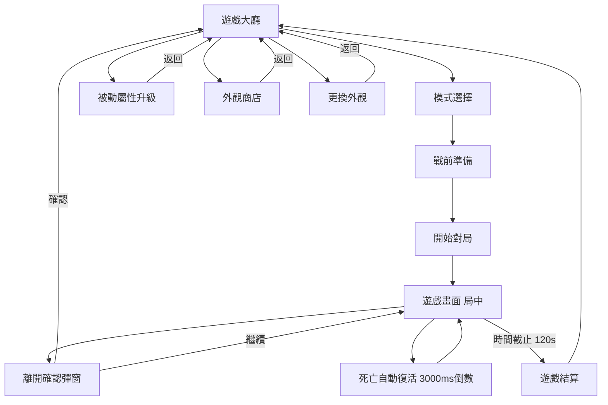

# 貪食蛇GDD

**文件版本**：0.6 📝[v0.6]
**更新日期**：2026-05-29 📝[v0.6]
**適用平台**：手機 (橫版)
**母 App 平台**：「玩星派對」App

---

## 1. 專案概述

本文件定義多人競技 2D 橫版小遊戲《貪食蛇》在「玩星派對」App 平台下的各項企劃規格。
核心目標為提供節奏明快、博弈性強 2D 橫版競技體驗。遊戲主打 **「多人大亂鬥 X 體力控管 X 截斷反殺」** 的核心樂趣，搭配戰前地圖道具準備、局外屬性被動養成，以及外觀商店，建立起完整的核心循環。

---

## 2. 系統與版本變更紀錄

### 2.1 系統刪減與保留清單

為了使遊戲體驗更純粹，針對早期版本進行以下調整：

* **🛑 移除的系統**：移除 3D 微黏土與霧面塑料美術，改為 **2D 扁平/卡通風格**；不接入任何廣告單元；移除死亡時手動消耗資源復活或返回大廳按鈕。
* **✅ 保留/新增的系統**：Solo 練習、多人大亂鬥與多人組隊賽；戰前地圖道具準備（非主動技能）；局外被動養成；自訂上傳個人照片作為蛇頭頭像；表情貼圖局內自動觸發。

### 2.2 版本變更與增減紀錄

以下列出本企劃規格書的所有歷史變更項目：

<details open>
<summary><b>v0.6 (2026-05-29) - 本次更新</b></summary> 📝[v0.6]

* **章節獨立大數字拆分**： 📝[v0.6]
  * **Ch 3 基礎核心與操作**：整合搖桿操控、跑速計算與主動技能。 📝[v0.6]
  * **Ch 4 碰撞、死亡與重生復活規則**：獨立為大章節，移至基礎操作之後。 📝[v0.6]
  * **Ch 5 地圖、食物與道具系統**：獨立為大章節，包含地圖設計、安全生成、吃食與道具細則。 📝[v0.6]
  * **Ch 6 遊戲模式與排行規則**：獨立為大章節。 📝[v0.6]
  * **Ch 7 電腦 (AI/BOT) 策略與匹配**：獨立為大章節。 📝[v0.6]
  * **Ch 8 局外系統與養成**：獨立為大章節。 📝[v0.6]
* **規則與公式微調**：
  * **速度加成公式改寫**：改為 `最終跑速 = 基本跑速 + 各項速度加成(正數=提升；負數=降低)`。 📝[v0.6]
  * **食物規則拆分**：將原 3.2.2 拆分為「食物生成規則」、「吃食物規則」與「加分規則」三個獨立小節。 📝[v0.6]
* **行內標籤更新**：剔除所有歷史 `v0.5` 的標記，本次新增/修改處尾部標記為 `📝[v0.6]`。 📝[v0.6]
</details>

<details>
<summary><b>v0.5 (2026-05-29) - 歷史更新</b></summary>

* **結構重組與清理**：
  * 移除 Chapter 3.0，將基礎參數下放至對應小節。
  * 補回與重建地圖道具章節，移除 Ch 3 尾部多餘的 duplicated Ch 6 美術列表。
  * 清理主動技內重疊的擊殺判定、死亡與復活限制、結算與經濟。
* **機制與公式優化**：
  * **純加算速度公式**：修改移動速度增減算法為純加算，控制模組統一歸於 `<Module表_基礎屬性>`。
  * **公式去 floor 符號**：所有公式計算結果改以純文字標註「（無條件捨去至整數）」。
  * **條列式平衡清單**：將積分與長度成長的換算關係以條列式清單呈現。
  * **食物生成規則重構**：合併食物與道具的地形分配、初始投放、常態檢測與安全生成規則。
  * **體力超載視覺**：體力扣減至 0 觸發超載時，蛇頭光暈變為紅色，且在超載狀態下禁止衝刺且暫停體力回復。
  * **非前三名排行顯示**：玩家不在前三名時，HUD 排行榜第四格固定顯示玩家本人名次與資訊（前三名 + 玩家自己）。
  * **相對方位標示排版**：修正第一名方位追蹤 ICON 的排版格式與縮進。
</details>

<details>
<summary><b>v0.4 (2026-05-28) - 歷史更新</b></summary>

* **新增**：
  * 食物地形分配權重改為統一表格格式
  * 增補局內積分計算與蛇身長度成長公式
  * 幽靈無敵重生狀態下禁止吞食、主動技與道具等互動限制
  * 被動屬性升級金幣消耗公式與參數展示
  * 畫面正上方增補擊殺提示訊息與連殺音效徽章規則
  * 畫面中央增補復活倒計時字體與面板 UI 規則
* **修改**：
  * 核心與被動升級參數全面去小數點化
  * 衝刺體力扣減與回復速度等相關係數調整
  * Mermaid 介面流程圖補全大廳外觀商店、更換外觀、被動屬性升級等跳轉分支
</details>

<details>
<summary><b>v0.3 (2026-05-28) - 歷史更新</b></summary>

* **新增**：
  * 撞岩石與地圖邊界損失 50% 長度與演出效果描述，邊界碰撞不死回彈
  * 被截斷後半段蛇體身軀 100% 碎裂轉化為地圖上的食物殘骸
  * 食物與隨機道具安全生成機制（避開岩石）
  * 速度加減法（加算）運算規則與吸附飛行速度層級 (Vortex > Magnet > Base)
  * 戰前付費攜帶道具效果（直接套用滿級效果）
  * 道具堆疊/覆蓋/重複使用/死亡倒數規則
* **修改**：
  * 地圖道具快捷鍵展示位置修改為畫面中央下方
  * 死亡判定移除地圖邊界致死條件
  * 衝刺狀態速度加成修改為加算 +25%跑速
  * 被動屬性養成屬性明細重構為統一的 Markdown 表格格式
  * 將復活時間改為 `3000ms`
  * 被動養成上限改為 40 級，並拆分列出 1 等/滿等/每級成長之屬性數值
  * 移除被動養成的「星盤」名詞
  * 將原「拾荒者」拆分為 4 種獨立的地圖道具持續時間被動
  * 新增岩石抗性與河流抗性被動屬性
  * 小數全部改用萬分比格式 `(X｜萬分比)`
  * 秒數依有無小數點進行分流
  * 模式、食物類型與結算評價全面表格化
  * 金幣與鑽石獲取管道調整
  * 商店價格標註位置與欄位格式修正
  * 第四章參數總覽拆分寬高，並增設「單位」與「防重疊間距」欄位
  * 介面流程圖流向調整
  * 變更歷史紀錄採用折疊收合格式，且每項目換行條列
</details>

---

## 3. 基礎核心與操作 (Core Mechanics & Controls) 📝[v0.6]

### 3.1 基本操作與快捷展示 📝[v0.6]

遊戲採用標準的手機橫版雙手操作介面，基本搖桿與快捷配置如下：

1. **移動搖桿**：左手操控動態虛擬搖桿，控制蛇體 360 度移動走位。
2. **衝刺加速**：按住右手大顆衝刺按鈕，消耗體力值以使蛇體加速前進。
3. **磁力漩渦**：點擊右手小顆主動技按鈕，釋放磁力漩渦瞬間吸附周圍食物。
4. **地圖道具快捷欄**：若戰前準備裝備了地圖道具，在畫面中央下方會顯示該道具的快捷欄，點擊即可發動效果。

### 3.2 基礎跑速與速度計算規則 📝[v0.6]

1. **基礎跑速**：
   * 蛇隻初始狀態下的基礎前進速度為 `BASE_SPEED = 4 px/s`（由<Module表_基礎屬性>控制）。
2. **速度增減計算公式**： 📝[v0.6]
   * 局內所有的移動速度加成與減幅一律採用以下加算公式： 📝[v0.6]
     ```text
     最終跑速 = 基礎跑速 + 各項速度加成 （正數 = 提升，負數 = 降低）
     ```
   * **各項速度加成運算規則**： 📝[v0.6]
     各項跑速加成/減幅係數以萬分比計，所有加成與減幅比例先進行加算，再折算為絕對跑速增幅：
     ```text
     各項速度加成 = 基礎跑速 * (各項加成/減幅萬分比之和) / 10000 （計算結果無條件捨去至整數）
     ```
3. **實例計算說明**： 📝[v0.6]
   假設蛇隻基礎跑速 `BASE_SPEED = 4 px/s`，當前狀態為：
   * 衝刺狀態中：加成比例 `+2500`（即 `+25%` 移動速度）
   * 處於巨大蘑菇狀態：減幅比例 `-2500`（即 `-25%` 移動速度）
   * 巨大蘑菇跑速被動升級至 Lv6：加成比例 `+600`（即 `+6%` 移動速度）
   * 進入河流地形區：減幅比例 `-5000`（即 `-50%` 移動速度）
   * **計算過程**：
     * 各項比例之和 = `+2500 - 2500 + 600 - 5000 = -4400`
     * 各項速度加成 = `4 * (-4400) / 10000 = -1.76 px/s` ➡️ 無條件捨去至整數為 **`-2 px/s`**。
     * 最終跑速 = `4 px/s + (-2 px/s) = 2 px/s`。 📝[v0.6]

### 3.3 主動技能 (Active Skills) 📝[v0.6]

1. **衝刺 (Dash)**：
    * **速度增幅**：按住加速鍵時，移動速度加成比例為 `+2500 (2500｜萬分比)`（由<Module表_基礎屬性>控制）。
    * **體力上限**：蛇隻最大體力值 `STAMINA_MAX = 1000`（由<Module表_基礎屬性>控制）。
    * **消耗與回復**：
      * 衝刺狀態下，每秒持續扣除 `STAMINA_DRAIN_SPEED = 333` 點體力值（由<Module表_基礎屬性>控制，滿體力約可衝刺 3 秒）。
      * 常態非衝刺狀態下，每秒自動回復 `STAMINA_REGEN_SPEED = 80` 點體力值（由<Module表_基礎屬性>控制）。
    * **過熱超載 (Overload)**：
      * 當體力值消耗至 0 點時，觸發「超載」狀態。此時蛇頭周圍的體力光暈（Aura）變為 **紅色**。
      * 在超載狀態下，系統將 **強制鎖定並禁止使用衝刺加速**，且 **暫停體力自然回復**。
      * 只有在超載狀態持續中，體力值藉由拾取「活力蘇打」道具瞬間補滿，或在禁止衝刺下冷卻等待至體力值回滿至上限 1000 點時，方可解除超載狀態，恢復正常體力機制與光暈顏色。
2. **磁力漩渦 (Vortex)**：
    * **效果描述**：點擊主動技按鈕，以蛇頭為中心瞬間釋放一個半徑 `VORTEX_RADIUS = 200px` 的強力食物吸引磁場。將半徑內所有食物以吸附移動速度 `VORTEX_SUCTION_SPEED = 12 px/s`（由<Module表_基礎屬性>控制）迅速吸附拉近至蛇頭。
    * **冷卻時間**：主動技冷卻時間為 `VORTEX_CD = 30` 秒（由<Module表_基礎屬性>控制）。
    * **視野規格**：常態下視野倍率為 `BASE_VISION_SCALE = 10000 (10000｜萬分比)`（由<Module表_基礎屬性>控制）。

---

## 4. 碰撞、死亡與重生復活規則 (Collision, Death & Respawn) 📝[v0.6]

### 4.1 碰撞與死亡判定 📝[v0.6]

* **死亡判定**：蛇頭碰撞到其他蛇隻的身體段落時判定死亡。
* **邊界碰撞不死回彈**：蛇頭撞擊地圖邊界時不會致死。撞擊時，會瞬間觸發受撞閃爍並受力回彈，扣除 **當前蛇身長度的 50%**（由<Module表_地圖場景>控制：`ROCK_BOUNCE_PENALTY_RATIO = 5000 (5000｜萬分比)`）。扣減後長度不得低於 `INITIAL_LENGTH = 50` 節。後半段被扣除的蛇身會碎裂化為煙霧消失（不轉化為食物）。 📝[v0.6]
* **岩石碰撞不死回彈**：蛇頭撞擊岩石時不會致死。撞擊時，蛇體會瞬間觸發紅色受撞閃爍並受力向後彈開，扣除 **當前蛇身長度的 50%**（由<Module表_地圖場景>控制：`ROCK_BOUNCE_PENALTY_RATIO = 5000 (5000｜萬分比)`）。扣減後**長度不得低於 `INITIAL_LENGTH = 50`**。後半段被扣除的蛇身會碎裂化為煙霧特效逐漸在空中融解消失（**不轉化為地圖上的食物**）。 📝[v0.6]

### 4.2 死亡復活與行為限制 📝[v0.6]

* **死亡表現與復活時間**：
  * 玩家撞身死亡後，畫面轉為黑白，蛇體化為發光殘骸。
  * 畫面中央彈出大型半透明倒數面板，顯示倒計時字體：`3... 2... 1... 隨機復活中`（復活倒數時間 `RESPAWN_TIME = 3000ms`，由<Module表_遊戲模式>控制）。
* **復活倒數期間行為限制**：
  * 玩家在復活倒數期間，無法進行任何方向移動，亦無法使用、點擊或釋放任何主動技能（衝刺與磁力漩渦）或地圖道具。
  * **時間即時扣減**：死亡復活期間，玩家身上作用中的所有地圖道具或技能道具持續時間**仍持續進行即時倒計時消耗**，不會凍結暫停。

### 4.3 重生幽靈與防守屍保護 📝[v0.6]

* **隱藏重生點（防守屍機制）**：
  * 所有蛇隻（包含玩家與電腦）隨機分配的安全重生點，對其他所有對手蛇隻皆為隱蔽、不可見。畫面上不會對對手顯示任何重生點的預告特效或指針，防止被提前圍剿。
* **重生幽靈狀態**：
  * 讀秒完畢後，於隨機安全座標復活，並獲得 **`2000ms`** 的幽靈無敵狀態（由<Module表_遊戲模式>控制：`GHOST_TIME = 2000` ms）。
  * **幽靈狀態下限制**：蛇隻呈現半透明，可穿透岩石與其他蛇隻，在此狀態下 **無法吃食物、無法使用任何主動技能（衝刺與磁力漩渦），亦無法使用或觸發任何地圖道具與戰前攜帶道具**。

---

## 5. 地圖、食物與道具系統 (Map, Food & Items) 📝[v0.6]

### 5.1 地圖設計與環境 📝[v0.6]

* **地圖尺寸**：寬度 `MAP_WIDTH = 2200px`，高度 `MAP_HEIGHT = 2200px` （由<Module表_地圖場景>控制）。
* **障礙物 (岩石)**：地圖中隨機分布無法穿透的 2D 岩石（碰撞規則詳見 `4.1`）。
* **緩速區 (河流)**：地圖中分布橫向的河流區域。任何蛇體（玩家與電腦）進入河流區時，移動速度減幅比例為 `RIVER_SLOW_MULTIPLIER = -5000 (-5000｜萬分比)`（由<Module表_地圖場景>控制）。

### 5.2 食物與道具安全生成規則 📝[v0.6]

* **食物總量積分基準**：食物有大中小三種價值，地圖的初始投放與維持下限一律以「總積分價值」計算。
* **初次生成**：對局開始時，系統在隨機安全座標生成總積分價值 `INITIAL_FOOD_POINTS = 3000` 分的隨機食物組合。
* **常態補充檢測**：
  * **檢測週期**：系統每隔 `FOOD_REPLENISH_INTERVAL = 10000ms`（10秒）背景檢測一次地圖上存活食物的總積分。
  * **補足邏輯**：當地圖上食物總積分低於 `MIN_FOOD_POINTS = 1000` 分時，系統自動在隨機安全座標補充投放缺額的食物，將總積分價值補足至 1000 分。
* **安全生成與重疊機制**：食物與隨機道具在生成時，必須避開岩石區域，絕對不能生成在岩石內部。**食物與食物、食物與道具、道具與道具之間允許重疊**，不設防重疊間距限制。
* **地形生成權重與分配**：（由<Module表_地圖場景>控制）

  | 地形分類 | 參數名稱 | 分配權重 | 初始投放積分價值 | 補足維持積分基準 | 說明 |
  | :--- | :--- | :---: | :---: | :---: | :--- |
  | **岩石區** | `FOOD_DIST_ROCK` | `5000` (5000｜萬分比) | **1500** 分 | **500** 分 | 碰撞風險極高，故設置最高投放密度，引導高風險高回報博弈。 |
  | **河流區** | `FOOD_DIST_RIVER` | `3000` (3000｜萬分比) | **900** 分 | **300** 分 | 具備減速阻礙，投放密度中等。 |
  | **平地無風險區** | `FOOD_DIST_PLAINS` | `2000` (2000｜萬分比) | **600** 分 | **200** 分 | 無任何風險，投放密度最低。 |

### 5.3 吃食物規則 📝[v0.6]

* **自動吸附機制**：蛇隻常態下具備基礎吸附食物半徑 `BASE_SUCTION_RADIUS = 50px`（由<Module表_基礎屬性>控制）。當食物進入吸附半徑時，會自動觸發吸附並平滑飛向蛇頭被蛇吞食。
* **吸附速度層級**：磁力漩渦 > 地圖磁鐵 > 基本吸附。食物向蛇頭飛行的吸附移動速度分別為：
  * 磁力漩渦吸附速度：`VORTEX_SUCTION_SPEED = 12 px/s`（由<Module表_基礎屬性>控制）。
  * 地圖磁鐵吸附速度：`MAGNET_SUCTION_SPEED = 8 px/s`（由<Module表_關卡道具>控制）。
  * 基本吸附速度：`BASE_SUCTION_SPEED = 4 px/s`（由<Module表_基礎屬性>控制）。

### 5.4 積分與加分公式 📝[v0.6]

* **食物類型與數值**：（由<Module表_地圖場景>控制）

  | 食物 | 價值 | 外觀尺寸 |
  | :--- | :---: | :---: |
  | **小食物** | `FOOD_VAL_SMALL = 2` | `FOOD_SIZE_SMALL = 4px`  |
  | **中食物** | `FOOD_VAL_MEDIUM = 5` | `FOOD_SIZE_MEDIUM = 7px` |
  | **大食物** | `FOOD_VAL_LARGE = 10` | `FOOD_SIZE_LARGE = 10px` |

* **積分獲取公式**：
  ```text
  每吞食食物獲得的積分 = 食物基礎價值 * 幸運糖得分倍率
  ```
  * 一般情況下幸運糖得分倍率為 1（即無加成），吃下幸運糖道具期間為 3（且可加算養成屬性增量，詳見 `8.2`）。
* **長度成長與平衡清單**：
  * **初始長度**：`INITIAL_LENGTH = 50` 節（由<Module表_基礎屬性>控制）。
  * **成長換算比率**：`POINTS_PER_SECTION = 10` 分/節（即每累積 10 分增加 1 節長度）。
  * **長度成長公式**（無條件捨去至整數）：
    ```text
    最終蛇隻總節數 = INITIAL_LENGTH + (當前總積分 / POINTS_PER_SECTION) （計算結果無條件捨去至整數）
    ```
  * **平衡對照關係**：
    * 吞食小食物（2分）：需要 5 顆成長 1 節。
    * 吞食中食物（5分）：需要 2 顆成長 1 節。
    * 吞食大食物（10分）：吞食 1 顆即可成長 1 節。
* **殘骸食物轉化**：
  * **擊殺殘骸**：當任何蛇體頭部碰撞到其他蛇體身軀死亡時，被擊殺之蛇身將 **100% 破碎為大型食物光點**（總價值相當於死者生前長度積分之 `DEBRIS_PERCENTAGE = 5000 (5000｜萬分比)`，即 50%）。殘骸集中散落在死亡蛇身的軌跡上。
  * **截斷殘骸**：當蛇體被其他蛇隻截斷身軀時，失去的後半段身軀將 **100% 破碎為食物光點**（總價值相當於被截斷蛇段生前長度積分之 `DEBRIS_PERCENTAGE = 5000 (5000｜萬分比)`，即 50%）。這些殘骸會散落在截斷軌跡上。

### 5.5 地圖道具機制 (Map Items)

#### 5.5.1 隨機道具說明

局內地圖中會隨機刷新 4 種不同的地圖道具，碰撞即可起效：

1. **磁鐵 (Magnet)**：
    * **效果與範圍**：啟用後產生磁吸光圈。吸附半徑擴大為 `ITEM_MAGNET_RADIUS = 100px`（由<Module表_關卡道具>控制）。
    * **吸附速度與持續時間**：食物飛行吸附速度為 `MAGNET_SUCTION_SPEED = 8 px/s`。持續時間為 `ITEM_MAGNET_DURATION = 10` 秒。
2. **巨大蘑菇 (Giant Mushroom)**：
    * **體型與碰撞**：蛇體渲染寬度與碰撞判定尺寸放大至 `ITEM_MUSHROOM_SIZE = 15000 (15000｜萬分比)` 倍（即 1.5 倍）。獲得金屬發光霸體效果，可免疫被其他小蛇攔截截斷。
    * **速度懲罰與致死判定**：巨大狀態下，移動速度加算扣減 25%：`ITEM_MUSHROOM_SPEED_PENALTY = -2500 (-2500｜萬分比)`（加算減速）。**注意：蛇頭碰撞到其他蛇體身軀依然判定死亡**，不做撞身免死判定。
    * **持續時間**：巨大化效果持續時間為 `ITEM_MUSHROOM_DURATION = 10` 秒。
3. **幸運糖 (Lucky Candy)**：
    * **效果與持續時間**：蛇頭周圍出現彩色糖果環繞特效。在此期間，吞食地圖食物所獲得的積分與長度增加為 `ITEM_CANDY_MULTIPLIER = 30000 (30000｜萬分比)` 倍（即 3 倍分）。持續時間為 `ITEM_LUCKY7_DURATION = 10` 秒。
4. **鷹眼 (Eagle Eye)**：
    * **視野拉遠**：畫面視角平滑拉遠，獲取更廣闊的戰場視野，視野缩放比例提升為 `ITEM_EYE_SCALE = 13500 (13500｜萬分比)` 倍（即 1.35 倍）。
    * **持續時間**：鷹眼視野擴大持續時間為 `ITEM_EYE_DURATION = 10` 秒。
5. **道具刷新與生成限制**：（由<Module表_關卡道具>控制）
    * **刷新間隔與上限**：每隔 `ITEM_SPAWN_INTERVAL = 3` 秒，地圖隨機安全座標刷新一個道具，地圖上同時存在道具上限為 `ITEM_MAX_COUNT = 12` 個。
    * **預告提示**：道具生成前 3 秒，地圖上會預先顯示帶有倒數動畫的閃爍座標圖示，時長為 `ITEM_TEASER_TIME = 3` 秒。

#### 5.5.2 戰前付費攜帶道具

* **付費攜帶機制**：玩家在對局開局前，可付費攜帶或使用庫存的道具（即技能道具）。攜帶進入對局後，效果強度**高於**地圖上隨機拾取的道具。
* **套用滿級效果**：當玩家啟用付費攜帶的技能道具時，其效果參數（如吸附半徑、持續時間等）**直接套用被動養成滿級 (Level 40) 的數值參數**，無視玩家目前自己被動養成的實際等級。

#### 5.5.3 道具堆疊、覆蓋與重複使用規則

* **地圖與技能道具堆疊覆蓋**：
  * **高強度覆蓋低強度**：若玩家身上正在生效「地圖道具」效果（例如地圖磁鐵，剩餘 4 秒，半徑 100px），此時若啟用付費「技能道具」，技能道具會**完全覆蓋**並取代地圖道具，屬性立刻提升為滿級參數（半徑 200px），且剩餘時間重新重置為技能道具的滿級持續時間 20 秒。
  * **反向忽略**：若玩家身上已在生效「技能道具」效果，此時拾取地圖上的同種「地圖道具」，該地圖道具會被**忽略**（不覆蓋高強度效果，亦不重置/累加時間）。
* **同級別重複使用與時間倒數**：
  * **地圖道具重複拾取（覆蓋重置）**：玩家在「地圖道具」生效期間重複拾取同種地圖道具，其剩餘持續時間會被**覆蓋重置**為該道具之基礎時間（時間不累加，例如剩餘 4 秒磁鐵，拾取地圖磁鐵後重置為 10 秒）。
  * **技能道具重複啟用（累加延長）**：玩家在「技能道具」生效期間重複發動同種技能道具，其持續時間會進行**累加延長**（例如剩餘 4 秒，再次使用技能道具，持續時間延長為 24 秒）。

---

## 6. 遊戲模式與排行規則 (Game Modes & Leaderboards) 📝[v0.6]

### 6.1 遊戲模式設計 📝[v0.6]

遊戲提供三種對局模式，單局時間限制為 `GAME_DURATION = 120s` （由<Module表_遊戲模式>控制）：

| 模式 | 配置 | 勝負規則 |
| :--- | :--- | :--- |
| **Solo (單人練習)** | 1 名玩家 vs 7 名電腦 BOT | 120 秒時間結束，以玩家與所有 BOT 之積分進行排名，最高分者獲勝。 |
| **多人大亂鬥** | 1 名玩家 vs 7 名高階電腦 AI | 120 秒時間結束，以玩家與高階 AI 之個人長度/積分進行排名，最高分者獲勝。 |
| **多人組隊賽** | 紅白兩陣營對抗（4 vs 4，玩家 + 3 名 BOT 對抗 1 名高階 AI + 3 名 BOT） | 120 秒結束時，累計兩陣營所有成員（包含已死和存活）的總長度積分，總積分高之陣營獲勝。 |

### 6.2 排名與同分破平規則 📝[v0.6]

* **同分破平規則**：分數相同者，先達到名次高。在所有對局模式中，若比賽結束結算時兩隻或多隻蛇的分數/長度完全相同，則**在局中優先達到該分數的蛇隻名次排在前面**。

### 6.3 局內排行榜與第一名冠冕顯示規則 📝[v0.6]

* **局內排行 HUD 顯示規則**：
  * 畫面上方或右上角常駐一個**局內排行榜**，不顯示角色頭像，簡化顯示格式為「名次. 名字 - 長度(積分)」。
  * **第一名皇冠標誌**：排行榜第一名（No.1）名次左側額外顯示一個 **「皇冠標誌」**（如 👑 視覺元素）。
  * **第一名蛇頭皇冠掛飾**：當前積分排行第一名的蛇隻（玩家或 AI），其**蛇頭上方**會常駐一個縮小的 **「皇冠標誌」** 掛飾隨蛇身移動。若第一名易主，皇冠會轉移到新第一名的蛇頭上。
  * **最多顯示 4 個名次**：
    * **若玩家當前排名在前三名 (1, 2, 3)**：排行榜展示第 1, 2, 3, 4 名的資訊（含玩家本人）。
    * **若玩家當前排名在第四名或以下 (>= 4)**：排行榜展示前三名 (1, 2, 3) 的資訊，並在最下方固定一行顯示玩家本人的名次與資訊（合計顯示 4 行）。例如：
      1. (👑) AI_01 - 500
      2. AI_02 - 450
      3. AI_03 - 400
      ...
      6. 玩家名字 (你) - 230

---

## 7. 電腦 (AI/BOT) 策略與匹配 (Computer Logic) 📝[v0.6]

### 7.1 強弱控制參數 📝[v0.6]

* **反應延遲**：`AI_REACTION_DELAY = 100ms` （由<Module表_AI策略>控制）。
* **轉彎精準度**：`AI_STEERING_PRECISION = 8000 (8000｜萬分比)` （由<Module表_AI策略>控制）。
* **衝刺發動機率**：`AI_DASH_PROB = 3000 (3000｜萬分比)` （由<Module表_AI策略>控制）。

### 7.2 四大策略與行為差異 📝[v0.6]

1. **食物收集策略 (Food Scavenger)**：
    * **行為特徵**：尋食發育。移動邏輯偏向畫面食物密度最高的區域前行。在無威脅時，僅以常規跑速前進，不加速且不刻意進行防禦偏轉。
2. **圍剿截斷策略 (Hunter/Interceptor)**：
    * **行為特徵**：主動獵殺。當附近有小蛇時，計算交會點並按下「衝刺」進行前方卡位，強迫對方撞擊自身身軀。
3. **保命迴避策略 (Defensive/Survivor)**：
    * **行為特徵**：以避險為最高優先。當半徑 `AI_EVADE_DISTANCE = 150px` 內有敵蛇衝刺或接近時，會立刻放棄食物並朝相反方向 180 度大轉向逃跑。無威脅時，主動遠離亂戰中央區，保持在人稀的「安全邊緣地帶」緩慢蛇行。
4. **道具爭奪策略 (Item Seeker)**：
    * **行為特徵**：爭奪道具。當視野範圍 `AI_CHASE_DISTANCE = 300px` 內刷新了地圖道具（磁鐵、巨大蘑菇等），AI 會忽略一般食物，全速前往道具座標進行爭奪。

### 7.3 AI 策略動態切換 📝[v0.6]

每隻電腦在生成時，會隨機被分配一種性格配比作為基礎行為傾向。在對局進行中，系統會依據環境變數動態切換策略：

* **性格匹配佔比**：大亂鬥中，電腦的初始性格配比為：40% 收集型、30% 獵人型、20% 生存型、10% 道具型 （由<Module表_AI策略>控制）。
* **情境動態切換條件**：
  * **狀態機觸發**：長度 `< 100` 時強制鎖定 *食物收集策略*；半徑 300px 內刷新道具切換為 *道具爭奪策略*；半徑 150px 內敵蛇衝刺切換為 *保命迴避策略*；自身長度大於 800 且 200px 內有小蛇時切換為 *圍剿截斷策略*。

---

## 8. 局外系統與養成 (Out-of-Game Systems) 📝[v0.6]

### 8.1 被動屬性養成 📝[v0.6]

* **升級消耗金幣公式**：
  * **參數與預設值**：
    * 升級基礎金幣：`PASSIVE_UPGRADE_BASE_COST = 100` (金幣)
    * 升級指數係數：`PASSIVE_UPGRADE_EXPONENT = 115` (基底 1.15，計算時以 115/100 帶入計算)
  * **公式**（無條件捨去至整數）：
    ```text
    升級所需金幣 = PASSIVE_UPGRADE_BASE_COST * (PASSIVE_UPGRADE_EXPONENT / 100) ^ 當前該屬性等級 （計算結果無條件捨去至整數）
    ```
* **等級上限**：每個被動屬性的等級上限固定為 **`40`** 級（由<Module表_被動養成>控制：`PASSIVE_MAX_LEVEL = 40`）。

### 8.2 屬性養成明細 📝[v0.6]

| 被動屬性名稱 | 分類 | 初始(Lv1)數值 | 滿級(Lv40)數值 | 每級成長增量 | 說明 |
| :--- | :---: | :---: | :---: | :---: | :--- |
| **磁吸半徑** | 道具類 | `1025 (0.1px)` | `2000 (0.1px)` | `+25 (0.1px)` | 永久提升拾取磁鐵道具後的食物吸附半徑。 |
| **巨大蘑菇移動速度** | 道具類 | `-2400` | `1500` | `+100` | 永久提升在巨大蘑菇狀態下的移動速度（加算增幅，以萬分比表示）。 |
| **幸運糖食物倍率** | 道具類 | `31000` | `70000` | `+1000` | 永久增加拾取幸運糖後的吞食食物得分與長度增量倍率（以萬分比表示）。 |
| **鷹眼視野** | 道具類 | `13600` | `17500` | `+100` | 永久提升拾取鷹眼道具後相機的視野拉遠比例（以萬分比表示）。 |
| **磁鐵持續時間** | 特殊類 | `10250 ms` | `20000 ms` | `+250 ms` | 永久提升局內磁鐵道具的作用時長。 |
| **巨大蘑菇持續時間** | 特殊類 | `10250 ms` | `20000 ms` | `+250 ms` | 永久提升局內巨大蘑菇道具的作用時長。 |
| **幸運糖持續時間** | 特殊類 | `10250 ms` | `20000 ms` | `+250 ms` | 永久提升局內幸運糖道具的作用時長。 |
| **鷹眼持續時間** | 特殊類 | `10250 ms` | `20000 ms` | `+250 ms` | 永久提升局內鷹眼道具的作用時長。 |
| **岩石抗性** | 特殊類 | `扣減 4900` | `扣減 1000` | `-100` | 永久減免碰撞岩石與地圖邊界時的蛇身長度扣減百分比（以萬分比表示）。 |
| **河流抗性** | 特殊類 | `減速 4900` | `減速 1000` | `-100` | 永久減免河流緩速區的減速比例（以萬分比表示）。 |

### 8.3 個性化外觀與表情貼圖 📝[v0.6]

1. **2D 醜萌 Skin**：設計搞怪、可愛風格的 2D 橫版蛇身皮膚。
2. **自訂頭像照片上傳**：玩家可在「更換外觀」介面中上傳個人照片作為蛇頭圓形頭像，無等級限制。
3. **自動表情貼圖 (Emotes) 觸發機制**：
    * **表情貼圖購買與持續時間**：表情貼圖可自成長里程碑解鎖或**從商店中購買獲得**。表情持續顯示時間：`EMOTE_DURATION = 3s` （由<Module表_個性外觀>控制）。
    * **觸發時機與表現形式**：
        * **擊殺成功**：彈出「得意」氣泡。放大彈出，抖動 0.5 秒後靜止，最後 0.5 秒漸隱。
        * **被擊殺**：在蛇頭碎裂的位置彈出「大哭」氣泡。緩慢下落並漸隱。
        * **被截斷**：彈出「生氣」氣泡。伴隨紅色感嘆號閃爍並漸隱。
        * **近距離交會**：雙方蛇頭距離小於 60px 且擦身而過時彈出「求饒」氣泡，快速淡出。

### 8.4 結算評價與獎勵機制 📝[v0.6]

對局結束後，系統彈出結算畫面，展示最終排名（1-8）、獲得的金幣與熟練度，並給予發育評價：

* **評價評級標準**：（由<Module表_遊戲模式>控制）
  * **`SSS`**：獲得第一名且局終個人累計積分達 `2000` 分及以上。
  * **`SS`**：獲得第一名，或累計積分達 `1500` 分及以上。
  * **`S`**：獲得前三名，且累計積分達 `1000` 分及以上.
  * **`A`**：獲得前三名，或累計積分達 `800` 分及以上。
  * **`B`**：獲得前五名，且累計積分達 `500` 分及以上。
  * **`C`**：累計積分達 `300` 分及以上。
  * **`D`**：累計積分達 `100` 分及以上。
  * **`E`**：累計積分低於 `100` 分。

### 8.5 遊戲經濟與商店直購 📝[v0.6]

1. **金幣 (Coins)**：
    * **獲取**：局終結算獎勵。
    * **消耗**：局外被動屬性升級、戰前準備道具購買。
2. **鑽石 (Diamonds)**：
    * **獲取**：儲值內購、成長里程碑、成長之路。
    * **消耗**：外觀商店 Skin 直購、表情貼圖直購、戰前準備道具購買。
3. **入場能量**：每局開局固定扣除 `ENTRY_ENERGY = 30` 點能量（由<Module表_基礎屬性>控制）。自然恢復上限 300 點。
4. **地圖道具直購價格表**：（由<Module表_商店配置>控制）

    | 地圖道具名稱 | 鑽石 | 消耗數量 |
    | :--- | :---: | :---: |
    | **磁鐵 (Magnet)** | 5 | 1 |
    | **巨大蘑菇 (Giant Mushroom)** | 5 | 1 |
    | **幸運糖 (Lucky Candy)** | 8 | 1 |
    | **鷹眼 (Eagle Eye)** | 5 | 1 |

---

## 9. 參數表總覽 (Parameters Overview) 📝[v0.6]

### 9.1 基礎核心參數 📝[v0.6]

| 參數名稱 | 參數描述 | 預設數值 | 單位 |
| :--- | :--- | :---: | :---: |
| `BASE_SPEED` | 蛇隻初始基礎跑速 | 4 | px/s |
| `STAMINA_MAX` | 蛇隻最大體力值 | 1000 | 點 |
| `STAMINA_DRAIN_SPEED` | 衝刺狀態下每秒體力扣減速度 | 333 | 點/s |
| `STAMINA_REGEN_SPEED` | 常態下每秒體力恢復速度 | 80 | 點/s |
| `BASE_SUCTION_RADIUS` | 蛇隻基礎吸附食物半徑 | 50 | px |
| `BASE_VISION_SCALE` | 遊戲相機基礎視野倍率 | 10000 | 萬分比 |
| `INITIAL_LENGTH` | 蛇隻開局初始長度/節數 | 50 | 節 |
| `ENTRY_ENERGY` | 進入一局對戰消耗的能量點數 | 30 | 點 |
| `DASH_SPEED_BONUS` | 衝刺狀態下跑速加成比例 | 2500 | 萬分比 |
| `VORTEX_CD` | 主動技能「磁力漩渦」的冷卻時間 | 30 | s |
| `VORTEX_RADIUS` | 主動技能「磁力漩渦」的吸附半徑 | 200 | px |
| `VORTEX_SUCTION_SPEED` | 「磁力漩渦」釋放時的食物吸附飛行速度 | 12 | px/s |
| `MAGNET_SUCTION_SPEED` | 拾取「磁鐵」道具後的食物吸附飛行速度 | 8 | px/s |
| `BASE_SUCTION_SPEED` | 常態下的食物基礎吸附飛行速度 | 4 | px/s |
| `POINTS_PER_SECTION` | 每累積該積分增加 1 節蛇身長度 | 10 | 分 |

### 9.2 遊戲模式參數 📝[v0.6]

| 參數名稱 | 參數描述 | 預設數值 | 單位 |
| :--- | :--- | :---: | :---: |
| `GAME_DURATION` | 單局遊戲時間限制 | 120 | s |
| `RESPAWN_TIME` | 死亡復活的自動倒數計時時間 | 3000 | ms |
| `GHOST_TIME` | 復活後擁有的幽靈無敵保護狀態時間 | 2000 | ms |

### 9.3 地圖與場景參數 📝[v0.6]

| 參數名稱 | 參數描述 | 預設數值 | 單位 |
| :--- | :--- | :---: | :---: |
| `MAP_WIDTH` | 2D 對戰地圖邊界寬度（超出則回彈扣減長度） | 2200 | px |
| `MAP_HEIGHT` | 2D 對戰地圖邊界高度（超出則回彈扣減長度） | 2200 | px |
| `ROCK_BOUNCE_PENALTY_RATIO` | 碰撞岩石與邊界時所扣除的長度百分比 (50%當前長度) | 5000 | 萬分比 |
| `RIVER_SLOW_MULTIPLIER` | 蛇隻處於河流緩速區的速度扣減比例 (50%減速) | -5000 | 萬分比 |
| `FOOD_DIST_ROCK` | 食物在岩石地形區的生成分配權重 | 5000 | 萬分比 |
| `FOOD_DIST_RIVER` | 食物在河流地形區的生成分配權重 | 3000 | 萬分比 |
| `FOOD_DIST_PLAINS` | 食物在平地地形區的生成分配權重 | 2000 | 萬分比 |
| `FOOD_VAL_SMALL` | 小食物增加的積分/長度 | 2 | 分 |
| `FOOD_SIZE_SMALL` | 小食物的 2D 渲染尺寸 | 4 | px |
| `FOOD_VAL_MEDIUM` | 中食物增加的積分/長度 | 5 | 分 |
| `FOOD_SIZE_MEDIUM` | 中食物的 2D 渲染尺寸 | 7 | px |
| `FOOD_VAL_LARGE` | 大食物增加的積分/長度 | 10 | 分 |
| `FOOD_SIZE_LARGE` | 大食物的 2D 渲染尺寸 | 10 | px |
| `INITIAL_FOOD_POINTS` | 開局地圖隨機散落食物初始總積分價值 | 3000 | 分 |
| `MIN_FOOD_POINTS` | 地圖上維持的最少食物總積分價值（補足下限） | 1000 | 分 |
| `FOOD_REPLENISH_INTERVAL` | 食物補充投放的背景檢測與補足週期 | 10000 | ms |
| `DEBRIS_PERCENTAGE` | 死亡與截斷蛇體轉化為發光殘骸的積分百分比 (50%) | 5000 | 萬分比 |

### 9.4 電腦 AI 策略參數 📝[v0.6]

| 參數名稱 | 參數描述 | 預設數值 | 單位 |
| :--- | :--- | :---: | :---: |
| `AI_REACTION_DELAY` | 電腦檢測到威脅或切換策略時的反應延遲 | 100 | ms |
| `AI_STEERING_PRECISION` | 電腦角度偏轉與卡位時的轉向精準度 | 8000 | 萬分比 |
| `AI_DASH_PROB` | 電腦做出衝刺決策的概率 | 3000 | 萬分比 |
| `AI_EVADE_DISTANCE` | 電腦保命迴避策略的避險檢測半徑 | 150 | px |
| `AI_CHASE_DISTANCE` | 電腦追尋目標/爭奪道具的檢測半徑 | 300 | px |

### 9.5 關卡道具參數 📝[v0.6]

| 參數名稱 | 參數描述 | 預設數值 | 單位 |
| :--- | :--- | :---: | :---: |
| `ITEM_MAGNET_RADIUS` | 局內拾取磁鐵道具後的基礎吸附半徑 | 100 | px |
| `ITEM_MAGNET_DURATION` | 地圖道具「磁鐵」的吸附效果持續時間 | 10 | s |
| `ITEM_MUSHROOM_DURATION` | 地圖道具「巨大蘑菇」霸體效果持續時間 | 10 | s |
| `ITEM_MUSHROOM_SIZE` | 地圖道具「巨大蘑菇」體型與碰撞判定放大倍率 | 15000 | 萬分比 |
| `ITEM_MUSHROOM_SPEED_PENALTY` | 地圖道具「巨大蘑菇」狀態下的速度扣減比例 (25%減速) | -2500 | 萬分比 |
| `ITEM_LUCKY7_DURATION` | 地圖道具「幸運糖」得分加成效果持續時間 | 10 | s |
| `ITEM_CANDY_MULTIPLIER` | 得分加成倍率 | 30000 | 萬分比 |
| `ITEM_EYE_DURATION` | 地圖道具「鷹眼」視野擴大效果持續時間 | 10 | s |
| `ITEM_EYE_SCALE` | 地圖道具「鷹眼」相機拉遠視野比例倍率 | 13500 | 萬分比 |
| `ITEM_SPAWN_INTERVAL` | 地圖刷新隨機道具的時間間隔 | 3 | s |
| `ITEM_MAX_COUNT` | 地圖上同時允許存在的道具最大上限 | 12 | 個 |
| `ITEM_TEASER_TIME` | 道具刷新座標預先顯示倒數動畫的時長 | 3 | s |

### 9.6 被動屬性養成參數 📝[v0.6]

| 參數名稱 | 參數描述 | 初始(Lv1)數值 | 滿級(Lv40)數值 | 每級成長增量 | 單位 |
| :--- | :--- | :---: | :---: | :---: | :---: |
| `PASSIVE_MAGNET_UPGRADE` | 磁吸半徑永久增量 | 1025 | 2000 | +25 | 0.1 px |
| `PASSIVE_SPEED_UPGRADE` | 巨大蘑菇狀態下跑速永久增幅 | -2400 | 1500 | +100 | 萬分比 |
| `PASSIVE_LUCKY7_UPGRADE` | 幸運糖得分倍率永久增量 | 31000 | 70000 | +1000 | 萬分比 |
| `PASSIVE_EYE_UPGRADE` | 鷹眼視野縮放比例永久增量 | 13600 | 17500 | +100 | 萬分比 |
| `PASSIVE_MAGNET_DUR` | 磁鐵持續時間永久增量 | 10250 | 20000 | +250 | ms |
| `PASSIVE_MUSHROOM_DUR` | 巨大蘑菇持續時間永久增量 | 10250 | 20000 | +250 | ms |
| `PASSIVE_CANDY_DUR` | 幸運糖持續時間永久增量 | 10250 | 20000 | +250 | ms |
| `PASSIVE_EYE_DUR` | 鷹眼持續時間永久增量 | 10250 | 20000 | +250 | ms |
| `PASSIVE_ROCK_RESIST` | 岩石撞擊所造成的長度損失減免增量 | 4900 | 1000 | -100 | 萬分比 |
| `PASSIVE_RIVER_RESIST` | 河流緩速效果永久減免增量 | 4900 | 1000 | -100 | 萬分比 |
| `PASSIVE_UPGRADE_BASE_COST` | 養成被動屬性升級基礎金幣費用 | 100 | - | - | 金幣 |
| `PASSIVE_UPGRADE_EXPONENT` | 養成被動屬性升級費用指數係數 (115/100倍) | 115 | - | - | 比例 |

### 9.7 個性化外觀與貼圖參數 📝[v0.6]

| 參數名稱 | 參數描述 | 預設數值 | 單位 |
| :--- | :--- | :---: | :---: |
| `EMOTE_DURATION` | 表情氣泡在蛇頭上方的持續顯示時間 | 3 | s |

---

## 10. 介面設計 (UI Flow & Layout) 📝[v0.6]

### 10.1 介面流程圖 (UI Flow) 📝[v0.6]



### 10.2 局外介面 📝[v0.6]

1. **遊戲大廳**：
    * **排版**：橫版設計。左上角顯示玩家頭像與里程碑等級。右上角並排顯示金幣、鑽石與能量（30 點參賽能量標示）。
    * **中央**：三個橫向的模式選擇卡片（Solo 練習、多人大亂鬥、多人組隊賽）。
    * **底部**：【被動屬性升級】、【外觀商店】、【更換外觀】、右下角大型【開始遊戲】按鈕。
2. **被動屬性升級介面**：
    * **排版**：列表展示 10 種屬性的圖示、目前等級與進度條。底部為【升級】按鈕與所需金幣。點擊後以消耗金幣升級一個屬性。
3. **外觀商店**：
    * **排版**：左側展示已選皮膚的 2D 擺動動畫預覽。右側為分頁標籤（Skin、表情貼圖），列表列出每項外觀與其金幣/鑽石售價。
4. **戰前準備彈窗**：
    * **排版**：大廳點擊【開始遊戲】後彈出。提示開局扣除 30 點能量，並列出 4 個地圖道具（磁鐵、巨大蘑菇等）的攜帶勾選欄。
5. **更換外觀**：
    * **排版**：展示已擁有的皮膚，點擊即可更換。提供個人照片上傳按鈕，無任何等級限制。
6. **獲得獎勵彈窗**：
    * **排版**：全螢幕發光彈窗，展示獲得的 Skin 或表情。

### 10.3 局中介面 📝[v0.6]

1. **遊戲畫面 (HUD)**：
    * **無小地圖**。
    * **🧭 第一名相對方位標示**：
      畫面四周邊緣隨時會有一顆**帶有皇冠標誌的座標 ICON**（替代紅色指針）環繞移動，動態指向第一名玩家的座標，旁附其目前積分。
    * **🚪 中途離開按鈕**：右上角設有【Exit / 離開】按鈕。
    * **確認離開二次彈窗**：點擊離開後，畫面暫停，彈出離開二次確認視窗。
    * **局內排行榜**：右上角（Exit 按鈕下方）顯示排行榜，最多顯示 4 個名次。格式簡化為「名次. 名字 - 長度(積分)」（無頭像顯示）。排行榜第一名（No.1）名次左側顯示皇冠標誌（👑）。動態更新第一名蛇頭上方的皇冠掛飾（詳見 `6.3`）。 📝[v0.6]
    * **擊殺提示訊息 (Killing Banner Feed)**：
      * 當任何蛇體被擊殺時，畫面正上方滑出橫幅提示。
      * 提示格式：`[擊殺者頭像] 擊殺者名字 ➔ [被擊殺者頭像] 被擊殺者名字`。
      * **玩家擊殺**：使用金色發光邊框，名字高亮，並播報對應的連擊音效與徽章（擊殺、雙擊、三連擊、無人能擋）。
      * **玩家被擊殺**：橫幅顯示為紅色，文字提示：`你被 [擊殺者名字] 擊殺了！`。
    * 右下角配置大顆「Dash (衝刺)」、小顆「磁力漩渦」（帶有半透明扇形旋轉冷卻遮罩與秒數倒計時數字顯示）。左下角配置動態虛擬搖桿。畫面中央下方配置「地圖道具觸發按鈕」快捷欄。
2. **死亡復活畫面 (Respawn Countdown)**：
    * 玩家撞身死亡後，畫面轉為黑白，蛇身碎為光點。
    * 畫面中央彈出半透明倒數面板，顯示倒計時字體：`3... 2... 1... 隨機復活中`（詳見 `4.2`）。 📝[v0.6]
3. **遊戲結算**：
    * 120s 時間截止後彈出。展示最終排名（1-8）、綜合發育評價（SSS - E）與獲得的金幣及熟練度（詳見 `8.4`）。 📝[v0.6]

---

## 11. 美術需求列表 (2D) 📝[v0.6]

由於本作定位為 2D 扁平卡通畫風，所有資源均不涉及 3D 渲染，具體美術產出如下：

| 資源名稱 | 類型 | 規格 / 尺寸 | 說明 | 是否需要客製化 |
| :--- | :--- | :--- | :--- | :--- |
| **AppIcon** | Icon | 1024*1024 px | 2D 卡通蛇頭像，對齊玩星派對平台視覺。 | 需要 |
| **Loading 畫面** | 背景圖 | 2340*1080 px | 手機橫版 2D 貪食蛇競技插圖。 | 需要 |
| **大廳 UI 套件** | UI 向量 | 橫版扁平 | 包含模式選擇卡片、能量顯示框與開始按鈕。 | 需要 |
| **被動屬性 UI 套件** | UI 向量 | 橫版扁平 | 包含被動升級底框與 10 個屬性圖示。 |  |
| **2D 皮膚集** | 角色美術 | 序列幀/向量 | 5 款醜萌搞怪蛇身皮膚（如呆萌蚯蚓、辣條）。 | 需要 |
| **表情氣泡** | 貼圖 | 128*128 px | 哭臉、得意、生氣、求饒等 4 款 2D 搞怪表情。 | 需要 |
| **局中戰場 HUD 套件** | HUD 向量 | 橫版扁平 | 搖桿、大衝刺鍵、小漩渦鍵（含冷卻遮罩與文字層設計）、第一名方位皇冠座標追蹤指針。 | 需要 |
| **皇冠標誌** | UI/掛飾 | 32*32 px | 用於局內排行第一名左側、蛇頭上方，以及畫面邊緣的座標追蹤指針。 | 需要 |
| **離開確認彈窗背景** | UI 框 | 600*400 px | 橫版警告邊框與兩個按鈕。 |  |
| **獲得獎勵彈窗** | UI 框 | 800*500 px | 帶有放射狀發光背景 of 2D 橫版獲獎展示彈窗。 |  |

---
*Powered by Antigravity v0.6 - 玩星派對專用*
