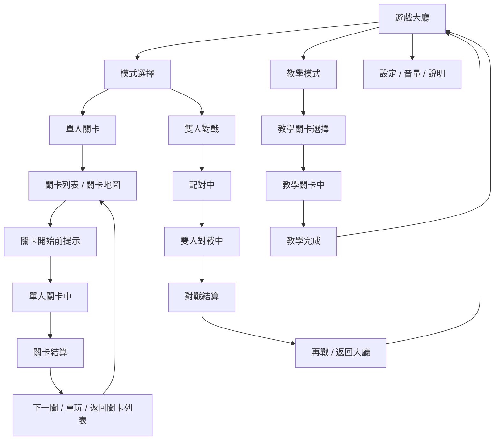

# 🎮 《泡泡龍》遊戲設計規格書

**文件版本**：1.0  
**更新日期**：2026-06-18  
**文件主旨**：定義《泡泡龍》手機直版版本之完整遊戲規格，內容包含核心玩法、單人關卡、關卡生成、雙人對戰、UI 流程、參數表、美術需求、音效需求與驗收規則，作為開發團隊實作成品的唯一依據。

---

## 0. 系統與版本變更紀錄

<details open>
<summary><b>v1.0 (2026-06-18) - 正式 GDD 初版</b></summary>

* **專案設定**：
  * 遊戲名稱為《泡泡龍》。
  * 平台為手機，畫面為直版。
  * 模式包含單人關卡、雙人對戰與教學模式。
* **對戰規則**：
  * 雙人對戰中，玩家成功消除的珠珠會轉換為壓力值，送往對手盤面上方，形成額外壓力。
  * 對戰主軸為清除效率、連鎖能力、送珠壓制與結算勝負。
* **關卡生成**：
  * 單人關卡採關卡模板 + 參數 + 可解性驗證方式生成與管理。
* **UI 與素材**：
  * 直版手機 UI 為主。
  * 各 UI 需配合基礎字串、圖示、結算視窗與對戰壓力提示設計。

</details>

---

# 1. 遊戲核心玩法與簡介

## 1.1 遊戲名稱

《泡泡龍》

## 1.2 一句話介紹

一款手機直版泡泡消除遊戲，玩家透過發射泡泡清理盤面、完成單人關卡目標，或在雙人對戰中將消除轉為壓力送給對手，迫使對手盤面持續上升並爭取勝利。

## 1.3 遊戲在玩什麼

* 玩家從畫面底部發射泡泡。
* 泡泡撞上盤面後吸附到六角格點。
* 3 顆同色即消除。
* 消除後可能造成連鎖掉落。
* 雙人對戰時，成功消除會累積送珠值，達到門檻後轉為對手盤面上方新增泡泡。

## 1.4 玩家在比什麼

| 模式 | 比賽重點 |
| :-- | :-- |
| 單人關卡 | 通關速度、步數效率、時間效率、星級表現、特殊條件完成度 |
| 雙人對戰 | 清除效率、連鎖能力、送珠壓制、盤面壓力控制、結算分數 |

## 1.5 核心循環

1. 進入大廳
2. 選擇單人關卡或雙人對戰
3. 進入關卡或配對
4. 瞄準並發射泡泡
5. 吸附、消除、掉落、送珠
6. 達成通關或勝負條件
7. 進入結算
8. 返回大廳或繼續下一局

## 1.6 核心體驗目標

* 操作直覺
* 消除爽快
* 盤面變化明確
* 對戰壓力感清楚
* 關卡可持續擴充

---

## 2. 介面設計 (UI Flow & Layout)

### 2.1 介面流程圖 (UI Flow)



### 2.2 基礎 UI 字元圖

#### 大廳

```text
┌──────────────────────────┐
│            泡泡龍         │
│    金幣 / 體力 / 設定      │
├──────────────────────────┤
│                          │
│       [ 單人關卡 ]       │
│       [ 雙人對戰 ]       │
│       [ 教學模式 ]       │
│                          │
├──────────────────────────┤
│  活動 / 排行 / 商店 / 其他 │
└──────────────────────────┘
```

#### 單人關卡

```text
┌──────────────────────────┐
│  關卡名稱   目標   星級   │
├──────────────────────────┤
│                          │
│        關卡盤面區         │
│                          │
├──────────────────────────┤
│ [返回]   [道具]   [開始]  │
└──────────────────────────┘
```

#### 局中

```text
┌──────────────────────────┐
│ 時間/步數   目標進度   分數 │
├──────────────────────────┤
│                          │
│        泡泡盤面區         │
│                          │
├──────────────────────────┤
│ 下一顆  |  目前泡泡  | 切換 │
│        發射器 / 瞄準線     │
└──────────────────────────┘
```

#### 雙人對戰

```text
┌──────────────────────────┐
│ 玩家A 分數/壓力  玩家B 分數/壓力 │
├──────────────────────────┤
│                          │
│        對戰盤面區         │
│                          │
├──────────────────────────┤
│ 下一顆  |  目前泡泡  | 切換 │
│        發射器 / 瞄準線     │
└──────────────────────────┘
```

### 2.3 UI 狀態定義

| 類型 | 狀態 |
| :-- | :-- |
| 按鈕 | 預設、滑入、按下、不可用 |
| 關卡 | 未解鎖、已解鎖、已通關、三星完成 |
| 對戰 | 等待中、配對中、準備中、對戰中、已結算 |
| 提示窗 | 開啟、確認、取消、關閉 |

### 2.4 UI 版面原則

* 上方顯示資訊。
* 中間顯示盤面。
* 下方顯示操作。
* 直版布局必須保留最大的盤面視野。
* 所有按鈕要在單手可操作範圍內。

---

## 3. 遊戲模式、排行與結算

### 3.1 遊戲模式與對局設定

| 模式名稱 | 入場方式 | 對局配置 | 勝負規則與時限 |
| :-- | :-- | :-- | :-- |
| **新手教學** | 0 成本 | 單人引導 | 完成教學步驟即過關 |
| **單人關卡** | 關卡解鎖 / 體力 / 門票 | 單人 | 依關卡目標與星級條件判定 |
| **雙人對戰** | 配對進入 | 2 人 | 以壓制效率與結算條件判定勝負 |

### 3.2 單人關卡結算

* 單人關卡的通關條件由關卡資料指定，常見類型包括：
  * 清除指定顏色泡泡
  * 清除指定區域
  * 在指定步數內達成條件
  * 在指定時間內達成條件
  * 保護目標不被擊中
* 評價採三星制：
  * 3 星：高效率完成
  * 2 星：正常完成
  * 1 星：臨界通關
* 若失敗，需依關卡規則顯示：
  * 步數不足
  * 時間耗盡
  * 保護目標失敗
* 星級與獎勵可連動：
  * 通關獎勵
  * 三星獎勵
  * 首通獎勵

### 3.3 雙人對戰結算

* 雙人對戰可採下列其中一種主結算方式：
  * 限時結束比分高者勝
  * 先達成指定清台條件者勝
  * 先達成壓制條件者勝
* 本專案建議初版採：
  * 限時制
  * 分數高者勝
* 若同分，依以下順序判定：
  1. 送珠量高者勝
  2. 連鎖數高者勝
  3. 剩餘盤面較低者勝
* 結算畫面至少顯示：
  * 勝負
  * 雙方分數
  * 送珠量
  * 連鎖數
  * 再戰 / 返回按鈕

---

## 4. 核心玩法與規則

### 4.1 發射與操作

* 玩家以拖曳或點按方式決定發射方向。
* 發射器固定在畫面底部中央。
* 當前泡泡與下一顆泡泡需清楚可辨識。
* 預瞄線需顯示直線路徑與一次牆面反彈結果。
* 每次發射只產生 1 顆泡泡。
* 發射中途不可取消。
* 泡泡一旦吸附即進入下一顆泡泡準備狀態。

### 4.2 泡泡盤面與吸附規則

* 盤面採六角鄰接格點。
* 泡泡碰撞後吸附到與碰撞點最近的合法格位。
* 若鄰近格位被占滿，則尋找最近可放置的相鄰格。
* 若多個格位距離相同，優先選擇較上方的位置，再選接近發射方向者。

### 4.3 消除規則

* 3 顆同色連結即消除。
* 消除判定在吸附完成後立即進行。
* 若消除後造成新的同色連結，立即遞迴檢查連鎖。
* 特殊泡泡可由關卡指定視為任意色或特殊效果來源。

### 4.4 掉落規則

* 消除後若下方失去支撐，整群泡泡需掉落。
* 掉落泡泡可轉為分數、碎片特效或對戰壓力值。
* 掉落演出與掉落結果需分開定義：
  * 演出：泡泡碎裂、落下、閃光
  * 結果：分數、送珠值、關卡進度

### 4.5 連鎖規則

* 單次消除可引發連鎖掉落。
* 連鎖需提供額外分數與視覺回饋。
* 連鎖回饋至少包含：
  * 分數加成
  * 飛字提示
  * 連鎖特效

### 4.6 基礎泡泡池

* 初版泡泡顏色池固定為 5 色：
  * 紅
  * 黃
  * 綠
  * 藍
  * 粉
* 顏色池可在關卡參數中調整為 3 色、4 色或 5 色難度。
* 單一關卡內的顏色池必須在關卡資料中明確指定。

### 4.7 特殊泡泡

| 類型 | 效果 |
| :-- | :-- |
| 爆炸泡泡 | 命中後清除附近範圍 |
| 彩虹泡泡 | 可視為任意顏色 |
| 穿透泡泡 | 可穿過第一個阻擋物 |

* 初版建議先只做 2 到 3 種特殊泡泡。
* 關卡資料可指定特殊泡泡的出現頻率。

### 4.8 發射上限與時間

| 模式 | 時間 / 步數 |
| :-- | :-- |
| 單人標準關卡 | 90 秒，或改用步數制 |
| 雙人對戰 | 120 秒 |

* 若關卡採步數制，關卡資料需明確記錄：
  * 起始步數
  * 每次發射是否消耗步數
  * 特殊效果是否額外扣步

---

## 5. 單人關卡與 AI 生成規格

### 5.1 關卡生成原則

* 單人關卡必須支援 AI 生成。
* 所有生成關卡需先通過可解性驗證。
* 生成結果需包含：
  * 盤面配置
  * 顏色分布
  * 障礙配置
  * 關卡目標
  * 難度標記
* AI 生成原則：
  * 不生成死局
  * 不生成一眼過簡或一眼必死的盤面
  * 盤面需具備至少一條可推進路徑
  * 盤面需能在目標步數內理論通關

### 5.2 關卡模板

| 模板 | 說明 |
| :-- | :-- |
| 基礎清除型 | 清除特定數量或特定顏色泡泡 |
| 指定目標型 | 清除特殊目標或指定區域 |
| 障礙突破型 | 打開被障礙阻擋的盤面 |
| 限步挑戰型 | 以步數為主要限制 |
| 限時挑戰型 | 以時間為主要限制 |
| 分段目標型 | 分多階段達成條件 |
| Boss 關卡型 | 以大型目標或多階段結構呈現 |
| 教學引導型 | 針對新手操作設計 |

### 5.3 關卡資料欄位

| 欄位 | 說明 |
| :-- | :-- |
| `level_id` | 關卡編號 |
| `name` | 關卡名稱 |
| `mode_type` | 關卡類型 |
| `time_limit` | 時間限制 |
| `move_limit` | 步數限制 |
| `target_type` | 目標類型 |
| `target_value` | 目標數值 |
| `color_pool` | 顏色池設定 |
| `special_pool` | 特殊泡泡設定 |
| `obstacle_layout` | 障礙配置 |
| `drop_rule` | 掉落規則 |
| `star_rule` | 星級條件 |
| `reward_rule` | 獎勵規則 |

### 5.4 難度參數

* 關卡難度由以下參數控制：
  * 泡泡顏色種類數
  * 相鄰同色密度
  * 障礙物比例
  * 盤面高度
  * 可使用步數
  * 特殊泡泡出現率
  * 盤面初始空隙率
  * 關卡目標複合度

### 5.5 可解性驗證

* AI 關卡必須可解。
* 若驗證失敗，需重新生成或降級安全模板。
* 驗證至少要檢查：
  * 是否存在可達消除路徑
  * 是否有必要泡泡被完全封死
  * 步數是否足夠完成目標
  * 盤面是否過度偏色導致不可玩

### 5.6 AI 生成流程

1. 選擇關卡模板
2. 指定主題與難度
3. 生成盤面骨架
4. 套入顏色與障礙分布
5. 驗證可解性
6. 不通過則重生或降階
7. 通過後輸出正式關卡資料
8. 寫入關卡資料表供遊戲讀取

---

## 6. 雙人對戰規格

### 6.1 對戰模式目的

* 以即時對戰為主。
* 重點是節奏、壓制與技巧。
* 對戰必須讓玩家明確感受到：
  * 我方消除會造成對手壓力
  * 我方連鎖會快速加壓
  * 對手的盤面會逐步被推高

### 6.2 對戰盤面模式

* 初版採各自獨立盤面。
* 原因：
  * 較容易做平衡
  * 較容易驗證勝負
  * 較容易做送珠與壓力值系統
* 兩邊盤面需共用同一組局內時間與對戰規則。

### 6.3 對戰勝負規則

* 本專案建議初版採：
  * 限時制
  * 分數高者勝
* 若同分，依以下順序判定：
  1. 送珠量高者勝
  2. 連鎖數高者勝
  3. 剩餘盤面較低者勝

### 6.4 送珠與干擾規則

* 對戰中每次成功消除都會累積送珠值。
* 送珠值達門檻後，會生成一批干擾珠送給對手。
* 送珠值來源：
  * 基礎消除：+1
  * 連鎖消除：每層 +1
  * 一次消除顆數超過 3 顆時，額外加成
* 送珠觸發時機：
  * 達到門檻就立即送珠
  * 送珠後扣回門檻值或歸零，依模式設定

### 6.4.1 干擾珠產出方式

* 干擾珠從對手盤面上方生成。
* 初版採固定列產出：
  * 盤面頂部固定生成一列干擾珠
  * 顏色由系統依對戰配置產生
* 若頂部空間不足：
  * 優先填入最上層合法空位
  * 若無合法空位，則轉為壓力值累積

### 6.4.2 干擾珠規則

* 干擾珠初版可視為一般泡泡色，但由系統批次塞入。
* 若要更強壓制感，可在後續版本讓干擾珠成為特殊阻擋珠。

### 6.4.3 壓力值與塞珠公式

* 每位玩家有獨立送珠值。
* 送珠值計算完成後，換算為對手盤面新增泡泡數。
* 建議基礎公式：

```text
新增珠數 = floor(送珠值 / 送珠門檻)
剩餘送珠值 = 送珠值 % 送珠門檻
```

* 送珠門檻建議初版使用 `8`。

### 6.5 對戰回合流程

1. 配對成功
2. 進入開局倒數
3. 雙方同步開局
4. 進行盤面消除與壓制
5. 送珠值累積並轉為干擾珠
6. 時間到或條件達成
7. 顯示勝負與獎勵
8. 提供再戰或返回選項

### 6.6 離線與中斷

* 若先做線上對戰，需定義：
  * 中斷是否直接判負
  * 是否有重連機制
  * 是否會由 AI 接手
* 初版若要簡化，建議先定義為：
  * 中斷即結束對戰
  * 由系統直接判定結果

---

## 7. 系統規格

### 7.1 單人進度與章節

* 單人關卡可採章節式解鎖。
* 每章節可包含不同主題與難度曲線。
* 關卡清單需支援：
  * 解鎖狀態
  * 通關狀態
  * 星級狀態

### 7.2 對戰匹配

* 雙人對戰需支援快速配對。
* 若等待超時，需有明確 fallback：
  * 等待延長
  * AI 補位
  * 返回大廳

### 7.3 道具與輔助系統

* 若雙人對戰使用道具，需避免破壞公平性。
* 商店可有，但商店內的能力不應直接破壞對戰平衡。

### 7.4 數值框架

* 單人關卡需定義：
  * 通關獎勵
  * 星級獎勵
  * 重玩獎勵
* 對戰模式需定義：
  * 勝利獎勵
  * 失敗補償
  * 連勝加成

### 7.5 最小資料表

* 關卡資料表
* 模式資料表
* 泡泡類型表
* 特殊泡泡表
* UI 字串表
* 對戰送珠規則表

---

## 8. 美術與音效需求

### 8.1 美術需求

* 採直版手機 UI。
* 盤面泡泡需高辨識度，避免同色過近造成混淆。
* 特殊泡泡需有明顯視覺標記。
* 單人關卡與雙人對戰可用不同色系或 HUD 風格區分。

### 8.2 最低素材需求

* 5 種基礎泡泡色
* 3 種特殊泡泡 icon
* 1 套發射器
* 1 套大廳 UI
* 1 套局中 HUD
* 1 套結算 UI
* 1 套對戰送珠 / 壓力提示特效

### 8.3 音效需求

* 發射音
* 命中音
* 消除音
* 連鎖音
* 送珠音
* 通關音
* 失敗音
* 對戰勝負音

### 8.4 特效需求

* 射擊尾跡
* 消除爆裂
* 連鎖閃光
* 送珠提示
* 特殊泡泡觸發特效
* 結算飄字與星級演出

---

## 9. 版本與驗收

### 9.1 版本規劃

* v1.0：正式 GDD 初版
* v1.1：補齊關卡模板與數值表
* v1.2：補齊美術與音效資源表
* v1.3：補齊對戰平衡與送珠數值

### 9.2 驗收標準

* 單人關卡可由 AI 自動產生且可通關。
* 雙人對戰可完整完成配對、對局、送珠與結算。
* 直版 UI 在主要手機解析度下可正常顯示。
* 核心流程與規則文案須與最終實作一致。
* 開發團隊可直接依本文件拆出任務、規格與驗收清單。

---

## 10. 備註

* 本文件為正式 GDD 初版，內容以開發實作為優先，而非概念簡報。
* 若要進一步進入外包或實作階段，下一步可補：
  * 更完整的關卡資料表
  * 對戰送珠公式表
  * 關卡模板表
  * UI 字串表
  * 美術與音效資產清單

