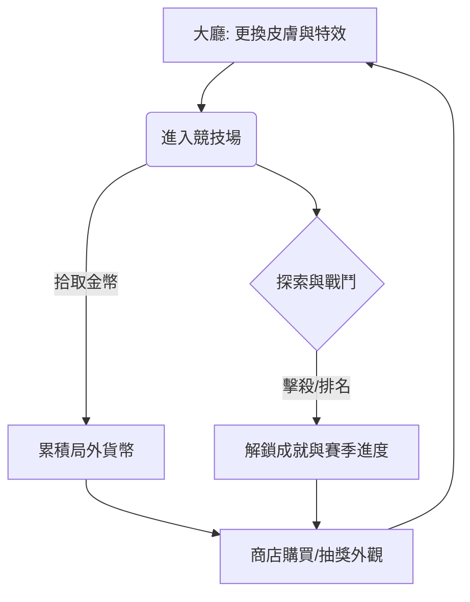

# Snake.io 遊戲設計文件 (GDD) - 核心玩法版

## 1. 系統目標與定位
本專案專注於 **公平競技 (Fair Play)** 與 **個性化展現 (Self-Expression)**。
- **核心定位**：極低進入門檻的 io 大混戰，強調技術與策略。
- **商業化目標**：透過豐富的「外觀、特效、表情」建立深度的付費點，**嚴禁販售任何影響戰鬥數值的道具**，確保競技公平性。

---

## 2. 核心遊戲循環 (Core Loop)

---

## 3. 核心玩法規則 (Core Mechanics)
(此處保留原本的移動、加速、戰鬥與技能規則，詳見下方...)

### 3.1 遊戲技能 (Skills)
- **磁鐵 (Magnet)** / **望遠鏡 (Telescope)**：所有玩家起始條件相同，無須透過等級解鎖數值。

---

## 4. 局外獎勵與商業化 (Meta-Progression & Monetization)

為了增加付費深度且不破壞平衡，本系統分為以下三大維度：

### 4.1 個性化外觀 (Skins & Cosmetics)
- **蛇身皮膚**：多樣化紋理（金屬感、霓虹、生物鱗片）。
- **頭部裝飾**：帽子、眼鏡、冠冕。
- **拖尾特效 (Trails)**：蛇移動時留下的粒子特效（如：火焰、星光、像素流）。

### 4.2 局內互動與表現 (Interaction & VFX)
- **表情符號 (Emotes)**：玩家可即時在蛇頭彈出氣泡表情，用於示好或嘲諷。
- **擊殺特效 (Kill Effects)**：擊敗對手時，對方的能量散落伴隨特殊動畫（如：爆散花瓣、金幣噴泉）。
- **死亡墳碑 (Death Markers)**：玩家死亡處留下的遺物外觀。

### 4.3 商業化模組 (Monetization Models)
- **戰令系統 (Battle Pass)**：完成每日任務提升等級，獲取賽季限定表情與皮膚。
- **限時商店 (Daily Shop)**：隨機輪替珍稀外觀，驅動每日登入。
- **盲盒系統 (Crates)**：隨機獲取不同稀有度的特效，滿足收集慾。
- **尊爵訂閱 (VIP)**：獲取專屬聊天氣泡框與特殊名牌顏色，純視覺榮耀。

---

## 5. 設計方向：付費深度與平衡 (Design Philosophy)

| 類別 | 付費內容 | 對數值的影響 | 目的 |
| :--- | :--- | :--- | :--- |
| **視覺** | 皮膚、拖尾、擊殺動畫 | **無 (0)** | 滿足虛榮心與收集感。 |
| **互動** | 表情包、快捷語音 | **無 (0)** | 增加社交樂趣與心理博弈。 |
| **便利性** | 局後積分加倍、任務刷新 | **無 (0)** | 縮短外觀解鎖週期，不影響單局勝負。 |

> [!IMPORTANT]
> **核心原則**：課金玩家與免費玩家在進入戰局時，初始長度、速度、碰撞判定、技能冷卻時間必須完全一致。

---

## 4. 遊戲模式規則 (Game Modes)

| 模式名稱 | 勝負判定規則 | 核心特色 |
| :--- | :--- | :--- |
| **INFINITY** | 直到死亡為止。根據「單局最高積分」進行排名。 | 無壓力長線經營。 |
| **TIME** | 倒數 180s 結束時，積分最高者勝。 | 死亡後 3s 復活，保留 50% 積分。 |
| **TEAM** | 團隊總分達到門檻或限時結束總分高者勝。 | 隊友間穿透，共享團隊 BUFF。 |
| **SURVIVAL** | 場上存活到最後一刻者獲勝。 | **毒圈機制**：地圖隨時間縮小。 |
| **SPEED** | 首位長度達到 2,000 的玩家勝。 | 全局速度 +50%，能量積分加倍。 |

---

## 5. 勝負判定 (Win/Loss Rules)
- **獲勝條件**：依模式規定（如最後存活、最高積分、首位達標）。
- **失敗判定**：一旦觸發死亡碰撞且無法/不選擇復活，則立即結算。

---

## 5. 設計方向比較 (Design Directions)

### 方向 A：RPG 進階型 (推薦)
- **特點**：合成等級不僅改變外觀，還提供「特殊技能」（如：強力磁鐵、短暫隱身）。
- **優點**：數值成長感強，長留存表現佳。
- **缺點**：PVP 平衡較難調教，高等級蛇對新手的壓制力大。

### 方向 B：純粹技術型
- **特點**：合成僅提供外觀解鎖與初始長度微加成，所有蛇的戰鬥性能一致。
- **優點**：公平競技感強，適合電子競技化。
- **缺點**：合成系統的長線驅動力較弱。

---

## 6. 異常處理與邊界條件
- **斷線處理**：玩家斷線後，蛇進入 AI 託管狀態 10s，若未重連則化為能量。
- **碰撞補償**：由於網路延遲，後端判定以「伺服器端座標」為準，前端進行平滑差值預測。
