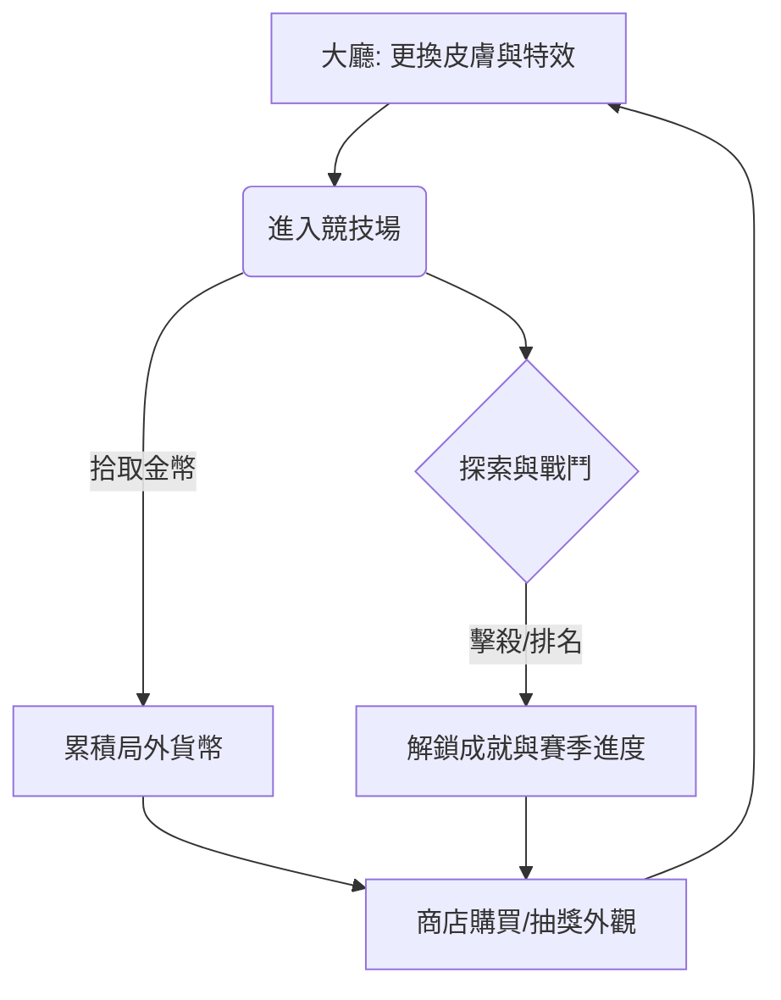

# Snake.io 遊戲設計文件 (GDD) v1.0.0

## 1. 系統目標與定位
本專案專注於 **公平競技 (Fair Play)** 與 **個性化展現 (Self-Expression)**。
- **核心定位**：極低進入門檻的 io 大混戰，強調技術與策略。
- **商業化目標**：透過豐富的「外觀、特效、表情」建立深度的付費點，**嚴禁販售任何影響戰鬥數值的道具**。

---

## 2. 核心遊戲循環 (Core Loop)

---

## 3. 核心玩法規則 (Core Mechanics)

### 3.1 移動與控制 (Movement)
- **蛇頭定向**：蛇頭始終朝向虛擬搖桿或滑鼠指向的方向，並以「基礎初速」移動。
- **加速 (Dash)**：
    - **觸發**：按住加速鍵。
    - **效果**：移動速度提升 50%。
    - **代價**：每秒消耗 1% 的當前長度，並轉化為微小的能量顆粒散落在蛇尾路徑上。

### 3.2 戰鬥與碰撞規則 (Combat)
- **碰撞判定**：
    1. **撞擊敵身**：當己方蛇頭觸碰到任何敵對蛇的身體（Body）時，己方判定死亡。
    2. **邊界撞擊**：蛇頭觸碰地圖邊緣牆壁判定死亡。
    3. **頭對頭**：兩蛇蛇頭正面撞擊時，長度較長者存活，較短者死亡；若長度相同則雙亡。
- **擊殺回饋 (Energy Drop)**：
    - 蛇死亡後，其當前總體積的 **60%** 會轉化為大型能量球散落在死亡位置。
    - 吞食大型能量球可獲得比普通食物更高的長度成長。

### 3.4 遊戲技能 (Skills)
所有玩家進入戰局時均擁有以下相同規格的技能：

- **磁鐵 (Magnet)**
    - **規則**：開啟後，以蛇頭為中心 300 像素半徑內的食物、能量球與金幣將被強制吸引至蛇頭。
    - **持續時間**：8 秒。
    - **冷卻時間 (CD)**：20 秒。
- **望遠鏡 (Telescope)**
    - **規則**：開啟後，相機鏡頭高度提升 50%，提供更廣闊的視野偵查敵情。
    - **持續時間**：10 秒。
    - **冷卻時間 (CD)**：15 秒。

---

## 4. 場地道具 (Field Items)

道具在地圖隨機位置生成，玩家觸碰即可獲得暫時性增益。

| 道具名稱 | 效果說明 | 持續時間 | 產出頻率 |
| :--- | :--- | :--- | :--- |
| **金幣 (Gold)** | 獲取局外商店貨幣，不增加體積。 | 立即 | **高** (全地圖散落) |
| **加速 (Speed)** | 無消耗提升 100% 速度，不損失長度。 | 5 秒 | **中** |
| **5 倍 (5x)** | 期間內吞食所有能量點獲得的積分與長度翻 5 倍。 | 8 秒 | **低** |
| **磁鐵 (Magnet)** | 獲得與「磁鐵技能」相同的吸取效果，不消耗技能 CD。 | 10 秒 | **中** |

### 4.1 道具產出邏輯
- **定時補足**：伺服器每 30 秒檢索全地圖道具數量，若低於設定上限則隨機在地圖空白處生成。
- **事件補償**：當有巨型蛇死亡時，其遺產中心點有 15% 機率額外生成一個高級道具（5 倍或加速）。

---

## 5. 遊戲模式規則 (Game Modes)

| 模式名稱 | 勝負判定規則 | 核心特色 |
| :--- | :--- | :--- |
| **INFINITY (無盡)** | 持續到死亡。以「單局最高積分」進行全球實時排名。 | 適合長時間休閒與破紀錄。 |
| **TIME (限時)** | 180 秒結束後，積分排名前三者獲勝。 | 死亡後 3s 復活，保留 50% 積分。 |
| **TEAM (團隊)** | 團隊總分領先或先達標（如 5 萬分）獲勝。 | 同隊互不碰撞，共享全隊 BUFF 道具。 |
| **SURVIVAL (生存)** | 場上僅剩最後一條蛇存活時獲勝（吃雞）。 | **毒圈機制**：地圖隨時間向中心縮小。 |
| **SPEED (競速)** | 首位長度達到 2,000 的玩家勝。 | 全局加速，成長速度提升 200%。 |

---

## 6. 局外獎勵與商業化 (Meta-Progression)

### 6.1 個性化收藏 (Cosmetics)
- **蛇皮外觀**：包括普通色、彩虹色、金屬質感與特殊動態紋理。
- **配件系統**：蛇頭裝飾（帽子、皇冠）、拖尾特效（火花、雪花）。
- **表現特效**：專屬擊殺動畫、死亡後的特殊遺物模型。

### 6.2 社交與互動
- **表情符號 (Emotes)**：局內快捷彈出氣泡（如：大笑、生氣、求救）。
- **榮譽頭銜**：達成特定成就（如：單局擊殺 100 人）獲得特殊名牌顏色。

### 6.3 商業化模組 (Monetization)
- **賽季戰令 (Battle Pass)**：分免費與付費兩檔，解鎖限定皮膚與表情。
- **盲盒商店 (Mystery Boxes)**：隨機抽取稀有配件。
- **廣告激勵**：觀看廣告可免費復活一次或領取每日金幣。

---

## 7. 設計方向：付費深度與平衡 (Design Philosophy)

- **絕對平衡**：付費內容嚴禁包含「初始長度增加」、「速度提升」或「碰撞豁免」等影響勝負的數值。
- **深度外觀**：透過細緻的特效與社交互動（表情、頭銜）建立付費動力。
- **競技導向**：所有玩家具備相同的戰略工具（技能與地圖道具）。
