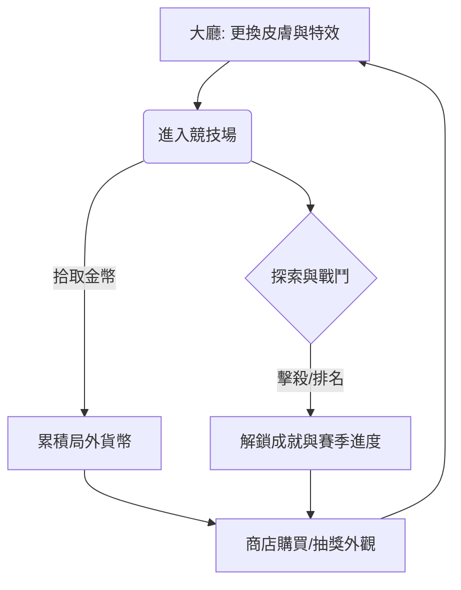

# Snake.io 遊戲設計文件 (GDD) v1.4.0

## 1. 系統目標與定位
本專案專注於 **公平競技 (Fair Play)** 與 **個性化展現 (Self-Expression)**。
- **核心定位**：直屏 (Portrait) 手機遊戲，極低門檻的 io 大混戰。
- **商業化目標**：深度的「外觀、特效、表情」付費點，**嚴禁販售影響平衡的數值**。

---

## 2. 遊戲介面與體驗 (UI/UX) - 直屏手機版

### 2.1 畫面佈局
- **頂部 HUD**：顯示當前積分、排名（Top 10）、剩餘時間（若有）。
- **中心視野**：相機以蛇頭為中心平滑跟隨。
- **底部控制區**：
    - **左側**：虛擬搖桿（控制方向）。
    - **右側**：加速按鈕 (Dash)、技能按鈕 (Magnet, Telescope)。
- **交互回饋**：
    - **右上角**：擊殺通知滾動（Kill Feed）。
    - **事件表情**：發生擊殺、死亡或連殺時，蛇頭上方**自動觸發**配置好的表情氣泡，不需手動操作。

---

## 3. 核心遊戲循環 (Core Loop)

---

## 4. 核心玩法規則 (Core Mechanics)

### 4.1 移動與控制 (Movement)
- **蛇頭定向**：蛇頭朝向虛擬搖桿指向的方向，並以「基礎初速」移動。
- **加速 (Dash)**：
    - **觸發**：點擊或長按右側加速鍵。
    - **代價**：每秒消耗 1% 的當前長度，轉化為微小能量散落在蛇尾。

### 4.2 戰鬥與碰撞規則 (Combat)
- **碰撞判定**：
    1. **撞擊敵身**：己方蛇頭觸碰到敵蛇身體判定死亡。
    2. **邊界撞擊**：蛇頭觸碰地圖邊緣判定死亡。
    3. **頭對頭**：正面撞擊時，長度較長者存活，短者死亡；若長度相同則雙亡。

### 4.3 能量轉換與成長 (Growth)
- **自然能量**：地圖散落的小顆粒，吞食增加微量長度。
- **死亡遺產**：蛇死亡後，其體積的 **60%** 化為大型能量球散佈在死亡路徑上。
- **動態視野 (Zooming)**：
    - **規則**：長度每增加 500，相機視野高度提升 2.5%。
    - **上限**：相機高度最高可提升至初始狀態的 200%。

### 4.4 遊戲技能 (Skills)
- **磁鐵 (Magnet)**：吸引 300 像素半徑內的物資，持續 8s，冷卻 20s。
- **望遠鏡 (Telescope)**：相機高度提升 50%，持續 10s，冷卻 15s。

---

## 5. 場地道具 (Field Items)

| 道具名稱 | 效果說明 | 持續時間 | 產出頻率與邏輯 |
| :--- | :--- | :--- | :--- |
| **金幣 (Gold)** | 獲取局外貨幣。 | 立即 | **高**。隨機散落在全地圖，每 500x500 區域保證存在 1-2 枚。 |
| **加速 (Speed)** | 100% 速度提升，無消耗。 | 5 秒 | **中**。出現在地圖較空曠處，作為移動補償。 |
| **5 倍 (5x)** | 能量收益翻 5 倍。 | 8 秒 | **低**。多生成於地圖邊緣或強者聚集區中心。 |
| **磁鐵 (Magnet)** | 吸取物資。 | 10 秒 | **中**。與「加速」道具互補生成。 |
| **望遠鏡 (Telescope)**| 視野擴大 50%。 | 10 秒 | **中**。隨機分佈，用於偵查環境。 |

### 5.1 產出補充邏輯
- **定時生成**：伺服器每 30 秒檢查，若道具總數低於上限則在「無人區域」隨機補足。
- **事件補償**：當有巨型蛇死亡（長度 > 5000）時，其遺產區域有 20% 機率額外觸發一個「5 倍」或「磁鐵」道具。

---

## 6. 遊戲模式規則與勝負判定 (Game Modes & Win/Loss)

| 模式名稱 | 獲勝條件 | 失敗與死亡規則 | 核心特色 |
| :--- | :--- | :--- | :--- |
| **INFINITY (無盡)** | 無絕對獲勝。根據「單局最高積分」進行全球實時排名。 | 蛇頭發生任何碰撞即判定死亡，進入結算。 | 適合長時間休閒與破紀錄。 |
| **TIME (限時)** | 180 秒倒數結束後，積分排名前三者獲勝。 | 死亡後 3s 可復活。復活時保留 50% 積分。 | 死亡代價低，節奏極快。 |
| **TEAM (團隊)** | 團隊總分領先或先達到 50,000 分者獲勝。 | 同隊互不碰撞。死亡可立即復活，積分不衰減。 | 團隊圍堵，共享 BUFF。 |
| **SURVIVAL (生存)** | 場上僅剩最後一條蛇存活時判定獲勝。 | 單命制。發生碰撞或進入縮圈外即判定死亡淘汰。 | **毒圈機制**：地圖隨時間縮小。 |
| **SPEED (競速)** | 首位長度達到 2,000 的玩家立即結束並獲勝。 | 碰撞即死亡，需從初始長度重新開始。 | 全局加速，成長速度提升 200%。 |

---

## 7. 局外獎勵與商業化 (Meta-Progression)
- **收藏品**：皮膚、頭飾、拖尾特效、專屬擊殺/死亡動畫。
- **自動表情**：配置好的表情包將在特定事件自動觸發。
- **商業模組**：賽季戰令 (Battle Pass)、限時商店、激勵廣告（免費復活/獎勵加倍）。

---

## 8. 設計方向：付費深度與平衡
- **課金不影響強弱**：所有初始數值（速度、長度、判定）全玩家統一。
- **深耕視覺體驗**：以「帥氣、搞怪、尊榮」作為付費核心驅動力。
