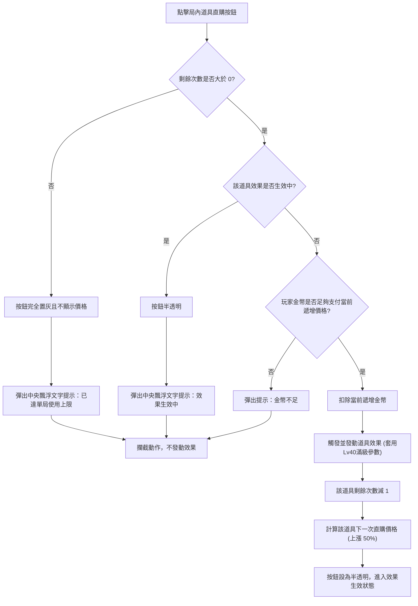
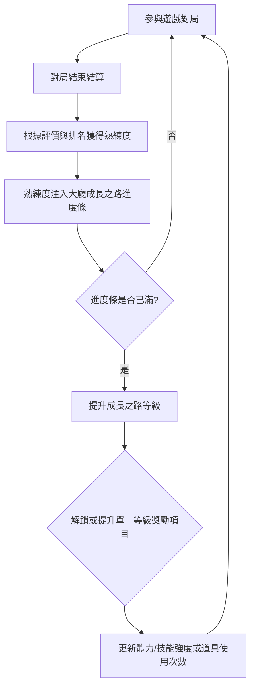
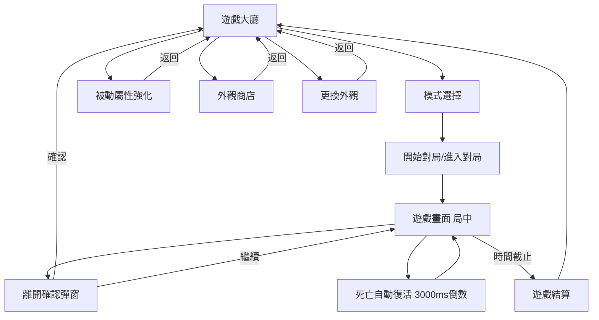

# 🎮 《貪食蛇》遊戲設計規格書

**文件版本**：11.0
**更新日期**：2026-05-29
**文件主旨**：定義《貪食蛇》玩法操作、局內規則、勝負判定、美術 UI 需求與 AI 機制，作為外包開發與程式實作之最高依據。

---

## 0. 系統與版本變更紀錄

### 0.1 系統刪減與保留清單

* **🛑 移除**：移除 3D 美術（改為 2D 扁平卡通風）；不接入廣告；移除死亡時手動付費/看廣告買活；移除戰前攜帶道具與裝備欄位解鎖機制。
* **✅ 保留**：Solo 練習、多人大亂鬥與多人組隊賽；局內金幣直購高級道具；局外被動養成與成長之路；自訂蛇頭頭像；表情貼圖局內自動觸發。

### 0.2 版本變更與增減紀錄

<b>v11.0 (2026-05-29) - 局內金幣直購道具與體驗簡化版</b>

* **局內金幣直購道具與體驗簡化版**：
  * 廢除原「戰前攜帶」與「裝備欄位解鎖」機制。所有高級技能道具改為局內常駐快捷欄直購（鷹眼 2000G、磁鐵 4000G、巨大蘑菇 6000G、幸運糖 8000G）。
  * 道具使用無 CD 限制，單局售價每購買一次遞增 50% (1.5 倍)，單局使用上限初始 2 次，最大 5 次（視成長之路解鎖）。
  * 道具生效期間阻擋重複點擊，道具按鈕透明度增加，且點擊時在螢幕中央彈出漂浮文字 (floating tip) 提示「效果生效中」。金幣不足與次數耗盡則攔截。
* **成長之路與主動技能養成調整**：
  * 成長之路等級上限由 40 級提升至 60 級，且 1-60 級關鍵解鎖表採「一級僅解鎖單一效果」規則。
  * 主動技能養成範圍定為 **Lv 0 ~ Lv 4**。
  * 衝刺（無須解鎖）：滿級 (Lv 4) 體力上限為 1500 點（可持續衝刺 4.50 秒），回復速度提升至 200/s（回滿時間 7.50 秒，相比初始 12.50 秒縮短 40%）。
  * 磁力漩渦：滿級 (Lv 4) 吸附半徑為 400px，冷卻 CD 時間縮短至 25 秒（等級對應 CD 為 30/29/28/27/25 秒）。
* **流程與參數修改**：
  * 修改 Ch 7 Mermaid 流程圖為局內直購、次數與遞增判定。
  * 升級全文版號標記為 `📝[v11.0]`。

<b>v10.0 (2026-05-29) - 戰前攜帶、重疊與主動技機制升級版</b>

* **生死與碰撞規則修正**：
  * 修正 Ch 4.1 碰撞判定中「雙方皆衝刺頭對頭碰撞」，由原本的「扣除長度 50%」改為 **「反彈但不扣除長度」**。
* **安全生成重疊規則優化**：
  * 修正 Ch 6.1 食物與隨機道具安全生成間距，由 `15px` 縮減為 `2px`。食物與食物、食物與道具、道具與道具可以重疊，但不能完全重疊。
* **戰前攜帶道具規則與流程圖**：
  * 於 Ch 7.1 明確列出可攜帶的四種道具，並限制初始最大攜帶上限為 1。
  * 攜帶數量上限隨成長之路等級提升而解鎖成長（Lv 10 解鎖第 2 欄位，Lv 20 解鎖第 3 欄位）。
  * 補充戰前道具攜帶與直購補充的簡易 Mermaid 流程圖，定義「有庫存也能點選直購，但點擊超過攜帶上限時不置灰，直接以 Toast 提示阻擋」的互動邏輯。
* **主動技限制放寬**：
  * 取消主動技能磁力漩渦（Vortex）單局 9 次的次數限制，僅受 CD 限制。
* **被動養成與成長之路重構**：
  * 刪除 Ch 10.1 原有的成長之路系統說明。
  * 新增 Ch 10.3 成長之路與主動技能升級系統，詳細說明玩遊戲累積熟練度提升成長之路等級，進而解鎖與升級主動技能的機制，並以 Mermaid 流程圖表現。
* **外觀商店拆分與更換外觀規格**：
  * 將外觀商店獨立拆出為全新大章節 `## 12. 外觀商店與皮膚定價規則`，順延後續章節。
  * 於 Ch 11.4 新增更換外觀與表情貼圖的操作入口與配置規格說明。
* **版號升級**：全文升級為 v10.0，清除 `📝[v0.9]`，更換為 `📝[v10.0]`。

<b>v0.9 (2026-05-29) - 規則與配置優化版</b>

* **AI 策略與對局補位配置表格化**：
  * Ch 9.2 AI 策略表移除所有 ` ` 標記，改用 inline 括號。
  * 將對局電腦固定配比重寫為標準 Markdown 表格，欄位為 `模式｜電腦數｜初階｜避險｜收集｜截斷｜追獵｜說明與限制`。
  * 修正 Solo 電腦數量為 7 隻，且對局補位配置與加總完全對齊（2 初階 + 2 避險 + 1 收集 + 1 截斷 + 1 追獵 = 7 隻）。
* **主動技能規則修正**：
  * 修正 Ch 3.2 衝刺技能，移除超載狀態中「拾取蘇打解鎖」描述。
  * 修正 Ch 3.2 磁力漩渦，移除隨成長之路解鎖次數設定，改為「解鎖並常駐升級（增加半徑、減少冷卻）」。
* **生死與碰撞規則修正**：
  * 修正 Ch 4.1 碰撞判定矩陣，雙方衝刺頭對頭碰撞改為 **「雙方皆判定死亡」**。
  * 於 Ch 4.1 碰撞判定中明確寫入碎裂殘骸僅轉化生前積分之 `DEBRIS_PERCENTAGE = 5000` (50% 萬分比) 的食物積分。
* **結構大改拆分**：
  * 將原 Ch 5 拆分為三個大章：Ch 5 地圖與環境系統、Ch 6 食物、道具與積分系統、Ch 7 戰前攜帶道具與堆疊規則。
  * 將原 5.4 中的長度與積分成長關係，單獨拉出為獨立小節 `### 6.4 長度成長關係`。
  * 後續章節編號順延至 Ch 15，並同步更新文內所有交互參照。

<b>v0.8 (2026-05-29) - 規則與配置優化版</b>

* **AI 策略與配置優化**：
  * 將 AI 策略類型細化為 5 種（由弱到強：初階 BOT、避險型 AI、收集型 AI、截斷型 AI、追獵型 AI）。
  * 規定初階 BOT 仍會無規律隨機使用衝刺與漩渦吸附技能，且僅在 Solo 模式出現，其他模式絕不生成初階 BOT。
  * 設定各模式對局電腦固定配比：Solo (2初階+1避險+1收集+1截斷+1追獵)；多人組隊賽單側補位 (各1隻避險/收集/截斷/追獵，無初階BOT)；多人大亂鬥補位 (2追獵+2截斷+2收集+1避險)。
  * 表格下方增設「配對超時未滿真人由電腦替代」備註。
* **公式渲染修復**：
  * 將 Ch 3.1 跑速公式由 LaTeX 方程式塊改為 Plain Text 格式，修復部分 Markdown 解析器渲染異常。
* **中離懲罰放寬**：
  * 移除 Ch 10.2 中離 5 分鐘禁止匹配限制，玩家中離後仍可立即再次發起配對。
* **版號與標記更新**：
  * 全文升級為 v0.8，清除舊 `📝[v0.7]` 標記，其餘章節全新加上 `📝[v0.8]` 標記。開頭與 Ch 0 不標註任何標記。

<b>v0.7 (2026-05-29) - 參數修正版</b>

* **參數與顯示修正**：
  * 修正 Ch 8.2 磁吸半徑顯示為純數字，移除冗餘單位。
  * 修正 Ch 8.2 岩石抗性與河流抗性數值，將「扣減/減速」描述統一改為負號（`-4900` 與 `-1000`）。
  * 修正 Ch 9.2 表情持續時長 `EMOTE_DURATION` 從 3s 調整為 `2500ms`，同步更新 Ch 11 參數總覽。
* **版號升級**：全文升級為 v0.7，剔除 v0.6 標記，更新為 v0.7 標記。

<b>v0.6 (2026-05-29) - Remix 整合版</b>

* **結構大改與精簡**：
  * 引進 Gemini 開頭玩法導引（玩什麼、怎麼玩、比什麼），提高可讀性。
  * 全面將複雜文字改為表格化與條列式呈現，降低閱讀負擔。
  * 將碰撞生死判定、死亡復活及幽靈重生獨立為 Chapter 4，緊跟在基礎操作之後。
  * 引入「生死碰撞矩陣」表格、「成長之路」主動技解鎖，以及「斷線接管中離懲罰」機制。
* **規則與數值微調**：
  * 變更紀錄調整為 Ch 0，單局時長不再寫明 120 秒。
  * 修正跑速公式為 `基礎跑速 = 40000 + (2500 + (-2500) + 600 + (-5000)) = 40000 + (-6900) = 33100 = 3.31 px/s`。
  * 修正主動技規則表格語法，用 inline 標註替代 ` `。
  * 地圖道具刷新頻率從 3s 改為 20s、動畫預告從 3s 改為 2s。
  * 將「電腦 AI 策略」、「遊戲模式設計」與「參數總覽」全部重構為表格格式。
  * 將原 8.4 結算評價與獎勵移入 Ch 6，刪除原 8.5 經濟章節並將能量門票消耗移入 Ch 6 模式表格。
  * 將「個性化外觀與表情貼圖」與「異常處理與中離邊界條件」各自拆出獨立 H2 大章。

---

## 1. 遊戲核心玩法與簡介

### 1.1 玩什麼 (Core Loop)

玩家與電腦（共 8 人）置身於封閉的平面二維競技場內進行限時大亂鬥：

* **基礎食物**：地圖常駐隨機散落之發光小圆點。
* **殘骸資源**：蛇隻死亡後，長度 100% 碎裂轉化為高價值發光圓點殘骸，吞食殘骸為發育增長之核心手段。
* **單局時長**：固定的單局限時倒數計時。

### 1.2 怎麼玩：基礎操作與 HUD 佈局

操作介面採用雙手橫屏配置：

* **動態搖桿（左下角）**：控制蛇頭進行 360 度任意轉向與走位。
* **Dash 衝刺按鈕（右下角-大顆）**：按住時消耗體力加速跑速；體力耗盡進入疲勞超載狀態，鬆開按鈕後體力自然回復。
* **主動技與道具快捷鍵（中下方）**：
  * 左側配置【磁力漩渦】高級技能鍵（點擊觸發 30 秒冷卻遮罩與倒計時）。
  * 右側配置常駐的高級道具直購快捷欄（顯示各道具之金幣直購價格：鷹眼 2000G、磁鐵 4000G、巨大蘑菇 6000G、幸運糖 8000G）。點擊扣除對應金幣後直接發動效果，無須局前攜帶。

### 1.3 比什麼 (Scoring & Rank)

* 即時計算「蛇身長度數值（積分）」，並於 HUD 右上方顯示「8 人即時積分排行榜」。
* 單局時間截止時，依據結算那一瞬間的長度積分進行 1 ~ 8 名的最終名次排定，並換算為 SSS 至 E 級別發放金幣獎勵。

---

## 2. 基礎操作與佈局

### 2.1 控制配置與搖桿

* **虛擬搖桿**：支援 360 度動態追隨，靈敏度高，防止走位遲滯。
* **快捷按鍵**：衝刺與漩渦技能按鈕具備冷卻倒數與半透明遮罩顯示。
* **局內直購快捷欄**：常駐顯示四種高級道具的價格（鷹眼 2000G、磁鐵 4000G、巨大蘑菇 6000G、幸運糖 8000G）。點擊即時扣減金幣發動效果，無 CD。若金幣不足，點擊提示「金幣不足」；若效果生效中，按鈕透明度增加，且點擊提示「效果生效中」。

---

## 3. 基礎核心與速度控制

### 3.1 基礎跑速與速度計算規則

* **基礎跑速**：初始基礎跑速單位為 `BASE_SPEED = 40000`（等同於 `4.00 px/s`，由<Module表_基礎屬性>控制）。
* **速度計算公式**：
  最終跑速 = 基礎跑速 + 各項速度加成 （正數 = 提升，負數 = 降低）
* **實例計算說明**：
  假設基礎跑速為 `40000`。當前狀態為：衝刺加成 `+2500`、巨大蘑菇減幅 `-2500`、被動巨大化跑速 Lv6 加成 `+600`、河流地形減幅 `-5000`：
  最終跑速 = 40000 + (2500 + (-2500) + 600 + (-5000)) = 40000 + (-6900) = 33100 = 3.31 px/s

### 3.2 主動技能規則 📝[v11.0]

| 技能名稱 | 控制模組 | 解鎖等級 | 養成與最大等級 | 基礎規格 / 冷卻 | 疲勞與超載規則 |
| :--- | :--- | :--- | :--- | :--- | :--- |
| **衝刺 (Dash)** | `<Module表_基礎屬性>` | 無須解鎖 (初始 Lv 0) | 可升至Lv4   (體力上限 1000｜1500；  回復 80/s｜200/s) | 每秒消耗 `333` 點體力。加速 `+25%` 移動速度。 | 體力歸 0 進入超載：鎖定禁衝刺與回體，回滿後解鎖。 |
| **磁力漩渦 (Vortex)** | `<Module表_基礎屬性>` | 成長之路 Lv 1 解鎖 | 可升至Lv4   (半徑 200px｜400px；  冷卻 30s｜25s) | 瞬間釋放磁場，以速度 `12 px/s` 吸附區域食物。 | 釋放後進入冷卻。單局無次數限制。 |

#### 主動技能養成與數值參數表 📝[v11.0]

* **衝刺 (Dash) 升級養成數值表**（體力消耗固定為 `333 點/s`）：

| 技能等級 | 體力上限 | 體力回復速度 | 體力全滿可衝刺秒數 | 體力全回滿時間 | 備註 |
| :---: | :---: | :---: | :---: | :---: | :--- |
| **Lv 0** | `1000` 點 | `80/s` | `3.00 秒` | `12.50 秒` | 0等初始狀態 |
| **Lv 1** | `1125` 點 | `100/s` | `3.38 秒` | `11.25 秒` | |
| **Lv 2** | `1250` 點 | `125/s` | `3.75 秒` | `10.00 秒` | |
| **Lv 3** | `1375` 點 | `158/s` | `4.13 秒` | `8.70 秒` | |
| **Lv 4** | `1500` 點 | `200/s` | `4.50 秒` | `7.50 秒` | 回滿時間縮短 40% |

* **磁力漩渦 (Vortex) 升級養成數值表**（食物吸附飛行速度固定為 `12 px/s`）：

| 技能等級 | 吸附半徑 | 冷卻時間 | 備註 |
| :---: | :---: | :---: | :--- |
| **Lv 0** | `200px` | `30 秒` | Lv 1解鎖初始狀態 |
| **Lv 1** | `250px` | `29 秒` | |
| **Lv 2** | `300px` | `28 秒` | |
| **Lv 3** | `350px` | `27 秒` | |
| **Lv 4** | `400px` | `25 秒` | |

---

## 4. 碰撞、死亡與重生復活規則 (Collision, Death & Respawn)

### 4.1 生死與碰撞判定矩陣 📝[v11.0]

局內生死邏輯最高指導原則為「撞身即死」（撞擊他人身體者必死）。頭對頭碰撞時執行以下判定矩陣：

| 撞擊情境 | 判定結果 | 物理演出與特效 |
| :--- | :--- | :--- |
| **A蛇頭 撞 B蛇身** | 撞擊他人身體者 A 判定死亡，B 存活。 | A 蛇瞬間原地 100% 碎裂，轉化為其生前積分之 50% 價值的發光殘骸資源（由 DEBRIS_PERCENTAGE = 5000 控制）。 📝[v10.0] |
| **頭對頭：皆未衝刺** | 雙方皆判定死亡。 📝[v10.0] | 雙方皆 100% 碎裂，同時在原地各自轉化為生前積分之 50% 價值的發光殘骸資源（由 DEBRIS_PERCENTAGE = 5000 控制）。 📝[v10.0] |
| **頭對頭：A衝刺，B未衝刺** | 衝刺方 A 獲勝；未衝刺方 B 判定死亡。 | 無視雙方長度，B 蛇被擊殺且 100% 碎裂轉化為其生前積分之 50% 價值的食物殘骸（由 DEBRIS_PERCENTAGE = 5000 控制）。 📝[v10.0] |
| **頭對頭：雙方皆衝刺** | 雙方觸發回彈判定，不致死。 📝[v10.0] | 雙方受衝撞反彈，但**不扣除長度**。 📝[v10.0] |
| **蛇頭 撞 岩石或邊界** | 不致死。觸發回彈並扣除當前長度的 50%。 | 蛇身受撞發光閃爍。長度扣減後不得低於 50 節，被扣除長度直接化為煙霧消失。 |

### 4.2 死亡復活與行為限制

* **死亡罰站**：死亡後，畫面轉為黑白，中央彈出大型半透明倒數面板計時 `3... 2... 1... 隨機復活中`（復活倒數 `RESPAWN_TIME = 3000ms`，由<Module表_遊戲模式>控制）。
* **讀秒期行為限制**：無法位移，無法釋放主動技能或使用地圖道具。身上作用中的所有地圖道具或技能道具**計時器不凍結，持續實時倒數消耗**。

### 4.3 重生幽靈與防守屍保護

* **隱蔽重生點**：重生安全座標對所有對手蛇隻隱蔽，畫面上不提供 any 指針或特效預告，防止守屍。
* **幽靈無敵狀態**：讀秒完畢復活後，獲得 **`2000ms`** 幽靈無敵保護（由<Module表_遊戲模式>控制：`GHOST_TIME = 2000` ms）。
* **無敵期限制**：蛇身呈半透明，可穿透岩石與其他蛇身，但**無法吃食物、無法使用衝刺與磁力漩渦、無法釋放或觸發 any 道具**。

---

## 5. 地圖與環境系統 📝[v11.0]

### 5.1 地圖尺寸與阻擋

* **地圖尺寸**：寬度 `MAP_WIDTH = 2200px`，高度 `MAP_HEIGHT = 2200px` （由<Module表_地圖場景>控制）。
* **岩石區**：地圖中隨機分布無法穿透的 2D 岩石（碰撞規則詳見 4.1），撞擊不致死，觸發回彈並扣減 50% 當前長度。

### 5.2 緩速河道設計

* **河流區**：河流緩速區，進入河流時移動速度減幅比例為 `RIVER_SLOW_MULTIPLIER = -5000` (即減速 50%，由<Module表_地圖場景>控制)。

---

## 6. 食物、道具與積分系統 📝[v11.0]

### 6.1 食物與隨機道具安全生成規則

* **安全投放與重疊**：食物與道具生成時必須避開岩石內部。**食物與食物、食物與道具、道具與道具生成時可允許重疊，但不能完全重疊**（即中心點不能重合，安全投放時由最小中心點間距 `ITEM_SPAWN_MIN_DIST = 2px` 控制，以確保不完全重疊）。 📝[v10.0]
* **初次生成**：開局在安全座標生成總價值 `INITIAL_FOOD_POINTS = 3000` 分的隨機食物。
* **常態補充**：每隔 `FOOD_REPLENISH_INTERVAL = 10000ms`（10秒）檢測一次。當地圖食物總積分低於 `MIN_FOOD_POINTS = 1000` 分時，在隨機安全點補足缺額。
* **地形生成權重**：（由<Module表_地圖場景>控制）
  * **岩石區** (`FOOD_DIST_ROCK`)：權重 `5000 (50%)`，高風險高回報，投放密度最高。
  * **河流區** (`FOOD_DIST_RIVER`)：權重 `3000 (30%)`，具減速阻礙，投放密度中等。
  * **平地區** (`FOOD_DIST_PLAINS`)：權重 `2000 (20%)`，無 any 風險，投放密度最低。

### 6.2 吃食物與吸附規則

* **自動吸附**：常態基礎吸附半徑 `BASE_SUCTION_RADIUS = 50px`（由<Module表_基礎屬性>控制）。當食物進入半徑時，自動向蛇頭飛行被吞食。
* **吸附飛行速度**：磁力漩渦（`12 px/s`） > 地圖磁鐵（`8 px/s`） > 基本吸附（`4 px/s`）。

### 6.3 積分與加分公式

* **食物價值與尺寸表**：

  | 食物級別 | 基礎分數價值 | 渲染尺寸 |
  | :--- | :---: | :---: |
  | **小食物** | `FOOD_VAL_SMALL = 2` | `4px` |
  | **中食物** | `FOOD_VAL_MEDIUM = 5` | `7px` |
  | **大食物** | `FOOD_VAL_LARGE = 10` | `10px` |

* **加分公式**：
  每吞食食物獲得的積分 = 食物基礎價值 * 幸運糖得分倍率

### 6.4 長度成長關係 📝[v11.0]

* **初始長度**：`INITIAL_LENGTH = 50` 節（由<Module表_基礎屬性>控制）。
* **長度計算公式**：
  最終蛇隻總節數 = INITIAL_LENGTH + (當前總積分 / POINTS_PER_SECTION) （計算結果無條件捨去至整數） 📝[v10.0]
* **平衡換算關係**：每累積 `POINTS_PER_SECTION = 10` 分增加 1 節長度。小食物需 5 顆、中食物需 2 顆、大食物需 1 顆可成長 1 節。
* **死亡與截斷殘骸**：轉化為死者/截斷蛇段生前長度積分之 `DEBRIS_PERCENTAGE = 5000 (50%)` 價值的發光食物殘骸。 📝[v10.0]

### 6.5 地圖隨機道具說明

地圖隨機安全座標每 `20s` 刷新一個道具，上限為 `12` 個。生成前有 `2s` 的倒數動畫預告。

| 道具名稱 | 類型 | 數值與半徑參數 | 基礎持續時間 | 生效效果說明 |
| :--- | :---: | :--- | :---: | :--- |
| **磁鐵 (Magnet)** | 地圖基礎 | 半徑 `ITEM_MAGNET_RADIUS = 100px` | `10s` | 自動吸附周圍食物，飛行吸附速度 `8 px/s`。 |
| **巨大蘑菇 (Giant Mushroom)** | 地圖基礎 | 體型倍率 `ITEM_MUSHROOM_SIZE = 15000 (1.5x)` | `10s` | 體型與碰撞判定增大。獲得免疫截斷的霸體。速度懲罰 `-2500 (加算減速)`。撞身仍判定死亡。 |
| **幸運糖 (Lucky Candy)** | 地圖基礎 | 得分倍率 `ITEM_CANDY_MULTIPLIER = 30000 (3x)` | `10s` | 吞食食物獲得的積分與長度增加為 3 倍。 |
| **鷹眼 (Eagle Eye)** | 地圖基礎 | 視野倍率 `ITEM_EYE_SCALE = 13500 (1.35x)` | `10s` | 視角平滑拉遠，獲取更開闊的視野。 |

---

## 7. 局內金幣直購道具與覆蓋規則 📝[v11.0]

### 7.1 局內金幣直購高級道具

* **無局前攜帶**：完全取消大廳與戰前準備階段的「攜帶道具」及「裝備欄位解鎖」機制。玩家不需做任何局前準備或道具攜帶即可進入對局。
* **效果封裝**：局內直購的道具啟用時直接套用 **被動屬性養成滿級 (Level 40) 的數值參數**，與玩家目前的實際被動養成等級無關。
* **可直購道具列舉與基礎價格**：
  * **鷹眼 (Eagle Eye)**：基礎價格 `2000` 金幣。
  * **磁鐵 (Magnet)**：基礎價格 `4000` 金幣。
  * **巨大蘑菇 (Giant Mushroom)**：基礎價格 `6000` 金幣。
  * **幸運糖 (Lucky Candy)**：基礎價格 `8000` 金幣。
* **單局售價遞增機制**：在單局對局中，同一個道具每被購買一次，其局內售價將上漲 **50%**（即 `1.5` 倍，由 `BOOSTER_PRICE_MULTIPLIER = 15000` 萬分比控制），用於回收金幣並限制惡意連發。
  * **遞增價格計算公式**：
    第 $N$ 次購買的價格 = 基礎價格 + 基礎價格 *(BOOSTER_PRICE_MULTIPLIER / 10000 - 1)* (N - 1) （計算結果無條件捨去至整數，其中 $N \ge 1$）
  * **所有道具單局購買次數與費用對照表**：

    | 購買次數 ($N$) | 鷹眼 | 磁鐵 | 巨大蘑菇 | 幸運糖 |
    | :---: | :---: | :---: | :---: | :---: |
    | **第 1 次** | 2,000 | 4,000 | 6,000 | 8,000 |
    | **第 2 次** | 3,000 | 6,000 | 9,000 | 12,000 |
    | **第 3 次** | 4,000 | 8,000 | 12,000 | 16,000 |
    | **第 4 次** | 5,000 | 10,000 | 15,000 | 20,000 |
    | **第 5 次** | 6,000 | 12,000 | 18,000 | 24,000 |

* **單局使用次數限制**：
  * 單局內各道具的購買使用次數設有上限。
  * 次數上限與「成長之路等級」對接：初始（Lv 0）上限為 **2 次**，隨著成長之路等級提升，各道具的使用次數將獨立解鎖增加，最高可提升至 **5 次**（詳細解鎖等級與分配見 Ch 11.2 對照表）。
  * **HUD 按鈕視覺**：道具按鈕上方以分數形式常駐顯示當前剩餘可用額度與上限次數（如：`剩餘次數 / 上限次數`，例如 `2/2`），並在下方顯示當前購買所需之遞增金幣數。
* **購買與限制規則**：
  * **無 CD 限制**：道具無冷卻時間限制。
  * **生效期重複使用阻擋**：道具效果在生效期間內，無法再次點擊購買。該道具按鈕透明度增加（半透明置灰狀態）。玩家若在此期間強行點擊，動作將被攔截，且在螢幕中央跳出飄浮文字 (floating tip) 提示：「效果生效中」，不扣除金幣。
  * **金幣不足攔截**：若玩家金幣不足以支付道具當前遞增後的價格，點擊後會被攔截，不觸發效果並彈出提示：「金幣不足」。
  * **次數耗盡置灰攔截**：當道具剩餘次數為 0 時，按鈕將**完全置灰且不顯示價格**。玩家若點擊此時置灰按鈕，將被攔截並在螢幕中央彈出飄浮文字提示：「已達單局使用上限」。

### 7.2 道具堆疊、覆蓋與重複使用規則

* **高強度覆蓋低強度**：若玩家身上正有地圖隨機拾取的普通道具（非滿級參數）生效，此時點擊直購該高級道具，高級道具會完全覆蓋並取代地圖道具。屬性提升為滿級參數，剩餘時間重置為高級道具的滿級持續時間。
* **同級別重複使用**：由於直購道具在生效期間被阻擋重複點擊，無法在生效期內重複直購；地圖普通道具重複拾取時，則重置其基礎持續時間。
* **被動滿級對齊與同級別互動**：若玩家的對應被動屬性已提升至滿級 (Lv 40)，則地圖上隨機拾取的普通道具效果與持續時間將完全等同於局內金幣直購的高級道具效果。在此情境下兩者視為「同級別道具」，處理規則如下：
  1. **直購道具生效中 ➔ 拾取地圖普通道具**：視為同級別重置。道具效果不變，其剩餘持續時間**直接重置（刷新）為最大持續時間**。
  2. **地圖普通道具生效中 ➔ 欲點擊直購該道具**：系統偵測到同級別之道具效果已在生效中，**直購按鈕將被視同「效果生效中」而置灰阻擋**。玩家點擊時將被攔截，不扣除金幣並提示「效果生效中」，避免金幣浪費。

### 7.3 局內金幣直購與扣減流程圖 📝[v11.0]

---

## 8. 遊戲模式、排行與結算 📝[v10.0]

### 8.1 遊戲模式與消耗設計 📝[v10.0]

| 模式名稱 | 入場門票消耗 | 對局配置 | 勝負規則與時限 |
| :--- | :--- | :--- | :--- |
| **Solo (單人練習)** | `ENTRY_ENERGY = 30` 點能量 | 1 玩家 + 7 電腦 | 單局限時結束時，以所有角色長度積分排行，最高分者獲勝。 📝[v10.0] |
| **多人大亂鬥** | `ENTRY_ENERGY = 30` 點能量 | 8 玩家 | 單局限時結束時，以個人長度積分排行，最高分者獲勝。 |
| **多人組隊賽** | `ENTRY_ENERGY = 30` 點能量 | 4 玩家 + 4 玩家 | 單局限時結束時，累計陣營總長度積分，總分高之陣營獲勝。 |

> [!NOTE]
> 若在配對時長超時未配對到足夠的真人玩家，系統會自動使用電腦 AI 替代補滿對局席位。 📝[v11.0]
> 各對局模式電腦 BOT 補位固定分配與配比請參閱 Ch 9.2 對應表格。 📝[v11.0]

### 8.2 排名與破平規則

* **同分破平**：若結算時分數完全相同，則在對局中**優先達到該分數的蛇隻名次排在前面**。

### 8.3 局內排行榜與第一名冠冕顯示

* **排行榜 HUD**：右上顯示「名次. 名字 - 長度(積分)」，No.1 左側顯示皇冠 👑。
* **第一名冠冕掛飾**：當前積分第一名的蛇隻，其蛇頭上方會常駐隨蛇身滑行的皇冠掛飾，易主時轉移。
* **非前三名展示防護欄**：
  * 若玩家排在前三名：排行榜展示第 `1, 2, 3, 4` 名的資訊。
  * 若玩家排在第四名以下：排行榜展示前三名 `1, 2, 3`，並在第四格固定顯示玩家本人的名次與資訊（例如 `6. 玩家名字 (你) - 230`）。
* **相對方位標示**：畫面四周邊緣常駐一個帶有皇冠標誌的座標 ICON，動態指向第一名座標與積分。

### 8.4 結算評價與獎勵機制

對局結束後，系統彈出結算畫面，展示最終排名（1-8）、獲得的金幣與熟練度，並給予發育評價：

| 發育評價 | 結算評判標準 | 結算獎勵說明 |
| :---: | :--- | :--- |
| **`SSS`** | 獲得第一名且局終個人累計積分達 `2000` 分及以上。 | 獲得最高額金幣與最大值熟練度。 |
| **`SS`** | 獲得第一名，或積分達 `1500` 分及以上。 | 獲得高額金幣與熟練度。 |
| **`S`** | 獲得前三名且積分達 `1000` 分及以上. | 獲得較高金幣與熟練度。 |
| **`A`** | 獲得前三名，或積分達 `800` 分及以上. | 獲得標準金幣與熟練度。 |
| **`B`** | 獲得前五名且積分達 `500` 分及以上. | 獲得一般金幣與熟練度。 |
| **`C`** | 積分達 `300` 分及以上。 | 獲得少量金幣與熟練度。 |
| **`D`** | 積分達 `100` 分及以上。 | 獲得微量金幣。 |
| **`E`** | 積分低於 `100` 分。 | 僅獲得基礎安慰獎勵。 |

---

## 9. 電腦 (AI/BOT) 策略與匹配系統 📝[v11.0]

### 9.1 強弱控制參數

* **反應延遲**：`AI_REACTION_DELAY = 100ms`（由<Module表_AI策略>控制）。
* **轉彎精準度**：`AI_STEERING_PRECISION = 8000 (萬分比)`。
* **衝刺決策機率**：`AI_DASH_PROB = 3000 (萬分比)`。

### 9.2 AI 策略特徵表 📝[v10.0]

載入對局時，電腦對手會依據簡化的 5 種策略行為特徵進入戰場（由弱至強排序）：

| AI 策略類型 | 出現機率 *(非 Solo 補位機率)* | 核心尋路與移動特徵 | 技能與道具使用邏輯 |
| :--- | :---: | :--- | :--- |
| **【初階 BOT】** (The Room Filler) | 0% *(僅在 Solo 固定配置出現)* | **環境基礎填充物**： 大半徑隨機折線滑行，無主動攻擊意識。作為移動發育資源。 | 仍會使用衝刺與磁力漩渦，但僅為無規律地隨機亂用。 📝[v10.0] |
| **【避險型 AI】** (The Survivor) | 25% | **安全避險型**： 半徑 150px 內有敵蛇衝刺或接近時立即大轉向逃跑，常駐在安全邊緣滑行。 | 不主動攻擊，僅在逃避威脅時使用衝刺。 |
| **【收集型 AI】** (The Scavenger) | 25% | **食物與道具收集型**： 偏好高密度食物與 300px 內刷新道具，無威脅時以常速前進發育。 | 拾取到地圖道具時主動發動，爭奪道具時會開啟衝刺。 |
| **【截斷型 AI】** (The Interceptor) | 25% | **主動獵殺卡位型**： 當附近有其他蛇時，計算交會點並進行前方卡位，強迫對方撞擊自身身軀。 | 鎖定卡位時長按衝刺加速。 |
| **【追獵型 AI】** (The Pursuit Master) | 25% | **高階獵殺型**： 高智商 AI。鎖定地圖上高名次/長度長的大蛇，預判交會路徑。 📝[v10.0] | 進入殺傷半徑時，長按衝刺並以極刁鑽 the Z/C 字軌跡切入目標頭前截斷反殺。 |

* **電腦 BOT 對局固定補位配比表** 📝[v10.0]

| 模式 | 電腦數 | 初階 | 避險 | 收集 | 截斷 | 追獵 | 說明與限制 |
| :--- | :---: | :---: | :---: | :---: | :---: | :---: | :--- |
| **Solo (單人練習)** | 7 隻 | 2 隻 | 2 隻 | 1 隻 | 1 隻 | 1 隻 | 僅在 Solo 模式出現初階 BOT 作為基礎發育資源。 📝[v10.0] |
| **多人組隊賽** | 單側 4 席 | - | 1 隻 | 1 隻 | 1 隻 | 1 隻 | 各一個由強到爛補位，組隊賽不生成初階 BOT。 📝[v10.0] |
| **多人大亂鬥** | 7 席 | - | 1 隻 | 2 隻 | 2 隻 | 2 隻 | 大亂鬥高強度競技，不生成初階 BOT。 📝[v10.0] |

### 9.3 AI 策略動態切換

* **切換條件**：長度 `< 100` 鎖定 *食物收集*；半徑 300px 內刷新道具切換為 *道具爭奪*；半徑 150px 內有敵蛇衝刺切換為 *保命迴避*；長度大於 800 且 200px 內有小蛇時切換為 *圍剿截斷*。
* **真人偽裝**：載入真實頭像照片，加載畫面中隨機延遲 0.2 ~ 0.8 秒 Ready 以模擬網路延遲。

---

## 10. 被動養成 (強化系統) 📝[v11.0]

### 10.1 被動強化機制與消耗公式 📝[v11.0]

* **被動強化使用說明**： 📝[v11.0]
  * 玩家可於大廳進入「被動強化」介面，點擊【強化】按鈕進行屬性提升。
  * **隨機提升機制**：每次點擊【強化】時，系統會從 10 種被動屬性中，**隨機提升其中一個未達滿級 (Lv 40) 的屬性 1 等**。每個屬性的提升機率**完全均分**（皆為 10% 權重；若有屬性已達滿級，則由剩餘未滿級屬性均分機率）。
* **強化消耗金幣公式 (S 型曲線)**： 📝[v11.0]
  每次強化的所需金幣基於整體已強化次數（$x$，範圍 0 至 399）通過 S 型邏輯分佈曲線公式計算，計算結果四捨五入至整數：
  $$C(x) = \text{round}\left(A + \frac{B}{1 + e^{-k(x - x_0)}}\right)$$
  * **參數設定**：
    * 初始費用 $C(0) = 1,000$ 金幣
    * 滿級費用 $C(399) = 300,000$ 金幣
    * 漲幅係數 $k = 0.024$
    * 拐點位置 $x_0 = 190$
    * 輔助係數 $A \approx -2149.20$，$B \approx 304152.34$
  * **階段特徵與關鍵節點費用**：
    * **0 ~ 100 級（甜蜜期）**：費用增長極緩慢，從 1,000 升至 29,300，便於前期發育。
    * **100 ~ 200 級（陡峭段）**：費用快速增長，200 級達到 168,089，為中期的經濟回收主體。
    * **200 ~ 300 級（減速段）**：漲幅逐步放緩，300 級達到 281,745。
    * **300 ~ 400 級（收斂段）**：近乎水平，最終收斂於 300,000。
  * **扣費規則**：每次點擊強化，系統隨機判定提升的屬性後，依據**當前全部屬性已強化總次數 $x$** 帶入公式扣除對應金幣。詳細對照表請參閱 [被動強化費用對照表_S型曲線.md](file:///c:/Users/fanchunkao/Documents/MyProject/snake.io/GDD/被動強化費用對照表_S型曲線.md)。
  * **屬性等級範圍**：10種屬性初始皆為 0 級，單一屬性最大可強化至 40 級（共計 400 次強化）。

### 10.2 被動屬性強化明細 📝[v11.0]

| 被動屬性名稱 | 類別 | 初始(Lv 0)數值 | 滿級(Lv 40)數值 | 每級強化增量 | 作用說明 |
| :--- | :---: | :---: | :---: | :---: | :--- |
| **磁吸半徑** | 道具 | `1000` | `2000` | `+25` | 提升拾取磁鐵道具後的吸附半徑（單位 0.1 px）。 |
| **巨大蘑菇移動速度** | 道具 | `-2500` | `1500` | `+100` | 提升巨大蘑菇狀態下的移動速度（加算萬分比）。 |
| **幸運糖食物倍率** | 道具 | `30000` | `70000` | `+1000` | 增加幸運糖狀態下的得分與長度增量倍率（萬分比）。 |
| **鷹眼視野** | 道具 | `13500` | `17500` | `+100` | 提升鷹眼狀態下的相機拉遠比例（萬分比）。 |
| **磁鐵持續時間** | 特殊 | `10000 ms` | `20000 ms` | `+250 ms` | 延長局內地圖磁鐵道具的作用時長。 |
| **巨大蘑菇持續時間** | 特殊 | `10000 ms` | `20000 ms` | `+250 ms` | 延長局內巨大蘑菇道具的作用時長。 |
| **幸運糖持續時間** | 特殊 | `10000 ms` | `20000 ms` | `+250 ms` | 延長局內幸運糖道具的作用時長. |
| **鷹眼持續時間** | 特殊 | `10000 ms` | `20000 ms` | `+250 ms` | 延長局內鷹眼道具的作用時長。 |
| **岩石抗性** | 特殊 | `-5000` | `-1000` | `+100` | 減免撞擊岩石與邊界時的蛇身長度扣除百分比（萬分比）。 |
| **河流抗性** | 特殊 | `-5000` | `-1000` | `+100` | 減免河流緩速區的跑速減弱比例（萬分比）。 |

## 11. 主動養成 (成長之路) 📝[v11.0]

### 11.1 成長之路解鎖與升級效果分類 📝[v11.0]

成長之路系統提供了四類核心能力的解鎖與等級提升，幫助玩家在局內獲得更多優勢：

| 效果類別 | 解鎖/升級項目 | 作用與體驗描述 |
| :--- | :--- | :--- |
| **主動技能解鎖** | 磁力漩渦 | 於 Lv 1 首度解鎖主動技能「磁力漩渦」，使玩家能在局內主動吸附食物。 |
| **衝刺性能升級** | 體力上限、體力回復速度 | 提升衝刺時的體力池長度（可連續衝刺時長）與停止衝刺後的體力自動恢復速度。 |
| **主動屬性升級** | 磁力漩渦半徑、冷卻時間 (CD) | 增大磁力漩渦的吸附範圍，並縮短再次釋放的冷卻等待時間。 |
| **直購道具次數** | 鷹眼、磁鐵、巨大蘑菇、幸運糖 | 提升單局遊戲中各高級道具直購的次數上限（初始為 2 次，最高升至 5 次）。 |

### 11.2 成長之路與技能/道具次數解鎖系統 📝[v11.0]

* **成長之路獲取熟練度與升級機制**：
  * 玩家透過參與各模式對局（Solo、大亂鬥、組隊賽），於對局結束結算時依據發育評價與排名獲得對應的「熟練度」。
  * 獲得的熟練度會自動注入遊戲大廳的「成長之路進度條」。當進度條填滿時，成長之路等級自動提升。成長之路等級區間為 **0 ~ 60 級**（由 `GROWTH_ROAD_MAX_LEVEL = 60` 控制）。
* **解鎖與技能/道具次數升級**：
  * **初始狀態 (0 級)**：當玩家處於成長之路 0 級時，適用以下初始規則：
    * **主動技能「磁力漩渦」**：**未解鎖**狀態，局內按鈕置灰且無法使用。點擊時系統彈出漂浮提示：「成長之路達到 1 級解鎖」。
    * **局內攜帶式道具**：單局直購攜帶式道具（包括鷹眼、磁鐵、巨大蘑菇、幸運糖）的使用次數上限各自限制為 **2 次**。
    * **衝刺技能**：初始為 **Lv 0** 狀態（基礎性能：體力上限 1000，回復速度 80/s，僅能衝刺 3.00 秒）。
  * **單一解鎖規則**：玩家提升成長之路等級，可逐步解鎖磁力漩渦技能，或提升衝刺體力、漩渦屬性（半徑、CD）及各道具的單局使用上限。**每一個等級只會解鎖提升單一的一種效果種類**。

  **成長之路 1-60 級關鍵解鎖獎勵大綱表** 📝[v11.0]：

  | 成長之路等級 | 效果種類 | 具體解鎖與數值變化說明 |
  | :---: | :--- | :--- |
  | **Lv 1** | 解鎖磁力漩渦 | 解鎖「磁力漩渦 (Lv 0)」，基礎吸附半徑 200px，冷卻時間 30 秒。 |
  | **Lv 3** | 體力上限 Lv 1 | 衝刺體力上限提升至 1125 點 (可衝刺 3.38 秒)。 |
  | **Lv 5** | 磁力漩渦半徑 Lv 1 | 磁力漩渦吸附半徑提升至 250px。 |
  | **Lv 7** | 體力回復速度 Lv 1 | 衝刺體力回復速度提升至 100/s (回滿時間 11.25 秒)。 |
  | **Lv 9** | 磁鐵使用次數 Lv 1 | 單局使用次數上限提升至 3 次。 |
  | **Lv 11** | 磁力漩渦CD Lv 1 | 磁力漩渦冷卻時間降低至 29 秒。 |
  | **Lv 13** | 巨大蘑菇使用次數 Lv 1 | 單局使用次數上限提升至 3 次。 |
  | **Lv 15** | 體力上限 Lv 2 | 衝刺體力上限提升至 1250 點 (可衝刺 3.75 秒)。 |
  | **Lv 17** | 幸運糖使用次數 Lv 1 | 單局使用次數上限提升至 3 次。 |
  | **Lv 19** | 磁力漩渦半徑 Lv 2 | 磁力漩渦吸附半徑提升至 300px。 |
  | **Lv 21** | 鷹眼使用次數 Lv 1 | 單局使用次數上限提升至 3 次。 |
  | **Lv 23** | 體力回復速度 Lv 2 | 衝刺體力回復速度提升至 125/s (回滿時間 10.00 秒)。 |
  | **Lv 25** | 磁力漩渦CD Lv 2 | 磁力漩渦冷卻時間降低至 28 秒。 |
  | **Lv 27** | 磁鐵使用次數 Lv 2 | 單局使用次數上限提升至 4 次。 |
  | **Lv 30** | 鷹眼使用次數 Lv 2 | 單局使用次數上限提升至 4 次。 |
  | **Lv 33** | 巨大蘑菇使用次數 Lv 2 | 單局使用次數上限提升至 4 次。 |
  | **Lv 36** | 體力上限 Lv 3 | 衝刺體力上限提升至 1375 點 (可衝刺 4.13 秒)。 |
  | **Lv 39** | 幸運糖使用次數 Lv 2 | 單局使用次數上限提升至 4 次。 |
  | **Lv 42** | 磁力漩渦半徑 Lv 3 | 磁力漩渦吸附半徑提升至 350px。 |
  | **Lv 45** | 體力回復速度 Lv 3 | 衝刺體力回復速度提升至 158/s (回滿時間 8.70 秒)。 |
  | **Lv 48** | 磁力漩渦CD Lv 3 | 磁力漩渦冷卻時間降低至 27 秒。 |
  | **Lv 51** | 體力上限 Lv 4 | 衝刺體力上限提升至 1500 點 (可衝刺 4.50 秒)。 |
  | **Lv 53** | 磁鐵使用次數 Lv 3 | 單局使用次數上限提升至 5 次。 |
  | **Lv 54** | 鷹眼使用次數 Lv 3 | 單局使用次數上限提升至 5 次。 |
  | **Lv 55** | 巨大蘑菇使用次數 Lv 3 | 單局使用次數上限提升至 5 次。 |
  | **Lv 56** | 幸運糖使用次數 Lv 3 | 單局使用次數上限提升至 5 次。 |
  | **Lv 58** | 體力回復速度 Lv 4 | 衝刺體力回復速度提升至 200/s (回滿時間 7.50 秒)。 |
  | **Lv 59** | 磁力漩渦CD Lv 4 | 磁力漩渦冷卻時間降低至 25 秒。 |
  | **Lv 60** | 磁力漩渦半徑 Lv 4 | 磁力漩渦吸附半徑提升至最大 400px。 |

* **成長之路核心循環流程圖**：

---

## 12. 個性化外觀與表情貼圖

### 12.1 外觀自訂與照片上傳

* **醜萌 Skin**：2D 搞怪風格，蛇身節點支援物理抖動，增加擺動動態。
* **自訂頭像**：玩家可在「更換外觀」介面中自由上傳照片作為蛇頭圓形頭像，無等級門檻限制。

### 12.2 表情氣泡 (Emotes) 觸發

貼圖可自里程碑解鎖或從商店購買。氣泡顯示時長固定為 `EMOTE_DURATION = 2500ms`（由<Module表_個性外觀>控制）。

* **擊殺成功** ➔ 蛇頭上方彈出「得意」氣泡（放大抖動 0.5s，靜止，0.5s 漸隱）。
* **被擊殺** ➔ 於死亡碎裂處彈出「大哭」氣泡（緩慢下落並漸隱）。
* **被截斷** ➔ 蛇頭彈出「生氣」氣泡（伴隨紅驚嘆號閃爍並漸隱）。
* **擦身近掠** (頭頭距離 < 60px) ➔ 雙方彈出「求饒」氣泡，快速淡出。

### 12.3 皮膚套用與物理規則 📝[v11.0]

* **蛇身骨骼抖動 (Jiggle Physics)**：所有 Skin 在局內均套用 2D 骨骼擺動與節點物理抖動，轉彎與衝刺加速時，蛇體段落會產生滑稽的彈性收縮與慣性延遲，提升動態趣味。
* **自訂頭像融合機制**：玩家套用任何 Skin 時，若上傳了自訂頭像，圓形頭像照片會自動遮罩並融合至該 Skin 的蛇頭正中央；蛇身則維持該 Skin 的美術貼圖。

### 12.4 更換外觀與表情操作規格 📝[v11.0]

* **入口位置**：玩家可於遊戲大廳首頁點擊「更換外觀」按鈕進入個人自訂更換介面。
* **功能分頁切換**：
  * **蛇身皮膚 (Skins) 分頁**：展示所有已解鎖與未解鎖的蛇身外觀列表。玩家點擊已擁有的皮膚，可即時預覽並點擊「裝備」套用；點擊未擁有的皮膚則彈出直購視窗。
  * **表情貼圖 (Emotes) 分頁**：展示目前已獲得的表情氣泡（得意、大哭、生氣、求饒等）。玩家可自由將不同的表情指派並綁定到特定的局內自動觸發事件（例如：將「得意」綁定至「擊殺成功」事件）。

---

## 13. 外觀商店與皮膚定價規則 📝[v11.0]

### 13.1 商品內容與貨幣

* 玩家可從遊戲大廳點擊「外觀商店」進入直購介面，購買已解鎖的醜萌 Skin 或表情氣泡：
  * **金幣直購 Skin**：部分常規醜萌 Skin 可消耗金幣直接解鎖。
  * **鑽石直購 Skin**：稀有/搞怪 Skin 需消耗鑽石購買。
  * **表情氣泡直購**：未解鎖表情可消耗鑽石直接解鎖。

### 13.2 上架與更新機制

* **全品項常駐**：外觀商店採取全品項常駐陳列，不設隨機輪替欄位，僅配合特定節慶活動進行限時外觀上架與下架。

---

## 14. 異常處理與中離邊界條件

### 14.1 斷線接管與重連

* **接管機制**：多人組隊對局中，若玩家網路斷線，系統立即將該玩家交由【避險型 AI】接管暫存狀態，利用身體環抱自我防禦。 📝[v11.0]
* **重連時限**：30 秒內允許玩家透過狀態快照追幀重連；超時 30 秒則判定為中離。

### 14.2 中離懲罰 📝[v11.0]

* 該局判定中離後，不發放 any 金幣與熟練度，扣除全額能量門票。中離後玩家仍可立即重新進行匹配，無 any 匹配冷卻鎖定時間限制。 📝[v11.0]

---

## 15. 參數表總覽 (Parameters Overview)

### 15.1 基礎核心參數

| 參數名稱 | 預設數值 | 單位 | 參數描述 |
| :--- | :---: | :---: | :--- |
| `BASE_SPEED` | 40000 | - | 基礎跑速單位 (等同 4.00 px/s) |
| `STAMINA_MAX` | 1000 | 點 | 體力上限 (初始 Lv 0 狀態，隨等級最高升至 1500) 📝[v11.0] |
| `STAMINA_DRAIN_SPEED` | 333 | 點/s | 衝刺每秒體力消耗 (固定不變) 📝[v11.0] |
| `STAMINA_REGEN_SPEED` | 80 | 點/s | 常態每秒體力回復 (初始 Lv 0 狀態，隨等級最高升至 200/s) 📝[v11.0] |
| `BASE_SUCTION_RADIUS` | 50 | px | 基礎吸附食物半徑 |
| `BASE_VISION_SCALE` | 10000 | 萬分比 | 相機基礎視野倍率 |
| `INITIAL_LENGTH` | 50 | 節 | 開局初始長度 |
| `ENTRY_ENERGY` | 30 | 點 | 局門票參賽能量 |
| `DASH_SPEED_BONUS` | 2500 | 萬分比 | 衝刺加速比例 |
| `VORTEX_CD` | 30 | s | 磁力漩渦冷卻時間 (初始 Lv 0 狀態，隨等級降低至 25s) 📝[v11.0] |
| `VORTEX_RADIUS` | 200 | px | 磁力漩渦吸附半徑 (初始 Lv 0 狀態，隨等級拉大至 400px) 📝[v11.0] |
| `VORTEX_SUCTION_SPEED` | 12 | px/s | 磁力漩渦吸引食物飛行速度 |
| `MAGNET_SUCTION_SPEED` | 8 | px/s | 拾取磁鐵道具後的食物飛行速度 |
| `BASE_SUCTION_SPEED` | 4 | px/s | 基礎吃食吸引飛行速度 |
| `POINTS_PER_SECTION` | 10 | 分 | 每增長 1 節所需積分 |
| `GROWTH_ROAD_MAX_LEVEL` | 60 | - | 成長之路最高上限等級 📝[v11.0] |

### 15.2 遊戲模式參數

| 參數名稱 | 預設數值 | 單位 | 參數描述 |
| :--- | :---: | :---: | :--- |
| `GAME_DURATION` | 120 | s | 單局限時時長 |
| `RESPAWN_TIME` | 3000 | ms | 死亡復活倒數時間 |
| `GHOST_TIME` | 2000 | ms | 復活幽靈無敵時間 |

### 15.3 地圖與場景參數

| 參數名稱 | 預設數值 | 單位 | 參數描述 |
| :--- | :---: | :---: | :--- |
| `MAP_WIDTH` | 2200 | px | 地圖邊界寬度 |
| `MAP_HEIGHT` | 2200 | px | 地圖邊界高度 |
| `ROCK_BOUNCE_PENALTY_RATIO` | 5000 | 萬分比 | 撞邊界與岩石的長度扣除百分比 |
| `RIVER_SLOW_MULTIPLIER` | -5000 | 萬分比 | 河流減速比例 |
| `FOOD_DIST_ROCK` | 5000 | 萬分比 | 食物岩石區分配權重 |
| `FOOD_DIST_RIVER` | 3000 | 萬分比 | 食物河流區分配權重 |
| `FOOD_DIST_PLAINS` | 2000 | 萬分比 | 食物平地區分配權重 |
| `FOOD_VAL_SMALL` | 2 | 分 | 小食物積分價值 |
| `FOOD_VAL_MEDIUM` | 5 | 分 | 中食物積分價值 |
| `FOOD_VAL_LARGE` | 10 | 分 | 大食物積分價值 |
| `INITIAL_FOOD_POINTS` | 3000 | 分 | 開局地圖隨機食物總分 |
| `MIN_FOOD_POINTS` | 1000 | 分 | 食物補足下限 |
| `FOOD_REPLENISH_INTERVAL` | 10000 | ms | 食物補充檢測週期 |
| `DEBRIS_PERCENTAGE` | 5000 | 萬分比 | 死亡/截斷殘骸轉化比例 |
| `ITEM_SPAWN_MIN_DIST` | 2 | px | 食物與道具安全生成的防重疊最小間距 📝[v10.0] |

### 15.4 電腦 AI 策略參數

| 參數名稱 | 預設數值 | 單位 | 參數描述 |
| :--- | :---: | :---: | :--- |
| `AI_REACTION_DELAY` | 100 | ms | 電腦反應延遲 |
| `AI_STEERING_PRECISION` | 8000 | 萬分比 | 電腦轉向精準度 |
| `AI_DASH_PROB` | 3000 | 萬分比 | 電腦衝刺決策概率 |
| `AI_EVADE_DISTANCE` | 150 | px | 保命避險檢測半徑 |
| `AI_CHASE_DISTANCE` | 300 | px | AI 追逐道具/目標檢測半徑 |

### 15.5 局內道具直購參數 📝[v11.0]

| 參數名稱 | 預設數值 | 單位 | 參數描述 |
| :--- | :---: | :---: | :--- |
| `ITEM_MAGNET_RADIUS` | 100 | px | 地圖磁鐵吸附半徑 |
| `ITEM_MAGNET_DURATION` | 10 | s | 地圖磁鐵持續時間 |
| `ITEM_MUSHROOM_DURATION` | 10 | s | 地圖巨大蘑菇持續時間 |
| `ITEM_MUSHROOM_SIZE` | 15000 | 萬分比 | 巨大蘑菇體型放大倍率 |
| `ITEM_MUSHROOM_SPEED_PENALTY` | -2500 | 萬分比 | 巨大蘑菇速度扣減 |
| `ITEM_LUCKY7_DURATION` | 10 | s | 地圖幸運糖持續時間 |
| `ITEM_CANDY_MULTIPLIER` | 30000 | 萬分比 | 幸運糖加成倍率 |
| `ITEM_EYE_DURATION` | 10 | s | 地圖鷹眼持續時間 |
| `ITEM_EYE_SCALE` | 13500 | 萬分比 | 鷹眼相機視野拉遠倍率 |
| `ITEM_SPAWN_INTERVAL` | 20 | s | 道具刷新時間間隔 |
| `ITEM_MAX_COUNT` | 12 | 個 | 同時存在最大道具上限 |
| `ITEM_TEASER_TIME` | 2 | s | 道具刷新閃爍預告時長 |
| `ITEM_EYE_BUY_COST` | 2000 | 金幣 | 局內直購鷹眼消耗金幣 📝[v11.0] |
| `ITEM_MAGNET_BUY_COST` | 4000 | 金幣 | 局內直購磁鐵消耗金幣 📝[v11.0] |
| `ITEM_MUSHROOM_BUY_COST` | 6000 | 金幣 | 局內直購巨大蘑菇消耗金幣 📝[v11.0] |
| `ITEM_CANDY_BUY_COST` | 8000 | 金幣 | 局內直購幸運糖消耗金幣 📝[v11.0] |
| `BOOSTER_PRICE_MULTIPLIER` | 15000 | 萬分比 | 局內直購同款道具每買一次的價格遞增比例 (1.5倍) 📝[v11.0] |
| `BOOSTER_LIMIT_INITIAL` | 2 | 次 | 局內直購同款道具單局初始次數上限 (成長之路 Lv 0 狀態) 📝[v11.0] |
| `BOOSTER_LIMIT_MAX` | 5 | 次 | 局內直購同款道具單局最大次數上限 (成長之路 Lv 53-56 分別解鎖) 📝[v11.0] |

### 15.6 被動屬性強化參數 📝[v11.0]

| 參數名稱 | 初始(Lv 0)數值 | 滿級(Lv 40)數值 | 每級強化增量 | 單位 | 參數描述 |
| :--- | :---: | :---: | :---: | :---: | :--- |
| `PASSIVE_MAGNET_UPGRADE` | 1000 | 2000 | +25 | 0.1 px | 磁吸半徑永久強化增量 |
| `PASSIVE_SPEED_UPGRADE` | -2500 | 1500 | +100 | 萬分比 | 巨大蘑菇跑速強化增幅 |
| `PASSIVE_LUCKY7_UPGRADE` | 30000 | 70000 | +1000 | 萬分比 | 幸運糖倍率永久強化增量 |
| `PASSIVE_EYE_UPGRADE` | 13500 | 17500 | +100 | 萬分比 | 鷹眼視野永久強化增量 |
| `PASSIVE_MAGNET_DUR` | 10000 | 20000 | +250 | ms | 磁鐵時長永久強化增量 |
| `PASSIVE_MUSHROOM_DUR` | 10000 | 20000 | +250 | ms | 巨大蘑菇時長永久強化增量 |
| `PASSIVE_CANDY_DUR` | 10000 | 20000 | +250 | ms | 幸運糖時長永久強化增量 |
| `PASSIVE_EYE_DUR` | 10000 | 20000 | +250 | ms | 鷹眼時長永久強化增量 |
| `PASSIVE_ROCK_RESIST` | -5000 | -1000 | +100 | 萬分比 | 岩石長度扣除強化減免 |
| `PASSIVE_RIVER_RESIST` | -5000 | -1000 | +100 | 萬分比 | 河流減速效果強化減免 |
| `PASSIVE_UPGRADE_START_COST` | 1000 | - | - | 金幣 | 強化初始金幣費用 (x=0) |
| `PASSIVE_UPGRADE_END_COST` | 300000 | - | - | 金幣 | 強化滿級金幣費用 (x=399) |
| `PASSIVE_UPGRADE_SHAPE_K` | 0.024 | - | - | 比例 | S 曲線漲幅係數 k |
| `PASSIVE_UPGRADE_INFLECTION_X0` | 190 | - | - | 次 | S 曲線拐點級數 x0 |

### 15.7 個性化外觀與貼圖參數

| 參數名稱 | 預設數值 | 單位 | 參數描述 |
| :--- | :---: | :---: | :--- |
| `EMOTE_DURATION` | 2500 | ms | 表情氣泡在蛇頭上方持續時間 |

---

## 16. 介面設計 (UI Flow & Layout)

### 16.1 介面流程圖 (UI Flow)

### 16.2 局外與局中 UI 規格

* **遊戲大廳**：左上玩家頭像，右上金幣、鑽石、能量（30 點標示）。中央橫向模式卡片（Solo、大亂鬥、組隊）。底部配置被動強化、商店、更換外觀及開始按鈕。
* **被動屬性強化**：列表列出 10 種屬性的進度條與消耗金幣的隨機【強化】按鈕。
* **HUD 介面**：無小地圖。右上局內排行榜（4行，No.1冠冕）。正上方滑出擊殺橫幅。右下 Dash（衝刺）與磁力漩渦（半透明冷卻遮罩與倒計時）。左下虛擬搖桿。中下局內直購高級道具欄（常駐顯示鷹眼 2000G、磁鐵 4000G、巨大蘑菇 6000G、幸運糖 8000G 等直購按鈕）。
* **相對方位標示**：畫面四周邊緣的 crown ICON，動態指向第一名座標。
* **離開與結算**：中途離開彈窗確認。單局截止後遊戲結算彈窗顯示最終排名與 SSS - E 級別評價與獎勵。

---

## 17. 美術需求列表 (2D)

| 資源名稱 | 類型 | 規格 / 尺寸 | 說明 | 是否需要客製化 |
| :--- | :--- | :--- | :--- | :--- |
| **AppIcon** | Icon | 1024*1024 px | 2D 卡通蛇頭像，對齊玩星派對平台視覺。 | 需要 |
| **Loading 畫面** | 背景圖 | 2340*1080 px | 手機橫版 2D 貪食蛇競技插圖。 | 需要 |
| **大廳 UI 套件** | UI 向量 | 橫版扁平 | 包含模式選擇卡片、能量顯示框與開始按鈕。 | 需要 |
| **被動屬性 UI 套件** | UI 向量 | 橫版扁平 | 包含被動強化底框與 10 個屬性圖示。 |  |
| **2D 皮膚集** | 角色美術 | 序列幀/向量 | 5 款醜萌搞怪蛇身皮膚（如呆萌蚯蚓、辣條）。 | 需要 |
| **表情氣泡** | 貼圖 | 128*128 px | 哭臉、得意、生氣、求饒等 4 款 2D 表情。 | 需要 |
| **局中戰場 HUD 套件** | HUD 向量 | 橫版扁平 | 搖桿、大衝刺鍵、小漩渦鍵（含冷卻遮罩）、第一名追蹤指針。 | 需要 |
| **皇冠標誌** | UI/掛飾 | 32*32 px | 用於局內排行第一名左側、蛇頭上方，及畫面邊緣追蹤 ICON。 | 需要 |
| **離開與結算彈窗** | UI 框 | 向量規格 | 警告確認彈窗與放射狀獲獎展示彈窗。 |  |

---
*Powered by Antigravity v11.0 - 玩星派對專用*
