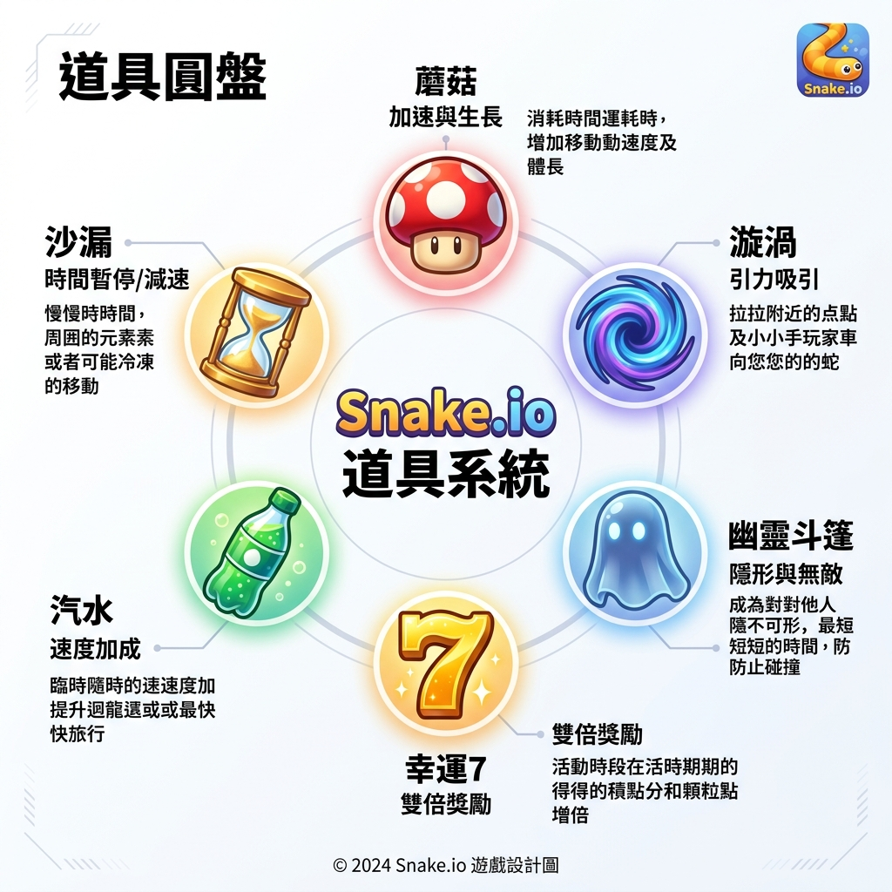

# 🐍 Snake.io - High-Performance Arena (v4.5.0)
> **狀態**：已發布 | **最後更新**：2026-05-14
> **核心設計目標**：極致截斷、戰術翻盤、高效能競技

---

## 🎮 1. 遊戲環境基礎規格 (Environment Specs)

| 項目 | 數值 / 規格 | 備註 |
| :--- | :--- | :--- |
| **地圖尺寸** | 2200px * 2200px | 正方形世界邊界 |
| **空間網格大小** | 200px * 200px | 用於優化食物吸取與查詢 (Grid Size) |
| **格線系統** | Alpha 0.05 | 基礎視覺背景 |
| **參賽人數** | 8 條蛇 | 1 名玩家與 7 名 AI 激烈對抗 |
| **單局時長** | 180 秒 | 3 分鐘標準競技對抗 |

---

## 📊 2. 介面佈局 (UI Layout)
> 採用 16:9 行動端標準視野，HUD 元素完全整合於螢幕內，支持 MOBA 式直覺操作。

*   **📊 戰況資訊**：左上顯示長度/最高分；右上僅顯示 **Top 4** 競爭者。
*   **⏲️ 戰局時鐘**：正上方顯示 180s 倒數，掌握決勝關鍵。
*   **🔋 動能核心**：底部的**青色體力條**，是衝刺與反擊的能量來源。
*   **⚔️ 戰術操作**：右下角 **DASH 大鍵** 與三大技能扇形佈局（磁鐵、噴墨、鷹眼）。

---

## ⚡ 3. 體力與加速系統 (Stamina & Dash System)

| 🔋 青色體力系統 | 🚀 加速衝刺 (DASH) |
| :--- | :--- |
| **恢復速度**：8.0 pts / 秒 | **速度加成**：1.25x 基礎速度 |
| **上限容量**：100 點 | **體力消耗**：33.3 pts / 秒 (極限 3s) |
| **戰術價值**：管理體力就是管理「進攻機會」。滿體力狀態是你最強大的時刻。 | **核心判定**：衝刺中具備 **截斷判定**，可切開任何未保護對手。 |

> ⚠️ **DASH 超載 (Overload)**：體力歸零將進入疲勞狀態，**禁止加速**且恢復效率減半，直到體力 **完全回滿 (100 pts)**。

---

## ⚔️ 4. 戰鬥與碰撞矩陣 (Combat Matrix)

| 碰撞情境 | 狀態：雙方衝刺 (Dash) | 狀態：僅一方衝刺 | 狀態：皆未衝刺 |
| :--- | :--- | :--- | :--- |
| **頭對頭 (Head-to-Head)** | 雙方強力回彈 (不致死) | 衝刺方獲勝，對方死亡 | 長度大者獲勝，小者死亡 |
| **頭對身 (Head-to-Body)** | 攻擊方回彈 (不致死) | **截斷 (Cut)**：對方斷尾 | 攻擊方死亡 |

### 4.1 死亡與懲罰機制
*   **死亡代價**：長度立即縮減 50%。
*   **遺產轉化**：原長度的 25% 會轉化為「遺產食物」散落在死亡位置，並在 8 秒後消失。
*   **復活保護**：玩家會在距離敵方蛇頭至少 400px 的安全區重生。

---

## 🛠️ 5. 戰術技能手冊 (Tactical Skills)

> 📸 **[圖片製作中]**：技能手冊示意圖 (風格將與道具圓盤對齊)

| 🧲 戰術磁鐵 | 🦑 噴墨煙霧 | 🦅 鷹眼 |
| :--- | :--- | :--- |
| **冷卻**：30s \| **持續**：8s | **冷卻**：20s \| **持續**：6s | **冷卻**：25s \| **持續**：12s |
| 將食物吸附半徑從 45px 提升至 **120px**，大幅增加收割效率。 | 在路徑後方留下致盲雲朵。敵方進入將損失 **90% 視野**，持續 5s。 | 相機鏡頭縮放至 **0.75x**。提供廣闊視野，提前偵測戰場動向。 |

---

## 🎁 6. 關鍵道具系統 (Key Items)

### 6.1 道具配額與效果清單

| 道具名稱 | 額位 | 重生 CD | 環帶區域 | 詳細效果說明 |
| :--- | :---: | :---: | :---: | :--- |
| **🍄 巨大蘑菇** | 2 | 25s | MID | 體型 1.5x。獲得**「免疫截斷」**霸體，無視加速截斷。 |
| **🌀 磁力漩渦** | 2 | 20s | MID | 瞬間啟動強磁，將 R=400 內所有食物暴力吸入。 |
| **👻 幽靈披風** | 2 | 25s | MID | 10s 透明狀態，可穿過所有蛇身，適合突圍或攔截。 |
| **7️⃣ 幸運 7** | 1 | 45s | CORE | 攝取食物價值翻 **7 倍**。搭配磁鐵可快速暴漲。 |
| **🥤 活力蘇打** | 3 | 15s | OUTER | 瞬間補滿 **100 點體力**，是解除超載的關鍵物資。 |
| **⏳ 時光沙漏** | 2 | 20s | OUTER | 瞬間恢復至本局 Session Max 長度。即使死亡也能回榜。 |

---

## 🌍 7. 生態自適應系統 (Adaptive Ecosystem)

### 7.1 行動導引邏輯 (Guidance)
*   **弱者導引**：長度低於初始 80% 的玩家，系統會優先在其路徑前方生成「活力蘇打」。
*   **強者推送**：領先者若長時間待在外環，系統會停止生成高價值道具，強制其向 CORE 推進。
*   **死亡熱點**：大蛇（長度 > 200）死亡後，該座標的道具重生權重提高 70%，吸引周遭玩家爭奪遺產。

---
*Powered by Antigravity v4.5.0 - 2026 Proposal*
