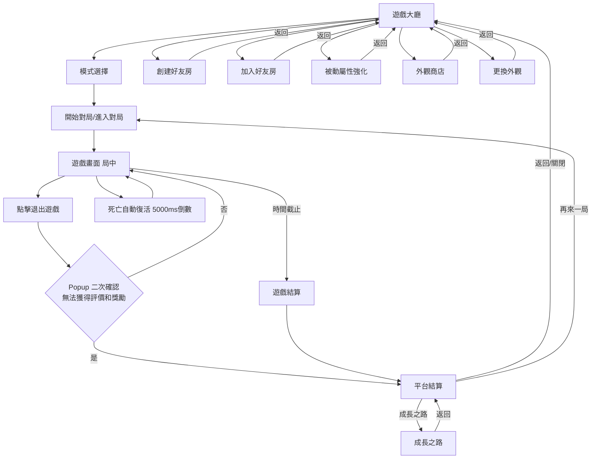
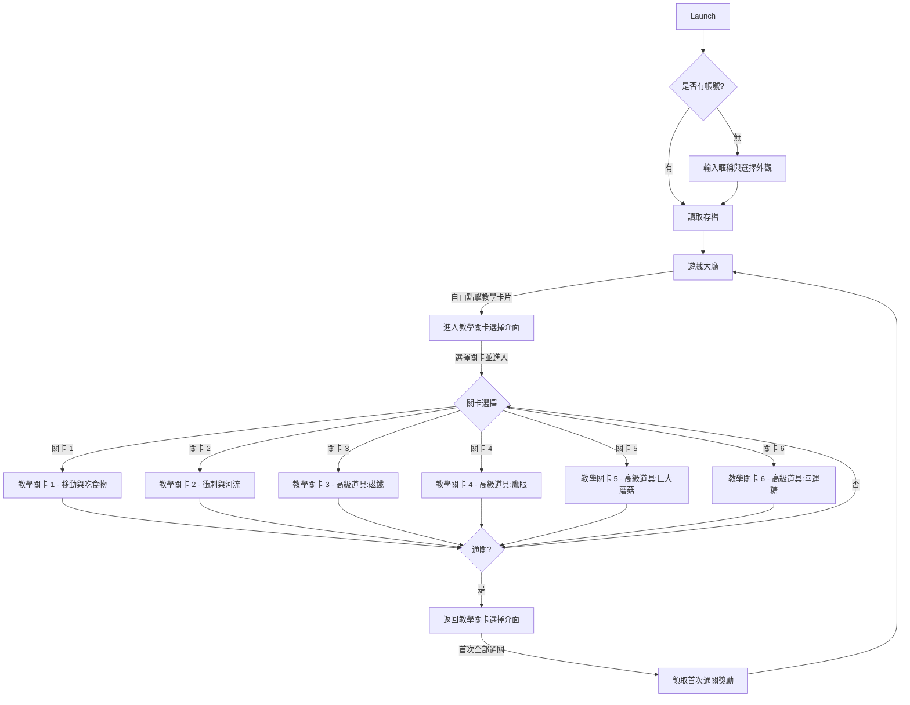
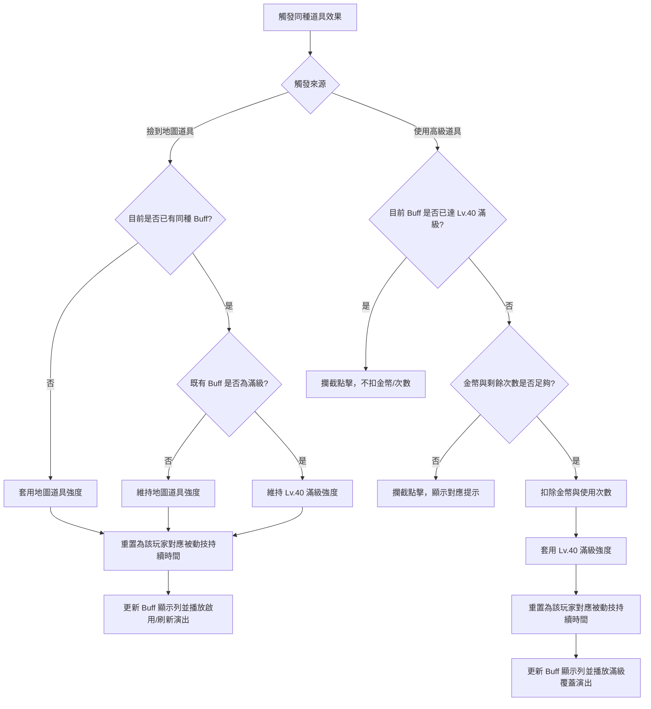
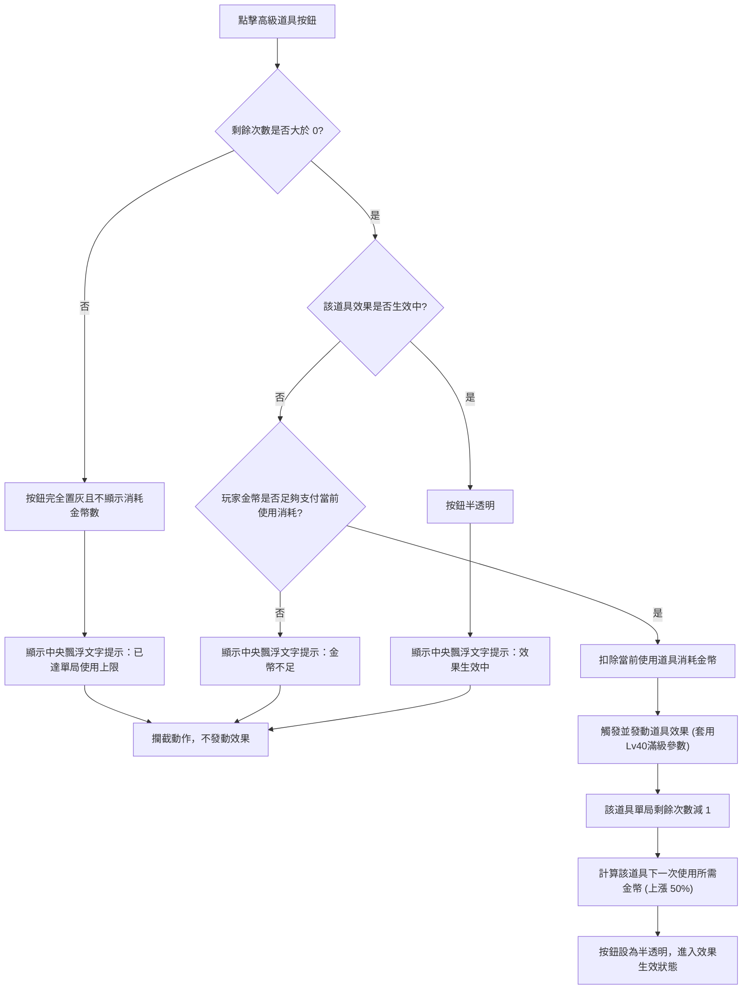
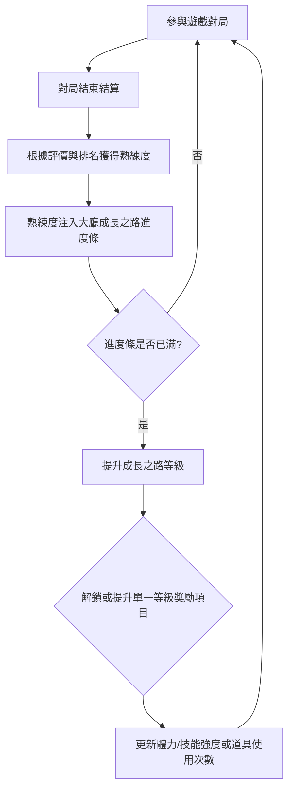
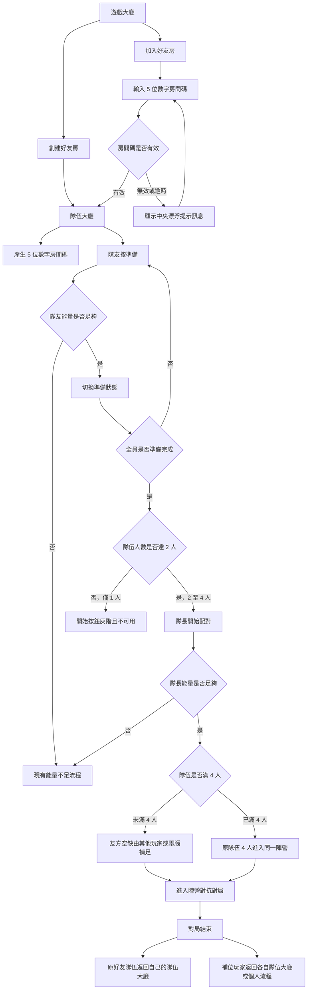

# 🎮 《貪食蛇》遊戲設計規格書

**文件版本**：14.0
**更新日期**：2026-06-12
**文件主旨**：定義《貪食蛇》玩法操作、局內規則、勝負判定、美術 UI 需求與 AI 機制，作為外包開發與程式實作之最高依據。

---

## 0. 系統與版本變更紀錄

<details open>
<summary><b>v14.0 (2026-06-12) - 退出確認、結算金幣發放與結算圖更新版</b></summary>

* **局中退出二次確認**：
  * 局中點擊退出遊戲時，先顯示 Popup 二次確認視窗，文案為「無法獲得評價和獎勵」，選項為「是 / 否」。
  * 選擇「否」返回局中；選擇「是」視為中途離開，跳過對局結算並進入平台結算流程。
* **結算金幣顯示與入帳**：
  * 評價金幣獎勵由遊戲/對局結算畫面計算並顯示，因其與發育評級直接掛鉤。
  * 實際金幣入帳統一於平台結算完成，平台結算也需再次顯示玩家本局名次。
* **結算圖片更新**：
  * 對局結算參考圖更新為 `Ref_對局結算.png`。
* **版號升級**：文件版本升級為 `14.0`。

</details>

<details>
<summary><b>v13.0 (2026-06-08) - 新手教學模式、好友社交組隊、音樂音效與數據真源整合版</b></summary>

* **新手教學模式與流程**：
  * 開闢獨立的新手教學關卡選擇入口與縱向滾動 UI（Ch 2.2.4）。
  * 包含 Level 1-6 的新手引導與通關蓋章，0 ⚡ 入場消耗，不給予結算獎勵，僅首通發放獎勵。
* **好友與社交組隊系統**：
  * 新增一次性五位數房間碼，支援 4 人小隊在大廳組隊，包含在線/配對/遊戲/離線狀態同步。
* **物理與視覺回饋規格補遺**：
  * 補齊初始核心屬性表（Ch 4.1），包括轉彎半徑與暴食 CD 等。
  * 規範蛇體擺動節奏、間距（10px）及防止拉伸空洞算法。
  * 補齊衝刺（拖尾、殘影）與減速（淡藍水體漣漪）的視覺特效規格。
  * 規範擊殺通告、隊友同色腳底光環（2px）及防跳動同步。
* **參數表數據真源 (SSoT) 整合**：
  * 替換全文 16 處 `<Module表_...>` 為指向第 16 章參數總覽的具體超連結。
* **音樂與音效需求 (Ch 17)**：
  * 定義 Main Theme / Ingame BGM / Victory Fanfare 等音軌與 22 項即時 SFX 的觸發規則與動態混音濾波。
* **美術需求追加**：
  * 美術需求表新增「教學關卡選擇介面」與「隊伍大廳 UI 介面」兩項向量 UI 套件。
* **版號升級**：全文新變更標記升級為 `📝[v13.0]`。

</details>

<details>
<summary><b>v12.0 (2026-06-01) - 多人組隊優化、重疊即死、斷線接管與效能優化版</b></summary>

* **陣營對抗規則優化**：
  * 同隊隊友之間不觸發碰撞死亡，可以自由互相穿過。
  * 道具效果共享：任一隊員拾取地圖隨機道具，其 Buff 效果與持續時間即時共享套用至全體隊友。
  * 共享覆蓋與覆寫規則：若隊友已帶有同種 Buff，新吃到的共享道具效果將採取「時間重置且數值取最高者覆蓋」原則。
  * 食物獨立：吃食物僅增加拾取者本人的長度與個人分數，不共享。
* **斷線與中離接管規則**：
  * 玩家網路斷線或中離，系統不會向其他玩家標示斷線圖示或通知，且完全斷線亦由「避險型 AI」接管其行動，採取保守的打圈自保策略。
  * 斷線/中離蛇隻限制 30 秒重連時限。超過 30 秒直接判定死亡並 100% 碎裂為食物殘骸，不發放 any 結算獎勵。
* **結算熟練度與金幣調整**：
  * 熟練度固定為 1 點能量 = 10 點熟練度。門票 30 點能量，單局基礎熟練度為 300 點。
  * 評級額外加成：SSS +50、SS +30、S +10 熟練度。
  * 初步金幣獎勵定額完全受評級影響：SSS 3000G，SS 2800G，S 2600G，A 2400G，B 2200G，C 2000G，D 1800G，E 1600G。
* **衝刺與緩速視覺演出**：
  * 衝刺時蛇頭兩側繪製向後流動的半透明白色運動速度線，蛇身配合粒子拖尾或殘影效果。
  * 河流或巨大蘑菇減速狀態下，速度線消失，蛇頭繪製淡藍色黏滯阻力漣漪與「🐌」氣泡圖示，且擺動頻率減慢 50%。
* **幽靈狀態無敵規則**：
  * 幽靈無敵狀態下不能穿透岩石，撞擊時觸發正常反彈，但不扣除長度（免除 50% 處罰）。
  * 結束重疊即死：無敵時間（`GHOST_TIME = 2000ms`）結束時，若蛇頭中心半徑內與其他 any 蛇的身體或頭部重疊，所有重疊到的蛇隻皆判定死亡，防止重疊暗殺。
* **物理防卡頓與時間戳校準**：
  * 物理 Update 的 `dt` 強制限制 `Math.min(dt, 0.1)`，防止背景分頁或卡頓時蛇隻穿牆。
  * 客戶端封包附帶時間戳 `client_timestamp`，邏輯按時間順序處理與驗證。
* **開局總分減少與防重疊檢測移除**：
  * 開局地圖隨機食物總分下調至 2000 分。
  * 移除食物與道具生成時的防重疊間距檢測，容許完全重合以提升大規模投放效效能。
* **衝刺截斷與撞頭擊殺**：
  * 衝刺撞擊非衝刺蛇身（避開頭部前 10 節），觸發「截斷」，前半段保留，後半段原地 100% 碎裂為 50% 價值的食物殘骸。
  * 衝刺撞擊非衝刺蛇頭，判定衝刺方擊殺，被撞方 100% 碎裂死亡.
* **版號升級**：全文標記升級為 `📝[v12.0]`。

</details>

<details>
<summary><b>v11.0 (2026-05-29) - 局內金幣直購道具與體驗簡化版</b></summary>

* **局內金幣直購道具與體驗簡化版**：
  * 廢除原「戰前攜帶」與「裝備欄位解鎖」機制。所有高級技能道具改為局內常駐快捷欄直購（鷹眼 2000G、磁鐵 4000G、巨大蘑菇 6000G、幸運糖 8000G）。
  * 道具使用無 CD 限制，單局售價每購買一次遞增 50% (1.5 倍)，單局使用上限初始 2 次，最大 5 次（視成長之路解鎖）。
  * 道具生效期間阻擋重複點擊，道具按鈕透明度增加，且點擊時在螢幕中央彈出漂浮文字 (floating tip) 提示「效果生效中」。金幣不足與次數耗盡則攔截。
* **成長之路與主動技能養成調整**：
  * 成長之路等級上限由 40 級提升至 60 級，且 1-60 級關鍵解鎖表採「一級僅解鎖單一效果」規則。
  * 主動技能養成範圍定為 **Lv 0 ~ Lv 4**。
  * 衝刺（無須解鎖）：滿級 (Lv 4) 體力上限為 1500 點（可持續衝刺 4.50 秒），回復速度提升至 200/s（回滿時間 7.50 秒，相比初始 12.50 秒縮短 40%）。
  * 暴食：滿級 (Lv 4) 吸附半徑為 400px，冷卻 CD 時間縮短至 25 秒（等級對應 CD 為 30/29/28/27/25 秒）。
* **流程與參數修改**：
  * 修改 Ch 8 Mermaid 流程圖為局內直購、次數與遞增判定。
  * 升級全文版號標記為 ``。

</details>

<details>
<summary><b>v10.0 (2026-05-29) - 戰前攜帶、重疊與主動技機制升級版</b></summary>

* **生死與碰撞規則修正**：
  * 修正 Ch 5.1 碰撞判定中「雙方皆衝刺頭對頭碰撞」，由原本的「扣除長度 50%」改為 **「反彈但不扣除長度」**。
* **安全生成重疊規則優化**：
  * 修正 Ch 7.1 食物與隨機道具安全生成間距，由 `15px` 縮減為 `2px`。食物與食物、食物與道具、道具與道具可以重疊，但不能完全重疊。
* **戰前道具攜帶與直購補充的簡易 Mermaid 流程圖**，定義「有庫存也能點選直購，但點擊超過攜帶上限時不置灰，直接以 Toast 提示阻擋」的互動邏輯。
* **主動技限制放緩**：
  * 取消主動技能暴食（Vortex）單局 9 次的次數限制，僅受 CD 限制。
* **被動養成與成長之路重構**：
  * 刪除 Ch 10.1 原有的成長之路系統說明。
  * 新增 Ch 11.2 成長之路與主動技能升級系統，詳細說明玩遊戲累積熟練度提升成長之路等級，進而解鎖與升級主動技能的機制，並以 Mermaid 流程圖表現。
* **外觀商店拆分與更換外觀規格**：
  * 將外觀商店獨立拆出為全新大章節 `## 13. 外觀商店與皮膚定價規則`，順延後續章節。
  * 於 Ch 11.4 新增更換外觀與表情貼圖的操作入口與配置規格說明。
* **版號升級**：全文升級為 v10.0，清除，更換為``📝[v10.0]``。

</details>

---

<details open>
<summary><b>📦 第一部分：框架與流程 (Frame & Flow)</b></summary>

### 1. 遊戲核心玩法與簡介

#### 1.1 玩什麼 (Core Loop)

玩家與電腦（共 8 人）置身於封閉的平面二維競技場內進行限時大亂鬥：

* **基礎食物**：地圖常駐隨機散落之發光小圓點。
* **殘骸資源**：蛇隻死亡後，身體殘骸轉化為高價值食物，**吞食殘骸為發育增長之核心手段**。
* **單局時長**：固定的單局限時倒數計時。

#### 1.2 怎麼玩：基礎操作與 HUD 佈局

操作介面採用雙手橫屏配置：


* **動態搖桿（手觸出現）**：
  * 控制蛇頭進行 360 度任意轉向與走位。
  * 支援 360 度動態追隨，靈敏度高，防止走位遲滯。
* **衝刺按鈕（右下角-大顆 圓形）**：
  * 按住時消耗體力提升移動速度。
  * 體力耗盡進入疲勞超載狀態，鬆開按鈕後體力自然回復。
* **暴食按鈕（右下角-小顆 圓形）**：
  * 點擊觸發， N 秒冷卻遮罩與倒計時。
* **道具快捷鍵（中央下排-小顆 方形r角）**：
  * 顯示各道具 消耗金幣 和 可用次數，無須局前攜帶。（鷹眼、磁鐵、巨大蘑菇、幸運糖）
* **局內排行榜（右上角）**：
  * 最多顯示 4 行，第一名（No.1）名字左側顯示皇冠標誌。
  * 玩家排名不在前三名時，第四格固定顯示玩家本人的名次與對局總積分。
* **擊殺橫幅（正上方）**：
  * 擊殺事件發生時，由畫面正上方滑出擊殺提示。
* **第一名相對方位標示（畫面邊緣）**：
  * 畫面四周邊緣常駐 crown icon，動態指向第一名目前所在座標。
* **小地圖限制**：
  * 局內 HUD 不顯示小地圖。

#### 1.3 比什麼 (Scoring & Rank)

* 即時計算「蛇身長度數值（積分）」，並於 HUD 右上方顯示「即時積分排行榜」。
* 單局時間截止時，依據結算那一瞬間的**積分**進行名次排定，並依照**積分**換算為 SSS 至 E 級別發放金幣獎勵。

---

### 2. 介面設計 (UI Flow & Layout)

#### 2.1 介面流程圖 (UI Flow)



#### 2.2 局外與局中 UI 規格

* **遊戲大廳**：最上方配置平台資訊欄（玩家頭像、能量、星星、金幣與選單）。大廳下方拆分為左右兩大區塊：
  * **左側固定資訊區**：展示當前遊戲（貪食蛇）之遊戲熟練度與進度條、遊戲技能解鎖與升級狀態、單局獎勵一覽、以及時限活動（貼紙派對）剩餘時間。
  * **右側功能與模式區**：包含可滾動的常規對局模式（單人對抗 30⚡、多人大亂鬥 30⚡、陣營對抗 30⚡），以及右側的社交與養成按鈕組（被動強化、外觀商店、更換外觀、創建好友房、加入好友房、教學模式）。無歷史紀錄。


---
* **被動屬性強化**：列表列出 10 種屬性的進度條與消耗金幣的隨機【強化】按鈕。


---
* **離開與結算**：局中退出、對局結算與平台結算流程統一由 [3.4 結算評價與獎勵機制](#34-結算評價與獎勵機制) 規範，避免同一規則在多處重複維護。

---

### 3. 遊戲模式、排行與結算

#### 3.1 遊戲模式與消耗設計

| 模式名稱 | 入場門票消耗 | 對局配置 | 勝負規則與時限 |
| :--- | :--- | :--- | :--- |
| **新手教學** | `0` 點能量 | 單人封閉沙盒，全手勢指引 | 獨立完成條件，無時限。不計對局結算與熟練度獎勵。 |
| **Solo (單人練習)** | `ENTRY_ENERGY_SOLO = 30` 點能量 | 1 玩家 + 7 電腦 | 單局限時結束時，以所有角色長度積分排行，最高分者獲勝。 |
| **多人大亂鬥** | `ENTRY_ENERGY_BRAWL = 30` 點能量 | 8 玩家 | 單局限時結束時，以個人長度積分排行，最高分者獲勝。 |
| **陣營對抗** | `ENTRY_ENERGY_TEAM = 30` 點能量 | 4 玩家 + 4 玩家 | 單局限時結束時，累計陣營總長度積分，總分高之陣營獲勝。 |

> [!NOTE]
> 若在配對時長超時未配對到足夠的真人玩家，系統會自動使用電腦 AI 替代補滿對局席位。
> 各對局模式電腦 BOT 補位固定分配與配比請參閱 Ch 9.2 對應表格。

##### 3.1.1 陣營對抗特殊互動規則

為增強團隊協作與社交趣味，陣營對抗（4v4）對局套用以下特殊規則：

* **友方穿透**：同隊隊友之間不觸發碰撞死亡判定，蛇頭可自由穿過隊友的身體與頭部。
* **道具共享與各人強度套用**：
  * **共享機制**：任一隊員在場上拾取到地圖道具（磁鐵、巨大蘑菇、幸運糖、鷹眼），全隊友方共享效果，各自均會獲得對應的 Buff 圖示與計時器。
  * **個人數值縮放**：**共享 Buff 的具體增益數值，由每個蛇隻本人的屬性養成等級決定，而非依據拾取者等級。**
    * *(例：隊伍中拾取者磁鐵效果為滿級 Lv 40，隊友 A 為 Lv 0，隊友 B 為 Lv 10。當拾取者吃得磁鐵時，全隊共享磁鐵效果；但拾取者獲得其滿級 Lv 40 的磁吸半徑，隊友 A 獲得其 Lv 0 的基礎半徑，隊友 B 則獲得其 Lv 10 的半徑。)*
  * **覆寫與時長重置**：若觸發共享時隊友身上已帶有同種 Buff，則該 Buff 的剩餘持續時間**直接重置（刷新）為最大持續時間**，但具體效果依然套用個人自身的屬性數值。
    * *(例：隊友 A 的磁鐵剩餘時間為 2000ms（其個人 Lv 0 磁鐵最大時長為 10000ms）。此時隊友 B 拾取了地圖隨機磁鐵，觸發共享覆寫：隊友 A 的磁鐵 Buff 剩餘時間立即重置刷新回其本人的最大時長 10000ms，而其磁吸增益半徑依然依據其本人的 Lv 0 屬性計算。)*
* **食物獨立**：地圖上的隨機食物及碎裂殘骸不共享拾取。玩家吃食僅會增加「吃食者本人」的蛇身長度與個人分數。

###### 3.1.1.1 隊伍識別視覺規範

為確保陣營對抗模式中同隊友方與敵方有直觀且清晰的視覺區隔，對局內採用以下辨識規範：

| 視覺層級 | 規則與表現效果 |
| :--- | :--- |
| **蛇頭與蛇身光環** | 友方蛇頭周圍繪製隊伍專屬色彩光環（如藍隊為半透明天藍色、紅隊為半透明淡紅色），寬度 `2 px`，透明度 `0.5`。 |
| **排行榜隊伍標示** | 右上角排行榜中，同隊玩家名稱後方加上對應的陣營文字或顏色方塊標記（如 `[藍]`、`[紅]`）。 |
| **擊殺橫幅廣播** | 擊殺橫幅格式升級為：`[藍隊] 玩家A 擊殺 [紅隊] 電腦_03`，並以對應顏色高亮隊伍名稱。 |

#### 3.2 排名與破平規則

* **同分破平**：若局終結算時有多名玩家的分數完全相同，名次將依據**達到該分數的毫秒級時間戳 (`score_update_timestamp`) 進行判定，先達到該分數的玩家排名在前**。系統會在每次得分時記錄當前幀的絕對時間戳（精確至毫秒），確保破平邏輯 100% 精準無爭議。

#### 3.3 局內排行榜與第一名冠冕顯示

* **排行榜 HUD**（介面佈局與顯示位置請參考 [1.2 怎麼玩：基礎操作與 HUD 佈局](#12-怎麼玩基礎操作與-hud-佈局)）：
  * 排行榜固定於畫面右上角，最多顯示 4 行，每行格式為「`名次. 名字 - 對局總積分`」。第一名（No.1）名字左側顯示皇冠 👑。
  * **領先與防護欄展示機制**：
    * 若玩家當前名次排在前三名（No.1 ~ No.3）：排行榜展示第 `1, 2, 3, 4` 名的資訊。
    * 若玩家當前名次排在第四名以下 (>= No.4)：排行榜前三格展示第 `1, 2, 3` 名的資訊，第四格固定顯示玩家本人的名次與對局總積分（例如 `6. 玩家名字 (你) - 230`）。
* **第一名冠冕掛飾**：當前對局總積分第一名的蛇隻，其蛇頭上方常駐隨蛇身滑行的皇冠掛飾，易主時轉移。
* **相對方位標示**：畫面四周邊緣常駐一個帶有皇冠標誌的指引座標 ICON，動態指向第一名當前所在座標與其對局總積分。


#### 3.4 結算評價與獎勵機制

對局結束後，系統彈出對局結算畫面（介面佈局見下方參考圖），條列式展示以下局內遊戲內容。評價金幣獎勵與發育評級直接掛鉤，因此需於此畫面完成計算與顯示；實際獎勵入帳統一於後續平台結算流程完成。


* **各玩家(電腦)排名**：展示本局所有玩家（及 AI 電腦）的最終名次與對局總積分列表。
* **發育評價**：展示本局自己獲得的最終發育等級評級（SSS / SS / S / A / B / C / D / E）。
* **擊殺數**：展示本局內自己成功擊殺敵蛇的總次數。
* **死亡數**：展示本局內自己被擊殺或碰撞死亡的次數。
* **本局可獲得金幣**：展示依發育評級計算出的評價金幣獎勵；此處僅顯示結果，實際入帳於平台結算完成。

##### 3.4.1 金幣獎勵機制

根據玩家的單局結算評級發放固定金幣獎勵，與排名無直接關聯。金幣獎勵於「遊戲/對局結算」階段計算並顯示，實際入帳於「平台結算」階段完成。

若玩家局中點擊退出遊戲，並在二次確認 Popup「無法獲得評價和獎勵」中選擇「是」，視為放棄本局評價與獎勵，不進入對局結算金幣發放流程。

##### 3.4.2 熟練度與評級加成計算

* **門票熟練度換算**：熟練度獲取比率固定為 `1點能量 = 10點熟練度`。單局基礎熟練度依據入場門票能量值動態計算（計算公式：`單局基礎熟練度 = 該對局模式之入場能量門票 * 10`）。
* **評級額外加成**：依據單局結算評級有額外定值熟練度加成.
* **計算公式**：

  ```text
  單局最終獲得熟練度 = 基礎熟練度 + 評級額外加成
  ```

  *(例：入場消耗能量門票為 30⚡，則單局基礎熟練度為 300 點；評級為 SSS 的玩家最終可獲得 300 + 50 = 350 點熟練度。)*

##### 3.4.3 發育評級標準

結算發育評級（SSS 至 E 級別）完全依據玩家在單局結束時所達到的「對局總積分（積分條件）」進行評判。

##### 3.4.4 單局結算獎勵與評級對照表

| 評級 | 對局總積分條件 | 金幣獎勵 | 評級額外熟練度 |
| :--: | :------------- | :------: | :------------: |
| SSS  | 2000 以上      |   3000   |       50       |
|  SS  | 1500 - 1999    |   2800   |       30       |
|  S   | 1000 - 1499    |   2600   |       10       |
|  A   | 800 - 999      |   2400   |       0        |
|  B   | 500 - 799      |   2200   |       0        |
|  C   | 300 - 499      |   2000   |       0        |
|  D   | 100 - 299      |   1800   |       0        |
|  E   | 99 以下        |   1600   |       0        |

##### 3.4.5 擊殺積分與結算獎勵

對局結算時，玩家的擊殺表現將獲得額外的積分加乘與獎勵：

* **發育評級積分累加**：對局結束時，結算發育評級採用的「個人累計積分」已包含局內的所有擊殺積分（每擊殺 1 次獲得 `KILL_SCORE = 100` 分）。
* **擊殺熟練度獎勵**：每成功擊殺一隻蛇，結算時額外發放 `KILL_MASTERY_BONUS = 2` 點熟練度。擊殺不會獲得額外金幣。此額外獎勵與評級獎勵累加發放，不設上限。
  * *(例：玩家評級為 SSS 且擊殺 5 次，最終獲得金幣為：3000 (評級固定獎勵，無擊殺額外金幣)；獲得熟練度為：300 (基礎) + 50 (評級加成) + 5 * 2 = 360 點。)*

##### 3.4.6 平台結算與養成機制

當玩家關閉「對局結算」視窗後，系統會自動載入「平台結算介面」（介面佈局與按鈕引導見下方參考圖）進行評價金幣實際入帳、平台 XP、外觀熟練度、隨機掉落、活動入口與後續引導等局外流程。平台結算需再次顯示玩家本局名次，讓玩家能對照對局結果與實際獎勵發放。

若玩家中途離開並在退出二次確認 Popup 選擇「是」，仍會進入平台結算流程，但不取得對局評價、評價金幣與該局獎勵；此規則與 [15.2 中離懲罰](#152-中離懲罰) 一致。


* **本局名次再次顯示**：平台結算需再次顯示玩家本局名次與對局總積分，讓玩家確認獎勵入帳來源。
* **評價金幣入帳**：依對局結算畫面顯示的發育評級與金幣獎勵，在平台結算階段實際加算至玩家帳號金幣餘額。
* **平台經驗與等級**：根據對局的表現與名次折算為平台 XP，當 XP 條滿時提升「平台等級」。
* **外觀熟練度累積**：將當局獲得之熟練度（依對局表現與門票消耗計算，參考 [3.4.2 熟練度與評級加成計算](#342-熟練度與評級加成計算)）注入當前裝備之蛇隻皮膚中，累積熟練度條。
* **隨機掉落獎勵**：對局結束時有一定機率獲得隨機掉落獎勵（如貼紙派對活動貼紙、平台虛擬代幣或裝飾等，但不會掉落磁鐵等局內戰鬥消耗道具）。若未觸發任何掉落，底部子面板文字固定顯示 `未獲得隨機掉落獎勵`。
* **活動面板關聯**：右側展示時限活動（如「貼紙派對」之賸餘時間與圖示），點擊可開啟對應活動詳情。
* **按鈕引導邏輯**：
  * **再來一局**：點擊直接關閉平台結算，並依據上一局之模式與門票設定，直接進入配對佇列（快速開始對局）。
  * **成長之路**：點擊切換至平台「成長之路」專屬畫面，領取等級成長解鎖的里程碑獎勵。

#### 3.5 新手教學模式與首次使用者體驗


##### 3.5.1 設計原則

* **零強制閱讀，全手勢引導**：操作以「手指光暈 ➔ 搖桿/按鈕高亮 ➔ 示意動態」三步引導，避免長篇文字。
* **獨立遊戲模式**：教學模式為完全獨立的選關玩法，玩家可在大廳隨時自由進入、重複挑戰或選擇特定關卡進行練習。
* **零消耗與零獎勵**：每次進入關卡不消耗能量（0 ⚡），對局結束時不發放常規的評級金幣、擊殺金幣或熟練度結算獎勵。
* **新手首次通關獎勵**：玩家首次通過全部教學關卡後，系統透過任務系統發放一次性獎勵：500 G 金幣、100 XP 熟練度，並解鎖「經典綠」基礎外觀。

##### 3.5.2 教學流程圖



##### 3.5.3 教學關卡明細

| 關卡 | 場景 | 目標 | 引導內容 | 完成條件 | 失敗條件 |
| :--- | :--- | :--- | :--- | :--- | :--- |
| **教學關卡 1：搖桿與吃食** | 小型封壓沙盒（約 1200×1200 px），無敵人、無岩石、無河流。 | 引導玩家將蛇頭移動至 10 顆閃爍食物並吞食。 | 1. 畫面左下出現半透明手勢光暈，引導玩家放置左手拇指於虛擬搖桿區域。<br>2. 食物高亮並出現「前往」指引虛線。<br>3. 吃到第 3 顆食物後，播放 Floating Tip：「移動吃食物，可增長蛇身並獲得積分！」 | 吃到 10 顆食物，個人長度積分達 50 分。 | 無。撞牆僅會彈回，不致死亦不扣分。 |
| **教學關卡 2：衝刺與河流** | 地圖中央有一條橫向河流（寬度 80 px），兩側各有 1 隻靜止的初階 BOT。 | 引導玩家使用衝刺穿過河流，並在安全區域發育。 | 1. 畫面右下角「衝刺按鈕」高亮並播放脈衝特效，提示玩家按住。<br>2. 按住按鈕衝刺時，顯示體力條與加速特效。<br>3. 衝刺進入河流後，播放減速漣漪特效與蝸牛狀態圖示，顯示 Floating Tip：「河流會降低 50% 速度，按住衝刺可快速通過！」 | 成功衝刺穿越河流一次，且個人長度積分達 100 分。 | 無。 |
| **教學關卡 3：高級道具 - 磁鐵** | 沙盒地圖，無隨機道具，地圖中散落多個靜止食物。 | 引導玩家主動點擊 HUD 中的**磁鐵道具按鈕**（消耗金幣），體驗吸附周邊食物的效果。 | 1. 地圖上**不生成**任何實體道具。<br>2. 畫面下方 HUD 的「磁鐵道具按鈕」高亮閃爍，浮空手勢指引點擊，提示 Tip：「點擊使用磁鐵，可自動吸附附近食物！」<br>3. 點擊後，道具按鈕顯示剩餘次數從 `1` 變為 `0`（本局金幣充足或模擬扣減），並啟動 8 秒倒數（蛇頭上方顯示）。播放磁鐵吸力特效與音效，周圍食物向蛇頭滑行。 | 使用磁鐵吃到至少 20 顆被吸附食物，個人長度積分達 200 分。 | 無。教學局若金幣不足，系統會自動補足，確保玩家可重複點擊。 |
| **教學關卡 4：高級道具 - 鷹眼** | 沙盒地圖，隨機分散 20 顆食物。 | 引導玩家主動點擊 HUD 中的**鷹眼道具按鈕**，體驗雷達掃描與視野拉遠。 | 1. 畫面下方 HUD 的「鷹眼道具按鈕」高亮閃爍，指引點擊。<br>2. 點擊後扣除模擬金幣，剩餘次數變更為 `0`。<br>3. 相機相應拉遠（視野擴大至 1.35x），地圖上所有食物的位置高亮標記，持續 10 秒。 | 使用鷹眼掃描後，在 20 秒內吃到至少 15 顆食物，個人長度積分達 250 分。 | 無。 |
| **教學關卡 5：高級道具 - 巨大蘑菇** | 沙盒地圖，加入 2 隻「進階 BOT」。 | 引導玩家主動點擊 HUD 中的**巨大蘑菇道具按鈕**，化身大蛇撞擊敵方。 | 1. 畫面下方 HUD 的「巨大蘑菇道具按鈕」高亮閃爍，指引點擊。<br>2. 點擊後，蛇隻體型變大（1.5 倍），外周加上金色光環無敵特效，持續 10 秒。<br>3. 引導玩家在無敵狀態下衝刺去「衝撞」敵方 BOT（敵方會短暫眩暈且無法移動）。 | 在無敵狀態下成功衝撞敵方 BOT 至少 1 次。 | 無。 |
| **教學關卡 6：高級道具 - 幸運糖** | 沙盒地圖，散落少量基礎食物。 | 引導玩家主動點擊 HUD 中的**幸運糖道具按鈕**，體驗幸運時間內的食物增長與點數加成。 | 1. 畫面下方 HUD 的「幸運糖道具按鈕」高亮閃爍，指引點擊。<br>2. 點擊使用後，蛇隻進入持續 15 秒的幸運狀態，食物點數獲取倍率翻倍。 | 在幸運糖持續時間內吃到至少 25 顆食物，個人長度積分達 300 分。 | 無。 |

##### 3.5.4 退出與跳過機制

* **跳過教學**：關卡對局中允許玩家隨時點擊「離開」按鈕退出，彈出確認提示：「跳過教學將直接返回大廳，未通關前無法領取首次獎勵，確定跳過嗎？」。確認後退回大廳。
* **重新體驗**：通關後，玩家仍可在關卡選擇介面中自由選擇任一關卡重複體驗，但不再重複發放首次通關獎勵。

---

</details>

<details open>
<summary><b>⚔️ 第二部分：局內核心玩法 (Core Gameplay)</b></summary>

### 4. 基礎核心與速度控制

#### 4.1 初始蛇隻基礎屬性規格表

為統一對局初始化與運算邏輯，蛇隻（玩家與電腦 AI）在剛進入戰局或重生時的初始屬性設定如下表所示：

| 屬性名稱 | 預設數值 | 單位 | 說明 | 對應參數常數 |
| :--- | :---: | :---: | :--- | :--- |
| **基礎移動速度** | `400` | 0.01 px/s | 蛇隻無加速時的移動速度（4.00 px/s） | `BASE_SPEED` |
| **初始蛇身長度** | `50` | 節 | 剛進入戰場或重生時的蛇節數量 | `INITIAL_LENGTH` |
| **體力上限值** | `1000` | 點 | 衝刺時消耗 the 體力最大池（可連續衝刺 3 秒） | `STAMINA_MAX` |
| **體力回復速度** | `80` | 點/s | 停止衝刺後每秒自動恢復的體力量 | `STAMINA_RECOVERY` |
| **每節所需積分** | `10` | 分 | 蛇身每增加 1 節所需的積分增量 | `POINTS_PER_SECTION` |
| **常態吸附半徑** | `50` | px | 未開啟暴食與磁鐵時的基礎食物吸附半徑 | `BASE_SUCTION_RADIUS` |
| **蛇頭碰撞半徑** | `12` | px | 蛇頭進行死亡碰撞檢測的物理半徑 | `SNAKE_HEAD_COLLISION_RADIUS` |
| **蛇身碰撞半徑** | `8` | px | 蛇身被敵方頭部碰撞檢測的物理半徑 | `SNAKE_BODY_COLLISION_RADIUS` |
| **復活無敵時間** | `2000` | ms | 重生時閃爍無敵且不可移動的停留時間 | `GHOST_TIME` |

#### 4.2 基礎跑速與速度計算規則

* **基礎跑速**：初始基礎跑速單位為 `BASE_SPEED = 400`（等同於 `4.00 px/s`，即以 100 代表 1 px/s，由 [16.2 基礎核心參數](#162-基礎核心參數) 控制）。
* **速度計算公式**：
  $$
  \text{最終跑速} = \text{基礎跑速} \times \left(1 + \frac{\text{所有速度增減}}{100}\right)
  $$
* **實例計算說明**：
  * 假設基礎跑速為 `400`。
  * 當前狀態為：衝刺加成 `+25`
  * 巨大蘑菇減幅 `-25`
  * 被動巨大化跑速 Lv6 加成 `+6`
  * 河流地形減幅 `-50`

  $$
  \text{最終跑速} = 400 \times \left(1 + \frac{25 - 25 + 6 - 50}{100}\right) = 400 \times 0.56 = 224 \text{ (等同於 2.24 px/s)}
  $$

##### 4.2.1 跑速狀態視覺演出範例

為增強操作回饋與物理動態，當跑速發生顯著變化時需觸發特定視覺演出：

* **1. 衝刺加速**：
  * **流線速度線**：蛇頭後方兩側（-30 度與 +30 度張角）繪製向後噴射的半透明白色速度線。
  * **拖尾與殘影**：蛇身路徑釋放同色粒子，且節點產生短殘影（持續時間 `200ms`）。
* **2. 減速狀態**（跑速低於 `BASE_SPEED`）：
  * **漣漪與阻力**：速度線與殘影消失，蛇頭四周繪製淡藍色/青色水體漣漪。
  * **動畫降頻**：蛇體 2D 擺動頻率降低 **50%**，以展現黏滯阻力。

#### 4.3 蛇隻主動技能規則

| Icon | 技能名稱                  | 控制模組                | 解鎖等級             | 養成與最大等級                                                           | 基礎規格 / 冷卻                                     | 疲勞與超載規則                                    |
| :---: | :------------------------ | :---------------------- | :------------------- | :----------------------------------------------------------------------- | :-------------------------------------------------- | :------------------------------------------------ |
|  | **衝刺 (Dash)**     | [16.2 基礎核心參數](#162-基礎核心參數) | 無須解鎖 (初始 Lv 0) | **體力上限**：可升至 Lv4`<br>`**體力回復速度**：可升至 Lv4 | 每秒消耗 `333` 點體力。加速 `+25%` 移動速度。   | 體力歸 0 進入超載：鎖定禁衝刺與回體，回滿後解鎖。 |
|  | **暴食 (Gluttony)** | [16.2 基礎核心參數](#162-基礎核心參數) | 成長之路 Lv 1 解鎖   | **吸附範圍**：可升至 Lv4`<br>`**冷卻時間縮短**：可升至 Lv4 | 瞬間釋放暴食力場，以速度 `12 px/s` 吸附區域食物。 | 釋放後進入冷卻。單局無次數限制。                  |

##### 主動技能養成與數值參數表

###### 衝刺 (Dash) 升級養成數值表

* **體力上限升級表**（體力消耗固定為 `333 點/s`）：

|    效果等級    |  體力上限  | 體力全滿可衝刺秒數 | 備註     |
| :------------: | :---------: | :----------------: | :------- |
| **Lv 0** | `1000` 點 |    `3.00 秒`    | 初始狀態 |
| **Lv 1** | `1125` 點 |    `3.38 秒`    |          |
| **Lv 2** | `1250` 點 |    `3.75 秒`    |          |
| **Lv 3** | `1375` 點 |    `4.13 秒`    |          |
| **Lv 4** | `1500` 點 |    `4.50 秒`    | 滿級狀態 |

* **體力回復速度升級表**：

|    效果等級    | 體力回復速度 | 備註                                            |
| :------------: | :----------: | :---------------------------------------------- |
| **Lv 0** |   `80/s`   | 初始狀態（搭配上限 1000 點時，回滿需 12.50 秒） |
| **Lv 1** |  `100/s`  |                                                 |
| **Lv 2** |  `125/s`  |                                                 |
| **Lv 3** |  `158/s`  |                                                 |
| **Lv 4** |  `200/s`  | 滿級狀態（搭配上限 1500 點時，回滿需 7.50 秒）  |

###### 暴食 (Gluttony) 升級養成數值表

* **吸附範圍升級表**（食物吸附飛行速度固定為 `12 px/s`）：

|    效果等級    | 吸附半徑 | 備註     |
| :------------: | :-------: | :------- |
| **Lv 0** | `200px` | 初始狀態 |
| **Lv 1** | `250px` |          |
| **Lv 2** | `300px` |          |
| **Lv 3** | `350px` |          |
| **Lv 4** | `400px` | 滿級狀態 |

* **冷卻時間縮短升級表**：

|    效果等級    | 冷卻時間 | 備註     |
| :------------: | :-------: | :------- |
| **Lv 0** | `30 秒` | 初始狀態 |
| **Lv 1** | `29 秒` |          |
| **Lv 2** | `28 秒` |          |
| **Lv 3** | `27 秒` |          |
| **Lv 4** | `25 秒` | 滿級狀態 |

#### 4.4 蛇隻視覺節奏與尺寸對照表

蛇身渲染除長度外，需明確定義節點視覺間距，以避免高速移動時節點過密或過疏。

| 項目 | 建議數值 | 說明 |
| :--- | :---: | :--- |
| **蛇節視覺間距** | `10 px` | 頭部與第一節，以及每節之間的固定螢幕渲染距離。 |
| **蛇頭碰撞半徑** | `12 px` | 用於頭部與頭部、頭部與身體的碰撞偵測物理半徑 (`SNAKE_HEAD_COLLISION_RADIUS`)。 |
| **蛇身碰撞半徑** | `8 px` | 身體節點碰撞物理半徑 (`SNAKE_BODY_COLLISION_RADIUS`)。 |
| **食物碰撞半徑** | — | 各食物種類的碰撞物理半徑，請詳見 [7.1 全域食物規格對照表](#71-全域食物規格對照表)。 |
| **吸附生效距離** | `蛇頭碰撞半徑 + 當前食物碰撞半徑 + 2 px` | **判定食物已被吃掉的最小距離閾值**。當飛向蛇頭的食物與蛇頭中心的距離小於或等於此數值時，立即觸發吞食判定（食物銷毀、積分增加、長度增長）。此設計是為了避免蛇隻在高速衝刺時，因影格渲染的時間差而穿透了食物卻無法觸發正常吃食的問題。 |

#### 4.5 衝刺與減速視覺特效規範

* **衝刺加速特效**：
  * **流線速度線**：蛇頭兩側噴射 streamwise 粒子效果，角度 -30° / +30°，長度約 20 px，透明度 0.6。
  * **拖尾殘影**：蛇身路徑釋放同色粒子，且節點殘影保留時間固定為 `200 ms`。
  * **曲線插值**：蛇身每節在當前幀與上一幀位置之間採用 animation curve 內插補足，避免高速移動時節點跳動。
* **減速狀態特效（跑速低於基礎速度時）**：
  * **隱藏速度線**：自動隱藏加速流線粒子，並在蛇頭外周繪製淡藍色漣漪圈，半徑 14 px，透明度 0.4，呼吸動畫週期為 800 ms。
  * **狀態圖示**：蛇頭上方浮顯小型減速狀態圖示（🐌 或減速紗霧圖示），與其他 Buff/Debuff 圖示層疊顯示。
  * **動畫降頻**：蛇體物理擺動頻率由正常的 1.0x 降低至 0.5x，動畫播放週期翻倍。

---

### 5. 碰撞、死亡與重生復活規則 (Collision, Death & Respawn)

#### 5.1 生死與碰撞判定矩陣

局內生死邏輯最高指導原則為「撞身即死」（撞擊他人身體者必死）。
頭對頭碰撞或衝刺截斷時執行以下判定矩陣。
死亡後（包括但不限於：頭撞他人蛇身、撞頭被擊殺、無敵結束重疊判定死亡、或超時中離暴斃），屍體轉化為生前長度積分之 50% 價值的食物（由 `DEBRIS_PERCENTAGE = 5000` 控制）。

| 攻擊方 |   受擊方   | 攻擊方狀態 | 受擊方狀態 | 攻擊方死亡 | 受擊方死亡 | 攻擊方擊殺 | 受擊方擊殺 | 物理演出與碰撞說明                     |
| :----: | :--------: | :---------: | :--------: | :--------: | :--------: | :--------: | :--------: | :------------------------------------- |
|   頭   |     身     |   未衝刺   |   未衝刺   |     O     |     X     |     -     |     +1     | 攻擊方碎裂死亡，原地生成殘骸。         |
|   頭   |     身     |    衝刺    |   未衝刺   |     X     |     X     |     -     |     -     | 受擊方**從撞擊點截斷**变為殘骸。 |
|   頭   |     身     |    衝刺    |    衝刺    |     X     |     X     |     -     |     -     | 雙方物理回彈，不致死、不截斷。         |
|   頭   |     頭     |   未衝刺   |   未衝刺   |     O     |     O     |     +1     |     +1     | 雙方碎裂死亡，原地生成殘骸。           |
|   頭   |     頭     |    衝刺    |   未衝刺   |     X     |     O     |     +1     |     -     | 受擊方整個碎裂死亡（無視長度）。       |
|   頭   |     頭     |    衝刺    |    衝刺    |     X     |     X     |     -     |     -     | 雙方物理回彈，不扣除長度。             |
|   頭   | 岩石或邊界 | 衝刺/未衝刺 |     -     |     X     |     -     |     -     |     -     | 物理回彈，蛇身發光閃爍並扣 50% 長度。  |

##### 5.1.1 衝刺截斷與擊殺細節說明

衝刺撞擊敵蛇身體時，依撞擊位置節數觸發不同死傷判定：

* 撞擊位置 ＜＝ 10 節 (頭部區) ➔ 受擊方死亡。**攻擊方擊殺數 +1**。
* 撞擊位置 ＞ 10 節 (身體區) ➔ 受擊方被截斷。
* **擊殺廣播提示**：當觸發任一擊殺事件時，畫面中央上方會彈出置頂廣播提示（Tip），格式為 `[擊殺者頭像] {擊殺者名稱} 擊殺 {被擊殺者名稱} [被擊殺者頭像]`，其中擊殺方頭像顯示在名字左側，被擊殺方頭像顯示在名字右側。

#### 5.2 死亡復活與行為限制

* **死亡至重生 5 秒流程（攝影機與視覺演出）**：
  * **第 0 ~ 1.5 秒（觀察期）**：攝影機維持鎖定在蛇隻死亡的地點，讓玩家看清死亡結果與周圍戰局。
  * **第 1.5 ~ 3.0 秒（過渡期）**：攝影機平滑平移（Pan）至系統選定的安全重生點。
  * **第 3.0 ~ 5.0 秒（預覽期）**：於安全重生點處，僅對**重生玩家自身**顯示半透明的蛇頭預覽與朝向箭頭（預告初始面向），並在該預覽蛇頭正上方顯示浮動倒數文字 `2... 1...`。
  * **第 5.0 秒（重生）**：蛇隻正式生成，攝影機恢復即時鎖定跟隨，玩家取得操作控制權。
* **讀秒期行為限制**：無法位移，無法釋放主動技能或使用地圖道具。身上作用中的所有地圖道具或技能道具**計時器不凍結，持續實時倒數消耗**。

#### 5.3 重生安全保護與朝向判定

* **對手隱蔽規則**：重生安全座標與準備期的預覽特效，對**所有對手玩家完全隱蔽**，對手畫面上不提供 any 指針或特效預告，防止守屍。
* **重生點朝向邏輯**：重生預覽及生成時，蛇頭的初始朝向會自動計算並朝向**距離障礙物（岩石）和地圖邊界最遠的地方**，以確保重生後有最大的反應與移動緩衝空間。

#### 5.4 死亡碎裂與殘骸生成規格

* **殘骸尺寸與種類**：碎裂後每段殘骸半徑固定為 `8 px`，多個殘骸生成於同一區域時，需套用隨機位置偏移 `±2 px` 以避免完全重疊。**死亡殘骸會全部轉化為專屬的「殘骸結晶 (Debris Crystal)」**。每顆殘骸結晶的物理碰撞半徑為 `12 px`，實時生成時其渲染外觀尺寸隨機縮放為其基礎尺寸的 **`1.0x ~ 1.2x`**，以豐富視覺層次與立體感；其單顆積分固定為 `10` 分（詳見 [7.3 全域食物規格對照表](#73-積分與加分公式)）。
* **殘骸價值與無條件捨去**：轉化比例由 `DEBRIS_PERCENTAGE = 50%`（由 [16.4 地圖與場景參數](#164-地圖與場景參數) 控制）決定。當蛇隻死亡時，其個人累計長度積分的 50% 將轉化為地圖食物殘骸，並**無條件捨去至 10（單顆殘骸結晶積分）的倍數**：
  * *(例：蛇隻死亡時長度積分為 2400 分，轉化後的殘骸總積分為 1200 分。系統生成 1200 / 10 = 120 顆隨機尺寸的發光殘骸結晶。若殘骸總分為 1205 分，則無條件捨去至 1200 分，同樣生成 120 顆結晶。)*
* **殘骸生命週期與積分判定**：
  * **限時消失**：殘骸生成的食物在原地保留 **10 秒**（由 `DEBRIS_LIFETIME = 10` 秒控制）後會自動淡出（Fade-out）消失。
  * **列入局內積分**：吃下由殘骸轉化的食物會**正常增加蛇身當前長度與個人總積分**（影響排行榜名次與結算發育評級）。但這些殘骸食物在未被吃掉前，**不列入地圖常態食物補充的檢測計算基數**（避免地圖上現存殘骸積分過高而抑制了常態食物的補充生成，詳見 [7.1 常態補充](#71-食物與地圖道具安全生成規則) 說明）。

---

### 6. 地圖與環境系統

#### 6.1 地圖尺寸與阻擋

* **地圖尺寸**：寬度 `MAP_WIDTH = 2200px`，高度 `MAP_HEIGHT = 2200px` （由 [16.4 地圖與場景參數](#164-地圖與場景參數) 控制）。
* **岩石區**：地圖中隨機分布無法穿透 of 2D 岩石（碰撞規則詳見 5.1），撞擊不致死，觸發回彈並扣減 50% 當前長度。

#### 6.2 緩速河道設計

* **河流區**：河流緩速區，進入河流時移動速度減幅比例為 `RIVER_SLOW_MULTIPLIER = -5000` (即減速 50%，由 [16.4 地圖與場景參數](#164-地圖與場景參數) 控制)。

#### 6.3 隨機場景主題

* **隨機場景機制**：單局遊戲開始時，系統從美術場景庫中隨機挑選 1 種主題套用至地圖，每局隨機。
* **場景主題列表**：暫定 5 種可愛、醜萌風格主題：
  1. **搞怪塗鴉**：手繪歪斜風格的蠟筆/原子筆紙張背景，障礙物為歪歪扭扭的怪異手繪塗鴉，走醜萌搞怪風。
  2. **軟泥怪獸**：黏糊糊的繽紛果凍背景，障礙物與邊界是帶著大眼睛、表情呆滯的史萊姆軟膠怪獸，走可愛軟萌風。
  3. **爆萌紙箱**：手作牛皮紙箱風格背景，障礙物為貼有膠帶、畫著滑稽表情的紙箱怪獸，走醜萌手作風。
  4. **奇幻森林**：深綠草地背景配木質紋理，障礙物為會動的發光蘑菇與微光植物，走夢幻可愛風。
  5. **糖果樂園**：粉嫩馬卡龍色系甜點網格背景，障礙物為半透明的糖果與波霸珍珠，走繽紛甜美風。

---

### 7. 食物、地圖道具與積分系統

#### 7.1 食物與地圖道具安全生成規則

* **安全投放與防穿幫重疊**：食物與道具生成時，必須確保其碰撞半徑完全不與岩石或地圖邊界接觸（即物理無碰撞邊緣點）。
  * 食物與食物、食物與地圖道具、地圖道具與地圖道具之間**允許重疊，但不可完全等同**（即兩者的中心點座標 $X, Y$ 不能完全重合，需由最小間距 `ITEM_SPAWN_MIN_DIST = 2px` 進行安全隨機偏移控制）。
* **地形投放分配權重**：（由 [16.4 地圖與場景參數](#164-地圖與場景參數) 數據驅動）

  | 地形區域 | 關聯參數 | 分配權重 | 百分比 | 規則說明 |
  | :--- | :--- | :---: | :---: | :--- |
  | **岩石區** | `FOOD_DIST_ROCK` | `5000` | 50% | 高風險高回報區域，地圖道具投放密度最高，且單區域的食物總積分佔比最多。 |
  | **河流區** | `FOOD_DIST_RIVER` | `3000` | 30% | 具備減速阻礙阻禦，投放密度與食物總積分佔比中等。 |
  | **平地區** | `FOOD_DIST_PLAINS` | `2000` | 20% | 無任何環境風險，投放密度與食物總積分佔比最低。 |

* **首次生成 (Initial Spawn)**：每局開局時，系統在符合上述安全投放邏輯的隨機座標上，一次性生成總價值 `INITIAL_FOOD_POINTS = 2000` 分的隨機食物。
* **常態補充 (Replenish Check)**：系統每隔 `FOOD_REPLENISH_INTERVAL = 10000ms`（10秒）自動檢測全場數據。當「地圖基礎生成食物總積分」低於下限值 `MIN_FOOD_POINTS = 1000` 分時，在隨機安全點補足缺額。**注意：在檢測判定是否低於下限值時，地圖上現存之「死亡殘骸轉化食物」的積分不計入此統計基準中（避免大量屍體殘骸存留時，抑制了地圖基礎食物的常態刷新）。**

#### 7.2 吃食物與吸附規則

* **自動吸附半徑**：常態基礎吸附半徑為 `BASE_SUCTION_RADIUS = 50px`（由 [16.2 基礎核心參數](#162-基礎核心參數) 控制）。當食物或殘骸進入此半徑時，自動啟動 Lerp 內插向蛇頭滑行並被吞食。
* **吸附飛行速度**：暴食（`12 px/s`） > 地圖磁鐵（`8 px/s`） > 基本吸附（`4 px/s`）。

#### 7.3 積分與加分公式

* **全域食物規格對照表**：

  | 食物類型 | 基礎分數價值 | 物理碰撞半徑 | 渲染尺寸/縮放 | 說明與關聯參數 |
  | :--- | :---: | :---: | :---: | :--- |
  | **小食物** | `1` 分 | `4 px` | `1.0x` (固定半徑 `4px`) | 地圖隨機大量分布的基礎食物；由 `FOOD_VAL_SMALL` 控制。 |
  | **中食物** | `3` 分 | `7 px` | `1.0x` (固定半徑 `7px`) | 中等價值的隨機食物；由 `FOOD_VAL_MEDIUM` 控制。 |
  | **大食物** | `5` 分 | `10 px` | `1.0x` (固定半徑 `10px`) | 高價值的隨機食物；由 `FOOD_VAL_LARGE` 控制。 |
  | **殘骸結晶** | `10` 分 | `12 px` | **動態隨機 `1.0x ~ 1.2x`** | 蛇隻死亡碎裂轉化的專屬結晶。渲染半徑隨機以增加層次感，但吃下的分數價值均固定；由 `FOOD_VAL_DEBRIS` 控制。 |

* **對局總積分計算公式**：

  $$
  \text{對局總積分} = \text{個人長度積分} + \text{擊殺積分}
  $$

  *(註：對局總積分是決定每局結束那一瞬間的玩家排名與終局「SSS 至 E」發育評級的唯一最高依據)*
* **個人長度積分（物理成長線）**：

  * 通過吞食地圖基礎食物或死者殘骸資源累積。
  * 當前個人長度積分每達到「每節所需積分」`POINTS_PER_SECTION = 10` 分（由 [16.2 基礎核心參數](#162-基礎核心參數) 控制），蛇身長度增加 1 節。
  * 單次吞食得分加算公式：
    $$
    \text{吞食得分} = \text{食物基礎價值} \times \text{ITEM\_CANDY\_MULTIPLIER (幸運糖得分倍率)}
    $$
* **擊殺積分（非成長競技線）**：

  * 玩家每成功擊殺一隻敵蛇，系統直接加算 `KILL_SCORE = 100` 分（由 [16.3 遊戲模式參數](#163-遊戲模式參數) 控制）。
  * 擊殺積分僅會直接加算至「對局總積分」中，**絕對不增加蛇身的物理長度與節數**。

#### 7.4 長度成長關係

* **初始長度與重生重置**：初始長度 `INITIAL_LENGTH = 50` 節（由 [16.2 基礎核心參數](#162-基礎核心參數) 控制）。當玩家死亡並重生時，蛇頭與蛇身節數立刻重置為 50 節。
* **重生不加分**：重生只重置蛇身長度，不會額外增加對局分數或個人長度積分。
* **長度成長換算公式**：

  ```text
  目前蛇隻總節數 = INITIAL_LENGTH + floor(本次生命週期累積的個人長度積分 / POINTS_PER_SECTION)

  INITIAL_LENGTH = 50
  POINTS_PER_SECTION = 10
  ```

  玩家重生後會重新從 50 節開始，之後每累積 10 分個人長度積分即可增加 1 節長度。

#### 7.5 地圖道具說明

* **投放頻率**：系統每 `ITEM_SPAWN_INTERVAL = 20000ms` 嘗試刷新 1 個地圖道具（由 [16.3 遊戲模式參數](#163-遊戲模式參數) 控制）。
* **同時存在上限**：地圖上最多同時存在 `MAX_MAP_ITEMS = 12` 個地圖道具（由 [16.3 遊戲模式參數](#163-遊戲模式參數) 控制）；若已達上限，該次刷新跳過。
* **投放座標邏輯**：地圖道具會投放在「隨機安全座標」上。隨機安全座標指系統從可行走地圖區域中隨機抽取的位置，該位置不得位於岩石、邊界外或其他不可通行區，且不得與既有食物或地圖道具完全同座標；若抽取失敗，系統重新抽取直到找到合法位置或達到嘗試上限。
* **重疊容許規則**：食物與地圖道具可以視覺上接近或部分重疊，但中心點不可完全相同，需套用 `ITEM_SPAWN_MIN_DIST = 2px` 的最小安全偏移。
* **投放預告**：生成前有 `ITEM_PREVIEW_DURATION = 1500ms` 的倒數動畫預告（由 [16.3 遊戲模式參數](#163-遊戲模式參數) 控制）。
* **拾取生效**：玩家拾取地圖道具後會立即自動發動效果，並與高級道具共用局內上方 Buff 顯示列；Buff 顯示、啟用演出與覆蓋演出統一由 [8.2 局內 Buff 顯示列與效果回饋](#82-局內-buff-顯示列與效果回饋) 規範。

| Icon | 道具名稱                                   | 生效效果說明                                                               | 數值與半徑參數 (DataTable 綁定變數)                                                                                            |                  基礎持續時間                  |
| :---: | :----------------------------------------- | :------------------------------------------------------------------------- | :----------------------------------------------------------------------------------------------------------------------------- | :---------------------------------------------: |
|  | **磁鐵`<br>`(Magnet)**             | 啟動強制大範圍引力，自動吸附周圍食物向蛇頭飛行。                           | *吸附半徑：`ITEM_MAGNET_RADIUS = 100px<br>`* 飛行吸附速度：`ITEM_MAGNET_SPEED = 8 px/s`                                  |  `10s<br>`(由 `ITEM_MAGNET_DURATION` 控制)  |
|  | **巨大蘑菇`<br>`(Giant Mushroom)** | 體型與碰撞判定增大。獲得免疫截斷的霸體。**撞擊他人蛇身仍判定死亡。** | *體型放大倍率：`ITEM_MUSHROOM_SIZE = 15000` (1.5倍)`<br>`* 移動速度懲罰：`ITEM_MUSHROOM_SPEED = -2500` (-25% 加算減速) | `10s<br>`(由 `ITEM_MUSHROOM_DURATION` 控制) |
|  | **幸運糖`<br>`(Lucky Candy)**      | 蛇頭產生發光特效，期間內吞食獲得的個人長度積分與成長節數增幅。             | * 得分增幅倍率：`ITEM_CANDY_MULTIPLIER = 3` (3倍加成)                                                                        |  `10s<br>`(由 `ITEM_CANDY_DURATION` 控制)  |
|  | **鷹眼`<br>`(Eagle Eye)**          | 視角平滑拉遠，全域正交視野擴大，獲取開闊戰術視野。                         | * 相機視野拉遠倍率：`ITEM_EYE_SCALE = 13500` (1.35倍正交縮放)                                                                |   `10s<br>`(由 `ITEM_EYE_DURATION` 控制)   |

---

### 8. 高級道具與覆蓋規則

#### 8.1 高級道具

##### 8.1.1 滿級屬性封裝與 HUD 限制

* **屬性效果封裝**：
  * 局內點擊使用道具時，其發動效果直接套用 **【局外被動屬性養成滿級 (Level 40)】** 的極限數值參數。
  * 與玩家當前實際的帳號被動等級完全脫鉤。
* **次數上限解鎖**：
  * 各道具單局設有獨立的「可使用次數上限」，初始（Lv 0）上限為 **2 次**。
  * 隨大廳【成長之路】等級提升逐步解鎖，單局最高可提升至 **5 次**（請參照 [11.2 成長之路與技能/道具次數解鎖系統](#112-成長之路與技能道具次數解鎖系統)）
* **HUD 基礎資訊顯示**：
  * 局內道具按鈕需常駐顯示當前可用次數。
  * 按鈕下方顯示當前使用該道具需要消耗的金幣數。

##### 8.1.2 單局消耗等差遞增機制

* **遞增溢價邏輯**：`BOOSTER_PRICE_MULTIPLIER` 中文名稱為「高級道具價格倍率」，數值 `15000` 代表價格倍率為 1.5 倍。每次使用後，下一次同款高級道具的價格依此倍率做等差遞增。
* **遞增消耗計算公式**：

  ```text
  第 N 次使用需要消耗的金幣 = int(基礎價格 * (1 + ((高級道具價格倍率 / 10000) - 1) * (N - 1)))

  高級道具價格倍率 = BOOSTER_PRICE_MULTIPLIER = 15000
  其中 N >= 1
  ```
* **各道具單局使用次數與金幣消耗對照表**：

  |       使用次數 ($N$)       | 鷹眼消耗金幣 | 磁鐵消耗金幣 | 巨大蘑菇消耗金幣 | 幸運糖消耗金幣 |
  | :--------------------------: | :----------: | :----------: | :--------------: | :------------: |
  | **第 1 次 (基礎消耗)** |    2,000    |    4,000    |      6,000      |     8,000     |
  |      **第 2 次**      |    3,000    |    6,000    |      9,000      |     12,000     |
  |      **第 3 次**      |    4,000    |    8,000    |      12,000      |     16,000     |
  |      **第 4 次**      |    5,000    |    10,000    |      15,000      |     20,000     |
  |      **第 5 次**      |    6,000    |    12,000    |      18,000      |     24,000     |

##### 8.1.3 使用按鈕 4 大行為狀態機

* **無 CD 限制**：高級道具本身無任何冷卻時間限制，僅受限於「持續時間」與「單局總次數」。
* **按鈕狀態與反饋提示**：

| 按鈕當前狀態                                                | UI 視覺與外包美術需求                                                            | 玩家點擊時之程式處理與阻擋邏輯                                                                                                                                        |        螢幕中央飄浮文字 (Floating Tip)        |
| :---------------------------------------------------------- | :------------------------------------------------------------------------------- | :-------------------------------------------------------------------------------------------------------------------------------------------------------------------- | :-------------------------------------------: |
| **A. 可使用狀態** `<br>`*(次數>0 且 道具未生效)*  | 按鈕正常高亮，顯示剩餘次數。`<br>`下方顯示當前使用所需金幣。                   | 1. 成功扣除當前需消耗的金幣數。`<br>`2. 該道具單局剩餘次數 **`-1`**。`<br>`3. 即刻發動道具滿級效果（持續 10 秒）。`<br>`4. 更新下次使用之等差消耗售價。 | **無** `<br>`*(直接觸發使用與特效)* |
| **B. 效果生效中** `<br>`*(道具效果時效內)*      | 按鈕降低透明度（**半透明置灰 50%**）。`<br>`顯示剩餘次數與消耗提示。 | **【攔截點擊】**：效果期間內阻擋重複點擊與疊加消耗。不觸發效果，**不扣除金幣**。                                                                          |             `「效果生效中！」`             |
| **C. 次數耗盡狀態** `<br>`*(單局剩餘次數 = 0)*    | 按鈕**完全灰階**。`<br>`**隱藏金幣消耗數量顯示**。                 | **【攔截點擊】**：永久封殺本局該道具使用權。不觸發效果，不扣除金幣。                                                                                            |          `「已達單局使用上限！」`          |
| **D. 金幣不足狀態** `<br>`*(餘額 < 當前消耗代價)* | 按鈕**完全灰階**。`<br>`消耗金幣文字變紅（提醒餘額不足）。                                 | **【攔截點擊】**：檢測到剩餘金幣不足以支付本次使用代價。不觸發效果，不扣除金幣.                                                                                |              `「金幣不足！」`              |

#### 8.2 局內 Buff 顯示列與效果回饋

地圖道具與高級道具啟用後，統一在對局介面上方顯示對應 Buff 資訊，讓玩家能立即判斷目前身上效果、剩餘時間與是否發生覆蓋刷新。


* **適用來源**：
  * **地圖道具**：玩家在地圖中拾取磁鐵、巨大蘑菇、幸運糖、鷹眼後，自動加入 Buff 顯示列。
  * **高級道具**：玩家在 HUD 快捷欄消耗金幣啟用道具後，同樣加入 Buff 顯示列。
* **顯示位置**：Buff 顯示列固定於對局畫面上方，優先不遮擋排行榜、擊殺橫幅與主要操作區。
* **顯示資訊**：
  * Buff icon：顯示道具圖示，需可區分磁鐵、巨大蘑菇、幸運糖、鷹眼。
  * 剩餘時間：顯示倒數秒數或環形倒數遮罩，效果結束時從 Buff 列移除。
  * 強度狀態：若效果為高級道具或滿級效果，可在 icon 邊框加上滿級光框，避免與一般地圖道具混淆。
* **啟用演出**：
  * Buff 新增時，Buff 列對應 icon 以短暫滑入、亮起或脈衝動畫提示生效。
  * 地圖道具拾取與高級道具直購都需觸發啟用演出，但高級道具可使用更明顯的滿級光效。
* **覆蓋演出**：
  * 同種 Buff 被刷新時間或由高級道具覆蓋時，既有 Buff icon 不新增第二顆，而是在原 icon 上播放閃光、縮放或刷新掃光動畫。
  * 覆蓋後倒數時間立即回到最大值；若強度提升為滿級，icon 邊框同步切換為滿級光框。
  * 若拾取地圖道具只刷新時間但不改變強度，Buff icon 播放較短的刷新動畫即可。

#### 8.3 道具堆疊、覆蓋與重複使用規則

* **核心定義區分**：
  * **「地圖道具」**：指玩家在對局地圖中拾取後自動發動的道具。
  * **「高級道具」**：指玩家於局內 HUD 快捷欄中，點擊並消耗對應金幣後發動的道具。

##### 8.3.1 道具效果覆蓋與時效判定矩陣

本矩陣定義了當玩家身上已有 **Buff A**（地圖道具或高級道具），此時又觸發 **事件 B**（再次拾取地圖道具，或在 HUD 點擊使用高級道具）時的覆蓋關係與按鈕狀態判定：



| 當前生效中 Buff A | 高級按鈕狀態 | 觸發事件 B | 扣除金幣/次數 | 最終效果強度 | 最終剩餘時間 | 說明 |
| :--- | :---: | :--- | :---: | :---: | :---: | :--- |
| **無** | 可使用 | 撿到地圖道具 | 否 | 地圖道具強度 | 重置為該玩家對應被動技持續時間 | 正常觸發地圖道具效果。 |
| **無** | 可使用 | 使用高級道具 | **是** | **Lv.40 滿級** | 重置為該玩家對應被動技持續時間 | 正常觸發高級道具效果。 |
| **地圖道具 (非滿級)** | 可使用 | 撿到地圖道具 | 否 | 地圖道具強度 | **重置為該玩家對應被動技持續時間** | 重複拾取，刷新時長。 |
| **地圖道具 (非滿級)** | 可使用 | 使用高級道具 | **是** | **升級為滿級** | **重置為該玩家對應被動技持續時間** | **高級覆蓋普通**：套用滿級數值並重置時間。 |
| **高級道具 (滿級)** | 效果生效中 | 撿到地圖道具 | 否 | **維持滿級** | **重置為該玩家對應被動技持續時間** | **時間重置，強度不降級**（撿地圖道具續杯）。 |
| **高級道具 (滿級)** | 效果生效中 | 使用高級道具 | — | — | — | **點擊攔截**：不消耗金幣，不重複扣費。 |
| **滿級地圖道具 (Lv.40)** | 效果生效中 | 撿到地圖道具 | 否 | 維持滿級 | **重置為該玩家對應被動技持續時間** | 重複拾取，刷新時長。 |
| **滿級地圖道具 (Lv.40)** | 效果生效中 | 使用高級道具 | — | — | — | **點擊攔截**：效果已達滿級，不重複扣費。 |

##### 8.3.2 核心規則摘要說明

1. **高級優先級高**：高級道具（滿級屬性）生效中，若撿到地圖道具，Buff 持續時間會被重置為該玩家對應道具的被動技持續時間，且數值強度**維持滿級**，不會被地圖道具降級。
2. **滿級狀態點擊攔截（防呆）**：只要當前 Buff 強度已是 Lv.40 滿級（不論是透過高級道具觸發，還是玩家被動已升滿 Lv.40 從地圖撿的），高級按鈕會進入 **「效果生效中」半透明置灰 50% 狀態**（見 Ch 8.1.3 狀態表），點擊時直接攔截，不扣費，防止玩家浪費金幣。
3. **時間重置（續杯）**：效果期間內只要重複拾取同種地圖道具，效果持續時間一律**重置為該玩家對應道具的被動技持續時間**，不固定為 10 秒。
4. **Buff 顯示同步**：所有覆蓋、刷新、滿級提升與時間重置，都必須同步更新上方 Buff 顯示列，並播放對應的啟用或覆蓋演出。

#### 8.4 局內高級道具與消耗流程圖



---

### 9. 電腦 (AI/BOT) 策略與匹配系統

#### 9.1 電腦玩家策略類型與配比

載入對局時，電腦對手會依據簡化的 5 種策略行為特徵進入戰場（由弱至強排序）：

| AI 策略類型                                  | 出現機率 | 核心尋路與移動特徵                                                                                   | 技能與道具使用邏輯                                                      |
| :------------------------------------------- | :------------------------------------: | :--------------------------------------------------------------------------------------------------- | :---------------------------------------------------------------------- |
| **【初階 BOT】**         | 0% | **環境基礎填充物**：`<br>`大半徑隨機折線滑行，無主動攻擊意識。作為移動發育資源。             | 仍會使用衝刺與暴食，但僅為無規律地隨機亂用。                            |
| **【避險型 AI】**         |                  25%                  | **安全避險型**：`<br>`半徑 150px 內有敵蛇衝刺或接近時立即大轉向逃跑，常駐在安全邊緣滑行。    | 不主動攻擊，僅在逃避威脅時使用衝刺。                                    |
| **【收集型 AI】**         |                  25%                  | **食物與道具收集型**：`<br>`偏好高密度食物與 300px 內刷新道具，無威脅時以常速前進發育。      | 拾取到地圖道具時主動發動，爭奪道具時會開啟衝刺。                        |
| **【截斷型 AI】**         |                  25%                  | **主動獵殺卡位型**：`<br>`當附近有其他蛇時，計算交會點並進行前方卡位，強迫對方撞擊自身身軀。 | 鎖定卡位時長按衝刺加速。                                                |
| **【追獵型 AI】**         |                  25%                  | **高階獵殺型**：`<br>`高智商 AI。鎖定地圖上高名次/長度長的大蛇，預判交會路徑。               | 進入殺傷半徑時，長按衝刺並以極刁鑽 the Z/C 字軌跡切入目標頭前截斷反殺。 |

（玩家斷線時，根據「補位機率」隨機轉變成其中一種 AI。）

##### 9.1.1 電腦 BOT 對局固定補位配比表

| 模式                      |  電腦數  | 初階 | 避險 | 收集 | 截斷 | 追獵 | 說明與限制                                    |
| :------------------------ | :-------: | :--: | :--: | :--: | :--: | :--: | :-------------------------------------------- |
| **Solo (單人練習)** |   7 隻   | 2 隻 | 2 隻 | 1 隻 | 1 隻 | 1 隻 | 僅在 Solo 模式出現初階 BOT 作為基礎發育資源。 |
| **大亂鬥**      |   7 席   |  -  | 1 隻 | 2 隻 | 2 隻 | 2 隻 | 大亂鬥高強度競技，不生成初階 BOT。            |
| **陣營對抗**      | 單側 3 席 |  -  |  -  | 1 隻 | 1 隻 | 1 隻 | 單側玩家 1 席，補位 3 席，不生成初階 BOT 與避險型 AI。 |

#### 9.2 強度控制參數與物理控制

電腦玩家（AI/BOT）的行為強度由專屬參數配置矩陣細緻化控制（**註：電腦玩家僅能拾取並使用地圖隨機道具，無法購買與使用任何局外/局內金幣消耗之「高級道具」**）：

* **反應延遲 (Reaction Delay)**：感知環境並決策新向量的延遲間隔，用以模擬人類生理反應時間。
  *(範例：延遲 100ms 時，面對敵蛇突襲加速截斷，AI 仍會維持原軌跡 100ms，隨後才轉向避險，為玩家保留反應窗口。)*
* **轉彎精準度 (Steering Precision)**：轉向時與理論完美尋路向量的貼合度（萬分比），用以消除機械感。
  *(範例：精準度 8000 (80%) 時，若避險角度為 45°，實際指令方向會隨機在 36°~54° 之間偏航，使軌跡呈現人為手操的隨機平滑弧線。)*
* **衝刺決策機率 (Dash Probability)**：常態搶奪資源或尋路時，電腦玩家觸發衝刺加速的隨機判定機率（戰術必衝與低長度保護不受此機率限制）。
  *(範例：機率設為 3000 (30%) 時，若前方出現道具，AI 有 30% 的機率發動衝刺搶奪，其餘 70% 機率則維持常速前進，防止電腦對手步調一致地死板衝刺。)*

* **五大策略 AI 強度控制配置矩陣**：（詳參 [16.5 電腦 AI 策略參數](#165-電腦-ai-策略參數)）

  | 電腦策略類型 | 反應延遲 <br>`AI_REACTION_DELAY` | 轉彎精準度 <br>`AI_STEERING_PRECISION` | 衝刺決策機率 <br>`AI_DASH_PROB` | 避險檢測半徑 <br>`AI_EVADE_DISTANCE` | 追逐/尋路半徑 <br>`AI_CHASE_DISTANCE` |
  | :--- | :---: | :---: | :---: | :---: | :---: |
  | **【初階 BOT】** | `300 ms` | `5000 (50%)` | `1000 (10%)` | `50 px` | `100 px` |
  | **【避險型 AI】** | `150 ms` | `7000 (70%)` | `2000 (20%)` | `250 px` | `150 px` |
  | **【收集型 AI】** | `120 ms` | `8000 (80%)` | `3000 (30%)` | `150 px` | `400 px` |
  | **【截斷型 AI】** | `100 ms` | `9000 (90%)` | `5000 (50%)` | `180 px` | `350 px` |
  | **【追獵型 AI】** | `50 ms` | `9500 (95%)` | `6000 (60%)` | `200 px` | `500 px` |

#### 9.3 衝刺決策與攔截防盲追控制

定義所有電腦玩家在執行常態尋路或戰術行為時的衝刺與防盲追邏輯，其決策預設值隨 AI 類型從強度配置矩陣中載入，細分為以下四層與中止機制（各參數常數詳參 [16.5 電腦 AI 策略參數](#165-電腦-ai-策略參數)）：

1. **戰術型必衝 (100% 執行，無視隨機機率)**：
   * **危急逃生**：當敵蛇身軀逼近蛇頭半徑 `AI_EVADE_PANIC_DISTANCE`（預設 `80 px`）內且判定面臨正面碰撞威脅時，100% 強制開啟衝刺逃跑。
   * **卡位阻截**：當敵蛇頭部進入截斷夾角內，且預估開啟衝刺能在 `AI_INTERCEPT_PREDICT_TIME`（預設 `0.5 s`）內成功搶佔對手前進軌跡（完成卡位截斷）時，100% 強制開啟衝刺。
2. **常態搶資源型 (機率判定，受 `AI_DASH_PROB` 限制)**：
   * **搶食與搶道具**：當距離蛇頭 `AI_DASH_RESOURCE_DISTANCE`（預設 `300 px`）內刷新地圖道具或高價值食物堆，且周圍有其他競爭者時，以強度控制配置矩陣中的 `AI_DASH_PROB` (隨機機率判定) 是否開啟衝刺。
3. **攔截中止與防盲追機制 (關鍵優化)**：
   * 在進行衝刺截斷或追擊時，每影格進行即時演算。若滿足以下任一條件，判定攔截失敗，**AI 電腦玩家必須立刻終止衝刺加速、降回常速，並切換回常態尋路（停止無效盲目追擊）**：
     * **距離拉開**：敵蛇透過衝刺或大轉向，使雙方蛇頭距離拉開至 `> AI_CHASE_ABORT_DISTANCE`（預設 `250 px`）。
     * **時效超限**：預測能成功搶佔卡位點的時間拉長至 `> AI_CHASE_ABORT_TIME`（預設 `1.0 s`）。
     * **角度偏離**：敵方已轉向逃離或行進路線與 AI 平行，AI 無法在對方前進方向前截斷。
4. **長度保護與常速迂迴機制**：
   * 當電腦玩家長度 `< AI_PROTECT_MIN_LENGTH`（預設 `80` 節）時，**強制禁用所有常態搶資源型衝刺**（僅保留「危急逃生」衝刺）。
   * 此時行為模式切換為「迂迴發育」，只以常速安全收集食物，直至長度回升至 `> AI_PROTECT_RECOVERY_LENGTH`（預設 `120` 節）才解鎖限制。

#### 9.4 局內狀態動態切換與回復機制

* **動態切換決策矩陣**：

  | 目標 AI 狀態 | 觸發判定條件 | 狀態決策行為特徵 |
  | :--- | :--- | :--- |
  | **食物收集** | 當前蛇隻長度 `< 100` 節 | 鎖定「食物收集」策略，優先避險，常態尋路吃食發育。 |
  | **道具爭奪** | 當前蛇頭半徑 `300 px` 內刷新/存在地圖道具 | 暫停當前尋路，轉向直奔道具點，爭奪資源。 |
  | **保命迴避** | 當前蛇頭半徑 `150 px` 內有敵蛇接近或執行衝刺 | 立即執行大轉向朝遠離威脅點方向滑行逃跑。 |
  | **圍剿截斷** | 當前蛇隻長度 `> 800` 節 且 蛇頭半徑 `200 px` 內有其他蛇 | 發動獵殺，預判目標軌跡，以 Z/C 字卡位切入其頭前截斷。 |

* **適用對象範圍**：
  * 本動態切換規則適用於**所有電腦玩家（不論開局/重生時分配的是初階 BOT 還是何種高階 AI 檔案）**。
  * *(例如：即便初始分配的是高階的「追獵型 AI」，一旦其偵測到蛇頭半徑 150px 內有威脅，仍會優先切換為「保命迴避」以確保生存，絕不愚蠢撞擊。)*
* **決策狀態切換與回復機制**：
  * 當電腦玩家滿足以下條件之一時，會立即切換至對應的「目標 AI 狀態」。
  * **狀態回復**：當該狀態的「觸發判定條件」消失或解除時（如威脅點遠離、道具被撿走、長度累積回升等），電腦玩家**必須立刻自動回復為其開局或重生時所隨機分配的「初始常態主策略特徵」**（例如：追獵型 AI 回復至追獵大蛇、避險型 AI 回復至常態避險滑行）。

#### 9.5 電腦玩家頭像與名稱命名規則

* 電腦的頭像和名稱規則：按照現有《玩星派對》的假人規則。

---

</details>

<details open>
<summary><b>💰 第三部分：局外養成與經濟系統 (Progression & Economy)</b></summary>

### 10. 被動養成 (強化系統)

#### 10.1 被動強化機制與消耗公式

* **被動強化使用說明**：
  * 玩家可於大廳進入「被動強化」介面，點擊【隨機強化】按鈕進行屬性提升。
  * **隨機提升機制**：每次點擊【隨機強化】時，系統會從 10 種被動屬性中，**隨機提升其中一個未達滿級 (Lv 40) 的屬性 1 等**。每個屬性的提升機率**完全均分**（皆為 10% 權重；若有屬性已達滿級，則由剩餘未滿級屬性均分機率）。
* **強化消耗金幣公式 (節點平滑曲線)**：
  每次強化的所需金幣基於整體已強化次數（$x$，範圍 1 至 400）通過分段單調三次 Hermite 曲線（PCHIP）計算，計算結果四捨五入至整數。此公式需精準命中指定費用節點，並確保費用不會隨強化次數下降：
  $$
  C(x) = \text{round}(\text{PCHIP}(x))
  $$

  * **參數設定**：
    * 初始費用 $C(1) = 1,000$ 金幣
    * 費用節點 $C(100) = 40,000$ 金幣
    * 費用節點 $C(200) = 120,000$ 金幣
    * 費用節點 $C(300) = 240,000$ 金幣
    * 滿級費用 $C(400) = 300,000$ 金幣
  * **階段特徵與關鍵節點費用**：
    * **1 ~ 100 級（前期發育）**：費用從 1,000 金幣平滑升至 40,000 金幣。
    * **100 ~ 200 級（中期回收）**：費用從 40,000 金幣升至 120,000 金幣。
    * **200 ~ 300 級（後期壓力）**：費用從 120,000 金幣升至 240,000 金幣，作為主要金幣消耗段。
    * **300 ~ 400 級（滿級收斂）**：費用從 240,000 金幣放緩升至 300,000 金幣。
  * **扣費規則**：每次點擊隨機強化，系統隨機判定提升的屬性後，依據**當前全部屬性已強化總次數 $x$（自 1 開始，最大 400）** 代入公式扣除對應金幣。詳細對照表請參閱 [passive_upgrade_cost_curve.csv](passive_upgrade_cost_curve.csv)。
  * **屬性等級範圍**：10 種屬性初始皆為 0 級，單一屬性最大可強化至 40 級（共計 400 次強化）。

##### 10.1.1 被動屬性強化介面與互動規則

* **介面佈局示意圖**：


* **介面互動與彈窗規則**：
  * **[i] 規則說明按鈕**：
    * 介面右上角設有 `[i]` (Info) 按鈕，取代原本直接寫在介面上的冗長規則說明。
    * **點擊觸發**：玩家點擊 `[i]` 時，打開一個規則說明 Popup 彈窗，顯示以下內容：
      > **被動強化規則說明**
      > 1. 點擊【隨機強化】按鈕，將從所有未滿級（< 40 級）的被動屬性中，等機率隨機提升一個屬性的等級。
      > 2. 每個未滿級屬性被隨機抽中的機率完全均等（基礎為 10%）。若某屬性已達滿級，則由其餘未滿級屬性均分機率。
      > 3. 本次強化消耗的金幣由目前總強化次數決定。
  * **被動屬性 [Icon] 點擊互動**：
    * 每個屬性左側均配有專屬屬性 `[Icon]`。
    * **點擊觸發**：玩家點擊任意屬性 `[Icon]` 時，彈出效果詳情 Popup 彈窗，展示該屬性的目前等級效果、下一級效果（若未滿級）以及詳細作用說明（詳見下方 [10.2 被動屬性強化明細](#102-被動屬性強化明細)）。例如點擊「磁吸半徑」的 Icon，彈出：
      > **磁吸半徑**
      > 當前效果 (Lv.15)：吸附半徑增加 375px
      > 下一級效果 (Lv.16)：吸附半徑增加 400px
      > *說明：提升局內拾取磁鐵道具後的吸附範圍。*

#### 10.2 被動屬性強化明細

| 被動屬性名稱               | 類別 | 初始(Lv 0)數值 | 滿級(Lv 40)數值 | 每級強化增量 | 作用說明                                             |
| :------------------------- | :--: | :------------: | :-------------: | :----------: | :--------------------------------------------------- |
| **磁吸半徑**         | 道具 |    `1000`    |    `2000`    |   `+25`   | 提升拾取磁鐵道具後的吸附半徑（單位 0.1 px）。        |
| **巨大蘑菇移動速度** | 道具 |    `-25`    |     `15`     |    `+1`    | 提升巨大蘑菇狀態下的移動速度（加算百分比）。         |
| **幸運糖食物倍率**   | 道具 |   `30000`   |    `70000`    |  `+1000`  | 增加幸運糖狀態下的得分與長度增量倍率（萬分比）。     |
| **鷹眼視野**         | 道具 |   `13500`   |    `17500`    |   `+100`   | 提升鷹眼狀態下的相機拉遠比例（萬分比）。             |
| **磁鐵持續時間**     | 特殊 |  `10000 ms`  |  `20000 ms`  | `+250 ms` | 延長局內地圖磁鐵道具的作用時長。                     |
| **巨大蘑菇持續時間** | 特殊 |  `10000 ms`  |  `20000 ms`  | `+250 ms` | 延長局內巨大蘑菇道具的作用時長。                     |
| **幸運糖持續時間**   | 特殊 |  `10000 ms`  |  `20000 ms`  | `+250 ms` | 延長局內幸運糖道具的作用時長.                        |
| **鷹眼持續時間**     | 特殊 |  `10000 ms`  |  `20000 ms`  | `+250 ms` | 延長局內鷹眼道具的作用時長。                         |
| **岩石抗性**         | 特殊 |   `-5000`   |    `-1000`    |   `+100`   | 減免撞擊岩石與邊界時的蛇身長度扣除百分比（萬分比）。 |
| **河流抗性**         | 特殊 |    `-50`    |     `-10`     |    `+1`    | 減免河流緩速區的跑速減弱比例（百分比）。             |

---

### 11. 主動養成 (成長之路)


* **成長之路核心循環流程圖**：



#### 11.1 成長之路解鎖與升級效果分類

成長之路系統提供了四類核心能力的解鎖與等級提升，幫助玩家在局內獲得更多優勢：

| 效果類別               | 解鎖/升級項目                | 作用與體驗描述                                                           |
| :--------------------- | :--------------------------- | :----------------------------------------------------------------------- |
| **主動技能解鎖** | 暴食                         | 於 Lv 1 首度解鎖主動技能「暴食」，使玩家能在局內主動吸附食物。           |
| **衝刺性能升級** | 體力上限、體力回復速度       | 提升衝刺時的體力池長度（可連續衝刺時長）與停止衝刺後的體力自動恢復速度。 |
| **主動屬性升級** | 暴食吸附範圍、冷卻時間 (CD)  | 增大暴食的吸附範圍，並縮短再次釋放的冷卻等待時間。                       |
| **直購道具次數** | 鷹眼、磁鐵、巨大蘑菇、幸運糖 | 提升單局遊戲中各高級道具直購的次數上限（初始為 2 次，最高升至 5 次）。   |

#### 11.2 成長之路與技能/道具次數解鎖系統

* **成長之路獲取熟練度與升級機制**：

  * 玩家透過參與各模式對局（Solo、大亂鬥、陣營對抗），於對局結束結算時依據發育評價與排名獲得對應的「熟練度」。
  * 獲得的熟練度會自動注入遊戲大廳的「成長之路進度條」。當進度條填滿時，成長之路等級自動提升。成長之路等級區間為 **0 ~ 60 級**（由 `GROWTH_ROAD_MAX_LEVEL = 60` 控制）。
* **解鎖與技能/道具次數升級**：

  * **初始狀態 (0 級)**：當玩家處於成長之路 0 級時，適用以下初始規則：
    * **主動技能「暴食」**：**未解鎖**狀態，局內按鈕置灰且無法使用。點擊時系統彈出漂浮提示：「成長之路達到 1 級解鎖」。
    * **局內攜帶式道具**：單局直購攜帶式道具（包括鷹眼、磁鐵、巨大蘑菇、幸運糖）的使用次數上限各自限制為 **2 次**。
    * **衝刺技能**：初始為 **Lv 0** 狀態（基礎性能：體力上限 1000，回復速度 80/s，僅能衝刺 3.00 秒）。
  * **單一解鎖規則**：玩家提升成長之路等級，可逐步解鎖暴食技能，或提升衝刺體力、暴食屬性（半徑、CD）及各道具的單局使用上限。**每一個等級只會解鎖提升單一的一種效果種類**。

  **成長之路 1-60 級關鍵解鎖獎勵大綱表**：

  |  成長之路等級  | 效果種類              | 具體解鎖與數值變化說明                                    |
  | :-------------: | :-------------------- | :-------------------------------------------------------- |
  | **Lv 1** | 解鎖暴食              | 解鎖「暴食 (Lv 0)」，基礎吸附半徑 200px，冷卻時間 30 秒。 |
  | **Lv 3** | 體力上限 Lv 1         | 衝刺體力上限提升至 1125 點 (可衝刺 3.38 秒)。             |
  | **Lv 5** | 暴食吸附範圍 Lv 1     | 暴食吸附半徑提升至 250px。                                |
  | **Lv 7** | 體力回復速度 Lv 1     | 衝刺體力回復速度提升至 100/s (回滿時間 11.25 秒)。        |
  | **Lv 9** | 磁鐵使用次數 Lv 1     | 單局使用次數上限提升至 3 次。                             |
  | **Lv 11** | 暴食冷卻時間縮短 Lv 1 | 暴食冷卻時間降低至 29 秒。                                |
  | **Lv 13** | 巨大蘑菇使用次數 Lv 1 | 單局使用次數上限提升至 3 次。                             |
  | **Lv 15** | 體力上限 Lv 2         | 衝刺體力上限提升至 1250 點 (可衝刺 3.75 秒)。             |
  | **Lv 17** | 幸運糖使用次數 Lv 1   | 單局使用次數上限提升至 3 次。                             |
  | **Lv 19** | 暴食吸附範圍 Lv 2     | 暴食吸附半徑提升至 300px.                                 |
  | **Lv 21** | 鷹眼使用次數 Lv 1     | 單局使用次數上限提升至 3 次。                             |
  | **Lv 23** | 體力回復速度 Lv 2     | 衝刺體力回復速度提升至 125/s (回滿時間 10.00 秒)。        |
  | **Lv 25** | 暴食冷卻時間縮短 Lv 2 | 暴食冷卻時間降低至 28 秒.                                 |
  | **Lv 27** | 磁鐵使用次數 Lv 2     | 單局使用次數上限提升至 4 次。                             |
  | **Lv 30** | 鷹眼使用次數 Lv 2     | 單局使用次數上限提升至 4 次。                             |
  | **Lv 33** | 巨大蘑菇使用次數 Lv 2 | 單局使用次數上限提升至 4 次。                             |
  | **Lv 36** | 體力上限 Lv 3         | 衝刺體力上限提升至 1375 點 (可衝刺 4.13 秒)。             |
  | **Lv 39** | 幸運糖使用次數 Lv 2   | 單局使用次數上限提升至 4 次。                             |
  | **Lv 42** | 暴食吸附範圍 Lv 3     | 暴食吸附半徑提升至 350px。                                |
  | **Lv 45** | 體力回復速度 Lv 3     | 衝刺體力回復速度提升至 158/s (回滿時間 8.70 秒)。         |
  | **Lv 48** | 暴食冷卻時間縮短 Lv 3 | 暴食冷卻時間降低至 27 秒。                                |
  | **Lv 51** | 體力上限 Lv 4         | 衝刺體力上限提升至 1500 點 (可衝刺 4.50 秒)。             |
  | **Lv 53** | 磁鐵使用次數 Lv 3     | 單局使用次數上限提升至 5 次。                             |
  | **Lv 54** | 鷹眼使用次數 Lv 3     | 單局使用次數上限提升至 5 次。                             |
  | **Lv 55** | 巨大蘑菇使用次數 Lv 3 | 單局使用次數上限提升至 5 次。                             |
  | **Lv 56** | 幸運糖使用次數 Lv 3   | 單局使用次數上限提升至 5 次。                             |
  | **Lv 58** | 體力回復速度 Lv 4     | 衝刺體力回復速度提升至 200/s (回滿時間 7.50 秒)。         |
  | **Lv 59** | 暴食冷卻時間縮短 Lv 4 | 暴食冷卻時間降低至 25 秒。                                |
  | **Lv 60** | 暴食吸附範圍 Lv 4     | 暴食吸附半徑提升至最大 400px。                            |

---

### 12. 造型與表情貼圖

#### 12.1 自訂頭像與照片上傳

**醜萌 Skin**：2D 搞怪風格，蛇身節點支援物理抖動，增加擺動動態。
**自訂頭像**：玩家可在「更換外觀」介面中自由上傳照片作為蛇頭圓形頭像，無等級門檻限制。

#### 12.2 表情貼圖觸發

* 表情貼圖觸發時機：
  * **擊殺成功** ➔ 蛇頭上方彈出「得意」貼圖（放大抖動 0.5s，靜止，0.5s 漸隱）。
  * **截斷成功** ➔ 成功截斷其他玩家蛇身時，蛇頭上方彈出「得意」貼圖（快速放大 0.3s，短暫停留後漸隱）。
  * **死亡** ➔ 於死亡碎裂處彈出「大哭」貼圖（緩慢下落並漸隱）。
  * **被截斷** ➔ 蛇頭彈出「生氣」貼圖（伴隨紅驚嘆號閃爍並漸隱）。
  * **擦身** (頭頭距離 < 60px) ➔ 雙方彈出「求饒」貼圖，快速淡入。

* 基本表情貼圖預設有 5 個（適合每種觸發時機的情境各 1 個）。其餘貼圖從「外觀商店」購買。
* 表情貼圖顯示時長固定為 `EMOTE_DURATION = 2500ms`（由 [16.8 個性化外觀與貼圖參數](#168-個性化外觀與貼圖參數) 控制）。


#### 12.3 造型套用與物理規則

* **蛇身骨骼抖動**：所有 Skin 在局內均套用 2D 骨骼擺動與節點物理抖動，轉彎與衝刺加速時，蛇體段落會產生滑稽的彈性收縮與慣性延遲，提升動態趣味。
* **自訂頭像融合機制**：玩家套用任何 Skin 時，若上傳了自訂頭像，圓形頭像照片會自動遮罩並融合至該 Skin 的蛇頭正中央；蛇身則維持該 Skin 的美術貼圖。

#### 12.4 更換外觀

* **入口位置**：玩家可於遊戲大廳首頁點擊「更換外觀」按鈕進入個人自訂更換介面。
* **功能分頁切換**：
  * **造型分頁**：
    * 展示所有已解鎖與未解鎖的蛇身外觀列表。
  * **表情貼圖分頁**：
    * 會分成擊殺、截斷、死亡、被截斷、擦身等 5 個頁籤。
    * 展示所有已解鎖與未解鎖的蛇身外觀列表。相同的表情貼圖可以套用在複數個觸發時機。
    * *（例如：擊殺和死亡都使用 大哭 表情貼圖；截斷、被截斷、擦身都使用 得意 表情貼圖。）*
  * **互動邏輯**：
    * 點擊【已擁有】的造型或表情貼圖，選取並套用。方塊出現「使用中」標籤。
    * 點擊【未擁有】的造型或表情貼圖，仍可選取，但無法套用。
  

  


### 13. 外觀商店與定價規則

#### 13.1 外觀商店介面佈局示意圖


#### 13.2 商品內容與貨幣

* 玩家可從遊戲大廳點擊「外觀商店」進入直購介面，購買已解鎖的醜萌 Skin 或表情貼圖：
  * **金幣直購 Skin**：部分常規醜萌 Skin 可消耗金幣直接解鎖。
  * **鑽石直購 Skin**：稀有/搞怪 Skin 需消耗鑽石購買。
  * **表情貼圖直購**：未解鎖表情可消耗鑽石直接解鎖。

#### 13.3 上架與更新機制

* **全品項常駐**：外觀商店採取全品項常駐陳列，不設隨機輪替欄位，僅配合特定節慶活動進行限時外觀上架與下架。
* **排列順序**：外觀商店商品由左至右依上架時間排序，順序為**新到舊**。

### 14. 好友與社交組隊系統

* **組隊流程圖**：



#### 14.1 隊伍大廳規格

* **隊伍人數限制**：
  * **陣營對抗模式**：目前唯一支援好友組隊的對局模式，好友房隊伍人數上限為 `4` 人，組成藍隊或紅隊。
  * **開始配對人數門檻**：隊伍至少需 `2` 人才可由隊長開始配對；僅 `1` 人在隊伍大廳時，開始按鈕顯示灰階且不可用。
  * **未滿隊補位規則**：`2 ~ 3` 人好友隊伍可直接開始配對；進入陣營對抗後，友方陣營缺少的名額由配對池中的其他玩家優先補足，若玩家不足則由電腦補位。
  * **對局後隊伍歸屬**：補足的其他玩家不會加入原好友房隊伍大廳；對局結束後，各自返回自己的隊伍大廳或個人流程，電腦補位不保留。
  * **Solo / 大亂鬥模式**：目前不支援透過好友房組隊進入，仍維持個人直接配對流程。
* **隊伍大廳 UI 佈局示意圖**：


#### 14.2 房間碼與快捷組隊流程

為提供手遊玩家最輕量、快捷的社交組隊體驗，系統屏棄繁複的好友申請與邀請同意流程，實作「房間碼」一次性組隊機制：

* **房間碼生成**：當玩家點擊大廳右側模式選擇區的「創建好友房」按鈕後，會自動創建一個全新房間，並由伺服器派發一個隨機的 **5 位數字房間碼**（如 `20155`），並導向進入「隊伍大廳」。
* **快捷加入流程**：
  1. 隊友在大廳點擊「加入好友房」按鈕，彈出 5 位數字輸入鍵盤。
  2. 輸入正確的房間碼後，直接進入對應隊長的隊伍大廳，並預設為 [未準備] 狀態。
  3. 若房間碼錯誤、逾時或已失效，輸入介面不跳頁，螢幕中央顯示漂浮提示訊息。
  4. 房間碼一次性有效：當隊長按下開始配對並成功進入戰局，或房間閒置超時 `300` 秒後，該房間碼自動失效回收。


#### 14.3 隊伍互動規則

* **隊長與隊員功能權限表**：

  | 功能 | 隊長 | 隊員 |
  | :--- | :---: | :---: |
  | 查看隊伍大廳 | O | O |
  | 複製/分享房間碼 | O | O |
  | 查看更換對局模式入口 | O | X |
  | 踢出隊友 | O | X |
  | 準備/取消準備 | X | O |
  | 開始配對 | O | X |
  | 離開隊伍 | O | O |

* **隊長權限**：隊長為房主，擁有踢出隊友、查看「更換對局模式」入口、以及發起配對的唯一權限。
* **更換對局模式限制**：目前僅「陣營對抗」支援好友房組隊，因此「更換對局模式」入口保留，但模式清單只顯示陣營對抗；若未來新增可組隊模式，再於此入口追加選項。
* **開始配對條件**：隊長僅能在隊伍人數達 `2 ~ 4` 人、隊長自身能量足夠，且所有非隊長成員均已準備完成時發起配對；隊伍僅 `1` 人時不可開始，開始按鈕維持灰階不可用狀態。若隊長能量不足，導入現有能量不足流程。
* **隊長離線/移交**：若隊長主動退出或斷線，房主權限會依加入隊伍的先後順序，自動無縫轉移給下一個最先加入的隊友。
* **準備狀態同步**：非隊長成員需手動點擊「準備」按鈕。玩家點擊準備時需先檢查自身能量是否足夠；若能量不足，導入現有能量不足流程，不切換為 `[Ready]` 狀態。當所有非隊長隊員均顯示為 `[Ready]` 且隊伍人數達開始門檻後，隊長方可點擊「開始配對」。

---

</details>

<details open>
<summary><b>⚙️ 第四部分：異常與參數附錄 (Exceptions & Appendix)</b></summary>

### 15. 異常處理與中離邊界條件

#### 15.1 斷線接管與重連

* **隱性接管機制**：多人對局中，若玩家網路斷線或卡頓，系統會立即將該玩家交由【避險型 AI】接管行動，採取保守的環抱自保策略。**對局中其他玩家不會收到任何斷線通知，亦不會在該蛇頭上方顯示任何斷線標示或 UI（保持隱性，模擬玩家依然在線）**。不論是短暫卡頓或是完全中斷連線，均由 AI 進行無縫接管。
* **重連時限與暴斃**：自斷線開始起算，限制 **30 秒** 重連判定時限。
  * **30 秒內**：允許玩家透過狀態快照追幀重連，重連成功後立即解除 AI接管並歸還控制權。
  * **超時 30 秒**：直接判定該玩家為「中離 (Leave/Deserted)」，此時該蛇隻在局內立即**暴斃死亡（原地 100% 碎裂為 50% 價值的食物殘骸）**，結束接管。

#### 15.2 中離懲罰

* 該局判定中離後，不發放 any 金幣與熟練度，扣除該模式的全額能量門票（`ENTRY_ENERGY_SOLO` / `ENTRY_ENERGY_BRAWL` / `ENTRY_ENERGY_TEAM`）。中離後玩家仍可立即重新進行匹配，無 any 匹配冷卻鎖定時間限制。

#### 15.3 時間戳校準與物理防卡頓規則

為防範多人即時對局中的網路不穩定、作弊與分頁掛機等邊界異常，系統實作以下防護規則：

* **物理更新步長限制 (Frame Delta Clamping)**：局內物理 Update 計算位移時，傳入的幀間隔 `dt` (Delta Time) 必須強制執行 `Math.min(dt, 100ms)` 限制。此限制可確保當玩家縮小瀏覽器、切換後台分頁或遭遇系統嚴重卡頓後再次返回對局時，不會因為單幀 `dt` 瞬間過大，而導致蛇隻發生大距離瞬移、穿牆或穿過其他蛇身碰撞體。
* **輸入時間戳排序與驗證 (Client Timestamp Reconciliation)**：
  * 客戶端向主機/伺服器傳送的所有操作包（轉向、衝刺等）均必須附帶毫秒級時間戳 (`client_timestamp`)。
  * 系統依照時間戳的先後順序進行排序並逐幀執行，防止因網速波動產生的亂序包導致蛇隻走位異常。
  * 若封包的時間戳與當前系統時間的偏差大於 `500ms`（`LATENCY_THRESHOLD = 500ms`），或時間戳超出系統當前時間（未來包），該操作包將被直接攔截過濾，不予執行。

---

### 16. 參數表總覽 (Parameters Overview)

#### 16.1 參數與數據真源 (Single Source of Truth) 對照表

原文件中使用的大量 `<Module表_...>` 內部占位符，在此統一收斂並對應到本章節的各核心數據表中。開發人員應以本章數據作為對局初始化與數值計算的唯一真源：

| 原占位符 | 對應真源數據表 | 對應範疇與主要變數 |
| :--- | :--- | :--- |
| `<Module表_基礎屬性>` | [16.2 基礎核心參數](#162-基礎核心參數) | `BASE_SPEED`、`STAMINA_MAX`、`STAMINA_REGEN_SPEED`、`BASE_SUCTION_RADIUS`、`INITIAL_LENGTH`、`POINTS_PER_SECTION` 等。 |
| `<Module表_地圖場景>` | [16.4 地圖與場景參數](#164-地圖與場景參數) | `MAP_WIDTH`、`MAP_HEIGHT`、`RIVER_SLOW_MULTIPLIER`、河流與岩石分配權重等。 |
| `<Module表_AI策略>` | [16.5 電腦 AI 策略參數](#165-電腦-ai-策略參數) | `AI_REACTION_DELAY`、`AI_STEERING_PRECISION`、`AI_DASH_PROB` 等行為變數。 |
| `<Module表_遊戲模式>` | [16.3 遊戲模式參數](#163-遊戲模式參數) | `GAME_DURATION`、`RESPAWN_TIME`、`GHOST_TIME`、門票能量等規則變數。 |
| `<Module表_個性外觀>` | [16.8 個性化外觀與貼圖參數](#168-個性化外觀與貼圖參數) | `EMOTE_DURATION` 表情貼圖在蛇頭上方持續時間。 |

#### 16.2 基礎核心參數

| 參數名稱                   | 預設數值 |  單位  | 參數描述                                                |
| :------------------------- | :------: | :----: | :------------------------------------------------------ |
| `BASE_SPEED`             |   400   |   -   | 基礎跑速單位 (等同 4.00 px/s，即以 100 代表 1 px/s)     |
| `STAMINA_MAX`            |   1000   |   點   | 體力上限 (初始 Lv 0 狀態，隨等級最高升至 1500)          |
| `STAMINA_DRAIN_SPEED`    |   333   |  點/s  | 衝刺每秒體力消耗 (固定不變)                             |
| `STAMINA_REGEN_SPEED`    |    80    |  點/s  | 常態每秒體力回復 (初始 Lv 0 狀態，隨等級最高升至 200/s) |
| `BASE_SUCTION_RADIUS`    |    50    |   px   | 基礎吸附食物半徑                                        |
| `BASE_VISION_SCALE`      |  10000  | 萬分比 | 相機基礎視野倍率                                        |
| `INITIAL_LENGTH`         |    50    |   節   | 開局初始長度                                            |
| `DASH_SPEED_BONUS`       |    25    | 百分比 | 衝刺加速比例 (等同 25%)                                 |
| `GLUTTONY_CD`            |    30    |   s   | 暴食冷卻時間 (初始 Lv 0 狀態，隨等級降低至 25s)         |
| `GLUTTONY_RADIUS`        |   200   |   px   | 暴食吸附半徑 (初始 Lv 0 狀態，隨等級拉大至 400px)       |
| `GLUTTONY_SUCTION_SPEED` |    12    |  px/s  | 暴食吸引食物飛行速度                                    |
| `MAGNET_SUCTION_SPEED`   |    8    |  px/s  | 拾取磁鐵道具後的食物飛行速度                            |
| `BASE_SUCTION_SPEED`     |    4    |  px/s  | 基礎吃食吸引飛行速度                                    |
| `POINTS_PER_SECTION`     |    10    |   分   | 每增長 1 節所需積分                                     |
| `GROWTH_ROAD_MAX_LEVEL`  |    60    |   -   | 成長之路最高上限等級                                    |

#### 16.3 遊戲模式參數

| 參數名稱               | 預設數值 | 單位 | 參數描述                                                   |
| :--------------------- | :------: | :--: | :--------------------------------------------------------- |
| `GAME_DURATION`      |   120   |  s  | 單局限時時長                                               |
| `RESPAWN_TIME`       |   5000   |  ms  | 死亡復活倒數時間                                           |
| `GHOST_TIME`         |   2000   |  ms  | 復活幽靈無敵時間                                           |
| `ENTRY_ENERGY_SOLO`  |    30    |  點  | Solo 模式入場參賽能量門票                        |
| `ENTRY_ENERGY_BRAWL` |    30    |  點  | 多人大亂鬥入場參賽能量門票                       |
| `ENTRY_ENERGY_TEAM`  |    30    |  點  | 陣營對抗入場參賽能量門票                         |
| `KILL_SCORE`         |   100   |  分  | 每次擊殺敵蛇獲得的積分                           |
| `KILL_MASTERY_BONUS` |    2    |  點  | 每次擊殺敵蛇獲得的額外結算熟練度                 |
| `RATING_BONUS_SSS`   |    50    |  點  | 評級 SSS 額外加成熟練度                          |
| `RATING_BONUS_SS`    |    30    |  點  | 評級 SS 額外加成熟練度                           |
| `RATING_BONUS_S`     |    10    |  點  | 評級 S 額外加成熟練度                            |

#### 16.4 地圖與場景參數

| 參數名稱                      | 預設數值 |  單位  | 參數描述                       |
| :---------------------------- | :------: | :----: | :----------------------------- |
| `MAP_WIDTH`                 |   2200   |   px   | 地圖邊界寬度                   |
| `MAP_HEIGHT`                |   2200   |   px   | 地圖邊界高度                   |
| `ROCK_BOUNCE_PENALTY_RATIO` |   5000   | 萬分比 | 撞邊界與岩石的長度扣除百分比   |
| `RIVER_SLOW_MULTIPLIER`     |   -50   | 百分比 | 河流減速比例                   |
| `FOOD_DIST_ROCK`            |   5000   | 萬分比 | 食物岩石區分配權重             |
| `FOOD_DIST_RIVER`           |   3000   | 萬分比 | 食物河流區分配權重             |
| `FOOD_DIST_PLAINS`          |   2000   | 萬分比 | 食物平地區分配權重             |
| `FOOD_VAL_SMALL`            |    1    |   分   | 小食物積分價值                 |
| `FOOD_VAL_MEDIUM`           |    3    |   分   | 中食物積分價值                 |
| `FOOD_VAL_LARGE`            |    5    |   分   | 大食物積分價值                 |
| `FOOD_VAL_DEBRIS`           |    10    |   分   | 死亡殘骸結晶積分價值           |
| `INITIAL_FOOD_POINTS`       |   2000   |   分   | 開局地圖隨機食物總分 |
| `MIN_FOOD_POINTS`           |   1000   |   分   | 食物補足下限                   |
| `FOOD_REPLENISH_INTERVAL`   |  10000  |   ms   | 食物補充檢測週期               |
| `DEBRIS_PERCENTAGE`         |   5000   | 萬分比 | 死亡/殘骸轉化比例              |
| `DEBRIS_LIFETIME`           |    10    |   s    | 死亡殘骸轉化食物生存/消失時間  |

#### 16.5 電腦 AI 策略參數

* **五大策略 AI 強度控制配置矩陣**：

| 電腦策略類型 | 反應延遲 <br>`AI_REACTION_DELAY` | 轉彎精準度 <br>`AI_STEERING_PRECISION` | 衝刺決策機率 <br>`AI_DASH_PROB` | 避險檢測半徑 <br>`AI_EVADE_DISTANCE` | 追逐/尋路半徑 <br>`AI_CHASE_DISTANCE` |
| :--- | :---: | :---: | :---: | :---: | :---: |
| **【初階 BOT】** | `300 ms` | `5000 (50%)` | `1000 (10%)` | `50 px` | `100 px` |
| **【避險型 AI】** | `150 ms` | `7000 (70%)` | `2000 (20%)` | `250 px` | `150 px` |
| **【收集型 AI】** | `120 ms` | `8000 (80%)` | `3000 (30%)` | `150 px` | `400 px` |
| **【截斷型 AI】** | `100 ms` | `9000 (90%)` | `5000 (50%)` | `180 px` | `350 px` |
| **【追獵型 AI】** | `50 ms` | `9500 (95%)` | `6000 (60%)` | `200 px` | `500 px` |

* **全域電腦 AI 行為決策常數**：

| 參數名稱 | 預設數值 | 單位 | 參數描述 |
| :--- | :---: | :---: | :--- |
| `AI_EVADE_PANIC_DISTANCE` | 80 | px | 電腦玩家危急逃生避險檢測半徑 |
| `AI_INTERCEPT_PREDICT_TIME` | 0.5 | s | 電腦玩家戰術卡位攔截預判時間 |
| `AI_DASH_RESOURCE_DISTANCE` | 300 | px | 電腦玩家常態搶道具與高價食物半徑 |
| `AI_CHASE_ABORT_DISTANCE` | 250 | px | 電腦玩家追擊/攔截中止之最大距離門檻 |
| `AI_CHASE_ABORT_TIME` | 1.0 | s | 電腦玩家追擊/攔截中止之最大時長門檻 |
| `AI_PROTECT_MIN_LENGTH` | 80 | 節 | 電腦玩家低長度保護禁用衝刺之長度下限 |
| `AI_PROTECT_RECOVERY_LENGTH` | 120 | 節 | 電腦玩家解鎖限制、回復常態衝刺之長度上限 |

#### 16.6 局內道具直購參數

| 參數名稱                        | 預設數值 |  單位  | 參數描述                                                      |
| :------------------------------ | :------: | :----: | :------------------------------------------------------------ |
| `ITEM_MAGNET_RADIUS`          |   100   |   px   | 地圖磁鐵吸附半徑                                              |
| `ITEM_MAGNET_DURATION`        |    10    |   s   | 地圖磁鐵持續時間                                              |
| `ITEM_MUSHROOM_DURATION`      |    10    |   s   | 地圖巨大蘑菇持續時間                                          |
| `ITEM_MUSHROOM_SIZE`          |  15000  | 萬分比 | 巨大蘑菇體型放大倍率                                          |
| `ITEM_MUSHROOM_SPEED_PENALTY` |   -25   | 百分比 | 巨大蘑菇速度扣減                                              |
| `ITEM_LUCKY7_DURATION`        |    10    |   s   | 地圖幸運糖持續時間                                            |
| `ITEM_CANDY_MULTIPLIER`       |  30000  | 萬分比 | 幸運糖加成倍率                                                |
| `ITEM_EYE_DURATION`           |    10    |   s   | 地圖鷹眼持續時間                                              |
| `ITEM_EYE_SCALE`              |  13500  | 萬分比 | 鷹眼相機視野拉遠倍率                                          |
| `ITEM_SPAWN_INTERVAL`         |    20    |   s   | 道具刷新時間間隔                                              |
| `ITEM_MAX_COUNT`              |    12    |   個   | 同時存在最大道具上限                                          |
| `ITEM_TEASER_TIME`            |    2    |   s   | 道具刷新閃爍預告時長                                          |
| `ITEM_EYE_BUY_COST`           |   2000   |  金幣  | 局內直購鷹眼消耗金幣                                          |
| `ITEM_MAGNET_BUY_COST`        |   4000   |  金幣  | 局內直購磁鐵消耗金幣                                          |
| `ITEM_MUSHROOM_BUY_COST`      |   6000   |  金幣  | 局內直購巨大蘑菇消耗金幣                                      |
| `ITEM_CANDY_BUY_COST`         |   8000   |  金幣  | 局內直購幸運糖消耗金幣                                        |
| `BOOSTER_PRICE_MULTIPLIER`    |  15000  | 萬分比 | 局內直購同款道具每買一次的價格遞增比例 (1.5倍)                |
| `BOOSTER_LIMIT_INITIAL`       |    2    |   次   | 局內直購同款道具單局初始次數上限 (成長之路 Lv 0 狀態)         |
| `BOOSTER_LIMIT_MAX`           |    5    |   次   | 局內直購同款道具單局最大次數上限 (成長之路 Lv 53-56 分別解鎖) |

#### 16.7 被動屬性強化參數

| 參數名稱                          | 初始(Lv 0)數值 | 滿級(Lv 40)數值 | 每級強化增量 |  單位  | 參數描述                 |
| :-------------------------------- | :------------: | :-------------: | :----------: | :----: | :----------------------- |
| `PASSIVE_MAGNET_UPGRADE`        |      1000      |      2000      |     +25     | 0.1 px | 磁吸半徑永久強化增量     |
| `PASSIVE_SPEED_UPGRADE`         |      -25      |       15       |      +1      | 百分比 | 巨大蘑菇跑速強化增幅     |
| `PASSIVE_LUCKY7_UPGRADE`        |     30000     |      70000      |    +1000    | 萬分比 | 幸運糖倍率永久強化增量   |
| `PASSIVE_EYE_UPGRADE`           |     13500     |      17500      |     +100     | 萬分比 | 鷹眼視野永久強化增量     |
| `PASSIVE_MAGNET_DUR`            |     10000     |      20000      |     +250     |   ms   | 磁鐵時長永久強化增量     |
| `PASSIVE_MUSHROOM_DUR`          |     10000     |      20000      |     +250     |   ms   | 巨大蘑菇時長永久強化增量 |
| `PASSIVE_CANDY_DUR`             |     10000     |      20000      |     +250     |   ms   | 幸運糖時長永久強化增量   |
| `PASSIVE_EYE_DUR`               |     10000     |      20000      |     +250     |   ms   | 鷹眼時長永久強化增量     |
| `PASSIVE_ROCK_RESIST`           |     -5000     |      -1000      |     +100     | 萬分比 | 岩石長度扣除強化減免     |
| `PASSIVE_RIVER_RESIST`          |      -50      |       -10       |      +1      | 百分比 | 河流減速效果強化減免     |
| `PASSIVE_UPGRADE_START_COST`    |      1000      |        -        |      -      |  金幣  | 強化初始金幣費用 (x=0)   |
| `PASSIVE_UPGRADE_END_COST`      |     300000     |        -        |      -      |  金幣  | 強化滿級金幣費用 (x=399) |
| `PASSIVE_UPGRADE_SHAPE_K`       |     0.024     |        -        |      -      |  比例  | S 曲線漲幅係數 k         |
| `PASSIVE_UPGRADE_INFLECTION_X0` |      190      |        -        |      -      |   次   | S 曲線拐點級數 x0        |

#### 16.8 個性化外觀與貼圖參數

| 參數名稱           | 預設數值 | 單位 | 參數描述                   |
| :----------------- | :------: | :--: | :------------------------- |
| `EMOTE_DURATION` |   2500   |  ms  | 表情貼圖在蛇頭上方持續時間 |

---

### 17. 音樂與音效設計需求

#### 17.1 設計基調

* **可愛與緊張並存**：背景音樂以輕鬆歡樂的卡通 Battle Pop 為主調；當對局發生關鍵對抗時，配合強烈節奏和音效提供強烈的反饋。
* **低記憶體佔用**：所有即時音效 (SFX) 一律採用 AAC 格式 / 44.1 kHz 進行高度壓縮，單個音效容量控制在極小範圍。背景音樂 (BGM) 採用循環 Segment 設計，每首音軌包容量限制在 `1.5 MB` 以下。
* **動態混音控制**：音頻管理器每幀根據玩家蛇隻長度與名次，即時調製 BGM Loudness：處於第 1 名時，BGM 加重鼓點與低音貝斯；排名在第 4 名之後則拉低 BGM 強度並淡化高頻。衝刺時疊加加速 Pulse 特效音，被河流緩速時套用 Low-pass Filter（800 Hz）降頻。

#### 17.2 音樂清單

| 音樂名稱 | 使用場景 | 風格描述 | 長度 | 備註 |
| :--- | :--- | :--- | :--- | :--- |
| **Main Theme** | 遊戲大廳 / 開頭動畫 | 輕快卡通，木箱鼓 + 合成器 | 2:00 | 靜音模式下自動停止解碼以釋放記憶體 |
| **Loading BGM** | 配對等待 / Loading | 節奏偏緩，循環段落 A-B 循環 | 1:30 | 藉由 Drum Fill 過渡，與大廳做出聽覺區隔 |
| **Ingame BGM** | 對局戰鬥中 | 卡通 Battle Pop，重音低音貝斯 | 3:00 | 支援動態 Loudness 層切換與即時動態濾波 |
| **Victory Fanfare** | 結算第一名畫面 | 嘹亮小號 + 熱烈掌聲 | 0:08 | 僅在獲得第 1 名時播放 |
| **Defeat Sting** | 結算非第一名畫面 | 短促幽默的低音下墜滑音 | 0:03 | 偏向滑稽搞怪，以減輕玩家挫折感 |

#### 17.3 即時音效清單

| 類別 | SFX 名稱 | 觸發時機 | 規格建議與動態 | 備註 |
| :--- | :--- | :--- | :--- | :--- |
| **移動** | `Move_Loop` | 蛇隻正常行進，每 3 節身體移動 | 0.3s / 輕微沙沙聲 (Rustle) | 隨速度線性微幅拉高 Pitch |
| **移動** | `Move_Turn` | 蛇頭大幅度轉向（大於 45°） | 0.1s / 滑順的 Whoosh 聲 | 側向擺動動態回饋 |
| **吃食** | `Eat_Small` | 吞食地圖小食物 | 0.08s / 短促的 Pop 聲 | 多個連續吞食時做 Pitch 隨機微調 |
| **吃食** | `Eat_Medium` | 吞食地圖中食物 | 0.12s / 中度 Pop 聲 | 無 |
| **吃食** | `Eat_Large` | 吞食地圖大食物 | 0.18s / 低沉 Thud + Pop 聲 | 無 |
| **吃食** | `Eat_Debris` | 吞食死亡殘骸 | 0.25s / 輕脆玻璃破碎 + Pop 聲 | 強化拾取殘骸的爽快感 |
| **衝刺** | `Dash_Start` | 按住衝刺按鈕瞬間 | 0.15s / 噴射加速嘶聲 (Hiss) | 衝刺角色音量權重提高 +3 dB |
| **衝刺** | `Dash_Loop` | 衝刺持續按住期間，每 0.5s 循環 | 0.4s / 引擎風切式氣流聲 | 體力小於 20% 時頻率加快 |
| **衝刺** | `Dash_End` | 體力耗盡被迫停止衝刺 | 0.3s / 機械失靈 Clunk 聲 | 提示進入疲勞超載狀態 |
| **道具** | `Buff_Activate` | 地圖道具或直購道具生效瞬間 | 0.4s / 閃爍 Shimmer 上行音 | 陣營對抗中隊友拾取時音量衰減一半 |
| **道具** | `Buff_Expire` | 道具增益時間結束 | 0.2s / 下降音階 Fade-out | 提示狀態消失 |
| **碰撞** | `Bounce_Rock` | 撞擊岩石或地圖邊界彈回 | 0.15s / 沉悶的 Knock 敲擊聲 | 無 |
| **碰撞** | `Death_Impact` | 蛇頭撞擊其他蛇身致死 | 0.3s / 氣球爆裂 Balloon Pop | 死亡事件觸發 |
| **碰撞** | `Death_Shatter` | 蛇身碎裂為食物殘骸瞬間 | 0.5s / 玻璃盒散落 Glass Cascade | 無 |
| **重生** | `Respawn_Ready`| 重生預覽倒數結束，蛇隻現身 | 0.4s / 電子鐘響 Ding 聲 | 搭配復活無敵閃爍 |
| **擊殺** | `Kill_Notify` | 擊殺橫幅彈出時 | 0.6s / 雄壯 Victory Fanfare | 陣營賽：同隊播勝利音，敵隊播哀傷低音 |
| **近掠** | `Near_Miss` | 頭部與敵方頭部極近距離掠過 | 0.2s / 滑稽尖叫 Squeak 聲 | 頭頭距離小於 60px 時觸發 |
| **彈窗** | `Alert_Warning` | 點擊離開等確認彈窗彈出 | 0.2s / 警示嗶嗶聲 | 無 |
| **彈窗** | `Alert_Success` | 結算獲得 SSS 評級或特殊獎勵 | 0.3s / 金幣雨 Coin Drop + 和弦 | 無 |
| **環境** | `River_Ambience`| 蛇頭進入河流區域 | 漸進式水流潺潺聲 | 隨深入程度音量線性 Lerp |
| **環境** | `Rock_Zone_Ambience`| 蛇頭接近岩石周圍 50px | 漸進式碎石摩擦與沙土聲 | 提示碰撞風險 |
| **配對** | `Match_Found` | 系統成功完成匹配進入加載 | 0.5s / 歡呼聲 + 定音鼓 | 無 |

#### 17.4 動態混音規則

| 優先級 | 觸發條件 | 背景音樂 (BGM) 處理 | 音效 (SFX) 處理 |
| :---: | :--- | :--- | :--- |
| **1** | 衝刺啟動 | 套用 Band-pass 升頻濾波、整體音量微調加強 `+3 dB` | `Dash_Start` 優先級設為 High，高頻拉升 |
| **2** | 進入減速狀態 | 套用 Low-pass Filter (Cutoff 800 Hz)、音量衰減 `-2 dB` | 暫時降低 `Move_Loop` 音量 `-6 dB` |
| **3** | 擊殺事件觸發 | BGM 暫時淡出 `-6 dB`，插播 Kill Sting 0.6 秒後恢復 | `Kill_Notify` 搶占播放通道，瞬間壓過背景 BGM |
| **4** | 對局剩餘時間 < 30s | 強制切入雙倍速的緊張版 BGM 段落 | 每隔 1.0 秒重疊播放 Tick-Tock 倒數滴答聲 |
| **5** | 隊伍賽遭遇團滅 | BGM 即時淡出，播放 `Defeat Sting` 滑音 | 觸發 Shock SFX，高頻聲軌全面降調 |

#### 17.5 語音包需求（選配）

| 觸發時機 | 語音台詞 (英文/中文各一版) | 規格建議 | 備註 |
| :--- | :--- | :--- | :--- |
| **加載完成對局開始** | "Go!" / "衝呀！" | 0.5s 爆發力語音 | 配合 3、2、1 倒數完畢 |
| **首局首次達成擊殺** | "First Blood!" / "第一滴血！" | 1.0s 雄壯男/女中音 | 僅限全場第一次擊殺觸發 |
| **最終結算獲得第 1 名**| "Victory!" / "大獲全勝！" | 1.2s 狂歡慶典語音 | 配合金幣雨特效 |

---

### 18. 美術需求列表 (2D)

| 資源名稱                    | 類型     | 規格 / 尺寸  | 說明                                                     | 是否需要客製化 |
| :-------------------------- | :------- | :----------- | :------------------------------------------------------- | :------------- |
| **AppIcon**           | Icon     | 1024*1024 px | 2D 卡通蛇頭像，對齊玩星派對平台視覺。                    | 需要           |
| **Loading 畫面**      | 背景圖   | 2340*1080 px | 手機橫版 2D 貪食蛇競技插圖。                             | 需要           |
| **大廳 UI 套件**      | UI 向量  | 橫版扁平     | 包含模式選擇卡片、能量顯示框與開始按鈕。                 | 需要           |
| **被動屬性 UI 套件**  | UI 向量  | 橫版扁平     | 包含被動強化底框與 10 個屬性圖示。                       |                |
| **2D 皮膚集**         | 角色美術 | 序列幀/向量  | 5 款醜萌搞怪蛇身皮膚（如呆萌蚯蚓、辣條）。               | 需要           |
| **表情貼圖**          | 貼圖     | 128*128 px   | 哭臉、得意、生氣、求饒等 4 款 2D 表情。                  | 需要           |
| **局中戰場 HUD 套件** | HUD 向量 | 橫版扁平     | 搖桿、大衝刺鍵、小暴食鍵（含冷卻遮罩）、第一名追蹤指針。 | 需要           |
| **皇冠標誌**          | UI/掛飾  | 32*32 px     | 用於局內排行第一名左側、蛇頭上方，及畫面邊緣追蹤 ICON。  | 需要           |
| **離開與結算彈窗**    | UI 框    | 向量規格     | 警告確認彈窗與放射狀獲獎展示彈窗。                       |                |
| **教學關卡選擇介面**  | UI 向量  | 縱向滑動     | 縱向關卡列表滾動底框、關卡卡片與過關蓋章標誌。           | 需要           |
| **隊伍大廳 UI 介面**  | UI 向量  | 橫版扁平     | 藍/紅隊友列表格、準備狀態標誌與快捷房間碼輸入框。        | 需要           |

---

*Powered by Antigravity v14.0 - 玩星派對專用*

</details>
